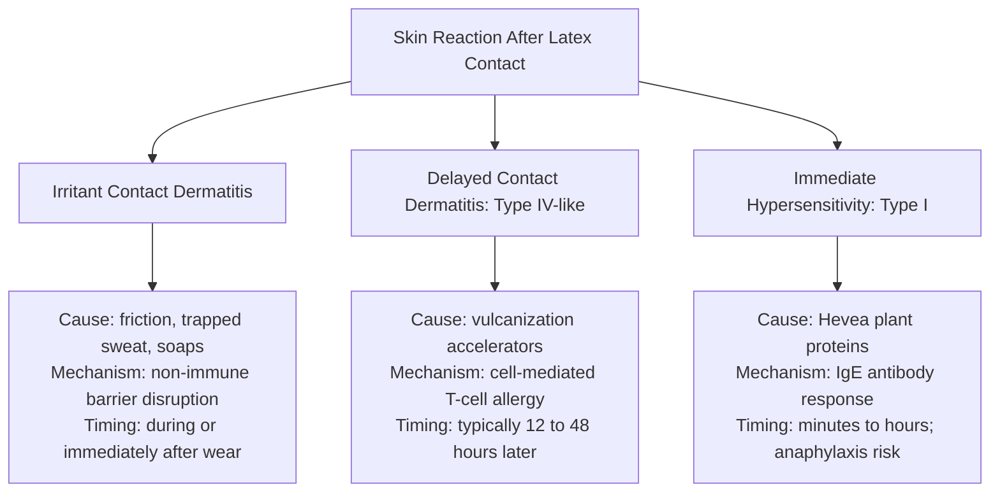

# Allergy and Skin Contact

> **Not medical advice.** This page outlines reaction classes, typical onset timing, and the legal meaning of commercial labels. It does not provide medical diagnosis, treatment plans, emergency protocols, or garment safety clearances. Consult a qualified clinician for any dermatological or allergic symptoms. Do not attempt self-diagnosis or treat any commercial rubber article as medically cleared.

## Executive summary

Skin irritation from rubber garments falls into three distinct categories. Irritant contact dermatitis is a non-allergic reaction caused by sweat, friction, or cleaning residues. Type IV-like contact dermatitis is an allergic immune response to vulcanization accelerators and chemical additives. Type I hypersensitivity is an immediate, systemic immune reaction to residual proteins in natural rubber latex. Conflating these three reactions leads to improper avoidance strategies. Marketing terms such as "hypoallergenic," "FDA-approved," or "food-grade" do not certify that sheet latex or liquid latex is safe for skin contact.

## Questions this article answers

- [What are the three reaction classes associated with rubber goods?](#three-reaction-classes)
- [What proteins and chemical accelerators remain in the rubber film?](#what-is-in-the-film)
- [What do medical device regulations and hypoallergenic claims mean?](#what-labels-mean)
- [Does FDA food-contact compliance make latex safe to wear?](#food-contact-fda)
- [What questions should buyers and makers ask about material content?](#buyer-checklist)
- [When should you stop wearing latex and seek professional care?](#when-to-stop-and-seek-care)

---

## What are the three reaction classes associated with rubber goods? {#three-reaction-classes}

### How

Distinguish skin responses by symptom onset and character rather than guessing. If your skin turns red immediately under tight edges during sweating, suspect mechanical irritation. If an itchy, blistering rash develops one to two days after wear, suspect a chemical sensitivity. If you experience hives, itching far from the contact zone, lip swelling, or shortness of breath within minutes, treat it as a medical emergency. Never rely on the timing clock alone to diagnose yourself.

### Why

The National Institute for Occupational Safety and Health (NIOSH) divides rubber-related skin reactions into three distinct mechanisms. Irritant contact dermatitis is the most common response. It is not an allergic reaction. It occurs when moisture, friction, or harsh soaps compromise the outer skin barrier. 

Delayed contact dermatitis, classified as a Type IV-like allergy, is an immune reaction directed against processing chemicals rather than the rubber polymer itself. Symptoms typically peak between 12 and 48 hours after contact. 

Immediate hypersensitivity, known as a Type I allergy, is an allergic reaction to natural Hevea tree proteins. In sensitized individuals, immune antibodies trigger histamine release within minutes or hours. This reaction can escalate into full-body hives or systemic anaphylaxis. Synthetic latices do not contain these natural plant proteins and do not trigger Type I natural rubber reactions.

Detail: Plant origins of natural rubber latex

Natural rubber latex is an aqueous colloidal emulsion harvested from the *Hevea brasiliensis* tree. The raw fluid contains approximately 30% to 35% cis-1,4-polyisoprene rubber particles, suspended alongside 1% to 1.5% plant proteins, lipids, carbohydrates, and inorganic salts. Synthetic materials labeled as latex, including carboxylated styrene-butadiene or acrylic emulsions, are produced via synthetic emulsion polymerization and contain no plant proteins.

Ammonia is added to raw field latex as a preservation agent to prevent bacterial coagulation. In high-ammonia concentrates, volatile ammonia vapor above 0.3% concentration can cause respiratory and ocular discomfort during casting or dipping. This irritant effect is a direct chemical hazard of the vapor, distinct from Type I or Type IV allergic mechanisms.

---

## What proteins and chemical accelerators remain in the rubber film? {#what-is-in-the-film}

### How

Do not assume finished sheet latex or cast liquid latex contains only pure polyisoprene. When purchasing materials, request the manufacturer safety data sheet to identify active curing systems. Never attempt DIY skin patch tests using neat compounding chemicals or raw latex samples.

### Why

Raw natural rubber cannot form durable sheets or garments without vulcanization. During industrial compounding, manufacturers add elemental sulfur, zinc oxide, and organic vulcanization accelerators to link the polymer chains. These accelerators allow the rubber to vulcanize quickly at temperatures below 100 °C.

Residual accelerators migrate to the film surface over time and act as contact allergens. Most occupational Type IV allergic contact dermatitis traces to specific accelerator groups: thiurams, dithiocarbamates, and thiazoles. Plant proteins also remain embedded inside the cured film matrix. If the rubber is not leached thoroughly in hot water during production, these extractable proteins sit on the surface, ready to transfer to moist skin.

Detail: Accelerator chemical families and patch-test findings

Industrial latex formulations depend on several organic accelerator families:

- Dithiocarbamates: Rapid accelerators including zinc diethyldithiocarbamate (ZDEC) and zinc dibutyldithiocarbamate (ZDBC), commonly used at 0.50 to 0.85 parts per hundred rubber (phr).
- Thiazoles: Slower secondary accelerators such as 2-mercaptobenzothiazole (MBT) and its zinc salt (ZMBT), dosed at 0.25 to 0.45 phr.
- Thiurams: Aggressive accelerators such as tetramethylthiuram disulfide (TMTD) and dipentamethylenethiuram disulfide.
- Guanidines and thioureas: Auxiliary accelerators used in specialty compounds.

A standard laboratory safety data sheet for neat ZDEC assigns GHS hazard class Skin Sensitization Category 1 with hazard statement H317 ("May cause an allergic skin reaction"). In a classic clinical study by Wilson evaluating 42 patients presenting with rubber dermatitis, neat patch testing produced positive reactions across several accelerator classes:

| Accelerator chemical tested | Positive patch tests (out of 42) |
| --- | --- |
| Dipentamethylenethiuram disulfide | 30 |
| Tetramethylthiuram disulfide (TMTD) | 20 |
| 2-Mercaptobenzothiazole (MBT) | 15 |
| Zinc diethyldithiocarbamate (ZDEC) | 2 |

Due to occupational allergic contact dermatitis from thiurams, manufacturing shifted toward dithiocarbamates. However, cross-reactivity between dithiocarbamates and thiurams remains common in sensitized individuals. Blackley noted that as thin rubber goods like gloves and condoms sit in intimate cutaneous contact, local contact dermatitis can generalize across broader skin areas. Certain low-ammonia liquid latex concentrates also introduce TMTD alongside zinc oxide directly into the storage bottle as a secondary preservative against microbial spoilage.

---

## What do medical device regulations and hypoallergenic claims mean? {#what-labels-mean}

### How

Disregard claims of "hypoallergenic" on retail sheet latex, liquid latex, and latex clothing. Check if a seller is citing consumer apparel standards or medical device codes. If a product lacks an allergy warning label, do not assume it is free of natural rubber proteins or residual accelerators.

### Why

Under federal regulation 21 CFR 801.437, the United States Food and Drug Administration mandates specific labeling on medical devices containing natural rubber latex that contact human tissue. The law requires a prominent warning stating that the product contains natural rubber latex which may cause allergic reactions. Crucially, paragraph (h) of the statute explicitly forbids manufacturers from using the word "hypoallergenic" on these devices.

The FDA banned hypoallergenic labeling because the historical animal tests used to justify the claim, such as the modified Draize test, evaluated chemical irritation rather than human IgE protein sensitization. Fashion apparel and craft supplies fall outside medical device jurisdiction. Garment retailers can advertise products as hypoallergenic without regulatory oversight, even though the material contains active proteins and cure chemicals.

Detail: Device labeling under 21 CFR 801.437 and the glove powder ban

Title 21 of the Code of Federal Regulations, Section 801.437, applies to all medical devices composed of or containing natural rubber latex that come into direct or indirect contact with the human body. The regulation establishes that:

- Devices containing natural rubber latex must carry an explicit, bold statement on the packaging: "Caution: This Product Contains Natural Rubber Latex Which May Cause Allergic Reactions."
- Under 21 CFR 801.437(h), any representation that a natural rubber device is "hypoallergenic" constitutes statutory misbranding under section 502 of the Federal Food, Drug, and Cosmetic Act.
- In 2016, the FDA issued a final rule banning powdered surgeon gloves, powdered exam gloves, and absorbable glove lubricating powder. Glove powders bind aerosolizable natural rubber proteins, significantly increasing sensitization and inhalation exposure risks. Non-powdered medical gloves remain subject to standard cautionary labeling.

---

## Does FDA food-contact compliance make latex safe to wear? {#food-contact-fda}

### How

Never accept an "FDA food-grade" certification or reference to 21 CFR 177.2600 as proof that latex is safe for skin contact. If a vendor advertises rubber sheet or liquid as skin-safe based on food regulations, disregard the claim.

### Why

Section 21 CFR 177.2600 governs rubber articles intended for repeated use in commercial food processing, packing, and holding equipment. It sets chemical purity standards and limits the amount of chemical additives that can dissolve into water or fatty foods during contact. 

Food-contact compliance evaluates oral toxicity and chemical migration into food streams. It does not measure dermal irritation, skin barrier disruption, chemical sensitization, or immune reactions to plant proteins. A rubber formulation that meets food-contact criteria can still contain sufficient residual accelerators and natural proteins to trigger severe contact dermatitis or systemic allergic reactions.

Detail: Extraction limits under 21 CFR 177.2600

The food-contact framework under 21 CFR 177.2600 permits specific classes of vulcanization accelerators, antioxidants, and plasticizers in rubber goods, subject to strict compounding ceilings:

- The total combined concentration of vulcanization accelerators must not exceed 1.5% by weight of the finished rubber article.
- Total antidegradants (antioxidants and antiozonants) must not exceed 5.0% by weight.
- Regulated articles must satisfy solvent extraction limits: total extractable matter must not exceed 20 milligrams per square inch in water during the first extraction hour, falling to 1 milligram per square inch in subsequent hours.

These limits are designed to prevent systemic toxicity from chemicals leaching into bulk food items. They provide no evaluation of whether residual surface chemicals or natural proteins will provoke Type I or Type IV immunologic responses against occluded skin.

---

## What should you ask before buying or wearing latex? {#buyer-checklist}

### How

Review product specifications and question suppliers before purchasing material or wearing garments. Avoid conducting skin challenges on yourself or others. Use the following screening questions to identify material risks:

| Question to ask | Why it matters | What silence or vague claims mean |
| --- | --- | --- |
| Is this material natural rubber latex or synthetic rubber? | Natural rubber contains plant proteins capable of triggering Type I allergies. Synthetic latices do not release these proteins. | The base polymer is unverified. You cannot evaluate Type I protein risks. |
| Is a product safety data sheet (SDS) available? | An SDS discloses whether active chemical accelerators like thiurams or dithiocarbamates are present. | Accelerator chemistry is unknown. Type IV sensitivity risks cannot be assessed. |
| Is the product advertised as "hypoallergenic"? | The term is legally prohibited on natural rubber medical devices because it does not protect against protein allergy. | The seller is using unregulated marketing language. |
| Are protein levels certified by standard test methods? | Standard assays measure aqueous extractable or antigenic protein concentrations. | Protein extraction has not been validated for the production batch. |
| Does the seller claim "FDA compliance" or "food grade"? | 21 CFR 177.2600 regulates food equipment, not skin safety or allergy clearance. | The vendor is conflating food processing standards with dermal wear safety. |

### Why

Latex apparel manufacturers rarely disclose exact chemical formulations or protein levels. Suppliers frequently mix terminology, describing synthetic polyurethanes, synthetic polyisoprenes, and natural tree rubber simply as "latex." 

Asking specific questions helps you identify whether a supplier understands rubber chemistry or is repeating marketing slogans. Makers cannot test their customers for allergies, and no garment maker can honestly certify finished rubber apparel as universally non-allergenic.

Detail: Protein measurement methods and industrial leaching

Three primary standardized analytical methods quantify residual proteins in natural rubber:

- ASTM D5712: Measures total aqueous extractable protein using a modified Lowry assay. It provides a broad chemical measurement of water-soluble proteins but does not differentiate between non-allergenic proteins and specific allergenic antigens.
- ASTM D6499: An immunological assay (ELISA) using polyclonal rabbit antibodies to measure specific antigenic proteins from *Hevea brasiliensis*. While sensitive down to microgram levels, quantified antigenic content does not establish direct human clinical potency.
- ISO 12243: A modified Lowry method validated specifically for water-extractable protein in natural rubber medical gloves. The standard notes that extraction procedures have not been validated for non-glove rubber articles, meaning glove protein values cannot be extrapolated to fashion sheeting.

In industrial dipping lines, wet-gel leaching and post-vulcanization hot-water leaching extract water-soluble proteins and surfactant residues. Low-protein specialty concentrates (Category 4 latex) target total extractable protein levels below 200 micrograms per gram of dry rubber. However, ambient craft dipping or poorly leached commercial sheeting can retain significantly higher protein loads.

---

## When should you stop wearing latex and seek medical care? {#when-to-stop-and-seek-care}

### How

Remove any rubber garment or barrier immediately if you experience itching, burning, hives, visible redness, or respiratory tightness. Wash the affected skin gently with mild soap and clean water to remove residual sweat and surface chemicals. Do not re-wear the item to test whether the reaction happens again. Consult a board-certified dermatologist or allergist for formal medical patch testing or IgE blood testing.

### Why

Continuing to wear rubber during an active reaction increases chemical and protein penetration through an inflamed skin barrier. Re-exposing sensitized skin accelerates the immune response and can cause localized dermatitis to generalize across the entire body. 

Chlorinating a garment, polishing it with silicone oil, washing it in laundry detergent, or lining it with baby powder will not eliminate embedded chemical accelerators or guarantee safe wear for an allergic individual. Medical diagnosis requires controlled patch testing by a physician using standardized allergen panels, not self-experimentation with garments.

---

## Sources

- American Academy of Allergy, Asthma & Immunology. *Latex Allergy*. Public education resource. Available from: https://www.aaaai.org/tools-for-the-public/conditions-library/allergies/latex-allergy
- ASTM International. *ASTM D5712: Standard Test Method for Analysis of Aqueous Extractable Protein in Natural Rubber and Its Products Using the Modified Lowry Method*. West Conshohocken, PA: ASTM International.
- ASTM International. *ASTM D6499: Standard Test Method for The Immunological Measurement of Antigenic Protein in Hevea Natural Rubber and its Products*. West Conshohocken, PA: ASTM International.
- Blackley, D. C. (1997). *Polymer Latices: Science and Technology*. 2nd ed. London: Chapman & Hall.
- Hansen, K. S., et al. Patch test clinic data across vulcanization accelerators and antioxidant mixtures. Contact Dermatitis clinical literature.
- International Organization for Standardization. *ISO 12243: Medical gloves made from natural rubber latex — Determination of water-extractable protein using the modified Lowry method*. Geneva: ISO.
- National Institute for Occupational Safety and Health. (1997). *Preventing Allergic Reactions to Natural Rubber Latex in the Workplace*. DHHS (NIOSH) Publication No. 97-135. Available from: https://www.cdc.gov/niosh/docs/97-135/
- Occupational Safety and Health Administration. *Hospital eTool: Healthcare Wide Hazards - Latex Allergy*. Washington, DC: U.S. Department of Labor. Available from: https://www.osha.gov/etools/hospitals/latex-allergy
- R. T. Vanderbilt Company. (1990). *The Vanderbilt Rubber Handbook*. 13th ed. Norwalk, CT: R. T. Vanderbilt Company.
- U.S. Food and Drug Administration. (1997). 21 CFR Part 801: *Natural Rubber-Containing Medical Devices; User Labeling*. Federal Register, 62(189), 51021–51031.
- U.S. Food and Drug Administration. 21 CFR 177.2600: *Rubber articles intended for repeated use*. Code of Federal Regulations.
- U.S. Food and Drug Administration. (2016). 21 CFR Parts 878, 880, and 895: *Banned Devices; Powdered Surgeon's Gloves, Powdered Patient Examination Gloves, and Absorbable Powder for Lubricating a Surgeon's Glove*. Federal Register, 81(244), 91722–91733.
- Wilson, H. T. H. Rubber accelerator patch test series in clinical contact dermatitis patients. British Journal of Dermatology clinical literature.