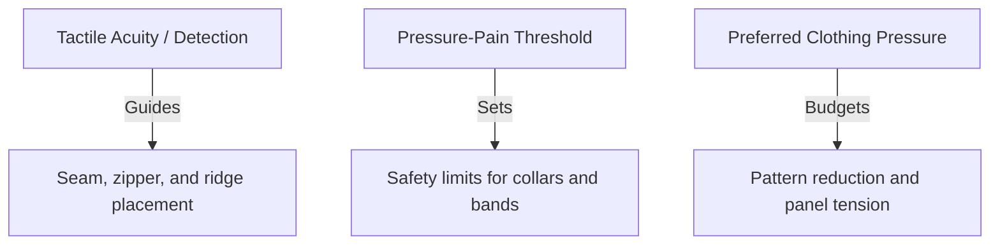

# Body-region pressure sensitivity

> **Not medical advice.** This page is literacy about published touch and clothing-pressure maps. It is not diagnosis, medical compression advice, or a safe-constriction certificate.

## Executive summary

Sensitivity refers to three distinct body maps. Tactile acuity measures how easily you notice light contact. Pressure-pain threshold measures the blunt force required to cause pain. Preferred clothing pressure measures the circumferential hoop compression that feels comfortable. Averaging these three scales into one number creates an inaccurate fit profile.

For latex garment fit, use preferred clothing pressure to set panel tension, check pressure-pain thresholds for safety ceilings at the neck and chest, and use tactile acuity to decide where seam ridges and hardware can sit.

No peer-reviewed regional clothing-pressure maps exist yet for fashion sheet latex garments. Textile compression studies provide the closest available comparison.

**Related fit planning:** [Reduction × pressure sensitivity](/literature-reviews/reduction-and-pressure-sensitivity) · [Pattern reduction → pressure targets](/literature-reviews/pattern-reduction-pressure-targets) · [Clo3D material simulation](/literature-reviews/clo3d-material-simulation)

---

## Questions this article answers

- [Why can you not use a single sensitivity number for latex garment fit?](#three-constructs)
- [How does tactile acuity affect seam and ridge placement?](#scale-a-acuity)
- [Where do pressure-pain thresholds set garment safety limits?](#scale-b-pain-ceiling)
- [How should preferred clothing pressure guide panel tension?](#scale-c-comfort)
- [What are the current research gaps in latex clothing pressure?](#research-gaps)

---

## Why can you not use a single sensitivity number for latex garment fit? {#three-constructs}

### How

Do not average touch sharpness, pain limits, and tightness ratings into one general sensitivity number. Match each pattern decision to the specific scale that governs it. Use tactile acuity for seam and zipper placement. Use pressure-pain thresholds for maximum collar and band tightness. Use preferred clothing pressure to budget how much tension each panel receives.

| Scale | What it measures | Use for garments |
| --- | --- | --- |
| **Tactile acuity / detection** | How finely or lightly you notice contact | Seam, zipper, and ridge noticeability |
| **Pressure-pain threshold (PPT)** | Force at which blunt pressure becomes painful | Safety ceiling (neck, face, chest) |
| **Preferred clothing pressure** | Subjective "just right" hoop compression | Relative constriction and panel budgets |

### Why

The body perceives contact, blunt force, and hoop constriction through different sensory mechanisms. High tactile acuity does not mean low pain tolerance. A body area with dense touch receptors might easily register a tiny ridge while comfortably handling broad constriction. Conversely, areas with lower tactile acuity can still ache quickly under continuous blunt force. Pain thresholds on hairy limbs can even invert touch rankings. Blending these separate measurements into a single multiplier gives misleading values.

Detail: What clothing pressure measures

Clothing pressure in textile science refers to the contact pressure applied by a stretched elastic band or fabric panel around a curved limb or torso. It represents circumferential hoop compression, calculated via the Laplace relation where pressure is proportional to fabric tension divided by the radius of curvature. It is not an arbitrary fit label or a medical compression stocking class.

Detail: Why sensitivity units cannot be averaged

The three scales use mutually incompatible units and testing procedures:

- Tactile acuity is recorded as distance in millimetres (two-point discrimination) or force in grams using monofilaments.
- Pressure-pain threshold is recorded in kilopascals (kPa) or Newtons per square centimetre (N/cm²) using an algometer with a rigid probe.
- Preferred clothing pressure is recorded through subjective comfort grading under varying circumferential band tension.

Averaging these physical dimensions without mathematical conversion produces an invalid scale. Keep Scale C for tension budgets, Scale B for safety margins, and Scale A for physical texture placement.

---

## How does tactile acuity affect seam and ridge placement? {#scale-a-acuity}

### How

Keep bulky seams, thick adhesive overlaps, and zipper edges away from the face, neck, hands, and feet whenever possible. Skive or bevel overlapping sheet latex edges that cross these areas. On high-acuity zones, keep the garment surface as flat as possible against the skin.

### Why

Touch receptors are concentrated unevenly across the body. The fingertips, palms, lips, and face have the highest density of sensory nerve fibers, which allows them to resolve fine spatial detail. The proximal limbs and trunk have much lower receptor densities. The forehead and palms detect light forces from fine filaments that thighs and shins fail to register. This map predicts whether a wearer will notice a raised seam or hardware edge, but it does not tell you how much tension the skin can handle.

Detail: Receptor distribution and two-point discrimination

Tactile spatial resolution correlates directly with the density of low-threshold mechanoreceptors, particularly slowly adapting type I (Merkel cell) and rapidly adapting type I (Meissner corpuscle) units with small, well-defined receptive fields. In psychophysical testing, two-point discrimination thresholds range from 2 to 4 mm on the fingertips and lips to more than 30 to 40 mm on the back and thighs. Monofilament detection thresholds show a similar gradient: facial skin detects forces below 0.1 mN, while the lower limbs require significantly greater deflection forces to trigger an action potential.

---

## Where do pressure-pain thresholds set garment safety limits? {#scale-b-pain-ceiling}

### How

Use pressure-pain thresholds as a ceiling to prevent injury or tissue ache, especially on collars, hoods, and tight chest bands. Reduce pattern reduction over bony landmarks and thin soft tissue. Check long-duration wear carefully at the nape of the neck, forehead, and sternum.

### Why

Pressure-pain thresholds measure the blunt force at which deep tissue pressure turns into pain. In algometry tests, the nape of the neck reaches pain thresholds at lower pressures than the lower back, with the shoulders falling between them. Bony landmarks like the forehead and sternum tolerate less pressure before pain than large limb muscles. Women frequently show lower pressure-pain thresholds than men at identical anatomical test points. Age and testing rates also shift the baseline.

Detail: Algometry methodology and anatomical landmarks

Algometry evaluates deep somatic pain sensitivity by applying a calibrated probe (typically a 1 cm² circular tip) perpendicular to the skin at a constant loading rate (such as 30 to 50 kPa/s). The threshold reflects nociceptor activation in cutaneous, subcutaneous, and muscle tissue, modified by underlying skeletal geometry. Thin soft-tissue padding over rigid bone—such as the sternum, forehead, or cervical vertebrae—leads to rapid stress concentration in periosteal and deep nociceptors, yielding significantly lower pressure-pain thresholds (often below 200 to 300 kPa) compared to bulkier musculature like the quadriceps or gluteal groups.

---

## How should preferred clothing pressure guide panel tension? {#scale-c-comfort}

### How

Budget higher tension and tighter pattern reduction on the arms and legs. Keep circumference tension lower across the neck, underbust, and waist. When grading patterns, allow room for torso expansion during breathing instead of applying a uniform reduction percentage across the whole body.

### Why

Textile wear studies show that people consistently prefer higher circumferential band pressure on their limbs than on their torso. Preferred pressure generally rises as you move outward toward the hands and feet. The anterior waist and underbust register among the lowest comfortable pressure thresholds on the trunk. Tight waistbands compress internal organs and fight the diaphragm during respiration. Applying the same pattern reduction percentage across all body parts produces an uncomfortable garment because the torso is sensitive to hoop constriction while having a larger radius of curvature.

Detail: Respiratory coupling and comfort ranges

Circumferential pressure around the trunk directly interacts with respiratory mechanics. Quiet tidal breathing expands the abdominal and thoracic circumference by 15 to 30 mm, with deep inhalation expanding the torso by up to 50 to 70 mm. If a garment exerts continuous pressure above approximately 2 to 3 kPa around the ventral abdomen or lower ribcage, it restricts tidal volume and increases the work of breathing, driving subjective comfort ratings down rapidly. In contrast, distal extremities can comfortably tolerate pressures exceeding 4 to 6 kPa without triggering discomfort or restricting vital functions, provided venous return is not occluded.

---

## What are the current research gaps in latex clothing pressure? {#research-gaps}

### How

Use published comfort maps as relative rankings rather than exact kilopascal specifications. When building sheet latex garments, test fit using physical prototypes. Adjust panel reductions based on wearer feedback instead of assuming woven fabric numbers translate directly to rubber.

### Why

No peer-reviewed studies have established regional clothing-pressure maps specifically for fashion natural rubber sheet garments. Existing literature relies on woven, knitted, or medical elastomeric fabrics. Natural rubber sheet lacks the air and moisture permeability of standard textiles. Its high coefficient of friction against skin and its non-linear stress-strain response alter how pressure is felt during movement. The relative order of sensitivity across body regions remains reliable, but the exact target pressure values remain unverified for rubber wear.

Detail: Friction, modulus, and open research needs

Translating pressure data from knitted support wear to vulcanized natural rubber sheet involves three unmodeled variables:

1. Friction and shear: Natural rubber has a high dry friction coefficient against human skin, generating substantial shear strain during joint articulation that textiles do not produce.
2. Vapor impermeability: Sheet latex blocks evaporative cooling and moisture transport, creating sweat accumulation that alters tactile sensation and skin compliance over time.
3. Viscoelastic relaxation: Vulcanized natural rubber exhibits stress relaxation under continuous elongation. A tension that exerts 3 kPa upon initial donning will drop over 30 to 60 minutes, shifting subjective pressure ratings.

Controlled experimental protocols measuring continuous interface pressure in fashion sheet latex garments remain an open research gap.

---

## Sources

- **Algometry and pressure-pain research:** Published clinical algometry datasets evaluating somatic pressure-pain thresholds across cranial, cervical, and torso landmarks.
- **Textile clothing-pressure literature:** Comfort threshold and circumferential band pressure studies examining preferred pressure distributions in elastic garments.
- **Related fit literacy:**
  - [Reduction × pressure sensitivity](/literature-reviews/reduction-and-pressure-sensitivity)
  - [Pattern reduction → pressure targets](/literature-reviews/pattern-reduction-pressure-targets)
  - [Clo3D material simulation](/literature-reviews/clo3d-material-simulation)
  - [Sheet gauge, modulus, and reduction](/literature-reviews/sheet-gauge-modulus-reduction)