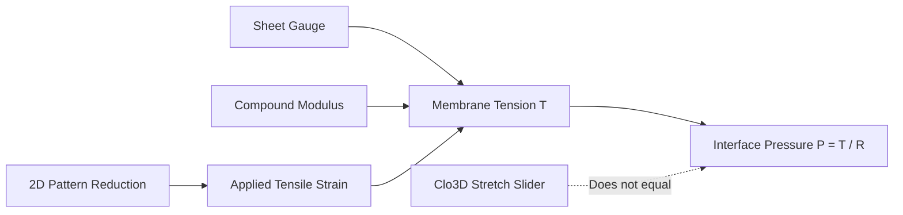

# Simulating NR sheet in Clo3D

## Executive summary

This repository models calendered natural rubber sheet as an isotropic, dielectric solid film in Clo3D. Presets scale stretch, shear, and bending resistance across standard gauges from 0.20 mm to 1.00 mm. Use these presets when assigning materials to 3D patterns, switching sheet gauge, or evaluating skintight drape against avatar geometry. Open YAML files under [`assets/`](assets/) and `clo3d/yaml/` serve as the source of truth for all parameters. Do not adjust the simulation Stretch sliders to create garment fit pressure. Fit pressure is controlled by 2D pattern reduction, gauge, and compound modulus.

**Related:** [Pattern reduction → pressure targets](/literature-reviews/pattern-reduction-pressure-targets) · [Reduction × pressure sensitivity](/literature-reviews/reduction-and-pressure-sensitivity) · [Body-region pressure sensitivity](/literature-reviews/body-region-pressure-sensitivity)

---

## Questions this article answers

* [What material properties does the Clo3D preset represent?](#what-simulated)
* [How do physical parameters scale across sheet gauges?](#physical-params)
* [How do you render a polished rubber surface?](#render)
* [How do you generate and install preset files?](#downloads)
* [How does fit pressure differ from the simulation stretch sliders?](#fit-pressure)
* [What physical sheet behaviors does Clo3D fail to model?](#limits)

---

## What material properties does the Clo3D preset represent? {#what-simulated}

### How

Select the preset matching your target gauge (0.20, 0.30, 0.40, 0.80, or 1.00 mm) in black or red. Assign the fabric to your pattern pieces. Verify that the preset applies equal values in both horizontal and vertical directions, which treats the film as isotropic sheet latex.

| Real sheet property | Clo3D stand-in |
| --- | --- |
| Calendered natural rubber roll goods | Presets for gauges 0.20, 0.30, 0.40, 0.80, and 1.00 mm in black and red |
| Soft unfilled film (M300 ~0.9 to 1.2 MPa) | Stretch, shear, and bend resistance clusters ($K$) |
| Density (~0.95 specific gravity) | Catalog Weight and density derived from $\text{GSM} = \text{gauge (mm)} \times 0.95 \times 1000$ |
| Shined face | Roughness intensity 3, reflection 100, metalness 0, IOR 1.5 |
| Surface asymmetry, solvent adhesive, tack | Not modeled |

### Why

Clo3D was built for woven and knitted textiles rather than continuous rubber membranes. The software uses internal resistance coefficients rather than direct engineering units like megapascals. The presets create a consistent baseline that mimics the low modulus and fluid drape of soft, unfilled natural rubber sheet without confusing Clo3D stretch sliders with laboratory tensile tests.

<details>
<summary>Detail: Material property baseline and optical constants</summary>

Industrial benchmarks establish the physical neighborhood for soft, unfilled natural rubber sheet:

- **Modulus baseline:** Unfilled natural rubber vulcanizates show a 300% modulus ($M_{300}$) around 0.90 MPa and a Shore A hardness of roughly 39 (Blackley, 1997, Table 16.12). Graft copolymer grades such as Vanderbilt MG 0% exhibit an $M_{300}$ near 1.17 MPa (Ohm, 1990). These figures establish that the rubber is soft and highly extensible, but they cannot be entered directly into the Clo3D Stretch slider.
- **Density:** Specific gravity is set to 0.95, matching standard commercial sheet latex (such as Supatex). Clo3D calculates fabric area density (grams per square meter) directly from gauge: $\text{GSM} = t \times 0.95 \times 1000$, where $t$ is thickness in millimeters.
- **Optical constants:** Purified *Hevea brasiliensis* rubber has an experimental refractive index ($n_D^{25}$) between 1.519 and 1.522 (McPherson & Cummings, 1935). Setting the index of refraction (IOR) to 1.50 matches physical measurements.
- **Metadata artifacts:** The preset files contain fixed-length strings such as `Classification: Tricot` and `Content: Nylon(100%)`. These are length-locked structural leftovers from the base `.zfab` template and do not affect physical behavior.

For the full property rationale, see [`clo3d/nr-sheet-settings.md`](../../../clo3d/nr-sheet-settings.md).

</details>

---

## How do physical parameters scale across sheet gauges? {#physical-params}

### How

Use the 0.30 mm preset as your reference. When changing gauge, scale in-plane stretch and shear resistance linearly with sheet thickness. Scale bending resistance with the cube of the thickness ratio. Keep friction, buckle ratios, and nonlinear growth exponents unchanged.

| Property | Packed value (0.30 mm) | Typical Detail UI readout | Notes |
| --- | --- | --- | --- |
| Thickness | 0.3 mm | 0.3 | Shop gauge; catalog string six characters |
| Weight | 285 g/m² | Slider displays relative value | Trust catalog Weight |
| Stretch (weft/warp) | `fSuK` = `fSvK` = 25000 | ~12 | Equal in U and V directions (isotropic) |
| Shear | `fHK` = 5000 (v2: 10000) | ~9 | Below stretch value; symmetric |
| Bend | `fBuK` family ~25.5 (v2: 80) | ~8 | Equal across U, V, and bias |
| Buckle ratio / stiffness | 0.90 / 0.85 | 90 / 85 | Linear with UI display |
| Friction | 0.03 | 3 | Avatar collision contact only |

### Why

Natural rubber sheet is a continuous, solid polymer layer. In-plane tensile resistance depends directly on cross-sectional area, so doubling thickness doubles the tensile stiffness. Bending resistance depends on the area moment of inertia, which scales with the cube of the thickness. A 0.80 mm sheet bends with far more rigidity than a 0.40 mm sheet, creating much stiffer folds and rolls.

<details>
<summary>Detail: Mathematical scaling rules and stiffness coefficients</summary>

Clo3D defines fabric properties using internal stiffness coefficients ($K$). In the 0.30 mm reference file, in-plane stretch uses $fSuK = fSvK = 25000$, shear uses $fHK = 5000$ (updated to $10000$ in v2), and bending uses $fBuK \approx 25.5$ (updated to $80$ in v2).

To compute parameters for a target gauge $t$ from the reference gauge $t_0 = 0.30\text{ mm}$:

$$\text{Weight}(t) = \text{Weight}(t_0) \times \left(\frac{t}{t_0}\right)$$

$$\text{Stretch } K(t) = K(t_0) \times \left(\frac{t}{t_0}\right)$$

$$\text{Shear } K(t) = K(t_0) \times \left(\frac{t}{t_0}\right)$$

$$\text{Bending } K(t) = K(t_0) \times \left(\frac{t}{t_0}\right)^3$$

The cubic scaling for bending reflects classic thin-plate flexural rigidity:

$$D = \frac{E t^3}{12(1 - \nu^2)}$$

where $E$ is Young's modulus and $\nu$ is Poisson's ratio. Thin membranes collapse easily under gravity, while heavier gauges maintain structural form around limb contours.

A complete per-gauge property matrix is maintained in [`clo3d/nr-sheet-settings.md`](../../../clo3d/nr-sheet-settings.md).

</details>

---

## How do you render a polished rubber surface? {#render}

### How

Apply a solid color map with a fine, procedurally generated surface grain. Avoid photographic vinyl textures. Set Roughness Intensity to 3, Reflection to 100, Metalness to 0, and Index of Refraction (IOR) to 1.5.

```
Roughness Intensity: 3
Reflection:          100
Metalness:           0
Index of Refraction: 1.5
```

### Why

Polished natural rubber is a non-metallic (dielectric) material treated with silicone shiner. It produces strong specular highlights without metallic color tinting. An index of refraction of 1.5 accurately reproduces the Fresnel reflection curve of natural rubber, creating sharp reflections at grazing angles and clear highlights on curved body panels.

<details>
<summary>Detail: Refractive index and surface scattering</summary>

Pure natural rubber (*cis*-1,4-polyisoprene) has a measured refractive index of approximately 1.52 at room temperature (McPherson & Cummings, 1935). Setting Clo3D's IOR input to 1.5 matches the physical interaction between light and an unfilled hydrocarbon polymer. 

Dielectric materials have zero electrical conductivity, which requires a metalness setting of 0. Setting reflection to 100 and roughness to 3 concentrates the specular reflection into a narrow, sharp highlight, simulating the liquid-smooth surface film formed by polydimethylsiloxane (silicone oil) wiped over vulcanized sheet latex.

</details>

---

## How do you generate and install preset files? {#downloads}

### How

Download the open YAML configuration files from the project repository. If you work in Clo3D, compile these files into `.zfab` presets using the command-line pack tool, or import the generated `.zfab` files directly into your workspace.

```powershell
dotnet run --project tools/ZfabYaml -- generate --base clo3d/edit.zfab --yaml-dir clo3d/yaml --zfab-dir clo3d/presets
```

### Why

Clo3D `.zfab` files are proprietary binary archives based on vendor templates. To avoid redistributing proprietary software files, this repository keeps material properties in open YAML files. You can edit, version, and inspect the raw stiffness values in plain text, then build the binary files locally for your licensed Clo3D installation.

<details>
<summary>Detail: Repository assets and licensing structure</summary>

Freely redistributable text definitions are located in the repository under [`assets/`](assets/) and `clo3d/yaml/`:

- **0.20 mm:** [`assets/NR-sheet-0.20-black.yaml`](assets/NR-sheet-0.20-black.yaml) · [red](assets/NR-sheet-0.20-red.yaml)
- **0.30 mm reference:** [`NR-sheet-0.30-black.yaml`](assets/NR-sheet-0.30-black.yaml) · [red](assets/NR-sheet-0.30-red.yaml)
- **0.40 mm:** [`NR-sheet-0.40-black.yaml`](assets/NR-sheet-0.40-black.yaml) · [red](assets/NR-sheet-0.40-red.yaml)
- **0.80 mm:** [`NR-sheet-0.80-black.yaml`](assets/NR-sheet-0.80-black.yaml) · [red](assets/NR-sheet-0.80-red.yaml)
- **1.00 mm:** [`NR-sheet-1.00-black.yaml`](assets/NR-sheet-1.00-black.yaml) · [red](assets/NR-sheet-1.00-red.yaml)

Binary files located at `clo3d/presets/*.zfab` and `clo3d/edit.zfab` are derived from Clo3D base templates and are intended solely for local workspace use. Details on copyright and distribution constraints are documented in [`assets/README.md`](assets/README.md).

The build tool injects the YAML stiffness coefficients and mass records directly into the base template archive. Tool instructions and options are documented in [`tools/ZfabYaml/README.md`](../../../tools/ZfabYaml/README.md).

</details>

---

## How does fit pressure differ from the simulation stretch sliders? {#fit-pressure}

### How

Control garment fit and compression by altering pattern reduction percentages on your 2D pattern pieces. Do not modify the Clo3D Stretch sliders to simulate higher pressure or a tighter fit.

### Why

Contact pressure on a body limb is created by drafting pattern pieces smaller than the body circumference. When the garment is worn, the rubber stretches to fit, creating inward tension. The Clo3D Stretch slider controls the material's resistance to elongation (compliance), not the applied stretch itself. Changing the slider turns the material into a different substance rather than showing the pressure of an undersized pattern.



<details>
<summary>Detail: Laplace law and contact pressure mechanics</summary>

Interface pressure between a tight elastic garment and a limb is governed by the law of Laplace for cylindrical surfaces:

$$P = \frac{T}{R} = \frac{\sigma \cdot t}{R}$$

In this relationship, $P$ is contact pressure in kilopascals, $T$ is membrane tension per unit width, $\sigma$ is tensile stress in the rubber, $t$ is sheet gauge, and $R$ is limb radius.

Tensile stress $\sigma$ is determined by pattern reduction:

$$\text{Reduction \%} = \left(1 - \frac{L_0}{L}\right) \times 100$$

where $L_0$ is the relaxed pattern dimension and $L$ is the circumferential body dimension.

For natural rubber sheet in the fashion gauge band (0.33 to 0.45 mm) fitted over a limb radius of approximately 10 cm, skintight fit targets an interface pressure of roughly 0.8 kPa. Adjusting the Clo3D Stretch slider changes the internal solver spring constant across mesh vertices, altering drape under gravity and collision response, but it does not reproduce the circumferential stress field created by pattern reduction.

For full derivations, see [`target-body-pressure.md`](../../../clo3d/target-body-pressure.md) and the review on [pattern reduction and pressure targets](/literature-reviews/pattern-reduction-pressure-targets).

</details>

---

## What sheet behaviors does Clo3D fail to model? {#limits}

### How

Use Clo3D to assess garment silhouette, panel drape, and proportion. Do not use simulation output to evaluate seam construction, open-time curling, adhesive performance, or high-strain elastic recovery.

### Why

Clo3D uses simplified surface-mesh mechanics tailored to conventional apparel. It assumes an elastic sheet with identical surface properties on both faces. It cannot simulate chemical swelling, adhesive bonding, dry skin friction, or nonlinear elastomer damage.

<details>
<summary>Detail: Omitted physical and chemical mechanisms</summary>

Several physical characteristics of sheet latex construction fall outside Clo3D's solver architecture:

- **Seam construction:** The solver does not model solvent rubber cement bonds, overlap widths, reinforcing discs, or the physical stiffness added by multiple seam layers.
- **Solvent curling:** When solvent rubber cement is applied to sheet latex, solvent absorption causes rapid local swelling, making the rubber curl. Crafters must air the adhesive until the solvent flashes off before they overlay the edges. Clo3D cannot simulate this chemical interaction.
- **Surface asymmetry:** Commercial sheet latex has a glossy face side and a matt underside. Clo3D presets apply symmetric render and physical parameters to both faces.
- **Friction and skin tack:** The preset friction coefficient (0.03) governs avatar collision sliding. It does not reproduce the dry tack of unpowdered natural rubber against human skin or the lubrication provided by dressing aids.
- **Calender grain anisotropy:** Real calendered sheet latex has a slight grain orientation, giving it different tear strength and modulus along roll length versus roll width. The Clo3D presets enforce isotropic behavior ($fSuK = fSvK$).
- **Nonlinear viscoelasticity:** Natural rubber shows strain crystallization, stress relaxation, and hysteresis (Mullins effect). Clo3D simulates ideal, reversible elasticity without permanent set or stress softening.

</details>

---

## Sources

* Blackley, D. C. (1997). *Polymer Latices: Science and Technology* (2nd ed., Vols. 1–3). Chapman & Hall.
* McPherson, A. T., & Cummings, A. D. (1935). Refractive index of natural rubber. *Journal of Research of the National Bureau of Standards*, 14(3), 241–254. https://doi.org/10.6028/jres.014.030
* Ohm, R. F. (Ed.). (1990). *The Vanderbilt Rubber Handbook* (13th ed.). R.T. Vanderbilt Company, Inc.