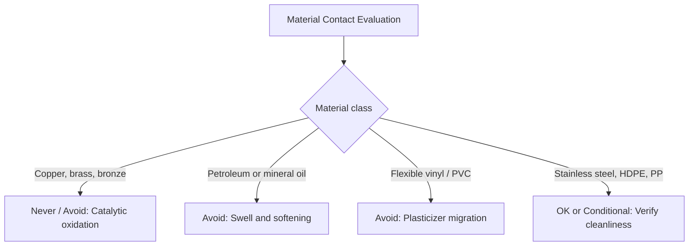

# Compatibility Matrix: Metals, Oils, Plastics, and Skin Products

> **Safety note:** Solvent rubber cements and certain organic liquids are fire hazards. Hydrocarbon oils degrade thin natural rubber barriers quickly, destroying their physical integrity rather than acting as lubricants. Always consult safety data sheets (SDS) for chemicals in your shop.

## Executive summary

This guide provides a four-tier compatibility rating (Never, Avoid, Conditional, and OK) for materials that contact natural rubber. Liquid latex in containers and vulcanized rubber in garments react differently to their surroundings. Uncured liquid latex destabilizes and coagulates when exposed to active metal ions such as copper and zinc. Cured sheet latex and dipped films resist water but suffer severe oxidative breakdown from copper and rapid swelling from oils. 

Consult these ratings when selecting storage containers, shop fittings, hardware fasteners, dressing lubricants, and storage bags.

---

## Questions this article answers

- [What do the compatibility ratings mean?](#ratings)
- [Which metals can safely touch liquid latex and cured rubber?](#metals)
- [How do oils and plasticizers affect natural rubber?](#oils)
- [Which plastics are safe for liquid storage and cured film contact?](#plastics)
- [Which skin and personal care products can you use with latex?](#skin-products)

---

## What do the compatibility ratings mean? {#ratings}

### How

Use these four ratings to screen any tool, container, fastener, or chemical before it touches liquid latex or sheet latex.

| Rating | Practical meaning |
| --- | --- |
| **Never** | Published sources prohibit contact. Immediate coagulation or chemical breakdown occurs. |
| **Avoid** | Contact causes documented deterioration or staining. Do not plan around this material. |
| **Conditional** | Contact is acceptable only under specified safeguards. If safeguards are unlisted, data is lacking. |
| **OK** | Published sources verify safe contact under normal shop and wear conditions. |

### Why

Natural rubber is an unsaturated hydrocarbon polymer. The double bonds along its polymer backbone react with oxygen, ozone, and nonpolar liquids. Liquid latex is an aqueous colloidal suspension of these rubber particles, stabilized by electrical charges and surfactants. Bringing the wrong substance into contact with rubber breaks the liquid suspension or severs the molecular chains of the vulcanized solid film.

Detail: Defining natural rubber (NR)

Natural rubber (NR) consists of cis-1,4-polyisoprene derived from the milky sap of the *Hevea brasiliensis* tree. In liquid latex, it forms a colloidal dispersion of polymer particles in an aqueous serum, commonly stabilized with ammonia. In sheet latex and dipped garments, the polymer chains are linked into a three-dimensional network through sulfur vulcanization. Commercial decorative paints sold as "latex" contain synthetic acrylic or vinyl emulsions and do not share this chemistry.

---

## Which metals can safely touch liquid latex and cured rubber? {#metals}

### How

Keep copper, brass, and bronze away from liquid latex and cured rubber garments. Do not use galvanized steel containers, buckets, or fittings where moisture or liquid latex is present. Use clean 304 or 316 stainless steel or unlined black iron for liquid handling and storage. For garment hardware such as snaps and eyelets, choose verified stainless steel or synthetic polymers, and avoid unverified plated fasteners.

| Metal contact | Liquid latex compound | Cured rubber film | Mechanism |
| --- | --- | --- | --- |
| Brass, copper, bronze | **Never** | **Avoid** direct contact | Catalytic poison; causes rapid oxidation, chain scission, and brown stains |
| Galvanized steel (wet) | **Never** | **Avoid** wet contact | Zinc ions induce coagulum in liquid; promotes moisture-driven corrosion on sheet |
| Black iron or stainless steel (clean) | **OK** with routine cleaning | **Conditional** | Standard for liquid plant fittings; safe on dry sheet, but unverified in sweat crevices |
| Unknown plated fasteners | — | **Avoid** until verified | Trade finish names do not identify the core alloy underneath |

### Why

Copper, manganese, and iron act as pro-oxidant catalysts. Copper ions accelerate oxidative chain scission in vulcanized rubber, turning elastic sheet brittle and sticky. In liquid latex, free copper and zinc ions neutralize the negative surface charges on suspended rubber particles, causing immediate coagulation into solid lumps.

Detail: Copper catalysis and antioxidant depletion

Trace amounts of copper catalyze the breakdown of unsaturated polyisoprene bonds. In experimental work by Sudsai, copper oleate induced localized matrix breakdown and distinct dark staining. Fatty-acid salts of copper, manganese, and iron belong to this same catalytic class. 

Industrial compounding for rubber exposed to copper requires a total of 2 phr (parts per hundred rubber) of antioxidant: 1 phr provides baseline protection against atmospheric oxygen, and 1 phr remains in reserve to inhibit metal-catalyzed oxidation. As the film ages, this antioxidant reserve is consumed. Once exhausted, copper contact causes catastrophic localized failure.

Detail: Black iron and stainless steel in garment hardware

Technical handbooks approve clean black iron and austenitic stainless steel for industrial latex compounding vessels and pipework. On worn garments, sweat containing sodium chloride and organic acids collects in crevices around rivets, eyelets, and snaps. This trapped moisture can initiate crevice corrosion or leach metal ions if the alloy is low grade. Formal wear-time ratings for metal crevices on garment films remain undocumented in rubber literature.

Detail: Definition of phr

The acronym phr stands for parts per hundred rubber. It expresses the weight of an additive relative to 100 parts of dry rubber hydrocarbon rather than the total weight of the wet compound. For example, adding 2 phr of antioxidant to a compound containing 100 grams of dry rubber requires 2 grams of active antioxidant, regardless of the water volume in the dispersion.

---

## How do oils and plasticizers affect natural rubber? {#oils}

### How

Never allow petroleum jelly, mineral oil, or vegetable cooking fats to contact natural rubber garments. Use pure silicone dressing fluids or water-based products to shine and wear rubber sheet. When an application demands direct oil resistance, use synthetic elastomers like chloroprene (CR) or carboxylated nitrile (XNBR) instead of natural rubber.

| Substance or elastomer | Contact rating on cured film | Observed effect |
| --- | --- | --- |
| Petroleum jelly and mineral oil | **Avoid** on wear surfaces | Hydrocarbon liquids swell the rubber, causing softness, rippling, and tears |
| Silicone dressing fluids and polishes | **Conditional** | Chemically inert; formal wear standards for fashion garments do not exist |
| Chloroprene (CR) vs natural rubber (NR) | CR outperforms NR | Polar chlorine groups resist moderate hydrocarbon oil absorption |
| Carboxylated nitrile (XNBR) vs NR | XNBR outperforms NR | Polar nitrile groups provide high resistance to petroleum swell |

### Why

Natural rubber is a nonpolar hydrocarbon. Under solubility principles, nonpolar fluids like mineral oil and paraffin wax dissolve into the nonpolar cis-1,4-polyisoprene network. The oil molecules wedge between polymer chains, forcing them apart. This swelling destroys the tensile strength of the rubber and leaves it prone to sudden tearing.

Detail: ASTM D471 oil swell testing

ASTM D471 standardizes how vulcanized rubber properties change during liquid immersion. Test coupons are submerged in standardized reference oils, such as IRM 901, 902, or 903, at controlled temperatures for specified periods. Technicians measure changes in mass, volume, tensile strength, and Shore A hardness. 

While ASTM D471 ranks the relative oil resistance of raw elastomers, coupon immersion does not replicate the intermittent mechanical stresses and sweat exposure typical of worn clothing.

---

## Which plastics are safe for liquid storage and cured film contact? {#plastics}

### How

Store liquid latex only in clean, rigid containers made from high-density polyethylene (HDPE) or polypropylene (PP). Verify that containers are clean and dry before filling. Keep vulcanized sheet latex garments away from flexible poly(vinyl chloride) (PVC) items, including clear vinyl storage bags, vinyl hangers, and inflatable pool toys.

| Polymer type | Liquid latex storage | Cured film contact | Observed interaction |
| --- | --- | --- | --- |
| Polyethylene (PE) and Polypropylene (PP) | **Conditional** | **Conditional** | Saturated polyolefins are inert; use verified virgin resin rather than waste tubs |
| Flexible PVC (vinyl) | **Avoid** | **Avoid** | Unbound plasticizers migrate into rubber, producing a sticky, degraded surface |

### Why

Polyethylene and polypropylene are saturated polyolefins produced without external plasticizers, so they do not exchange chemicals with natural rubber. Flexible PVC contains high concentrations of unbound plasticizers, such as phthalate esters, to keep the rigid vinyl polymer pliable. These oily plasticizer molecules migrate across the contact interface into the natural rubber, causing swelling, tackiness, and loss of shape.

Detail: Plasticizer migration mechanics

Plasticizers in flexible PVC are blended mechanically into the polymer matrix rather than anchored by chemical bonds. Because natural rubber acts as a nonpolar solvent sink, plasticizer molecules migrate down a concentration gradient across the contact area. 

This diffusion depresses the glass transition temperature of the rubber and weakens the vulcanized cross-link network. Unlabeled plastic storage bins from retail shops lack resin composition certificates, which is why general consumer plastic containers carry a conditional rating.

---

## Which skin and personal care products can you use with latex? {#skin-products}

### How

Do not apply petroleum-based ointments, mineral-oil moisturizers, or oil-based body creams before putting on latex garments. Wash skin thoroughly if these products were applied earlier in the day. Use pure silicone fluids or talc as dressing aids. Treat perfumes, colognes, and sunscreens as conditional: keep them off the rubber surface, and allow skin to dry completely before dressing.

| Product category | Contact rating | Recommendation |
| --- | --- | --- |
| Petroleum jelly and mineral-oil lotions | **Avoid** | Causes barrier softening and structural failure within minutes to hours |
| Silicone dressing aids and lubricants | **Conditional** | Safe on rubber; select formulations free of volatile hydrocarbon carriers |
| Alcohol-based perfumes and colognes | **Avoid** direct contact | Alcohol and fragrance oils can strip surface polish and cloud the finish |
| Sunscreens and cosmetic oils | **Avoid** direct contact | Chemical UV filters and organic carrier oils soften and swell natural rubber |

### Why

Occupational safety testing on medical gloves demonstrates that petroleum distillates and mineral oils cause rapid physical breakdown in thin natural rubber films. Hydrocarbon carriers diffuse into the membrane, causing pinhole leaks and tears. Cosmetic formulations containing synthetic esters, plant oils, and volatile solvents attack garment rubber through identical absorption mechanisms.

Detail: Occupational barrier degradation research

The National Institute for Occupational Safety and Health (NIOSH Alert 97-135) and OSHA technical guidelines document rapid loss of barrier integrity in natural rubber gloves exposed to oil-based hand lotions. Tests showed that exposure to mineral oil or petroleum jelly reduces glove barrier effectiveness significantly in fifteen to thirty minutes. 

Although fashion sheet latex is thicker than medical examination gloves (typically 0.25 mm to 0.80 mm compared to 0.10 mm), the chemical degradation mechanism is identical. Empirical studies evaluating specific cosmetic sunscreen or perfume formulations on heavy-gauge garment films remain absent in technical literature.

---

## Sources

- ASTM International. (2016). *ASTM D471: Standard Test Method for Rubber Property—Effect of Liquids*. West Conshohocken, PA: ASTM International. https://www.astm.org
- National Institute for Occupational Safety and Health. (1997). *Preventing Allergic Reactions to Natural Rubber Latex in the Workplace* (DHHS/NIOSH Alert Publication No. 97-135). Cincinnati, OH: U.S. Department of Health and Human Services. https://www.cdc.gov/niosh/docs/97-135/
- Occupational Safety and Health Administration. (2008). *Potential Health Hazards Associated with the Use of Natural Rubber Latex Gloves* (Safety and Health Information Bulletin SHIB 01-28-2008). Washington, DC: U.S. Department of Labor. https://www.osha.gov
- Sudsai, T. *Investigation of Copper Contamination and Catalytic Degradation in Natural Rubber Latex Compounds*.
- Winspear, G. G. (Ed.). (1987). *The Vanderbilt Latex Handbook* (3rd ed.). Norwalk, CT: R. T. Vanderbilt Company.