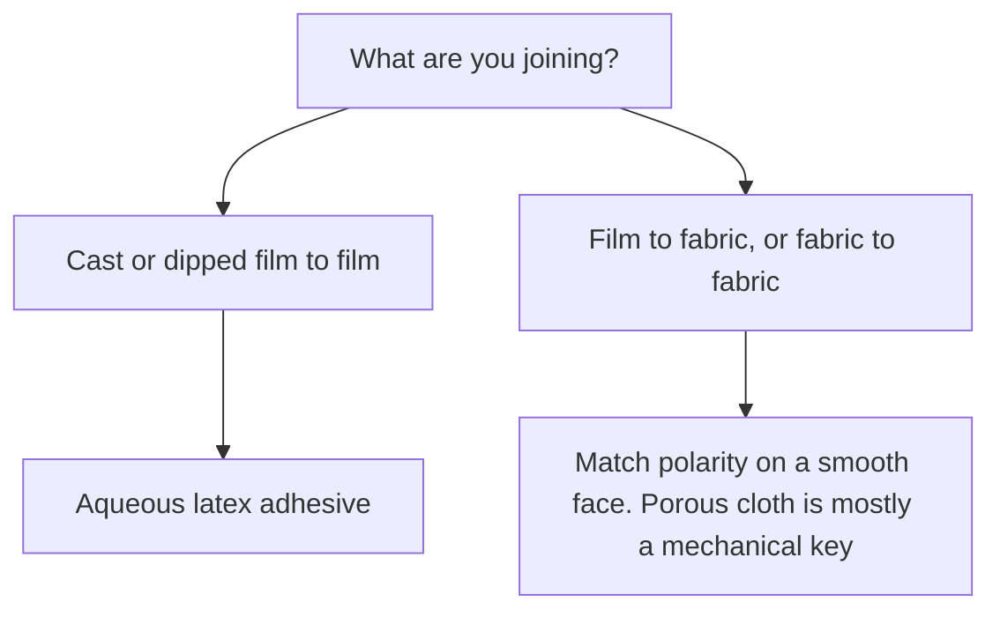
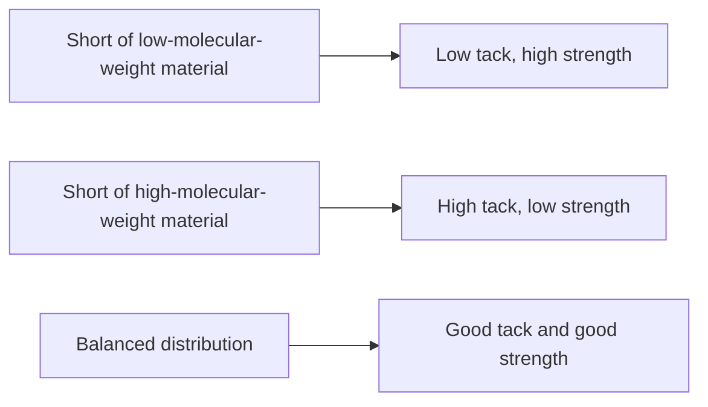
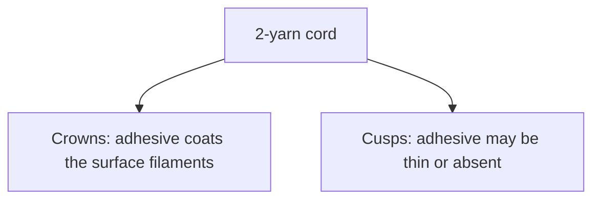
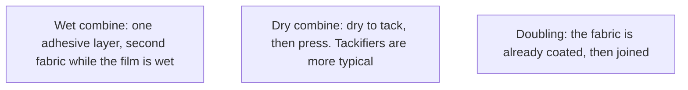
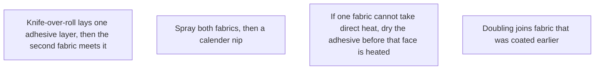

# Liquid Adhesives and Seam Integrity

> **Safety.** Water-based does not mean harmless. Latex adhesives can freeze, shrink fabrics, and carry ammonia. Read the product SDS. See [Liquid ventilation and ammonia](/literature-reviews/liquid-ventilation-ammonia).

## Executive summary

This review covers joining cast or dipped film, or combining fabric, with an aqueous latex adhesive. The industrial alternative is a solvent rubber cement. The water-based option eliminates flammable solvent vapors, handles a wide solids and viscosity range, and wets porous cloth directly. Its disadvantages include lower water resistance, freeze vulnerability, slow drying, fabric shrinkage, and contamination from reactive metal pots or dirty tools.

Use this when selecting an adhesive for liquid latex films, combining fabrics, or diagnosing a seam that peeled.

## Questions this article answers

- [Which adhesive fits cast or dipped film?](#which-adhesive)
- [How do I match the adhesive to the face?](#polarity)
- [How do I keep pots, tools, and faces clean?](#contamination)
- [Wet combine or dry combine?](#wet-vs-dry)
- [How do I read a join that peeled?](#reading-a-failed-join)
- [What still needs care with a water-based adhesive?](#safety)

## Which adhesive fits cast or dipped film? {#which-adhesive}

### How

For film-to-film joins on dipped or cast goods, use an aqueous latex adhesive. Prevulcanized latex serves as one common industrial base for these adhesives.

After applying the adhesive, air the coated surface until it is ready to overlay. In solvent rubber cement work, this waiting period is called flash-off; air-off describes the same step for water-based systems. Water evaporates slowly, so open time runs longer than with solvent cements. If an adhesive film stays tacky for days without setting, it is still wet, damaged by freezing, or formulated from an unsuitable polymer.

Seam geometry matters. A lap seam places one piece over the other across a defined width. Peel forces always concentrate at the free edge. A static lap seam remains flat during wear. A stretch lap seam flexes over joints and folds, which drives peel failure when the body moves.

### Why

Latex adhesives avoid flammable and toxic solvents, lower raw-material costs, support high molecular weights, and offer broad control over viscosity. They can also wet surfaces that are already damp with water.

The bond forms through coalescence. Polymer particles suspended in water must touch and deform into a continuous solid film as the water departs. Surfactants added to keep the liquid stable in the bottle can hinder this coalescence. As a result, the dried latex film may have lower initial tensile strength than a solvent cement film that started from fully dissolved rubber.

Detail: Solvent column versus latex column

*The Vanderbilt Latex Handbook* contrasts solvent and latex systems across key properties:

- Solvent rubber cements offer high water resistance, adjustable drying rates, high early tack, and reliable wetting on difficult surfaces. Their drawbacks include fire hazards, volatile organic vapor exposure, and special ventilation needs.
- Latex adhesives provide lower cost, nonflammable operation, wide viscosity ranges, high-molecular-weight polymers, and tunable substrate wetting. Their disadvantages include lower water resistance, risk of irreversible coagulation if frozen, fabric shrinkage, substrate wrinkling, equipment corrosion, and slow drying.

In pressure-sensitive adhesive testing described in the handbook, natural rubber latex preserves a high-molecular-weight fraction that cannot dissolve in typical solvents. Compounded with Piccolyte A85 tackifier, tack and peel were comparable between systems, but aqueous 178° shear resistance exceeded 6,000 minutes while solvent samples failed below 500 minutes.

This distribution curve illustrates molecular-weight balance in pressure-sensitive tape formulations. Historically, dipping from latex also required more immersions than dipping from rubber-gasoline cements because raw latex viscosity was lower (Letter Circular LC 321). US Patent 3,755,232 lists adhesive compounding among the industrial applications for aqueous prevulcanized latex feedstocks.

## How do I match the adhesive to the face? {#polarity}

### How

On smooth, non-porous faces, match the polarity of the adhesive to the substrate. Two dipped natural rubber films sit low on the polarity scale, making natural rubber or SBR latex adhesive the correct match. A natural rubber film bonded to slick nylon presents a mismatch. Industrial fabricators bridge that gap with a polar adhesive (such as NBR or acrylic) or a dedicated chemical pretreat.

On porous fabrics like cotton duck, the bond is mechanical. Liquid latex must penetrate open yarn pores before drying. If the latex and textile repel each other, particles remain on the surface. Adding heavy mineral fillers thickens the compound and prevents adequate pore entry.

### Why

Polarity measures electrical charge distribution across a polymer chain. Non-porous surfaces require matched surface energy so the liquid can wet the substrate and allow polymer chains to interdiffuse. On porous fabrics, mechanical keying dominates, making polymer polarity secondary unless electrostatic repulsion prevents liquid penetration.

Detail: Charge, filler, and textile pretreatments

Electrostatic repulsion between latex particles and fabric fibers can prevent penetration into yarn interstices. Thickeners are used to prevent the aqueous phase from wicking deep into the cloth while leaving dry rubber particles stranded on the surface (*Polymer Latices: Science and Technology*, Vol. 3).

Industrial tire cord uses resorcinol–formaldehyde–latex (RFL) dips to bond slick synthetic fibers to low-polarity rubber matrices. The resin phase adheres to the fiber while the latex phase bonds to the rubber compound during vulcanization. Commercial additives such as Ricobond 7004 apply this chemistry for polyester-nylon bonding to NR/SBR.

In twisted cords, adhesive covers exposed filament crowns but leaves cusps starved. Polyester requires specialized masked polyisocyanates that unblock near 220°C to activate bonding. In standard RFL systems, rubber-to-textile adhesion increases with resin concentration, rising from approximately 15 N per end at 0 phr resin to 80–91 N per end at optimal loading.

## How do I keep pots, tools, and faces clean? {#contamination}

### How

Stop work if a pot, applicator, or seam surface shows contamination. Re-clean or discard the tool before applying adhesive.

Common sources of bond failure:

- Mild steel or unlined metal cans used as glue pots.
- Brushes or spreaders previously exposed to silicone sprays, mold releases, or polishes.
- Mixing tubs containing dried residue, oils, waxes, or differing polymer families.
- Dipping formers or workbenches holding silicone release residue.

On the rubber itself, remove all traces of silicone oil, talc, or printing adhesive before applying liquid adhesive.

### Why

Latex compounds can destabilize on contact with multivalent metal ions, causing localized coagulation in metal pots. Silicone lubricants and mold releases form low-energy surface films that prevent the aqueous adhesive from wetting the rubber. This produces immediate adhesive failure, where the dried glue peels away leaving an untouched face.

## Wet combine or dry combine? {#wet-vs-dry}

### How

Choose between two production methods when joining rubber to fabric:

- **Wet combining:** apply a high-viscosity latex adhesive to one substrate, lay the second fabric into the wet film immediately, and pass the assembly through heat to dry.
- **Dry combining:** apply adhesive to the surfaces, let each coat dry to a tacky film, and marry them under pressure. Dry combining requires tackifier resins in the formulation to achieve grab.

In industrial plants, combining operates continuously on fresh coats. Doubling joins materials that were coated and dried in an earlier, separate operation.

If a fabric cannot endure direct heat, dry the adhesive on the heat-resistant substrate first. Then marry the delicate fabric using reduced pressure and mild warmth.

### Why

Wet combining drives liquid into yarn fibers before the water evaporates, producing a strong mechanical interlock with minimal additive requirements. Dry combining relies entirely on contact autohesion between dried polymer films. Without added tackifier resins, dry-combined latex films will not consolidate under roll pressure.

Detail: Plant layouts and handbook formulations

Industrial textile combining relies on knife-over-roll coaters, spray booths, calender nips, and steam-heated drying cans. Below is an industrial SBR wet-combining compound from *The Vanderbilt Latex Handbook*:

| Ingredient | Dry parts | Wet parts |
| --- | ---: | ---: |
| 40% SBR 2000 Latex | 100 | 250 |
| 20% Rosin Acid Soap | 2 | 10 |
| 60% Zinc Oxide Dispersion | 5 | 8.33 |
| 68% Sulfur Dispersion | 2 | 2.94 |
| 65% VANOX 102 Emulsion | 1.5 | 2.3 |
| SETSIT 51 Accelerator | — | 2 |

*Polymer Latices: Science and Technology*, Vol. 3 outlines three distinct starting bases:
1. Formulation A: a vulcanizable natural-rubber wet-combining adhesive cured for 15 minutes at 100°C.
2. Formulation B: a non-vulcanizable SBR adhesive used for both wet combining and dry doubling.
3. Formulation C: a polychloroprene wet-combining adhesive requiring added resin if adapted for dry doubling.

Compound roles:

| Component | Function | Examples |
| --- | --- | --- |
| Tackifiers | Restore surface grab in dry films | Rosin esters, terpene resins, asphalt emulsions |
| Fugitive plasticizers | Temporarily lower film modulus, evaporate on drying | Toluene, aromatic hydrocarbons |
| Crosslinkers | Improve heat, water, and solvent resistance; reduce tack | Zinc oxide, colloidal sulfur, sulfur donors |
| Mineral fillers | Reduce formulation cost, control penetration | Calcium carbonate, china clay (excess cuts peel strength) |
| Antioxidants | Prevent thermo-oxidative degradation | Hindered phenols, amine dispersions |

## How do I read a join that peeled? {#reading-a-failed-join}

### How

Examine the peeled surfaces to identify the cause:

- **Adhesive failure:** the adhesive separates cleanly from one substrate and remains on the other. Check surface prep, silicone contamination, polarity mismatch, or incomplete wetting.
- **Cohesive failure:** the adhesive layer splits down the middle, leaving residue on both faces. Check for incomplete drying, poor particle coalescence, insufficient crosslinking, or overfilled adhesive.
- **Ply split:** in multi-dipped liquid latex goods, separation happens between dipped latex layers rather than at the seam line. Check wet-gel dipping delays, leaching times, or ambient humidity.
- **Fabric tear:** broken textile fibers remain bonded to the rubber. The adhesive bond is stronger than the internal fabric structure.
- **Rubber tear:** the film tears alongside the seam line. Inspect the edge for cutting notches or excessive local stiffness. A notch is a sharp cut or corner where stress concentrates; adding more adhesive will not stop a notch from tearing.

| Observed defect | Diagnostic check |
| --- | --- |
| Clean substrate face, adhesive all on the opposite side | Surface contamination, silicone residue, polarity mismatch |
| Adhesive split down the middle, residue on both sides | Incomplete drying, poor coalescence, excess filler |
| Fabric fibers torn and stuck to the adhesive | Bond exceeds fabric tensile strength |
| Rubber film torn adjacent to seam overlap | Edge notch, stress concentration, or film too thin |
| Seam peels open starting strictly at outer edge | Edge peel moment under stretch; narrow seam allowance |
| Delamination between dipped layers | Dip interval, wet-gel leaching, or surface blushing |
| Adhesive remains tacky days after application | Freeze damage, excess plasticizer, or trapped water |

### Why

Standardized peel tests evaluate adhesion under controlled pull angles and speeds. Separation rate directly influences the observed failure mode. In natural rubber adhesive systems, low peel rates often generate cohesive failure, while higher peel rates shift the failure to the adhesive-substrate interface.

Detail: Four resin-versus-peel reports

Different resin and polymer pairings yield distinct peel performance curves:

1. Polychloroprene latex on cotton duck (Ward and Doherty): tack rises until resin content reaches 60–70% by weight, but overall peel strength decreases steadily as tackifier loading increases.

| Tackifier level (phr) | Asphalt peel (N/mm) | Rosin ester (mp 56°C) | Rosin ester (mp 83°C) |
| --- | ---: | ---: | ---: |
| 0 | 31 | 31 | 31 |
| 50 | 16 | 24 | 28 |
| 100 | 10 | 20 | 27 |
| 150 | 9 | 17 | 27 |
| 200 | 10 | 18 | 27 |

2. Carboxylated SBR Latex A with Foral 85 resin: 180° peel strength tested at 8, 2, 10, 85, and 32 oz/in across 30%, 40%, 50%, 60%, and 70% resin concentrations, peaking sharply at 60% resin.
3. Natural rubber latex on nylon fabric: compounding with phenolic resin demonstrates an adhesion optimum near 3 phr resin loading before strength declines.
4. Resorcinol–formaldehyde resins in tire cords: bond strength increases monotonically with resin content to form structural crosslinked interfaces.

Standard test procedures include ASTM D1876 (T-peel test for flexible substrate pairs) and ASTM D903 (180° peel test for flexible-to-rigid bonds).

## What still needs care with a water-based adhesive? {#safety}

### How

Store aqueous latex adhesives above freezing temperatures. Discard bottles that have coagulated into lumpy solids after frost exposure.

Never store or mix latex adhesives in unlined mild steel or copper containers.

Provide active exhaust ventilation when working with ammonia-preserved latex. Review the manufacturer safety data sheet to confirm the preservation system.

### Why

Freezing forces water out of the serum, compressing suspended rubber particles into an irreversible solid mass. Ammonia gas (CAS 7664-41-7) is routinely added to raw latex concentrate to prevent bacterial breakdown and maintain high pH stability. Ammonia has an OSHA Permissible Exposure Limit (PEL) of 50 ppm, a NIOSH Recommended Exposure Limit (REL) of 25 ppm, and an Immediately Dangerous to Life or Health (IDLH) ceiling of 300 ppm.

Detail: Crosslinking and tack in water-based pressure-sensitive adhesives

Introducing crosslinking agents into aqueous adhesives improves heat resistance, aging stability, and solvent resilience at the expense of surface tack. In aqueous pressure-sensitive formulations, sulfur-donor systems (such as tetramethylthiuram disulfide combinations) resist oxidation better than elemental colloidal sulfur. Advancing the state of vulcanization in the wet film suppresses chain mobility, lowering initial grab.

## Sources

- *The Vanderbilt Latex Handbook*. 3rd ed. Edited by Robert Francis Mausser. Norwalk, CT: R.T. Vanderbilt Company, 1987. [Library of Congress](https://lccn.loc.gov/92117844)
- *Practical Guide to Latex Technology*. Rani Joseph. Shawbury: Smithers Rapra Technology, 2013. [Google Books](https://books.google.com/books/about/Practical_Guide_to_Latex_Technology.html?id=NB5AMwEACAAJ)
- *Polymer Latices: Science and Technology — Volume 3: Applications of Latices*. 2nd ed. D. C. Blackley. London: Chapman & Hall, 1997. [Google Books](https://books.google.com/books?id=Y2VPGj7YbykC)
- *Letter Circular LC 321: Rubber Latex*. U.S. Department of Commerce, National Bureau of Standards, 1932. [NIST](https://nvlpubs.nist.gov/nistpubs/Legacy/LC/nbslettercircular321.pdf)
- Cray Valley. *Ricobond 7004 for Textile Treatment*. Technical Data Sheet. [crayvalley.com](https://crayvalley.com/download/10/technical-updates/733/ricobond-7004-for-textile-treatment)
- IOP Conference Series: Materials Science and Engineering 526 (2019) 012001. Phenolic resin level and peel of natural-rubber latex adhesive on nylon. [IOP](https://iopscience.iop.org/article/10.1088/1757-899X/526/1/012001/pdf)
- Poh, B. T., and Chee, D. P. "Effect of Peel Rate on Adhesion Properties of Pressure-Sensitive Adhesives Prepared from Epoxidized Natural Rubber." *International Journal of Polymer Science* 2013 (2013): 1–7.
- OSHA Chemical Database. "Ammonia." CAS 7664-41-7. [OSHA](https://www.osha.gov/chemicaldata/623)
- ASTM D1876-08. *Standard Test Method for Peel Resistance of Adhesives (T-Peel Test)*. West Conshohocken, PA: ASTM International.
- ASTM D903-98. *Standard Test Method for Peel or Stripping Strength of Adhesive Bonds*. West Conshohocken, PA: ASTM International.
- US Patent 3,755,232. *Process for Prevulcanizing Natural or Synthetic Rubber Latices*. Filed 1971, issued 1973. [Google Patents](https://patents.google.com/patent/US3755232A/en)
- US Patent 2,128,635. *Treatment of Rubber and Textiles*. Filed 1935, issued 1938.
- Solomon, T. S. "Bonding of Textiles to Rubber." *Rubber Chemistry and Technology* 58, no. 3 (1985): 561–576.