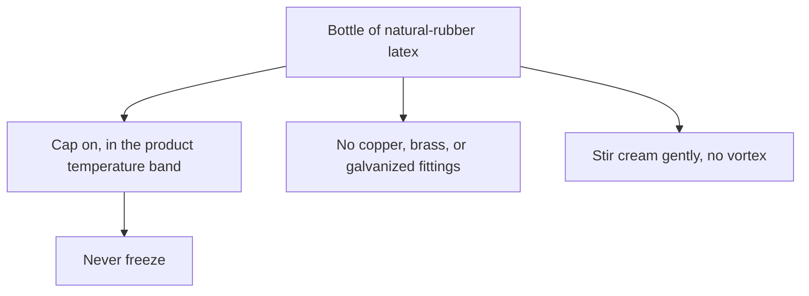
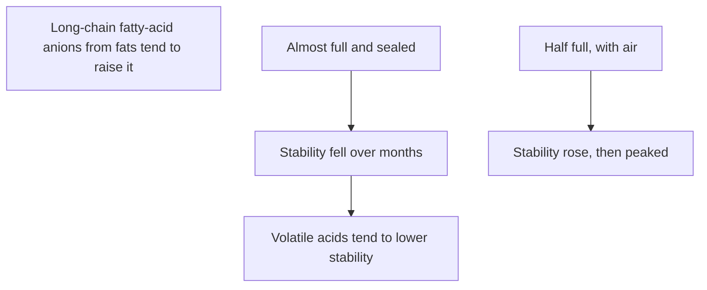
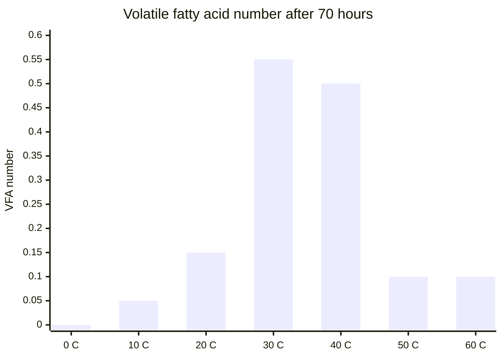
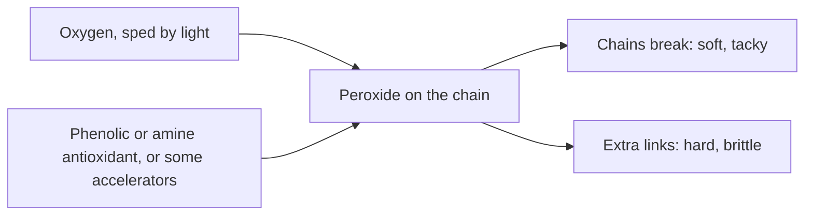

# Liquid Latex Aging, Storage and Care

> **Safety.** Concentrate still gives off ammonia. Open bottles in a ventilated space. See [Liquid latex ventilation and ammonia](/literature-reviews/liquid-ventilation-ammonia). Freeze wrecks ordinary natural-rubber latex. Petroleum products attack the film after it dries. This page does not diagnose skin reactions. For that, see [Allergy and skin contact](/literature-reviews/allergy-and-skin-contact).

## Executive summary

A bottle of natural-rubber latex and the film you cast or dip from it age in different ways. Fresh latex without a preservative turns to coagulum in hours. A preserved concentrate still requires a closed cap, a cool storage area, and fittings free of copper, brass, and zinc. After you form a film, leftover coagulant salt and settled compounding ingredients alter how that film discolors and degrades over time.

Use these rules when you store a bottle, remix separated cream, or handle a cast film. Bottle label markings are covered in [Decoding consumer latex bottle labels](/literature-reviews/liquid-decoding-bottle-labels).

## Questions this article answers

- [How do I store a bottle?](#how-do-i-store-a-bottle)
- [Why does untreated latex spoil?](#why-does-untreated-latex-spoil)
- [What changes after I have film?](#what-changes-after-i-have-film)
- [What should stay off the film?](#what-should-stay-off-the-film)

## How do I store a bottle? {#how-do-i-store-a-bottle}

### How

Keep the bottle tightly capped. Store it inside the temperature range printed on the technical data sheet, and never let the liquid freeze. 

If a layer of cream forms at the top, stir it back in gently. Do not whip the liquid or create a vortex that pulls air into the bottle.

Keep copper, brass, and galvanized metal away from liquid latex. Store the liquid in approved plastic containers, stainless steel, or black iron.

### Why

Fresh plantation latex is unstable until processors preserve and concentrate it, as noted in Rani Joseph's *Practical Guide to Latex Technology*. 

Contact with brass or copper causes rapid oxidative breakdown of the rubber particles. Sudsai and coauthors trace dark spots on dipped goods directly to copper contamination from processing equipment. Industrial specifications cited by Joseph cap copper content at 8 parts per million of total solids. Galvanized fittings release zinc ions into the liquid, causing premature coagulum. *The Vanderbilt Latex Handbook* specifies black iron and 304 or 316 stainless steel for handling bulk latex.

Freezing destroys the colloidal dispersion. Ice crystals force rubber particles together, causing irreversible coagulation. A 2023 study by Hamzah and coauthors confirms that standard natural-rubber latex breaks down completely upon freezing unless formulated with specialized low-temperature stabilizers. Product data sheets, such as the Revultex technical sheet, specify storage between 5 °C and 35 °C with explicit frost warnings.

In *High Polymer Latices*, D. C. Blackley observed that bulk ammonia-preserved latex stored in sealed, nearly full tanks lost mechanical stability over several months. Tanks stored half full with air gained stability before reaching a plateau. Blackley attributed stability loss to volatile fatty acids and stability gain to the formation of fatty-acid soaps. Despite those bulk aeration tests, consumer and workshop product sheets state to keep containers closed to prevent ammonia loss and skin formation. Keep your bottle tightly capped.

Detail: Ammonia bands, tank stirring, and headspace

Joseph describes ammonia as the primary industrial preservative for natural rubber latex. It is effective above 0.35% by weight of latex, with long-term storage typically set at 0.6% to 1.0%. Low-ammonia systems use around 0.2% ammonia supplemented with secondary bactericides, such as 0.0125% tetramethylthiuram disulfide (TMTD), 0.0125% zinc oxide, and 0.05% lauric acid.

Concentrate standards classify alkalinity levels by weight:
- High ammonia: minimum 0.60%
- Medium ammonia: 0.30% to 0.60%
- Low ammonia: maximum 0.30%

ISO 2004 and ASTM D1076 establish quality thresholds for centrifuged and creamed concentrates. These tests govern total solids content, dry rubber content, alkalinity, mechanical stability time, volatile fatty acid number, coagulum content, sludge content, and trace copper and manganese levels.

Early trade practices varied. A 1932 National Bureau of Standards letter circular (LC 321) describes stabilizing field latex with 3% concentrated aqueous ammonia by weight (specific gravity 0.882). This represents an aqueous liquor addition rather than the modern dry-ammonia basis.

*The Vanderbilt Latex Handbook* notes that storage tanks sitting for months require about 30 minutes of low-speed stirring every three weeks. The agitation must lift cream without creating a surface vortex that introduces air. Industrial storage tanks are drained and sterilized roughly twice per year.

For prevulcanized latex, excess compounding ingredients such as unreacted sulfur and zinc oxide are sometimes removed by centrifugation before long-term storage. Secondary antioxidants are added after centrifugation to prevent ongoing cross-linking in the drum.

This mechanism represents bulk tank observations from Blackley's 1966 text. It does not justify leaving small craft bottles unsealed.

## Why does untreated latex spoil? {#why-does-untreated-latex-spoil}

### How

Work only with commercially preserved latex concentrate. Never store fresh field latex without an added preservative system. Keep your workspace and storage area below 25 °C whenever possible.

### Why

Fresh latex coagulates on its own within a few hours of collection. Bacteria feed on non-rubber carbohydrates and proteins in the serum, producing volatile fatty acids such as formic, acetic, and propionic acids. 

These acids lower the pH of the dispersion and neutralize the negative electrical charges on the rubber particles. Once those surface charges drop below a critical threshold, the rubber particles collide, fuse, and separate into a solid mass called coagulum. 

Preservatives such as ammonia raise the pH and inhibit bacterial activity. In *High Polymer Latices*, Blackley illustrates that unpreserved field latex shows a sharp rise in volatile fatty acids within ten days. Preserved concentrate maintains a low acid level for weeks under similar conditions.

Bacterial activity depends heavily on temperature. Measurements published by Blackley demonstrate that volatile fatty acid accumulation peaks between 30 °C and 40 °C. While acid production declines at 50 °C and 60 °C due to bacterial heat death, heating stored latex degrades the rubber polymer through oxidation.

Detail: Volatile fatty acids and temperature measurements

The volatile fatty acid (VFA) number measures the volatile acid content extracted by steam distillation from an acidified latex serum, expressed as grams of potassium hydroxide required to neutralize the acids from 100 grams of dry rubber. It directly reflects bacterial decomposition since tapping.

Data recorded in Blackley (1966) compare the VFA number of field latex against ammonia-preserved concentrate stored at ambient conditions:

| Days | Field latex | Ammonia-preserved concentrate |
| ---: | ---: | ---: |
| 0 | 0.05 | 0.05 |
| 10 | 0.65 | 0.05 |
| 20 | 0.70 | 0.05 |
| 30 | 0.70 | 0.10 |
| 40 | 0.70 | 0.15 |

A second series traces VFA accumulation in field latex held at different temperatures for 44 and 70 hours:

| Temperature | VFA number after 44 h | VFA number after 70 h |
| ---: | ---: | ---: |
| 0 °C | 0.00 | 0.00 |
| 10 °C | 0.05 | 0.05 |
| 20 °C | 0.10 | 0.15 |
| 30 °C | 0.35 | 0.55 |
| 40 °C | 0.35 | 0.50 |
| 50 °C | 0.05 | 0.10 |
| 60 °C | 0.05 | 0.10 |

Modern specifications (ISO 2004, ASTM D1076) limit the VFA number to 0.20 or lower for high-quality concentrate. Values above 0.10 indicate poor preservation or extended microbial activity prior to concentration.

## What changes after I have film? {#what-changes-after-i-have-film}

### How

Leach dipped or cast rubber films in warm water before final drying and vulcanization. Warm water extracts coagulant salts from the rubber network.

Before pouring or dipping from a blended compound that has rested, stir it gently to redistribute settled solids. Avoid high speeds that entrain bubbles.

Store finished rubber articles away from direct sunlight, open electric motors, and heat radiators.

### Why

When dipping with salts like calcium nitrate, water-soluble residues remain trapped inside the gelled rubber. If you skip leaching, these hygroscopic salts attract moisture from the air. Under heat, gas combustion fumes, or ultraviolet light, residual coagulant accelerates discoloration and causes the rubber film to lose tensile strength.

Compounding ingredients such as sulfur, zinc oxide, and antioxidant dispersions are denser than water and gradually settle to the bottom of the container. If you cast or dip from an unmixed pot, the distribution of protective chemicals varies across your items. A film that lacks sufficient antioxidant will oxidize and break down much faster than a properly mixed film.

Thin dipped films are vulnerable to oxidative aging because they possess a high surface area relative to their total volume. In *Polymer Latices: Volume 3*, Blackley notes that oxygen diffuses quickly through thin rubber walls. However, vulcanized films formed directly from liquid latex retain natural serum antioxidants and resist aging better than unvulcanized films made by dissolving dry rubber in petroleum solvents.

Detail: Antioxidants and thermal aging mechanisms

Antioxidants scavenge free radicals and decompose hydroperoxides formed when molecular oxygen attacks unsaturated double bonds along the polyisoprene backbone.

*The Vanderbilt Latex Handbook* specifies 1.0 to 2.0 parts per hundred rubber (phr) of antioxidant for general dipped goods. Where copper contamination is anticipated, the handbook recommends 2.0 phr total: 1.0 phr for basic oxidation defense and 1.0 phr designated as a heavy metal deactivator.

Antioxidant classes provide distinct performance balances:
- Phenolic types are non-staining and maintain color clarity under light exposure, but they offer lower general thermal protection.
- Amine types offer superior resistance to heat, flex-cracking, and metal catalysis, but they oxidize to dark chromophores that discolor the rubber.

The compounding system determines how physical properties change during thermal aging:
1. Conventional sulfur cures with free colloidal sulfur tend to undergo chain scission upon prolonged heat aging (100 °C for 48 hours). This results in lower tensile strength, reduced 300% modulus, and higher ultimate elongation as the rubber softens.
2. Sulfur-donor systems (such as TMTD-cured systems) favor monosulfidic cross-links. Under identical heat exposure, these networks undergo post-vulcanization cross-linking, causing increased modulus, lower elongation, and embrittlement.

NBS Letter Circular LC 321 and Joseph's *Practical Guide to Latex Technology* emphasize that liquid latex deposits age better than dry-masticated rubber goods. Mechanical milling on open mills breaks high-molecular-weight polymer chains, whereas rubber deposited directly from latex preserves the native chain length and retains protective serum substances.

## What should stay off the film? {#what-should-stay-off-the-film}

### How

Keep petroleum jelly, mineral oil, motor lubricants, and oil-based body lotions off finished natural-rubber films. Use only pure silicone fluids or water-soluble lubricants on your rubber articles.

### Why

Natural rubber is a non-polar hydrocarbon polymer. When it contacts non-polar substances like petroleum distillates or mineral oils, the solvent molecules diffuse into the polymer network. 

This causes immediate swelling, softening, and loss of tensile strength. The rubber becomes limp, sticky, and tears under minimal tension. 

Occupational safety standards explicitly prohibit oil-based materials on natural rubber. A 1993 OSHA health compliance letter notes that petroleum-based lubricants cause rapid physical breakdown of natural-rubber barrier gloves. NIOSH Publication 97-135 advises health workers to avoid mineral oil and oil-based creams entirely when wearing natural rubber.

Detail: Testing liquid resistance and industrial mildewcides

ASTM D471 standardizes test methods for evaluating rubber degradation when exposed to liquids. Standard test oils (such as IRM 901, 902, and 903) produce large volumetric swelling and severe tensile degradation in natural rubber compounds due to the low solubility parameter differential between polyisoprene and aliphatic hydrocarbons.

Under prolonged damp storage, natural rubber films can develop fungal growth supported by non-rubber serum residues. *The Vanderbilt Latex Handbook* describes using water-dispersible mildewcides (such as zinc pyridinethione complexes) added at 0.25 to 1.0 phr to prevent surface mold without disrupting vulcanization kinetics. These industrial compounding additives are processing agents and must not be used on garments intended for direct skin contact without clinical biocompatibility testing.

## Sources

- *The Vanderbilt Latex Handbook*. 3rd ed. Edited by Robert Francis Mausser. Norwalk, CT: R.T. Vanderbilt Company, 1987. <https://lccn.loc.gov/92117844>
- *Polymer Latices: Science and Technology — Volume 3: Applications of Latices*. 2nd ed. D. C. Blackley. London: Chapman & Hall, 1997. <https://books.google.com/books?id=Y2VPGj7YbykC>
- *High Polymer Latices: Their Science and Technology*. 2 vols. D. C. Blackley. London: Maclaren; New York: Palmerton, 1966. <https://lccn.loc.gov/66077950>
- *Practical Guide to Latex Technology*. Rani Joseph. Shawbury: Smithers Rapra Technology, 2013. <https://books.google.com/books/about/Practical_Guide_to_Latex_Technology.html?id=NB5AMwEACAAJ>
- *Letter Circular LC 321: Rubber Latex*. U.S. Department of Commerce, National Bureau of Standards, 1932. <https://nvlpubs.nist.gov/nistpubs/Legacy/LC/nbslettercircular321.pdf>
- ISO 2004:2024. *Natural rubber latex concentrate — Centrifuged or creamed, ammonia-preserved types — Specifications*. <https://www.iso.org/standard/86502.html>
- ASTM D1076-23. *Standard Specification for Rubber—Concentrated, Ammonia Stabilized, Creamed, and Centrifuged Natural Latex*. <https://store.astm.org/d1076-23r26.html>
- ASTM D471-16a(2021). *Standard Test Method for Rubber Property—Effect of Liquids*. <https://store.astm.org/d0471-16ar21.html>
- Revultex prevulcanized natural-rubber latex technical data sheet. <https://shop.keramik.at/config/produktdokumente/Technisches_Datenblatt_Latex_Revultex.pdf>
- Hamzah et al. “The Influence of Azidated Glycerol as a New Low Temperature Stabilizer on the Colloidal Properties of Natural Rubber Latex.” *Polymers* 15, no. 3 (2023): 698. <https://doi.org/10.3390/polym15030698>
- Sudsai et al. “Effect of Copper Contamination in Concentrated Natural Rubber Latex on Dipped Product Quality.” *ScienceAsia* 43, no. 6 (2017): 369–374. <https://doi.org/10.2306/scienceasia1513-1874.2017.43.369>
- NIOSH. *Preventing Allergic Reactions to Natural Rubber Latex in the Workplace*. DHHS (NIOSH) Publication No. 97-135, 1997. <https://stacks.cdc.gov/view/cdc/21446>
- OSHA. Standard interpretation: Mineral oil and petrolatum skin-care products and latex gloves, 24 August 1993. <https://www.osha.gov/laws-regs/standardinterpretations/1993-08-24>