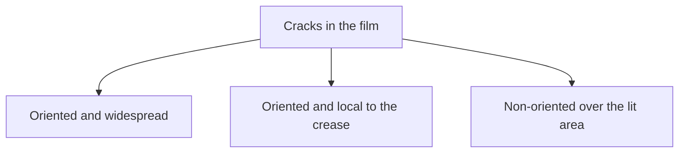
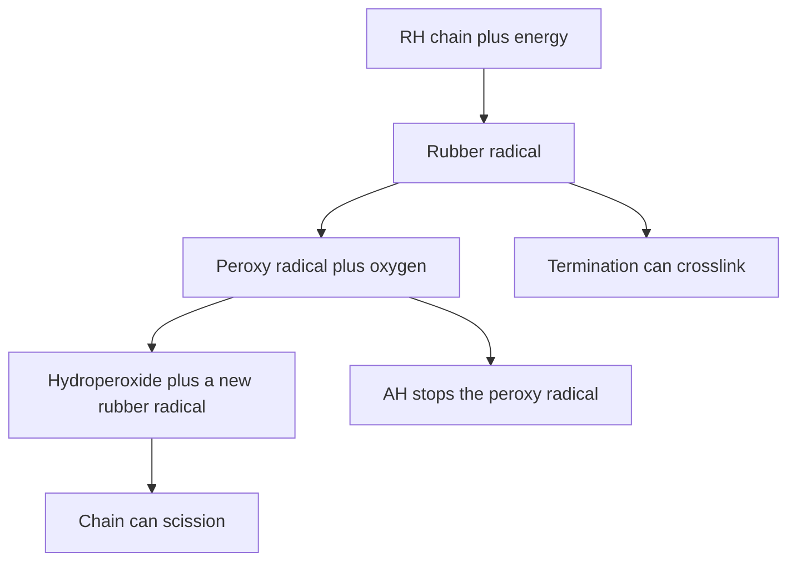
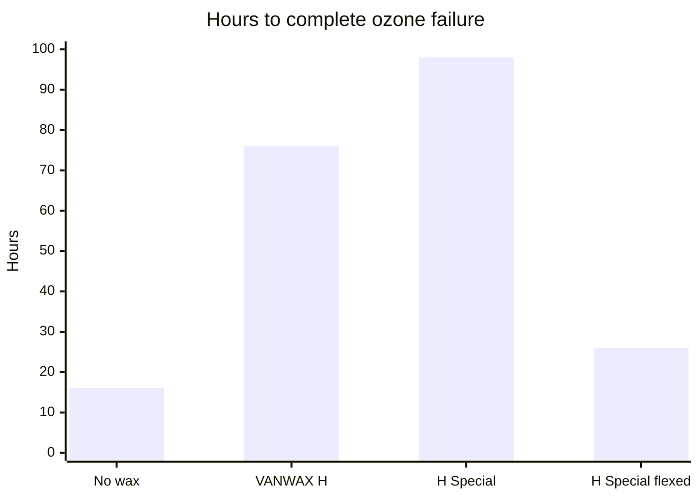

# Antidegradants in DIY Compounds

> *Polymer Latices* Vol 3 notes that certain antioxidants in skin contact may be associated with contact dermatitis, and that for many years there has been concern some antioxidants, or impurities in them, may be carcinogenic. This page is compounding literacy. It does not clear a compound for skin wear. Skin questions sit in [Allergy and Skin Contact](/literature-reviews/allergy-and-skin-contact).

> The phr numbers below are handbook ranges. Extra antioxidant can stain, bloom, or go unused.

## Executive summary

When working with liquid latex, you compound the latex, then dip, cast, or spread a film. That film will age over time. Heat, light, ozone, oxygen, and contact with oils or metals change how fast that breakdown happens. If you want the film to last past a single wear, add an antioxidant to the compound. Thin goods typically fall within a **0.5–2 phr** band, with many industrial recipe cards landing at **1–2 phr** total. Amines offer stronger protection but discolor. Phenolics stain less but offer less protection.

Apply these guidelines while you are compounding. Where you store the finished film is covered in [Aging, Storage, and Care](/literature-reviews/liquid-aging-storage-and-care). Copper risks introduced by pigments are addressed in [Pigment and Filler Compounding](/literature-reviews/liquid-pigment-filler-decks#metal-impurities).

## Questions this article answers

- [Can you stop the film from aging?](#stop)
- [How much antioxidant do you add?](#budget)
- [Amine or phenolic?](#choice)
- [Wax or a PPD when ozone is the problem?](#ozone)
- [What does a hot shelf do?](#heat)

## Can you stop the film from aging? {#stop}

### How

Plan on inevitable aging. Choose your antioxidant, wax, or PPD antiozonant, as well as your storage spot, based on the working life you need. Inspect the crack pattern on an aged film before diagnosing a seam failure.

| Pattern | What you see |
| --- | --- |
| Ozone | Oriented cracks across a wide face |
| Flex | Oriented cracks localized in a crease or joint |
| Ultraviolet | Cracks with no shared direction, across the face exposed to light |

### Why

*The Vanderbilt Latex Handbook* states the reality plainly: degradation of latex articles cannot be prevented; it can only be retarded. No compounding additive gives a vulcanized film permanent immunity. Heat, humidity, ultraviolet light, radiation, ozone, oxygen, industrial chemicals, oils, solvents, oxidizers, heavy metals, and mechanical stress all drive degradation. Several of these stressors often attack at once.

An **antidegradant** is an ingredient mixed into the compound to retard aging. **Antioxidants** slow down attack from oxygen and heat. **Antiozonants**, including PPD types, slow down ozone degradation. **Waxes** bloom to the surface to form a physical barrier against ozone.

Three oxidative degradation modes run concurrently. Chain scission breaks the rubber polymer backbone, causing the surface to become soft and tacky. Crosslinking binds chains together, hardening the film until it loses stretch. Chemical alteration changes the color and alters solubility. Which mode dominates depends on the polymer base, the ambient temperature, and oxygen exposure.

Ozone in standard ambient air measures only about 1–8 parts per hundred million, yet it is far more reactive with unsaturated rubber than molecular oxygen. It attacks the surface directly. Ozone cracks develop perpendicular to the line of tensile stress and spread across the entire exposed surface. Flex cracks also align perpendicular to stress, but stay concentrated where the film bends repeatedly. Ultraviolet cracks show no orientation, appearing across any face that received light.

Detail: How oxidation feeds itself

*The Vanderbilt Latex Handbook* diagrams autocatalytic oxidation in three distinct stages:

1. **Initiation:** Environmental energy cleaves a rubber chain (RH) into a free rubber radical ($R^\bullet$).
2. **Propagation:** The rubber radical reacts with oxygen to form a peroxy radical ($ROO^\bullet$). This peroxy radical abstracts a hydrogen atom from an adjacent rubber chain, yielding a hydroperoxide ($ROOH$) and generating a new rubber radical ($R^\bullet$). Hydroperoxide homolysis propagates the chain reaction and causes backbone chain scission.
3. **Termination:** Radicals combine into stable products: two rubber radicals can crosslink ($R-R$), a rubber radical can combine with a peroxy radical ($ROOR$), or two peroxy radicals can terminate into non-radical species.

Accelerators and primary antioxidants (phenolics and secondary aromatic amines) interrupt this cycle by donating a hydrogen atom to peroxy radicals:

$$ROO^\bullet + AH \rightarrow ROOH + A^\bullet$$

The resulting antioxidant radical ($A^\bullet$) is resonance-stabilized and incapable of abstracting hydrogen from the rubber backbone. It subsequently couples with a second peroxy radical to form an inactive product:

$$ROO^\bullet + A^\bullet \rightarrow ROOA$$

## How much antioxidant do you add? {#budget}

### How

Measure your antioxidant in parts per hundred rubber (**phr**). 1 phr means 1 part of active antioxidant per 100 parts of dry rubber content.

Add an effective antioxidant to nearly every liquid latex recipe. For thin dipping films, use a target range between **0.5 phr and 2 phr**. Industrial recipe cards from Vanderbilt frequently specify **1–2 phr** total antioxidant or blend.

Account for protective ingredients already present in the batch. Field-tapped natural rubber latex retains natural serum antioxidants. Several sulfur accelerators also impart antioxidant properties, most notably zinc diethyldithiocarbamate (ZDEC), while zinc 2-mercaptoimidazolate provides moderate antioxidant protection.

Stir stored compounds thoroughly before you dip, cast, or spread. If compounding dispersions settle out, dipped goods made from the top and bottom of the tank will vary in degradation resistance. Ensure your antioxidant dispersion has a fine particle size so the protection distributes evenly through the wet film.

If copper, brass, or bronze will contact the cured film, increase your antioxidant loading to **2 phr** total active material.

When dipping with a coagulant bath, leach the wet film in warm water. Residual salts like calcium nitrate accelerate discoloration under heat, industrial fumes, or ultraviolet light, degrading the physical properties of the film.

### Why

Natural rubber latex that avoids dry-mill mastication retains its molecular chain length and natural serum protective agents, meaning it ages better out of the drum than masticated dry rubber. Even so, handbooks recommend compounding a dedicated antioxidant into the formula, particularly for thin-gauge goods where the surface area is high relative to the volume of rubber.

The 0.5–2 phr range from *Polymer Latices* and the 1–2 phr target from *The Vanderbilt Latex Handbook* describe compatible industrial standards. Use the lower end for pale goods needing minimal discoloration; use the higher end for dark goods facing aggressive heat, flex, or metal contact.

Heavy metals like copper and manganese catalytically decompose hydroperoxides into free radicals, dramatically accelerating oxidation. This catalytic cycle rapidly consumes available antioxidant molecules. Vanderbilt's 2 phr rule allocates 1 phr to standard environmental oxidation and a second 1 phr reserve to neutralize metal-catalyzed breakdown.

Detail: Free sulfur and a sulfur donor age in opposite directions

Vanderbilt demonstrates compounding effects on aging using Base Compound 1: 100 phr natural rubber, 1 phr VANOX GT antioxidant, 3 phr zinc oxide, and 1 phr BUTYL ZIMATE, vulcanized for 20 minutes at 93°C:
- **Compound A:** Formulated with 1 phr elementary sulfur.
- **Compound B:** Formulated with 1 phr SULFADS (dipentamethylenethiuram hexasulfide) as a sulfur donor, with no elemental sulfur.

After accelerated heat aging for 2 days at 100°C:
- Compound A (free sulfur) exhibits polysulfidic crosslink cleavage (scission), showing a drop in modulus and tensile strength with an increase in ultimate elongation.
- Compound B (sulfur donor) generates monosulfidic and disulfidic crosslinks that favor post-vulcanization network formation, showing an increase in modulus and tensile strength with a drop in ultimate elongation.

Figure 2 from the handbook illustrates this divergence:

Select sulfur-donor curing systems when you need a vulcanized film that resists softening and tackiness during hot-air aging.

Detail: Antioxidant that stays tied to the network

*Polymer Latices* Vol 3 covers polymer-bound (network-bound) antioxidants where the protective functional moiety is covalently bonded directly to the rubber polymer chain. This immobilization prevents the antioxidant from being extracted by detergents, volatilized by heat, or migrated into adjoining materials.

However, if protection relies on active migration to the film surface, network immobilization hinders performance. While early hypotheses suggested chemical immobilization would reduce steric radical-scavenging activity, experimental data cited by Blackley demonstrated comparable antioxidant efficiency to free molecules.

One documented industrial method (Cain and Saville) incorporates 1 phr of N,N-diethyl-p-nitrosoaniline as a 50% aqueous dispersion into natural rubber latex, followed by compounding with 1 phr sulfur and zinc accelerators. The nitroso group reacts with unsaturated rubber bonds during vulcanization, anchoring the amine antioxidant directly to the elastomer backbone.

## Amine or phenolic? {#choice}

### How

Select a **phenolic** antioxidant if you are producing white, pastel, or translucent films where color stability is your primary requirement.

Select an **amine** antioxidant if you are casting black or dark films that require maximum resistance to heat and oxygen. Amines discolor noticeably, making them unsuitable for light garments or pale sheet goods.

Always review the technical data sheet for your dispersion to verify its staining classification. The chemical family dictates performance; trade names only indicate the packaging.

### Why

The two major antioxidant chemistries represent a direct performance trade-off. Phenolic antioxidants are non-staining or minimally staining, but they provide less chemical resistance against oxidation and high-temperature exposure.

Amine antioxidants provide superior radical-scavenging activity against heat, oxygen, and trace transition metals, but they oxidize into quinoid chromophores. As *Polymer Latices* points out, amine degradation produces dark reddish-brown reaction products that stain the host film and will migrate into adjacent light-colored polymers.

A light-colored translucent garment and a black heavy-gauge dipped piece require different chemical selections, even if both formulas use 1 phr of total antidegradant.

Detail: Structures, and why a phenolic can move the pH

*Polymer Latices* Vol 3 highlights two classic aromatic amine antioxidants:
- **Phenyl-2-naphthylamine (PBN):** Highly effective against thermo-oxidative breakdown, but exhibits severe brown staining and is difficult to disperse cleanly in aqueous systems due to its resinous nature.
- **N,N'-di-2-naphthyl-p-phenylenediamine (DNPD):** One of the most effective general-purpose antioxidants for unsaturated rubbers, offering notable resistance to heavy-metal-catalyzed oxidation.

Among non-staining hindered phenolics, the handbook highlights:
- **2,2'-methylene-bis(4-methyl-6-tert-butylphenol):** Extensively used in both natural rubber and polychloroprene latices at approximately 2 phr.
- **4,4'-butylidene-bis(6-tert-butyl-m-cresol):** A high-molecular-weight hindered bisphenol showing low volatility and minimal discoloration.
- **Hydroquinone monobenzyl ether:** Provides fair protection, though it exhibits slight yellow discoloration upon extended light exposure.

Sterically hindered phenols contain weakly acidic hydroxyl groups. In an alkaline latex concentrate (pH 9.5–10.5), these phenols dissociate partially into phenolate anions:

$$ArOH + OH^- \rightleftharpoons ArO^- + H_2O$$

This equilibrium slightly depresses the compound pH while increasing the negative electrokinetic zeta potential on the rubber particle surfaces. This shift changes colloidal stability, an effect separate from the chemical protection the antioxidant provides to the vulcanized film.

## Wax or a PPD when ozone is the problem? {#ozone}

### How

For articles that remain static during exposure, compound a microcrystalline wax dispersion at **0.5–1.0 phr**. Allow the vulcanized film several days to rest so the wax can bloom and build a continuous physical barrier. Freshly dried or vulcanized films will fail ozone tests before this surface layer establishes.

For articles that repeatedly flex or stretch in service, do not rely on wax alone. Use a paraphenylenediamine (PPD) antiozonant. Industrial dialkyl PPD additives (such as ANTOZITE 1 and 2) require a minimum threshold of **2 phr**, with typical compounding levels at **3 phr**; lower concentrations fail to protect dynamic films. These compounds produce intense brick-red to brown discoloration and are strictly limited to dark or black formulations.

If you are manufacturing a light-colored film that must flex under ozone exposure, review the non-staining chemical options described below.

To retard degradation from ultraviolet light, wrap finished goods in opaque packaging containing UV absorbers. Incorporating soluble UV absorbers directly into the compound is inefficient because the molecules distribute through the bulk thickness of the film rather than concentrating on the exposed surface. Inorganic pigments like zinc oxide and titanium dioxide act as physical UV reflectors throughout the compound.

### Why

Microcrystalline paraffin waxes have limited solubility in vulcanized rubber. After drying and vulcanization, the supersaturated wax migrates to the exterior face, forming an inert, physical barrier that blocks atmospheric ozone from reaching the rubber double bonds. Because this layer is purely physical, mechanical stretching or flexing ruptures the wax crust. Ozone then attacks the exposed cracks in the rubber underneath.

PPD antiozonants migrate continuously to the surface and react scavengingly with atmospheric ozone and ozonides faster than ozone can cleave the rubber double bonds. This chemical protection remains active while the film flexes, which is why dynamic articles require higher loading levels and accept significant discoloration.

In testing documented by Vanderbilt, natural rubber films were conditioned for 3 weeks at 23°C and 50% relative humidity to permit full wax bloom. Under ozone chamber exposure, the unprotected control film failed completely in 16 hours. A compound with standard microcrystalline wax resisted failure for 76 hours, and an optimized wax blend extended survival to 98 hours. However, when that same optimized wax film was subjected to dynamic flexing, complete failure dropped to 26 hours as the barrier fractured.

Detail: Hours in that wax series, and light-colored options

When antiozonant discoloration cannot be tolerated on light-colored natural rubber goods, standard PPDs are unusable. Vanderbilt documentation identifies several alternative compounding approaches:
- **Polymerized 1,2-dihydro-2,2,4-trimethylquinoline (AGERITE RESIN D):** Provides heat and oxidative resistance with moderate ozone retardance at 3–5 phr, causing significantly less staining than PPDs.
- **Nickel dibutyldithiocarbamate (NBC):** Functions as an antiozonant in synthetic elastomers like SBR, but acts as a pro-oxidant in natural rubber and must never be added to natural rubber latex.
- **Thiourea-accelerator blends:** A laboratory-developed non-staining system using 3 phr THIATE U (1,3-dibutylthiourea) combined with 0.25 phr BUTYL ZIMATE (zinc dibutyldithiocarbamate) provides dynamic ozone retardance in light natural rubber films without producing the severe brown discoloration of PPDs.

## What does a hot shelf do? {#heat}

### How

Store vulcanized rubber films in a cool, low-lying indoor storage location away from direct sunlight, heating vents, and electric motors.

Roll sheet goods and garments loosely around wide cores or fold them with gentle radii. Never press them flat under sharp creases. Sharp bends concentrate mechanical stress, forming focal points where ozone cracking begins.

Do not package light-colored rubber in clear plastic or cellophane films under ambient light. The wrapping traps heat and allows photo-oxidation to discolor the outer layer.

Compounding antioxidants into the rubber does not permit hot storage. Additives only extend shelf life when combined with proper storage conditions.

### Why

Chemical oxidation follows Arrhenius reaction kinetics: the oxidation rate of a natural rubber latex film approximately doubles for every 8.3°C increase in temperature.

*The Vanderbilt Latex Handbook* illustrates this through a seasonal warehouse study: in unconditioned industrial buildings during summer months, air temperatures measure roughly 35°C at floor level and can reach 60°C near the roof deck. Because of the thermal reaction rate, goods stored near the ceiling degrade approximately eight times faster than identical goods resting near the floor. Placing compounded stock on a high shelf in an uninsulated garage causes the same thermal breakdown.

Detail: Packaging that still lets aging through

Standard cardboard containers and clay-coated packaging boards are permeable to atmospheric oxygen and ozone. In the girdle and foundation-garment storage studies cited by Vanderbilt, goods were rolled without sharp folds and sealed inside heavy cardboard tubes fitted with end plugs to reduce air exchange and eliminate UV exposure.

Thin transparent polymer films (such as polyethylene, PVC, or cellophane) transmit near-ultraviolet radiation (290–400 nm). When wrapped rubber is exposed to light, the polymer wrap allows actinic light to initiate radical formation on the rubber surface while trapping volatile oxidative degradation byproducts. Heat build-up beneath the film accelerates degradation regardless of the antioxidant loading in the compound.

## Sources

- *The Vanderbilt Latex Handbook*. 3rd ed. Edited by Robert Francis Mausser. Norwalk, CT: R.T. Vanderbilt Company, 1987. [Library of Congress](https://lccn.loc.gov/92117844)
- *Polymer Latices: Science and Technology — Volume 3: Applications of Latices*. 2nd ed. D. C. Blackley. Chapman & Hall / Springer, 1997. [Google Books](https://books.google.com/books?id=Y2VPGj7YbykC)