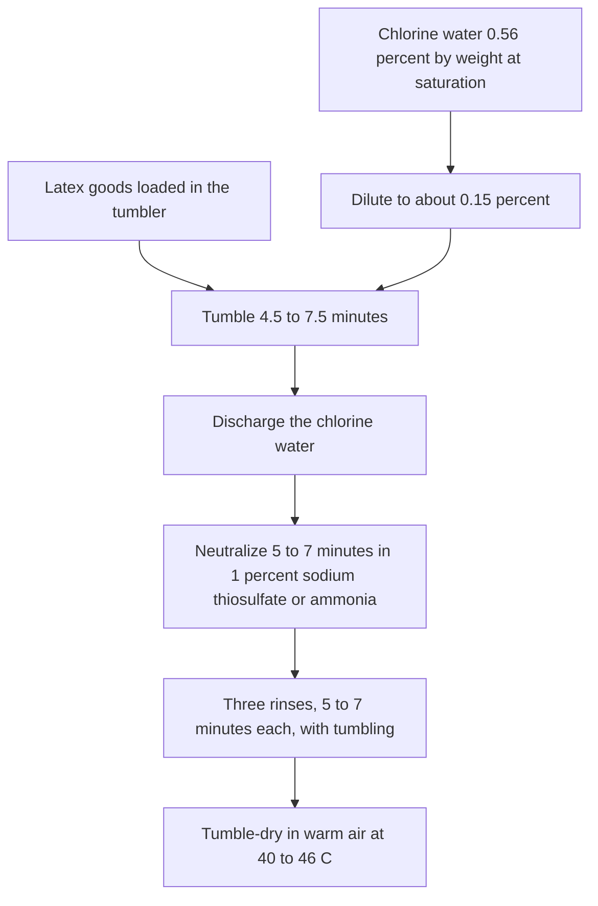

# Chlorination for Tack Control

> **Safety.** The bath turns acidic. Neutralize before the water rinses. Keep copper and brass out of the liquor and off anything that touches the goods. Read the product and process SDS. Halogenation on this page is a tack treatment. Protein and allergy classes are in [Allergy and Skin Contact](/literature-reviews/allergy-and-skin-contact).

## Executive summary

Vulcanized dipped film is naturally tacky. Talc dusting provides a cheap, temporary fix. A permanent commercial alternative is aqueous halogenation using chlorine water, sodium hypochlorite, or bromine water. Finished goods tumble in the liquor, enter a neutralizing bath, receive three water rinses, and dry in warm air. Commercial manufacturing lines rely primarily on chlorine water.

Use this treatment with liquid latex after the film is fully vulcanized. How that initial surface formed is covered in [Liquid Film Surface Finish](/literature-reviews/liquid-surface-finish-literacy).

## Questions this article answers

- [When do you halogenate a dipped film?](#when)
- [Which solution cuts tack with less discoloration?](#solution)
- [How does sulfur in the vulcanized film change the time?](#sulfur)
- [What order do you treat, neutralize, rinse, and dry?](#order)
- [What does halogenation change for skin contact?](#skin)

## When do you halogenate a dipped film? {#when}

### How

Halogenate dipped goods when you need a permanent surface treatment rather than a temporary powder coating. Household gloves and medical tubing are standard examples. For dipped gloves where the wearer must handle wet items, apply chlorine or bromine water to cut surface drag.

### Why

Talc sits loosely on the rubber and washes away during use. Halogenation chemically modifies the vulcanized surface, keeping drag low permanently. Surface texturing on a former alters physical contact area, but wet rubber remains slick without this chemical treatment.

## Which solution cuts tack with less discoloration? {#solution}

### How

Use dilute chlorine water to match standard dipped-goods operations. Select your halogen source based on process priorities:

| Solution | Tack reduction | Discoloration |
| --- | --- | --- |
| Chlorine water | About the same as bromine water | Least of the three |
| Bromine water | About the same degree as chlorine water | More than chlorine |
| Sodium hypochlorite | Less than chlorine or bromine | About the same as bromine |

### Why

Chlorine gas ships in pressurized cylinders. Bromine is a liquid, and sodium hypochlorite comes pre-mixed in solution. Both alternatives avoid the handling hazards of gas cylinders. Plants still favor aqueous chlorine gas solutions because they minimize discoloration while matching the tack reduction of bromine.

Detail: Hypochlorite in the Vanderbilt laboratory

The Vanderbilt laboratory evaluated commercial household bleach (Clorox brand sodium hypochlorite) for film treatment, noting it was the simplest process to stage in a small facility. Laboratory testing confirmed that hypochlorite ranks below chlorine water in friction reduction and causes more yellowing.

## How does sulfur in the vulcanized film change the time? {#sulfur}

### How

Adjust tumbling duration between 4.5 and 7.5 minutes based on the sulfur content of the vulcanized film. Shorten exposure for high-sulfur compounds. Lengthen exposure for low-sulfur compounds.

### Why

The halogenation reaction rate depends directly on the sulfur present in the vulcanizate. Higher sulfur concentrations react rapidly with dissolved chlorine. Lower sulfur concentrations react slowly and require longer contact times to achieve the same surface finish.

Detail: Sulfur levels and bath concentration

Goods compounded with 1.5 to 1.75 phr sulfur react faster than goods made with 0.25 to 0.35 phr sulfur. When treating low-sulfur film, processors may raise the chlorine concentration in the bath to shorten cycle times instead of extending the tumble duration.

## What order do you treat, neutralize, rinse, and dry? {#order}

### How

Run the entire sequence at room temperature. Use vessels lined with glass or made of stainless steel. Follow the standard schedule:

Discharge and replace the chlorine liquor after each batch. Keep all copper and brass hardware away from the solution and out of contact with wet goods.

### Why

Halogenation generates hydrochloric acid in the liquor. A dedicated 5 to 7 minute bath in 1 percent sodium thiosulfate or dilute ammonia neutralizes this acid before fresh water enters. Three successive tumbling rinses remove residual salts and processing chemicals. A warm-air cycle at 40 to 46 °C dries the goods and stabilizes the surface.

Detail: Stock saturation and bath volume ratios

Chlorine saturation in water reaches 0.56 percent chlorine by weight at standard conditions. Diluting this stock concentrate creates the working bath target of approximately 0.15 percent.

The liquid ratio requires approximately 1.5 ml of chlorine solution for every 2.5 cm² of latex surface area. This volume ensures complete submersion and uniform fluid movement across all surfaces in the tumbler.

## What does halogenation change for skin contact? {#skin}

### How

Never place chlorinated goods against skin until the neutralization, triple rinse, and warm-air drying stages are fully complete. Review the Safety Data Sheet for every bath component. Refer to [Allergy and Skin Contact](/literature-reviews/allergy-and-skin-contact) to understand protein extraction and accelerator sensitivities.

### Why

Halogenation changes surface friction and drag. The neutralization and multi-stage rinsing procedures exist specifically to eliminate acidic reaction byproducts and processing residues that cause dermal irritation.

## Sources

- *The Vanderbilt Latex Handbook*. 3rd ed. Edited by Robert Francis Mausser. Norwalk, CT: R.T. Vanderbilt Company, 1987. [Library of Congress](https://lccn.loc.gov/92117844)