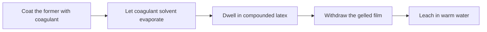
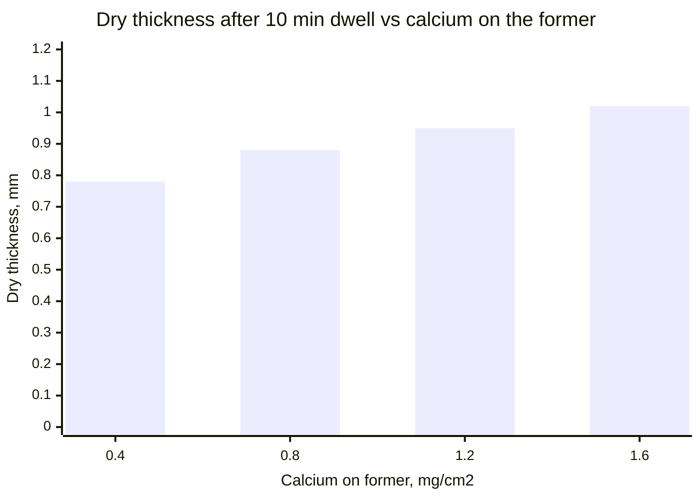
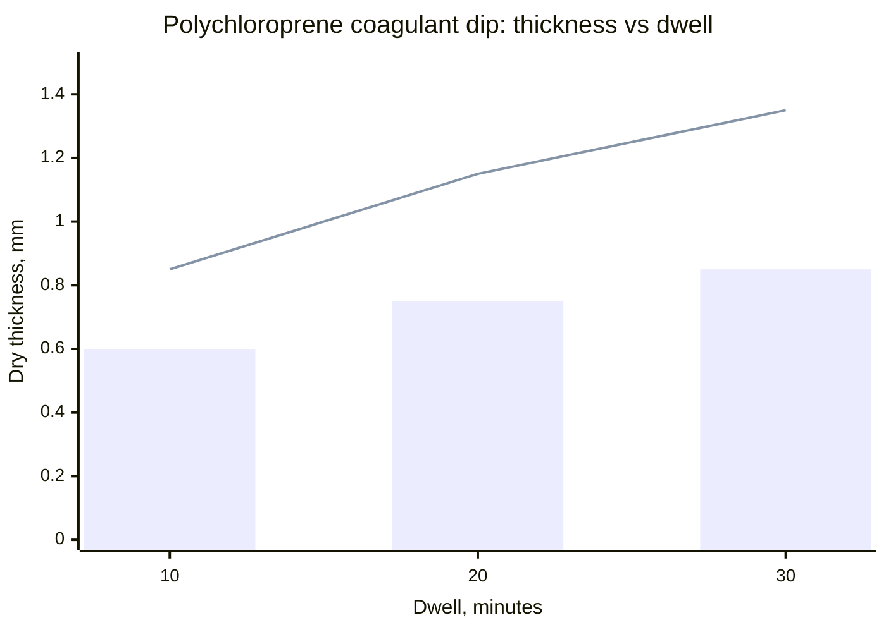

# Coagulant Dipping for Wearable Thickness

> **Safety.** Acetic acid coagulants need goggles and gloves. Add acid to water. Warm-water leach is part of the dip. Keep copper and brass out of the pipes that feed the leach tank. See [Allergy and Skin Contact](/literature-reviews/allergy-and-skin-contact).

## Executive summary

Coagulant dipping builds a wearable wall of liquid latex in a single pass. You coat a former with a salt solution, let the solvent evaporate, immerse the former in compounded liquid latex, and withdraw a gelled film.

A single coagulant dip typically deposits 0.2 to 0.8 mm of dry rubber. In contrast, straight dipping without a coagulant yields only about 0.01 to 0.05 mm per pass. Handbooks note that most dipped goods thicker than 8 mils (about 0.2 mm) rely on a coagulant to build wall thickness quickly. The key variables are the mass of salt deposited on the former, the dwell time in the tank, compound viscosity, and withdrawal speed. For polychloroprene latex, compound pH also controls the build rate. After dipping, you leach the wet gel in warm water and dry it under controlled humidity.

Use this guide after [Former dip, mould cast, and flat spread](/literature-reviews/liquid-former-dip-vs-mould-cast-vs-flat-spread) has led you to choose a dipping former.

## Questions this article answers

- [When does a coagulant dip replace another straight dip?](#when)
- [What do you put on the former first?](#coagulant)
- [How long does the former stay in the latex?](#dwell)
- [How do you keep the wet gel sound?](#gel)
- [What do you do after withdrawal?](#after)
- [How do you choose?](#choose)

## When does a coagulant dip replace another straight dip? {#when}

### How

Choose a coagulant dip whenever a single pass needs to reach a few tenths of a millimetre of dry rubber. Coat the former with coagulant solution, allow the solvent to evaporate, lower the former into the compounded liquid latex, dwell until the deposit builds, withdraw at a steady speed, and transfer the gel to a warm-water leach.

### Why

Straight dipping without a coagulant leaves a very thin layer. In tests on three natural-rubber compounds, a single straight dip deposited only 0.012 to 0.044 mm of dried rubber as compound viscosity increased (*Polymer Latices*, Volume 3). 

Coagulant dipping provides the standard industrial route to skip dozens of repeated dips. *Polymer Latices* cites **0.2 to 0.8 mm** as the typical dry thickness from one coagulant pass. The Vanderbilt latex handbook states that most dipped articles thicker than 8 mils (0.2 mm) dry use a coagulant because the wall forms much faster.

Heat-sensitized dipping offers another single-pass method, but it follows a different thickness-over-time profile. On ammonia-preserved natural rubber, heat dipping requires keeping the latex tank within ±1 °C. The steps for that route appear in [Heat-sensitized gelation](/literature-reviews/liquid-heat-sensitized-gelation).

Detail: Typical thickness band and measured limits

The 0.2 to 0.8 mm range describes standard factory runs. In the same chapter of *Polymer Latices* Volume 3, test runs using higher calcium salt concentrations on the former reached 1.02 mm of dry rubber after a 10-minute dwell. Treat 0.8 mm as the standard production band, and refer to the salt concentration table below for higher measured values.

## What do you put on the former first? {#coagulant}

### How

Dissolve a solid salt in alcohol or water, coat the clean former, and let the solvent evaporate before lowering the former into the latex. Calcium nitrate and calcium chloride are the standard salts. Apply a higher salt concentration to the former when you need a thicker gel for the same dwell time in the tank.

If you choose a wet coagulant like acetic acid, the acid film must remain liquid when entering the latex. Always add acid to water when mixing baths, and wear protective goggles and gloves.

### Why

Dry-coagulant dipping is by far the more common method in commercial dipping. A dry salt coat stays fixed in place, whereas a wet liquid coagulant can slide down a smooth former and cause uneven deposits. Calcium nitrate dissolved in alcohol wets the former cleanly and dries rapidly. 

Cyclohexylammonium acetate is used when making thin, transparent films, but it destabilizes latex far less effectively than calcium salts. The Vanderbilt handbook lists alcoholic calcium nitrate, a **20% alcoholic calcium chloride solution**, and aqueous acetic acid (typically specified for fabric-lined chloroprene gloves) as representative plant formulations.

Detail: Calcium on the former after 10 minutes

Dry thickness versus calcium salt deposited on the former, measured in *Polymer Latices* Volume 3 after a 10-minute dwell:

| Calcium on the former | Dry thickness |
| --- | --- |
| 0.4 mg/cm² | 0.78 mm |
| 0.8 mg/cm² | 0.88 mm |
| 1.2 mg/cm² | 0.95 mm |
| 1.6 mg/cm² | 1.02 mm |

Most of the calcium found in the gel remains water-soluble and diffuses toward the boundary between the gelled rubber and the liquid latex. The insoluble calcium fraction is small and increases slightly as dwell time extends.

## How long does the former stay in the latex? {#dwell}

### How

Hold the former stationary in the compound until the deposit reaches target thickness, then withdraw slowly and smoothly. Expect early minutes of dwell time to build rubber much faster than later minutes. 

Do not assume growth stops at ten minutes if your compound has high total solids content. Because the outer surface of the freshly withdrawn deposit is still fluid, keep withdrawal speeds low and smooth to prevent latex from running off the former.

### Why

Coagulant ions diffuse outward from the former surface into the latex, destabilizing suspended rubber particles along the moving front. Because the diffusion distance increases and salt ions are consumed, deposit thickness generally tracks the **square root of dwell time**. 

Higher compound viscosity also increases the total deposit by adding a thicker boundary layer of dragout. *Polymer Latices* Volume 3 notes that for ammonia-preserved natural rubber at high total solids, film thickness continued to climb after 1 hour of immersion. 

An earlier text, *High Polymer Latices* (1966), states that deposit thickness in wet-coagulant dipping usually levels off within 5 to 10 minutes. That observation applied to a wet acid system. The 1997 measurements reflecting continuous hour-long growth apply to dry-salt dipping in high-solids compounds.

Detail: Why square-root dwell plots show a bend

In the 1997 dwell series across several total-solids levels, plots of coagulant-deposited thickness against the square root of time show two distinct linear regimes rather than one single line. The slope changes around 5 to 10 minutes, and the transition occurs later at higher solids content. 

The outer layer of a long-dwell deposit is ungelled or barely gelled, and part of it flows off when the former leaves the tank. When that drained rubber is collected and added to the deposit mass, the plotted points align on a single straight line. The measured growth past 10 minutes reflects real deposition, not an experimental error.

Detail: Square-root growth equations

For a specific compound and coagulant system, Gorton expresses coagulant-deposited thickness as:

$$\theta' = A + B\sqrt{t}$$

An expanded form accounts for compound viscosity:

$$\theta' = \alpha + \beta\sqrt{t} \log \eta$$

Here, $\theta'$ is the thickness credited strictly to coagulant action after subtracting the straight-dip dragout contribution, $t$ is dwell time, and $\eta$ is viscosity. The constants depend on compound formulation, solids content, and salt concentration. Transferring an equation from a glove formulation to a custom latex mix requires fresh calibration.

## How do you keep the wet gel sound? {#gel}

### How

Track the precure level of your compound using the chloroform test, aiming for a rating of **Chloroform Coagulant Number 2 to 3**. Do not dip when the rating sits below 2. 

Keep entrained air out of the dipping tank. Pull a gentle vacuum over stored compound before production, or let it stand until micro-bubbles escape. Refill dipping tanks down an inclined wall or pipe to avoid beating air into the liquid. Inspect dry parts for defects using [Liquid film defects](/literature-reviews/liquid-film-defect-atlas).

### Why

The chloroform test provides a rapid plant check on the cross-linking state of compounded liquid latex before dipping. Number 1 indicates uncured rubber, while Number 4 indicates an advanced precure state. 

The Vanderbilt dipping chapter targets Number 2 to 3. Below 2, the wet gel lacks cohesion; gloves and garments can blow, distorting or tearing when stripped from the former. At Number 2 to 3, the gel holds its shape during handling while particles retain enough tack to knit completely. Air trapped in the compound cannot dissolve out during gelation and forms pinholes in the cured film.

Detail: Chloroform test coagulum ratings

The test mixes equal parts latex and chloroform, rating the coagulum consistency on a 1 to 4 scale. Although subjective, it serves as a rapid shop check where solvent-swell testing takes hours.

1. Tacky lump, breaks stringy.
2. Tender lump, breaks short.
3. Nontacky agglomerates.
4. Small dry crumbs.

## What do you do after withdrawal? {#after}

### How

Leach the freshly gelled film in circulating warm water. Discard or deionize the leach water rather than reusing salt-saturated bath water. 

Dry the film in an environment held around **20 to 26 °C** and 45 to 50% relative humidity, following Vanderbilt plant parameters. If you plan a second dip, immerse the former before the first layer forms a dry skin. Allow chloroprene films a longer room-temperature drying window than natural rubber before applying a second coat. For polychloroprene compounds, regulate compound pH within the 10.3 to 10.9 range.

### Why

Warm-water leaching washes residual calcium salts, compounding residues, and serum solids out of the porous wet gel. Extracting these soluble materials improves vulcanized tensile properties, decreases water absorption in service, and prevents surface discoloration. 

Controlled drying humidity ensures uniform water evaporation. Excessive humidity traps moisture inside the rubber matrix, which reduces tensile strength and modulus after vulcanization. Very low humidity dries the surface too quickly, creating a glazed skin that prevents subsequent dips or flock from knitting. Never use brass or copper fittings in leach water delivery, because copper contamination catalytically degrades natural rubber.

For polychloroprene compounds, lowering the pH accelerates coagulation and produces a thicker deposit during the same dwell period. *High Polymer Latices* (1966) recommended a factory compromise range of 10.3 to 10.8, while *Polymer Latices* Volume 3 (1997) reported 10.3 to 10.9. Keep within 10.3 to 10.9 to maximize deposit build while keeping the compound stable against premature tank gelation.

Detail: Polychloroprene thickness at two pH values

Livingston and Walsh data, reported in *Polymer Latices* Volume 3, comparing deposit thickness against dwell time at two pH levels. The pH was adjusted from 12.1 down to 10.7 by adding 0.5 parts glycine per hundred parts rubber (phr):

| Dwell | pH 12.1 | pH 10.7 |
| --- | --- | --- |
| 10 min | 0.60 mm | 0.85 mm |
| 20 min | 0.75 mm | 1.15 mm |
| 30 min | 0.85 mm | 1.35 mm |

The bars represent compound at pH 12.1. The line represents compound adjusted to pH 10.7.

## How do you choose? {#choose}

### How

- Use coagulant dipping whenever your target dry gauge is **0.2 mm or thicker** from a single dip.
- When you need a dry film over 0.8 mm, increase the calcium salt concentration on the former and extend dwell time beyond 10 minutes.
- Verify your warm-water leach and humidity controls before attempting to raise coagulant concentration.
- If wet gels tear, blow, or distort, evaluate the compound with the chloroform test before changing coagulant salt levels.
- For multi-layer dips, apply the second coat before the first coat forms a glazed skin, allowing chloroprene extra drying time between passes.
- Maintain polychloroprene compounds between pH 10.3 and 10.9 to achieve rapid deposition without sacrificing bath stability.

### Why

Salt density on the former, dwell time, compound viscosity, withdrawal speed, drying humidity, and compound pH each dictate final film gauge and structural soundess. Balancing these parameters systematically prevents defects while achieving wearable garment thickness.

## Sources

- *The Vanderbilt Latex Handbook*. 3rd ed. Edited by Robert Francis Mausser. Norwalk, CT: R.T. Vanderbilt Company, Inc., 1987. [Library of Congress](https://lccn.loc.gov/92117844)
- *Polymer Latices: Science and Technology — Volume 3: Applications of Latices*. 2nd ed. D. C. Blackley. London: Chapman & Hall, 1997. [Google Books](https://books.google.com/books?id=Y2VPGj7YbykC)
- *High Polymer Latices: Their Science and Technology*. 2 vols. D. C. Blackley. London: Maclaren & Sons; New York: Palmerton Publishing, 1966. [Library of Congress](https://lccn.loc.gov/66077950)