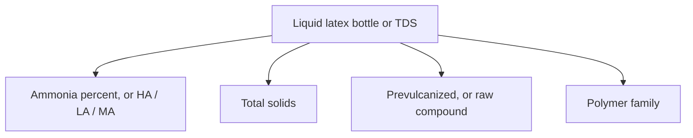
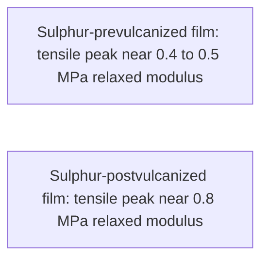

# Decoding Liquid Latex Bottle Labels

> **Label literacy, not medical advice.** Food-contact rubber tables and industrial concentrate specs do not certify fashion-garment wear clearance. See [Allergy and Skin Contact](/literature-reviews/allergy-and-skin-contact).

## Executive summary

Check the label or technical data sheet for four core values: the ammonia percentage, total solids content, whether the rubber is prevulcanized or an unvulcanized compound, and the polymer family. 

Use these specifications when selecting liquid latex, comparing suppliers, or evaluating claims about food contact and medical grades. Pair this guide with [Forming film from liquid latex](/literature-reviews/liquid-film-pathway) and [Liquid painting vs compounding pigment](/literature-reviews/liquid-painting-vs-compounding-pigment).

## Questions this article answers

- [What should I read on a liquid latex bottle?](#what-to-read)
- [Which marketing words are not concentrate specs?](#marketing-words)

## What should I read on a liquid latex bottle? {#what-to-read}

### How

Check the bottle label or technical data sheet for four specific entries:

1. Ammonia content: a percentage, along with the grade category (high-ammonia, low-ammonia, or medium-ammonia).
2. Total solids percentage.
3. Cure state: prevulcanized latex, or an unvulcanized raw compound requiring heat vulcanization after film drying.
4. Polymer family: natural rubber, polychloroprene, or another defined polymer.

If the product sheet omits these values, you cannot evaluate the material against industrial concentrate standards. A dried film that feels non-tacky does not prove the liquid was prevulcanized.

When working with prevulcanized liquid latex, plan only for water evaporation. Do not apply oven vulcanization cycles intended for raw compounds. See [Prevulcanized consumer latex](/literature-reviews/liquid-prevulcanized-consumer-latex).

### Why

Fresh natural rubber latex coagulates within hours of harvesting (*Practical Guide to Latex Technology*). Preservatives stop microbial growth and keep the liquid stable. Ammonia serves as the standard preservative in the concentrations established by technical handbooks.

ASTM D1076 sets standard specifications for ammonia-preserved natural rubber concentrates, explicitly excluding compounded latex. ISO 2004 defines centrifuged and creamed concentrates across high-, low-, and medium-ammonia categories, setting strict limits on trace copper and manganese. Neither standard specifies retail packaging for craft use.

Prevulcanized latex cross-links during liquid storage before casting or dipping. Dipped films made from prevulcanized latex require only warm-air drying to achieve their final mechanical strength (*The Vanderbilt Latex Handbook*). An unvulcanized raw compound follows an entirely different sequence: the cast deposit must dry completely, then undergo oven heating to complete vulcanization.

Detail: Ammonia percentages and test comparisons

ISO 2004 classifies centrifuged and creamed concentrate into high-ammonia (HA), low-ammonia (LA), and medium-ammonia (MA) types. Retail craft bottles rarely correlate directly to these standard designations.

*Practical Guide to Latex Technology* (Joseph, 2013) identifies distinct ammonia concentration thresholds:

- Ammonia acts as an effective bactericide at concentrations above 0.35%.
- Long-term preservation of concentrated latex requires 0.6% to 1.0% ammonia by weight of latex.
- Field latex preserved with ammonia alone requires 0.4% to 0.5% for single-day transit. Storage beyond 24 hours requires at least 1.0%. Field latex containing under 35% total solids can require even higher dosages.
- A standard low-ammonia preservation system combines 0.2% ammonia with secondary preservatives: 0.0125% tetramethylthiuram disulfide (TMTD), 0.0125% zinc oxide, and 0.05% lauric acid.

*High Polymer Latices* (Blackley, 1966, Volume 1) cites earlier bacterial count experiments from Lowe (1960). Field latex was sampled after 4 hours at 27°C. Bacterial mortality balanced reproduction only at roughly 0.1% ammonia on total latex weight. Between 0.35% and 0.5% ammonia, viable bacterial counts remained steady at roughly 10⁴·¹ per ml. These numbers illustrate why small ammonia additions do not sanitize field latex immediately. Modern concentrate handling relies on the preservative dosages outlined in Joseph and formal international standards.

| Initial ammonia (% on whole latex) | Viable bacteria per ml after 4 hours at 27°C |
| --- | --- |
| 0 | 10⁷ |
| 0.1 | 10⁵ |
| 0.35 | 10⁴·¹ |
| 0.5 | 10⁴·¹ |

At identical ammonia concentrations, liquid natural rubber latex maintains a lower pH than pure water. Serum proteins present in the latex neutralize a portion of the added ammonia (Blackley, 1966).

Confirm which calculation basis the manufacturer uses for stated percentages. *The Vanderbilt Latex Handbook* notes three different bases: percent of wet latex weight, percent of the aqueous phase, or parts per hundred dry rubber. A typical centrifuged concentrate might contain 62% dry rubber and 0.65% NH₃ calculated on wet weight. Studio ventilation requirements depend directly on total airborne ammonia concentration. See [Liquid ventilation and ammonia](/literature-reviews/liquid-ventilation-ammonia).

Detail: Prevulcanized film versus postvulcanized film properties

According to *The Vanderbilt Latex Handbook*, prevulcanized latex is prepared by heating sulfur (or a sulfur donor), zinc oxide, and an organic accelerator within stabilized liquid latex. Water-soluble ultra-accelerators enable this cross-linking reaction below 100°C. If combined sulfur exceeds a low threshold, the resulting dry film becomes brittle and short. Secondary centrifuging or decanting can remove residual particulate sulfur and zinc oxide, preventing unwanted post-cure during storage. A properly compounded prevulcanized latex yields films approaching the physical performance of conventionally postvulcanized rubber.

Vanderbilt notes typical tensile strengths between 4,000 and 5,000 psi (27.6 to 34.5 MPa) for fully vulcanized latex films. This range provides a technical baseline rather than a commercial pass-fail specification.

In *Polymer Latices* (Volume 3, 1997), Blackley compares sulfur-cured films. Postvulcanized latex films reached peak tensile strength near a relaxed modulus of approximately 0.8 MPa at 100% extension. Sulfur-prevulcanized films peaked lower, near 0.4 to 0.5 MPa relaxed modulus. Blackley attributes this performance difference to particle coalescence: pre-cross-linked latex particles interdiffuse less completely during film formation than unvulcanized particles.

Dipped goods produced from prevulcanized latex require only warm air to evaporate moisture (*The Vanderbilt Latex Handbook*). In contrast, unvulcanized cast compounds detailed in Vanderbilt's compounding studies required drying followed by a separate oven-cure step.

## Which marketing words are not concentrate specs? {#marketing-words}

### How

Disregard promotional descriptions on consumer labels. When a seller highlights marketing terms, request the technical data sheet and confirm the four standard technical parameters: ammonia content, total solids, cure state, and polymer identity.

| Phrase on the bottle | What the cited rule covers |
| --- | --- |
| "FDA approved" | Permitted rubber compounding ingredients for repeated food contact under 21 CFR 177.2600. |
| "Medical grade" | Packaging disclosure rules under 21 CFR 801.437 for medical devices containing natural rubber. |
| "Body safe" or "skin safe" | Unregulated marketing language with no technical definition in ASTM D1076, ISO 2004, or industry handbooks. |
| "100% latex" | An incomplete phrase that fails to name the polymer family. |

If skin irritation occurs, consult the guidance in [Allergy and Skin Contact](/literature-reviews/allergy-and-skin-contact).

### Why

Food-contact regulations list permitted chemical ingredients used in food-manufacturing equipment. They do not evaluate or certify apparel worn against human skin. 

Medical device regulations govern packaging warning labels for finished medical equipment. They do not certify bulk raw liquids sold in craft containers. 

The label "100% latex" merely indicates a polymer dispersion in water without identifying whether the polymer is natural rubber, polychloroprene, or synthetic polyisoprene.

Detail: Medical device labeling under 21 CFR 801.437

Title 21 CFR 801.437 mandates specific user labeling on medical devices composed of natural rubber latex. The regulation directs device manufacturers to state clearly that the product contains natural rubber that may trigger allergic reactions. The rule governs device packaging text; it does not establish a chemical purity grade or certification for retail liquid latex containers.

## Sources

- *The Vanderbilt Latex Handbook*. 3rd ed. Edited by Robert Francis Mausser. Norwalk, CT: R.T. Vanderbilt Company, 1987. [Library of Congress](https://lccn.loc.gov/92117844)
- *Polymer Latices: Science and Technology — Volume 3: Applications of Latices*. 2nd ed. D. C. Blackley. London: Chapman & Hall, 1997. [Google Books](https://books.google.com/books?id=Y2VPGj7YbykC)
- *Practical Guide to Latex Technology*. Rani Joseph. Shawbury: Smithers Rapra Technology, 2013. [Google Books](https://books.google.com/books/about/Practical_Guide_to_Latex_Technology.html?id=NB5AMwEACAAJ)
- *High Polymer Latices: Their Science and Technology*. 2 vols. D. C. Blackley. London: Maclaren; New York: Palmerton, 1966. [Library of Congress](https://lccn.loc.gov/66077950)
- ASTM D1076. Standard Specification for Rubber—Concentrated, Ammonia Preserved, Creamed, and Centrifuged Natural Latex.
- ISO 2004:2024. Natural rubber latex concentrate — Centrifuged or creamed, ammonia-preserved types — Specifications.
- 21 CFR 177.2600. Rubber articles intended for repeated use.
- 21 CFR 801.437. User labeling for devices that contain natural rubber.