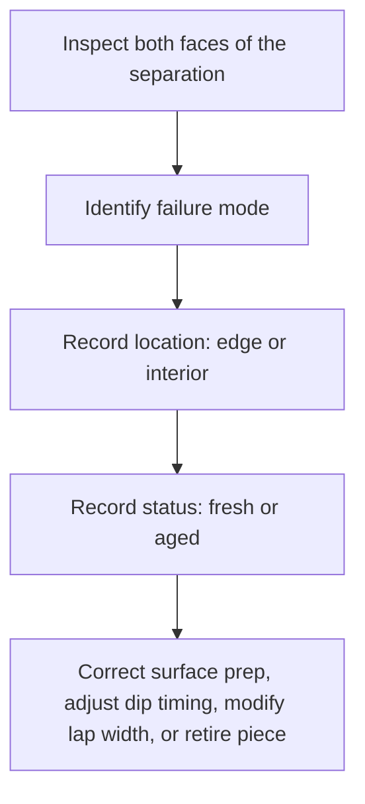
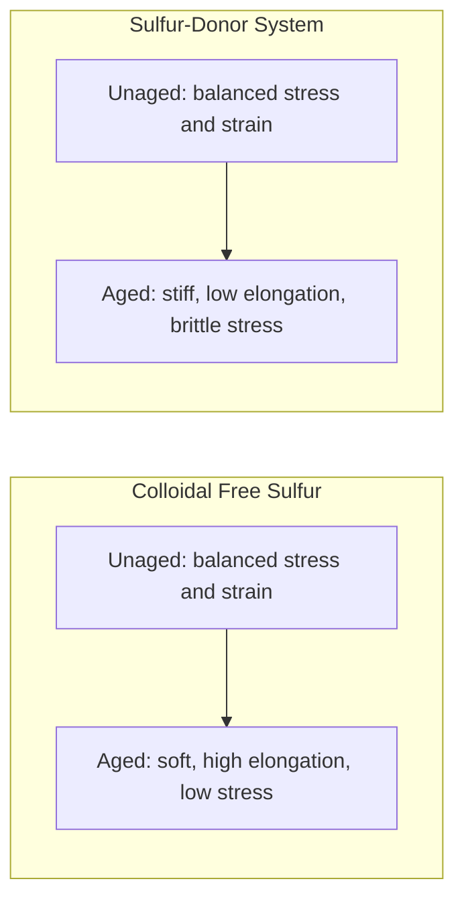
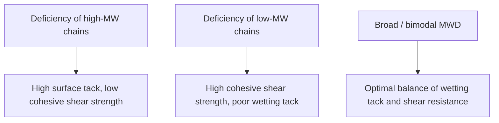

# Liquid Delamination and Seam Failure

> **Safety.** Liquid latex and water-based adhesives can give off ammonia vapor. Work in a well-ventilated space. See [Liquid ventilation and ammonia](/literature-reviews/liquid-ventilation-ammonia).

## Executive summary

Inspect the broken surfaces before applying more liquid latex or adhesive. Adhesive failure leaves the bonding material on only one surface. Cohesive failure tears through the adhesive layer itself, leaving residue on both sides. When dipped coats separate without an adhesive line, the failure is intercoat delamination. This occurs when an initial coat dries too thoroughly, undergoes leaching, or forms in low-humidity air before the next dip. 

Use these diagnostic checks when a cast or dipped article peels at a seam or between layers. For adhesive selection, see [Liquid adhesives](/literature-reviews/liquid-adhesives-and-seam-integrity). For area reinforcement, see [Liquid reinforcement](/literature-reviews/liquid-reinforcement-laminate-zones).

## Questions this article answers

- [How do I read the two faces?](#faces)
- [When did the dip layers come apart?](#ply-split)
- [What changes as the film or adhesive ages?](#aged)
- [What do I do after I classify the break?](#next)

## How do I read the two faces? {#faces}

### How

Peel open the failed joint and inspect both surfaces under good lighting. Identify where the break started, whether at an outer edge or across the interior, and record whether the article is freshly made or aged. 

| What you see | Failure mode |
| --- | --- |
| Adhesive on one face, the other face bare | Adhesive failure |
| Adhesive torn through its thickness, residue on both faces | Cohesive failure |
| Textile fibers pulled out and embedded in the adhesive | Substrate failure (textile) |
| Rubber film tore adjacent to the intact bond line | Substrate failure (film) |
| Two dipped layers separated with no distinct adhesive line | Delamination between dips |

Use the diagnostic sequence below to direct corrective action.

Test peeling speed matters when evaluating failure. In laboratory testing, pulling a joint apart slowly can cause cohesive splitting through the adhesive, while pulling the same joint rapidly can cause adhesive separation at the interface. Record the separation speed when noting a failure.

### Why

The appearance of the separated surfaces reveals whether failure occurred at the interface or within the bulk materials. 

For non-porous surfaces, interfacial bonding requires matching chemical polarity between the adhesive and the substrate. On porous surfaces, bonding depends on the liquid latex wetting and flowing into surface voids. This mechanical anchoring fails if electrostatic repulsion prevents contact. When latex particles and substrate fibers carry identical surface charges, they repel each other rather than deposit into the pores. Chemical contamination on application tools or within storage containers can also disrupt interfacial wetting.

Cohesive failure indicates that interfacial adhesion exceeded the internal tensile strength of the adhesive layer. Latex adhesives dry slowly, possess lower initial water resistance than solvent rubber cements, and suffer irreversible damage if frozen during storage. If the adhesive layer tears internally, examine whether the film dried completely or remained under-coalesced.

When textile fibers pull away, the bond was stronger than the fabric weave or fiber-to-rubber interface. When the rubber film tears outside the seam allowance, the seam geometry concentrated mechanical stress into a thinner adjacent wall.

Detail: Peel rate sensitivity in rubber adhesives

Poh and Lamaming (2013) evaluated the adhesion mechanics of an epoxidized natural rubber and standard Malaysian rubber (NBR/SMR L) pressure-sensitive adhesive system in toluene. Testing demonstrated that peel strength increased as peel rate increased. At low separation rates, failure was predominantly cohesive through the adhesive bulk. At high separation rates, the mechanism transitioned to adhesive interfacial failure. Viscoelastic polymers dissipate energy differently across deformation rates; high strain rates elevate bulk modulus, transferring stress directly to the interface.

Detail: Standard peel test method classes

Standardized laboratory methods isolate adhesive mechanics from craft handling:

- **ASTM D903**: Standard Test Method for Peel or Stripping Strength of Adhesive Bonds. Evaluates 180-degree peel on rigid-to-flexible substrates at standardized rates.
- **ASTM D1876**: Standard Test Method for Peel Resistance of Adhesives (T-Peel Test). Measures peel resistance between two flexible adherends under tension.

These standards require reporting the peak force, average steady-state force per unit width, and the visual distribution of failure modes across the coupon area.

## When did the dip layers come apart? {#ply-split}

### How

When separation occurs between dipped coats of the same article, stop production and check the drying interval of the preceding coat. 

Do not allow the first dip to dry completely before applying the second dip. A fresh, wet gel surface forms the strongest intercoat bond. Do not leach a dipped deposit in warm water if a second dipping pass must bond over it. Avoid introducing carboxylate soaps, such as potassium caprylate, into dip compounds intended for multi-layer build.

Maintain dip-room atmospheric conditions between 20°C and 26°C, and 45% to 50% relative humidity. 

- If relative humidity falls below 45%, the surface of the first dip dries prematurely, preventing the next coat from knitting into the gel.
- If relative humidity rises above 50%, moisture remains trapped inside thick deposits, reducing post-vulcanization tensile strength and elongation.

Ensure the second dip wets the previous layer immediately. High liquid viscosity can make a second coat appear continuous even when it has failed to wet the substrate. Polychloroprene dipping compounds require longer ambient drying intervals between dips than natural rubber formulations.

### Why

Multi-dip articles rely on polymer chain diffusion across the boundary layer. When an initial dipped gel dries into a consolidated film, the mobile chain ends retract into the polymer particles. The surface transitions from a hydrophilic, permeable network into a hydrophobic boundary. A subsequent latex coat cannot easily interdiffuse across that consolidated barrier.

Warm water leaching removes water-soluble serum substances and surfactants, accelerating surface skin formation and reducing subsequent coat cohesion. Carboxylate surfactants like potassium caprylate leave polar films on the surface that block polymer-to-polymer coalescence.

Controlled room humidity keeps the gel surface open long enough for the subsequent dip to penetrate. When air is too dry, rapid surface evaporation produces a dry skin over a wet interior, creating an internal plane of weakness.

Detail: Gazeley's intercoat adhesion findings

D. C. Blackley (*Polymer Latices*, Volume 3) reviewed Gazeley's investigations into the peel strength of two-layer natural rubber latex films. The findings establish quantitative boundaries for intercoat consolidation:

1. **Drying time:** Peel strength per unit width falls rapidly as the drying time of the first deposit increases prior to the second dip. Even modest drying reduces boundary cohesion.
2. **Leaching:** Leaching the first gel deposit in water causes a severe reduction in intercoat bond strength. The loss is attributed to the collapse of the hydrophilic pore structure required for interparticle diffusion.
3. **Surfactant contamination:** Adding potassium caprylate to the first deposit causes a sharp drop in intercoat peel force.
4. **Vulcanization state:** Unvulcanized, post-vulcanizable latex deposits yield the highest lamination strength. Sulfur-prevulcanized latex compounds form weaker intercoat bonds. In prevulcanized latices, intercoat strength correlates inversely with the state of cure: as liquid-state crosslink density increases, interparticle boundary diffusion in the solid state drops.

## What changes as the film or adhesive ages? {#aged}

### How

For failures on newly constructed items, review application viscosity, drying time, leaching exposure, surfactant contamination, and dip-room humidity.

For failures on older or worn articles, identify the vulcanization system used in the compound:

- **Colloidal free sulfur systems:** As these films age under thermal and oxidative stress, crosslinks break down. The rubber exhibits higher elongation, lower tensile stress at specified strain, and softening.
- **Sulfur-donor cure systems (such as tetramethylthiuram monosulfide or SULFADS):** As these films age, secondary crosslinking increases modulus. The rubber stiffens, stretches less, and breaks at lower elongation under high stress.

For water-based pressure-sensitive adhesives, sulfur-donor systems provide superior aging resistance compared to elemental sulfur. Because vulcanization reduces surface tack, compounding recipes for aged stability require higher tackifying resin ratios. Store finished goods away from elevated temperatures and overhead storage areas.

### Why

Latex films degrade primarily through thermal oxidation. Elevated temperatures accelerate oxidative chain scission and crosslink rearrangement. The oxidation rate of natural rubber latex film doubles with approximately every 8.3°C increase in exposure temperature. Storing vulcanized inventory near high ceilings, where warm air accumulates, accelerates thermal aging compared to floor-level storage.

Natural rubber latex adhesives preserve high-molecular-weight polymer chains that are destroyed when dry rubber is masticated in solvent cement manufacturing. In pressure-sensitive adhesive formulations, this high-molecular-weight fraction yields superior shear resistance under sustained dead loads, even when peel adhesion and surface tack match solvent-milled equivalents. When aged adhesive joints slip under static tension, the failure stems from oxidative scission reducing that high-molecular-weight structural backbone.

Detail: Molecular weight distribution and shear resistance

*The Vanderbilt Latex Handbook* details how molecular weight distribution (MWD) controls adhesive performance in polymer films:

In comparative evaluations between natural rubber latex adhesives and solvent-milled rubber solutions of identical elastomer content, 178° shear performance under load was higher in the latex adhesive. The high-shear mechanical milling used to dissolve dry rubber into petroleum solvents cleaves the longest polyisoprene chains. In contrast, aqueous latex compounding preserves the native high-molecular-weight network, retaining cohesive holding power during extended service.

## What do I do after I classify the break? {#next}

### How

Match the observed failure classification to its specific corrective process:

| Observed classification | Corrective action |
| --- | --- |
| Adhesive failure | Verify that the chemical polarity of the adhesive matches the substrate. Check for surface oils, dust, or migration of mold release agents. Replace contaminated adhesive stock. |
| Cohesive failure | Ensure full drying and coalescence of the adhesive layer before putting the joint into service. If the cured adhesive layer is too thin, adjust applicator gauge. |
| Substrate failure (textile) | Reinforce the textile interface or improve rubber impregnation into the weave. See [Liquid latex–textile bonding](/literature-reviews/liquid-latex-textile-bonding). |
| Substrate failure (film) | Increase wall gauge or redesign seam allowances to distribute bending moments away from the joint margin. |
| Delamination between dips | Shorten dry times between dips. Eliminate intermediate water leaching. Maintain ambient dipping conditions at 20–26°C and 45–50% RH. For rim builds, see [Liquid edge finishing](/literature-reviews/liquid-edge-finishing-materials). |
| Aged embrittlement or softening | Evaluate the sulfur cure ratio versus sulfur-donor packages. Lower storage temperatures and isolate parts from atmospheric oxidants. |

For primary adhesive selection and open-time rules, see [Liquid adhesives](/literature-reviews/liquid-adhesives-and-seam-integrity).

### Why

Applying fresh liquid latex or contact adhesive over an unanalyzed joint failure hides the root mechanism without restoring strength. Adhesive failure requires altering interfacial surface energy, surface cleanliness, or polarity matching. Cohesive failure requires addressing adhesive cure density, coalescence, or layer thickness. Intercoat dip peeling requires managing gel hydration and room humidity. 

Correct diagnosis isolates the physical root cause before materials and labor are spent on repairs.

## Sources

- ASTM International. *ASTM D903: Standard Test Method for Peel or Stripping Strength of Adhesive Bonds*. West Conshohocken, PA: ASTM International, 2017.
- ASTM International. *ASTM D1876: Standard Test Method for Peel Resistance of Adhesives (T-Peel Test)*. West Conshohocken, PA: ASTM International, 2015.
- Blackley, D. C. *Polymer Latices: Science and Technology — Volume 3: Applications of Latices*. 2nd ed. London: Chapman & Hall, 1997. https://books.google.com/books?id=Y2VPGj7YbykC
- Mausser, Robert Francis, ed. *The Vanderbilt Latex Handbook*. 3rd ed. Norwalk, CT: R.T. Vanderbilt Company, 1987. https://lccn.loc.gov/92117844
- Poh, B. T., and J. Lamaming. "Effect of Testing Rate on Adhesion Properties of Acrylonitrile-Butadiene Rubber/Standard Malaysian Rubber Blend-Based Pressure-Sensitive Adhesive." *Journal of Coatings* 2013 (2013): 1–7. https://doi.org/10.1155/2013/519416