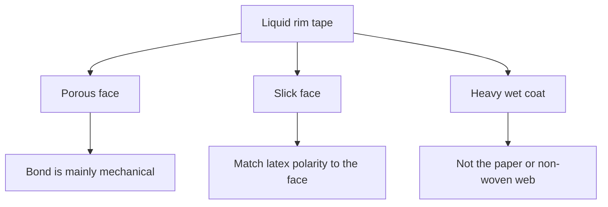

# Liquid Edge Finishing Materials

> **Safety.** Aqueous latex adhesive can shrink cloth. Check the product safety data sheet (SDS) for ammonia and other hazards. See [Liquid adhesives](/literature-reviews/liquid-adhesives-and-seam-integrity) and [Liquid ventilation](/literature-reviews/liquid-ventilation-ammonia).

## Executive summary

Finishing an edge on liquid latex work often involves reinforcing the rim with textile tape and an aqueous latex adhesive. You can also join two fabric layers into a combine using that same adhesive family. Water in the adhesive can shrink bare cloth. Smooth or non-porous tape requires a polarity match with the rubber polymer. Applying a heavy wet coat and drying it too quickly causes particles to migrate and weakens the bond. Use this guide when choosing tape and adhesive for liquid latex edges.

## Questions this article answers

- [Which tape for a liquid rim?](#rim-material)
- [Porous cloth or a slick face?](#face)
- [What if a heavy wet coat dries fast?](#drying)

## Which tape for a liquid rim? {#rim-material}

### How

Identify the surface texture of the tape before you pick an adhesive. Treat porous fabric and smooth surfaces as two distinct bonding tasks. 

When you use an aqueous latex adhesive, plan for potential textile shrinkage. If the tape was already rubberised in an industrial plant, it requires a different preparation method; review [Liquid latex–textile bonding](/literature-reviews/liquid-latex-textile-bonding) before treating it as bare cloth. Ensure rim overlaps maintain full seam allowance width.

### Why

Aqueous latex adhesives introduce water directly into textile yarns. *The Vanderbilt Latex Handbook* identifies fabric shrinkage as an inherent disadvantage of latex adhesives, along with freezing sensitivity, slower drying, and lower water resistance compared to solvent cements. *Practical Guide to Latex Technology* notes that water-based latices shrink textiles and wrinkle paper webs. 

Bond mechanisms depend on the substrate surface. On a porous weave, the bond is primarily mechanical interlocking. On a smooth, non-porous face, the adhesive polymer must match the polarity of the substrate. Industrial combine methods bring fabric layers together either by applying latex adhesive to a single face or by coating both faces before consolidation.

Detail: Plant combining layouts

*Polymer Latices* (1997) describes several industrial machinery layouts for combining fabrics:

- **Knife-over-roll:** Applies an adhesive layer to one fabric substrate. Marriage rollers then press a second fabric layer onto the wet adhesive, and a heated drum dries the joined pair.
- **Calender nip spray:** Spray heads wet both fabric faces immediately before they pass through a calender nip.
- **Heat-sensitive fabrics:** When direct drum heat would degrade one textile layer, adhesive is applied and dried on the heat-tolerant fabric first. The sensitive fabric is then consolidated against the dry film.
- **Dry combine (doubling):** Joins fabric webs that have already been coated and dried to tack. 

The deposited rubber layer may be non-vulcanizable, vulcanizable, or cast from a prevulcanized latex.

## Porous cloth or a slick face? {#face}

### How

Inspect your tape to determine if it is porous or non-porous:

1. **For porous tape:** Select an adhesive that wets and flows freely into the yarn pores. Avoid heavily filled adhesives, which thicken the liquid and block pore penetration.
2. **For slick, non-porous tape:** Match the chemical polarity of the adhesive polymer to the tape surface. Natural rubber latex has low polarity and should be paired with low-polarity substrates.

### Why

*Practical Guide to Latex Technology* states that bonding to a porous substrate is primarily mechanical, meaning the base polymer type has less impact on adhesion. On a non-porous substrate, mechanical keys do not exist, so the polymer must match the substrate polarity. 

*The Vanderbilt Latex Handbook* notes that for porous materials, the latex must flow directly into the void spaces. The electrical charge of the latex particles must oppose the surface charge of the substrate. If the charges match, the substrate repels the latex particles and prevents wetting. Adding mineral fillers raises compound viscosity, which impedes capillary flow into cloth pores.

Detail: Polarity groups and filler

*The Vanderbilt Latex Handbook* classifies latex polymers across three polarity tiers:

| Polarity | Latices |
| --- | --- |
| High | NBR, XNBR, XSBR, PSBR |
| Medium | CR, PVC |
| Low | NR, SBR, BR, IIR |

Polyvinyl chloride (PVC) latex is grouped in the medium-polarity bracket alongside polychloroprene (CR). Natural rubber (NR) and styrene-butadiene rubber (SBR) sit in the low-polarity tier.

Higher filler levels increase compound viscosity rapidly. As viscosity climbs, the liquid cannot enter small textile capillaries before drying begins, reducing mechanical peel resistance.

## What if a heavy wet coat dries fast? {#drying}

### How

Do not apply a thick coat of aqueous latex adhesive and force it to dry rapidly under high heat. 

If your application requires a heavy deposit, use a compound with higher total solids to reduce excess water. Alternatively, dry the work slowly at moderate temperatures to allow water to leave the layer evenly.

### Why

Rapid surface drying creates an uneven moisture gradient through the thickness of the adhesive. Industrial studies on paper webs and latex-bonded non-woven fabrics in *Polymer Latices* demonstrate this failure mode. 

When external heat evaporates water too quickly from the outer surface, moisture from the wet core creeps along fibers toward the dry exterior. This capillary flow carries suspended latex particles toward the outer surface. The interior region runs out of binder, leaving a weak core that splits and causes the rim to delaminate under stress.

Detail: Heat-sensitize, solids, and slow heat

In non-woven textile processing, heat-sensitizing agents cause the latex binder to gel throughout the web before particle migration starts. Gelation fails to prevent migration if substantial water evaporates before the gel point is reached.

When heat-sensitizing is impractical, *Polymer Latices* specifies two corrective controls:

1. Raise the total solids content of the latex bath, reducing the volume of carrier water available to migrate.
2. Raise the substrate temperature slowly, minimizing the moisture gradient between the surface and the core.

*The Vanderbilt Latex Handbook* outlines an identical mechanism for paper impregnation. Adding heat-sensitizing chemicals induces gelling or coagulation early in the heating cycle, locking the rubber particles in place across the cross-section.

## Sources

- *The Vanderbilt Latex Handbook*. 3rd ed. Edited by Robert Francis Mausser. Norwalk, CT: R.T. Vanderbilt Company, 1987. https://lccn.loc.gov/92117844
- *Practical Guide to Latex Technology*. Rani Joseph. Shawbury: Smithers Rapra Technology, 2013. https://books.google.com/books/about/Practical_Guide_to_Latex_Technology.html?id=NB5AMwEACAAJ
- *Polymer Latices: Science and Technology — Volume 3: Applications of Latices*. 2nd ed. D. C. Blackley. London: Chapman & Hall, 1997. https://books.google.com/books?id=Y2VPGj7YbykC