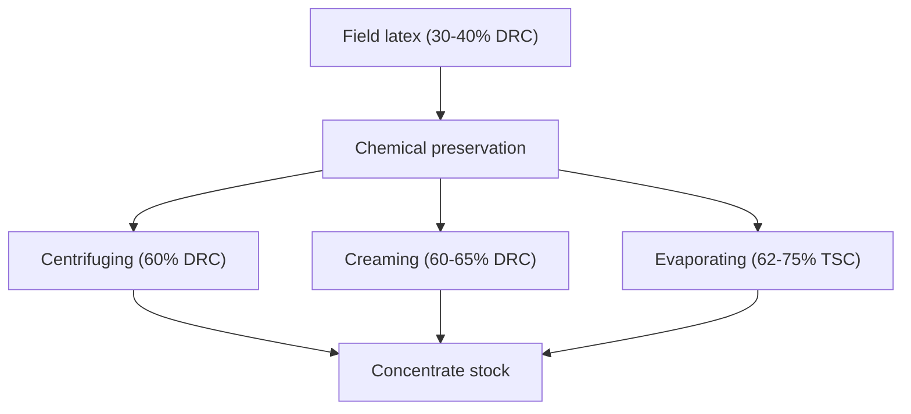

# Field Latex to Marketable Concentrate

> **Safety.** Ammonia fumes from natural-rubber latex can injure your lungs if you breathe them over extended periods. The Vanderbilt Latex Handbook advises switching to a low-ammonia natural latex and ventilating your workspace. See [Liquid Latex Ventilation and Ammonia](/literature-reviews/liquid-ventilation-ammonia) for airflow guidelines, and [Allergy and Skin Contact](/literature-reviews/allergy-and-skin-contact) for skin reactions.

## Executive summary

Field latex is the raw fluid gathered directly from the tree. Preserving field latex prevents natural bacterial clotting and decay. Concentrating raises the percentage of dry rubber so you are not shipping mostly water. Industrial processors achieve this through centrifuging, creaming, or evaporation. 

Compounding happens later. It adds curative dispersions, pigments, and stabilizers to convert concentrate into dipping or casting compounds for liquid latex garments.

Read this guide to learn how raw harvest becomes commercial feedstock. Tree biology, plantation tapping, sealed storage containers, and bottle label terms appear in companion articles.

## Questions this article answers

- [Why is field latex a different form from concentrate?](#forms)
- [Where does preserve hand off?](#preserve)
- [What do centrifuging, creaming, and evaporation do?](#routes)
- [What does a buyer of concentrate receive?](#buyer)

## Why is field latex a different form from concentrate? {#forms}

### How

Distinguish field latex from commercial concentrate by its solid content and stability. 

Raw field latex contains too much water and too many non-rubber solids to use for direct dipping or long-distance transport. If a process sheet or bottle lists dry rubber content around 60 percent, you are handling a concentrate, not field latex. 

Treat raw concentrate as an intermediate stock. Do not attempt to form functional dipped or cast films straight out of a concentrate drum without compounding ingredients.

### Why

Field latex contains roughly one-third rubber and two-thirds water and plant serum. According to *High Polymer Latices* (1966), freshly tapped field latex runs between 30 and 40 percent dry rubber content, averaging about 33 percent. Shipping that liquid across oceans means paying freight on unusable water.

Concentration boosts the dry rubber content up to roughly 60 percent. Concentrates are also far more uniform than field latex because the mechanical separation steps strip away a large fraction of the variable non-rubber serum solids.

Concentrate is still not finished film stock. *The Vanderbilt Latex Handbook* (1987) notes that a film made from raw latex is not a saleable article. Compounding must take place first, dispersing sulfur, accelerators, and antioxidants into the fluid so the resulting dried rubber can vulcanize.

<details>
<summary>Detail: Dry rubber content vs total solids</summary>

Technical data sheets split latex concentration into dry rubber content (DRC) and total solids content (TSC). 

TSC accounts for every non-volatile substance in the liquid, including rubber hydrocarbons, proteins, lipids, carbohydrates, and mineral salts. DRC measures the coagulable hydrocarbon mass alone. 

*The Vanderbilt Latex Handbook* (1987) demonstrates this math on a standard 62 percent centrifuged latex:
- Total solids content: 62 percent of wet weight
- Dry rubber content: 60 percent of wet weight
- Non-rubber solids: 2 percent of wet weight (the difference between TSC and DRC)
- Water: 38 percent of wet weight

Compounding calculations express formula additions in parts per hundred rubber (phr). To obtain 100 parts by weight of dry rubber from this latex, a compounder requires:

$$\text{Wet weight} = \frac{100}{\text{DRC}} \times 100 = \frac{100}{60} \times 100 = 166.7 \text{ parts wet latex}$$

</details>

<details>
<summary>Detail: Historical distribution of concentration methods</summary>

*High Polymer Latices* (1966) surveys four industrial concentration routes: evaporation, creaming, centrifuging, and electrodecantation. 

Evaporation pulls off water vapor exclusively. The starting ratio of non-rubber solids to rubber hydrocarbon remains fixed, and the original distribution of particle sizes does not change. Creaming, centrifuging, and electrodecantation remove non-rubber serum along with the dilute fraction, discarding a large portion of the smallest rubber particles in the process.

For the 1966 Malayan plantation sector, Blackley records an estimated production split:
- Centrifuging: approximately 88 percent
- Creaming: approximately 6 percent
- Evaporation: approximately 6 percent
- Electrodecantation: negligible commercial volume

Later editions, including *Polymer Latices* (1997) and *The Vanderbilt Latex Handbook* (1987), omit specific market-share percentages, leaving the 88/6/6 ratio as a baseline historical estimate of industrial adoption.

</details>

## Where does preserve hand off? {#preserve}

### How

Check preservation levels before running latex through mechanical concentration. 

Field latex must receive a chemical preservative right after collection, long before it enters a processing centrifuge or creaming tank. Once concentrated and packaged, the fluid requires an airtight seal to maintain its ammonia content until you open it in the shop.

### Why

Fresh natural rubber latex begins to clot within hours after tapping. Bacteria feed on the sugary plant serum, producing organic acids that lower the fluid's pH. When acidity drops toward the isoelectric point of the protective protein shell on the rubber particles, the negative surface charge neutralizes and the latex coagulates into lumpy curds.

Preservation prevents both microbial growth and mechanical coagulation. Handbooks divide this preservation into two tiers:
1. Short-term anticoagulants: low chemical dosages added at the collection cup to keep latex liquid for hours or days during transport to the plantation bulking station.
2. Long-term preservatives: higher chemical dosages added to protect the latex through industrial concentration, oceanic shipment, and years of warehouse storage.

Ammonia remains the universal preservative base. It acts as an alkaline buffer that raises pH, stabilizes particle charges, and kills bacteria. *High Polymer Latices* (1966) states that 0.2 percent ammonia by weight on whole latex suffices for short-term field transport, while roughly 0.7 percent is necessary for permanent preservation. Ammonia acts as a potent bactericide once its concentration exceeds 0.35 percent by weight, provided it is dosed before bacterial colonies multiply.

<details>
<summary>Detail: High-ammonia versus low-ammonia preservative systems</summary>

Standard commercial concentrates fall into two chemical categories:

**High-Ammonia (HA) Latex:** Relies entirely on ammonia gas dissolved in the aqueous serum at roughly 0.7 percent by weight on the total latex (around 1.6 percent on the aqueous phase). It gives excellent bacterial control and high mechanical stability, but releases sharp fumes during open compounding and dipping.

**Low-Ammonia (LA) Latex:** Lowers the dissolved ammonia content to around 0.2 percent by weight, controlling bacterial decay by pairing it with a secondary bactericide. 

Historical and modern secondary systems cited across the literature include:
- Sodium pentachlorophenate (SPP): Cited in *High Polymer Latices* (1966) as 0.2 percent ammonia combined with 0.2 percent SPP on whole latex. Now discontinued in modern processing due to organochlorine environmental and dermal toxicity.
- Tetramethylthiuram disulfide (TMTD) and zinc oxide: Cited in *Polymer Latices* Volume 3 (1997) as the standard replacement system, pairing roughly 0.2 percent ammonia with 0.013 to 0.025 percent TMTD and a small amount of zinc oxide (often designated LA-TZ).
- Sodium dimethyldithiocarbamate (SDBC): Alternative water-soluble carbamate used alongside zinc oxide in low-ammonia formulations.

Before centrifuging, plantation stations adjust ammonia depending on the holding time since tapping. Creaming tanks require an initial dosing up to 1.0 percent ammonia by weight to sustain stability over days of settling, followed by adjustment to 0.8 percent in the recovered cream layer.

</details>

## What do centrifuging, creaming, and evaporation do? {#routes}

### How

Identify which concentration route generated your raw concentrate to anticipate its dipping characteristics:



- Centrifuged concentrate: The dominant commercial supply for liquid latex dipping. Features high mechanical stability, lower protein content, and minimal residual additives.
- Creamed concentrate: High solids content with good film-forming traits, but may contain hydrocolloid residues that continue to separate slowly during quiet shelf storage.
- Evaporated concentrate: High solids content with intact serum proteins and added soap stabilizers. Yields thicker, stiffer films that wet out substrates easily.

### Why

The three routes exploit distinct physical mechanisms to alter the water-to-rubber ratio:

**Centrifuging** speeds up natural phase separation with centrifugal force. Natural rubber hydrocarbon has a specific gravity of roughly 0.91, making it lighter than water (1.00) and serum. In a spinning bowl, rubber particles migrate inward toward the axis, while the heavier water and non-rubber serum force outward. Centrifuging strips out the serum, along with very fine rubber particles that lack the mass to migrate inward against liquid shear.

**Creaming** accelerates buoyancy separation under normal gravity using chemical creaming agents. The processor dissolves a water-soluble hydrocolloid, such as ammonium alginate, into ammoniated field latex. The alginate molecules do not chemically react with rubber; instead, they alter the colloidal dynamics, causing individual rubber globules to gather into loose clusters. Because these clusters are larger than individual particles, they rise rapidly to the top according to Stokes' law. The bottom serum is drained off, leaving a concentrated rubber cream.

**Evaporation** drives off water using heat and reduced pressure. Because no liquid serum leaves the vessel, all natural proteins, salts, and non-rubber elements stay in the concentrate. As solids increase, the latex thickens; processors must add potassium soaps or alkali hydroxides to prevent the mixture from turning into an unworkable paste.

<details>
<summary>Detail: Centrifuge mechanics and disc bowl efficiency</summary>

Industrial concentration relies on continuous disc-bowl centrifuges, traditionally built around the de Laval configuration. 

Latex enters through a central feed pipe and flows outward into a stack of conical stainless steel discs spaced less than a millimetre apart. The disc stack splits the latex into thin fluid sheets, minimizing the distance an individual rubber particle must travel before contacting a surface:

```
           [ Central Feed Pipe ]
                     |
                     v
             [ Disc Stack ]
            /              \
           /                \
   Inward Migration     Outward Migration
 (Light Rubber Phase)  (Heavy Serum Phase)
          |                     |
          v                     v
   [ Upper Gully ]       [ Lower Gully ]
   60% DRC Concentrate    Skim (2.5-10% DRC)
```

At operational bowl speeds near 6,000 rpm, radial acceleration at a radius of 150 mm reaches approximately 6,160 times standard gravity ($6,160 \times g$).

*High Polymer Latices* (1966) defines separation efficiency ($E$) as the proportion of dry rubber present in the incoming feed that is recovered in the concentrate:

$$E = \frac{C (F - S)}{F (C - S)}$$

Where:
- $F$ = dry rubber content of the incoming field latex
- $C$ = dry rubber content of the recovered concentrate
- $S$ = dry rubber content of the dilute skim fraction

In Blackley's clean model ($F = 30\%$, $C = 60\%$, $S = 5\%$):

$$E = \frac{60(30 - 5)}{30(60 - 5)} = \frac{1500}{1650} \approx 0.909 \text{ (91\% recovery)}$$

In plant practice, Blackley notes overall industrial recovery runs closer to 85 percent ($E \approx 0.85$). The byproduct dilute skim contains between 2.5 and 10 percent dry rubber, dominated by tiny rubber particles and high protein loads. Bowl feed rate, rotation speed, and the position of the upper discharge regulating screw determine the final DRC of the concentrate.


As shown in Blackley's particle-size distribution curves, particles above a critical hydrodynamic diameter separate cleanly into the concentrate, while sub-micron particles remain split between the concentrate and the skim phase.

</details>

<details>
<summary>Detail: Creaming kinetics and industrial evaporation brands</summary>

Creaming relies on Stokes' law for terminal flotation velocity ($v$) of spherical globules:

$$v = \frac{2 r^2 (\rho_w - \rho_r) g}{9 \eta}$$

Where:
- $r$ = particle radius
- $\rho_w$ = aqueous serum density (~1.02 g/cm³)
- $\rho_r$ = rubber particle density (~0.91 g/cm³)
- $g$ = gravitational acceleration
- $\eta$ = dynamic viscosity of the serum phase

Because natural rubber particles average under 1 micron in diameter, natural gravity creaming takes months to produce a clean split. Adding 0.1 percent ammonium alginate causes reversible, weak clustering that multiplies effective particle radius ($r$), increasing flotation velocity by orders of magnitude without permanent coagulation. A creaming run takes roughly 40 hours in settling tanks.

Evaporated concentrates cited in the historical literature include:
- Standard Revertex: Evaporated under vacuum at low temperature to 72–75 percent total solids. Preserved non-ammoniacally with potassium hydroxide and potassium soaps.
- T-Revertex: Vacuum-evaporated concentrate reaching roughly 62 percent total solids, preserved with ammonia.
- High-stability evaporated latices cited in *Polymer Latices* Volume 3 (1997): Commercial types reaching 66 percent total solids by mass, used where exceptional mechanical shear stability is required in cement pastes.

</details>

## What does a buyer of concentrate receive? {#buyer}

### How

When buying raw natural rubber concentrate for garment work:

1. Confirm the ammonia grade. High-ammonia (HA, ~0.7% ammonia) requires strong room ventilation and periodic deammoniation before certain cure packages will take. Low-ammonia (LA, ~0.2% ammonia) is ready for direct compounding without blowing off excess gas.
2. Verify that the material is uncompounded concentrate. The liquid needs added sulfur dispersions, zinc oxide, accelerators, and antioxidants before it can yield a vulcanized, snap-elastic garment film.
3. Check the shelf stability. Centrifuged concentrate can sit quietly without separating rapidly, but any container left undisturbed for months will develop a faint rubber cream layer near the surface. Stir gently without whipping air bubbles into the liquid.

### Why

The default raw material across the dipping and latex apparel industry is 60 percent dry rubber content centrifuged natural latex. *Polymer Latices* Volume 3 (1997) identifies high-ammonia and low-ammonia 60 percent centrifugates as the baseline standards for both industrial dipped goods and Dunlop foam manufacture.

The trade-off between HA and LA grades lies in handling versus chemistry:
- High-ammonia latex can be compounded directly if your formula tolerates high pH, or it can be deammoniated by blowing clean compressed air across the liquid surface.
- Low-ammonia latex avoids intense room fumes and skips the deammoniation step, but it contains secondary preservatives (such as dithiocarbamates or thiurams) that remain in the dry film.

<details>
<summary>Detail: Colloid stability and deammoniation requirements</summary>

Colloid stability describes how well rubber particles resist coagulation under mechanical shear, chemical addition, or heat. 

*Polymer Latices* Volume 3 (1997) notes that centrifuged concentrate has lower intrinsic colloid stability than evaporated concentrate because centrifuging strips out water-soluble non-rubber proteins and soaps. When compounding centrifuged latex for heavy mechanical agitation, formulators must add secondary stabilizers, such as potassium oleate or non-ionic surfactants.

Deammoniation becomes necessary when compounding recipes require an exact, reduced pH to activate gelling agents. In Dunlop foam production, natural HA latex must be aerated until ammonia drops from 0.7 percent down to roughly 0.15 percent by weight before silicofluoride gelling agents can trigger properly. 

Industrial historical shipping milestones recorded by Blackley credit the first bulk transatlantic shipment of centrifuged liquid latex to the United Kingdom in 1931, replacing traditional dry smoked sheet imports for dipped rubber manufacture.

</details>

## Sources

- *High Polymer Latices: Their Science and Technology*. 2 vols. D. C. Blackley. London: Maclaren; New York: Palmerton, 1966. <https://lccn.loc.gov/66077950>
- *The Vanderbilt Latex Handbook*. 3rd ed. Edited by Robert Francis Mausser. Norwalk, CT: R.T. Vanderbilt Company, 1987. <https://lccn.loc.gov/92117844>
- *Polymer Latices: Science and Technology — Volume 3: Applications of Latices*. 2nd ed. D. C. Blackley. Chapman & Hall / Springer, 1997. <https://books.google.com/books?id=Y2VPGj7YbykC>