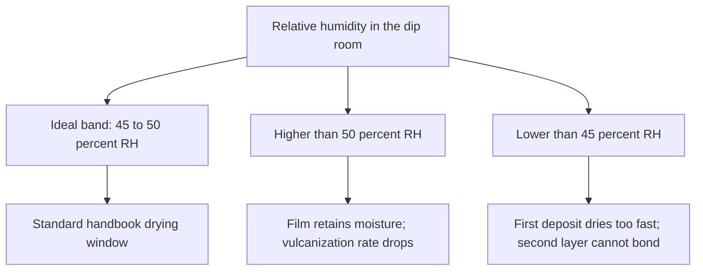
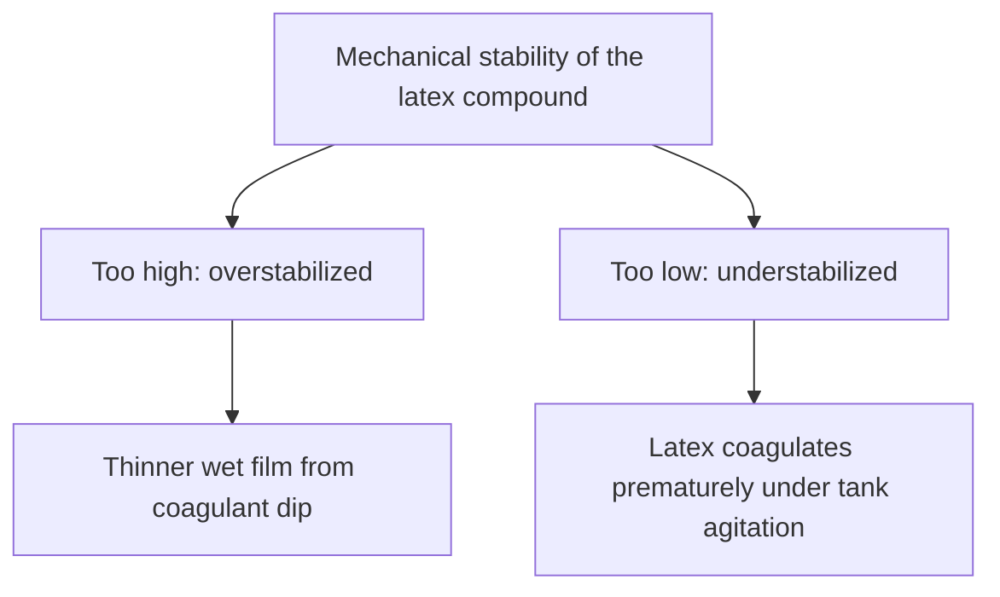

# Liquid Film Defects

> **Safety note:** The chloroform rating mentioned under weak gel is a factory test that uses chloroform, a toxic solvent. Read it so published numbers make sense. Do not run this test on a home bench.

## Executive summary

This guide covers film failures when you dip or cast liquid latex. It matches common defects, such as pinprick leaks, collapsing wet gels, webbing across gaps, and storage discoloration, to their industrial names and standard process checks. Use this reference when a dipped or cast piece fails during drying, vulcanization, or storage.

Use it with [Coagulant dipping](/literature-reviews/liquid-coagulant-dipping-wearable-thickness) and [Former dip, mould cast, and flat spread](/literature-reviews/liquid-former-dip-vs-mould-cast-vs-flat-spread).

## Questions this article answers

- [How do I match a symptom to a name?](#symptom-names)
- [What should I do about pinholes?](#pinholes)
- [What should I do about a weak, blown gel?](#blown-gel)
- [How does room humidity change the film?](#humidity)
- [What should I do about webbing?](#webbing)
- [Why does the film discolor after storage?](#discoloration)
- [What does tank stability do to the deposit?](#tank-stability)

## How do I match a symptom to a name? {#symptom-names}

### How

Match what you see on the film to the industrial name, then run the first process check. These defect classes come from dipped-goods manufacturing. If you are casting a wearable panel instead of dipping, use the same first check.

| What you see | Industrial name | First check |
| --- | --- | --- |
| Pinprick leaks | Pinholes from air | Check air in compound; review tank-filling method |
| Soft gel that collapses as it leaves the tank | Blown gel / weak wet gel | Chloroform rating below 2 |
| Sticky threads bridging a narrow gap | Webbing | Apply dewebbing mist; add octyl alcohol to compound |
| Second coat will not bond | Surface dried too fast | Check room humidity; chloroprene needs longer air dry |
| Weak, chalky film after vulcanizing | Vulcanization slowed by leftover moisture | Dipping room humidity too high |
| Yellow or brown discoloration after storage | Residual leach salts and aging | Complete warm-water leach; remove light from storage |
| Compound breaks in the tank, or thin deposit | Mechanical stability too high or low | Test mechanical stability of the compound |

### Why

Industrial plants categorize film defects to pinpoint whether the fault sits in compounding, tank stability, drying humidity, or washing. Glove manufacturing lines tie common defects, such as pinholes, weak spots, tears, bead flaws, and dimensional errors, directly to coagulant concentration, drying intervals, tank solids, and vulcanization ovens. The same physical mechanisms apply whether latex is dipped on a glove former or cast onto a flat bench mould.

Detail: Glove-line defect list and cause links

The *Practical Guide to Latex Technology* groups glove-line defects into pinholes, weak spots, tears, bead faults, low tensile strength, dimensional errors, and high residual protein from incomplete leaching. Its troubleshooting tables link these faults directly to insufficient coagulant drying, incomplete vulcanization, oven temperature drift, coagulant bath strength, and total solids variation.

## What should I do about pinholes? {#pinholes}

### How

Remove entrapped air from the liquid compound before dipping or casting. Hold the liquid under a mild vacuum in its storage vessel, and fill the dipping tank slowly along the wall to prevent churning air into the liquid.

### Why

Air bubbles suspended in the liquid latex cannot escape once coagulant sets the deposit. Each microscopic bubble forms a pinhole in the finished film. High-viscosity compounds trap air more readily, so thicker formulations require gentler handling and longer degassing times before use.

## What should I do about a weak, blown gel? {#blown-gel}

### How

Ensure the compound has prevulcanized enough before dipping. In commercial dipping, a compound with a chloroform test rating below 2 forms a wet gel that is too weak to hold its shape when lifted out of the tank.

### Why

The chloroform rating measures how far the latex particles have crosslinked while still dispersed in liquid. A rating of 1 indicates unvulcanized rubber. If latex has not reached adequate prevulcanization, the coagulated wet gel lacks cohesive strength. Gravity pulls the wet rubber down the former, tearing or distorting the deposit before it reaches the drying oven.

Detail: Chloroform coagulation rating

*The Vanderbilt Latex Handbook* details the chloroform coagulation test for natural-rubber dipping compounds. Mix equal volumes of compounded latex and chloroform (10 cm³ each) and stir until coagulation finishes. After 2 to 3 minutes, grade the coagulum on a four-point scale:

| Rating | Physical state of coagulum | Handbook judgment |
| --- | --- | --- |
| 1 | Tacky lump, breaks in strings | Uncured |
| 2 | Tender lump, breaks short | Intermediate |
| 3 | Nontacky agglomerates | Well prevulcanized |
| 4 | Small dry crumbs | Precured to an advanced stage |

The handbook notes that this visual evaluation is subjective and cannot resolve fine gradations. Solvent-swell testing provides precise quantitative crosslink density, but plants use the rapid chloroform test for routine tank checks. Compounds scoring under 2 risk wet-gel collapse on dipped formers.

## How does room humidity change the film? {#humidity}

### How

Keep your dipping area between 45% and 50% relative humidity, and between 20°C and 26°C. If your space is more humid, extend the drying time before vulcanizing. If your space is drier, protect the wet deposit from skinning over if you plan to dip a second layer.

### Why

Excess moisture in ambient air slows water evaporation from the gelled deposit. Residual water inside the rubber hinders subsequent vulcanization, reducing the tensile strength and modulus of the vulcanized film. Conversely, dry air evaporates water from the surface faster than it can diffuse from the core. This surface skinning prevents subsequent coats from fusing, leading to delamination between layers. Polychloroprene latex requires longer air-drying intervals than natural rubber latex to prevent trapped moisture.

## What should I do about webbing? {#webbing}

### How

Prevent liquid bridging between closely spaced edges by applying a fine dewebbing spray as the former clears the tank, or by adding a small amount of octyl alcohol directly to the compound.

### Why

Webbing occurs when surface tension and viscous drag hold a liquid membrane across narrow openings, such as the gap between fingers on a glove former. As the former leaves the liquid, this bridge fails to rupture. Dewebbing agents lower the local surface tension, breaking the liquid film before it coagulates. Because dewebbing sprays can create unstable emulsions that leave visible oil spots, adding octyl alcohol directly to the compound suppresses these blemishes.

Detail: Octyl alcohol amount and wait

*The Vanderbilt Latex Handbook* specifies 0.125 to 0.25 phr of octyl alcohol (2-ethylhexanol) added to the compound to prevent oil spotting from external dewebbing emulsions. Once added, allow the compounded latex to stand for roughly 4 hours before dipping.

## Why does the film discolor after storage? {#discoloration}

### How

Leach the gelled film thoroughly in fresh, circulating warm water before final drying and vulcanization. Store finished rubber flat or loosely rolled in dark containers away from heat and ultraviolet light. Do not fold the rubber into sharp creases.

### Why

Warm water leaching extracts water-soluble materials, primarily residual coagulant salts and natural serum proteins. When coagulant salts remain trapped in the polymer matrix, they accelerate oxidative degradation. Light, atmospheric nitrogen oxides, and elevated heat react with these residual salts, turning the rubber yellow or brown. Clean leaching stabilizes aging performance. In storage, sharp folds concentrate mechanical stress, and porous cardboard boxes admit ambient ozone, accelerating localized degradation along folded edges.

Detail: Which salt, and what the package does

*The Vanderbilt Latex Handbook* identifies calcium nitrate as the primary coagulant salt responsible for accelerated discoloration under heat, gas fumes, and ultraviolet radiation. Increasing leach bath temperature and water turnover significantly speeds salt extraction.

The handbook's degradation chapter also states that the thermal oxidation rate of vulcanized natural rubber latex film approximately doubles for every 8.3°C increase in ambient temperature. Goods stored in upper warehouse racks during summer conditions (35°C to 60°C) degrade substantially faster than goods held at floor level. To eliminate crease stress cracking, industrial producers of dipped foundation garments rolled items into capped cardboard cylinders rather than folding them into flat cartons.

## What does tank stability do to the deposit? {#tank-stability}

### How

Maintain the mechanical stability of your compounded liquid latex within the recommended working range. Monitor both mechanical agitation in the tank and compound viscosity to keep film pickup consistent.

### Why

Mechanical stability measures the ability of colloidal rubber particles to resist coagulation under shear stress. If stability is too low, the shear from tank mixers causes latex particles to agglomerate, ruining the bath. If stability is too high, the chemical coagulant on the dipped former cannot destabilize the latex particles fast enough, causing a thinner deposit. Thickness also depends on coagulant salt concentration, total solids, immersion dwell time, and withdrawal speed.

## Sources

- *The Vanderbilt Latex Handbook*. 3rd ed. Edited by Robert Francis Mausser. Norwalk, CT: R.T. Vanderbilt Company, Inc., 1987. [Library of Congress](https://lccn.loc.gov/92117844)
- *Practical Guide to Latex Technology*. Rani Joseph. Shawbury: Smithers Rapra Technology, 2013. [Google Books](https://books.google.com/books/about/Practical_Guide_to_Latex_Technology.html?id=NB5AMwEACAAJ)