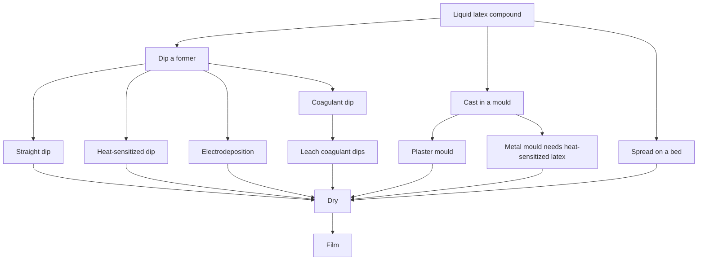

# Forming Film from Liquid Latex

> **Safety.** Liquid latex concentrates carry ammonia odor, freeze risk, and metal-fitting hygiene. Coagulant dips use calcium salts as plant tools. Natural-rubber protein and accelerator chemistry can matter for skin contact; that is literacy, not a wear certificate. See [Allergy and Skin Contact](/literature-reviews/allergy-and-skin-contact) and [Liquid ventilation and ammonia](/literature-reviews/liquid-ventilation-ammonia).

## Executive summary

Liquid latex starts as an aqueous dispersion of polymer particles suspended in water. You convert that liquid into an elastic film by dipping, casting, or spreading. Raw latex concentrate is not a finished product; it must be compounded and vulcanized so the resulting rubber can stretch to more than double its length and snap back.

Work with liquid latex when you need seamless forms, variable gauges, or custom dipping and casting on forms and moulds. If you only need flat panels for tailored garments, sheet latex is faster and avoids wet chemical processing. For choosing a specific liquid technique, see [Former dip, mould cast, and flat spread](/literature-reviews/liquid-former-dip-vs-mould-cast-vs-flat-spread). For container markings, see [Decoding liquid latex bottle labels](/literature-reviews/liquid-decoding-bottle-labels).

## Questions this article answers

- [What is in the bottle?](#feedstock)
- [How do you form the film?](#forming)
- [What may touch the latex?](#plant)
- [Is the rubber already vulcanized in the liquid?](#prevulc)
- [Which polymer is in the tank?](#polymer)
- [When does this pathway fit?](#when)

## What is in the bottle? {#feedstock}

### How

Inspect the container label before opening. Check the polymer type, total solids percentage, and whether the latex is uncompounded concentrate, compounded, or prevulcanized. Do not assume a craft bottle labeled "liquid latex" is ready for dipping without additives.

### Why

In rubber technology, latex is a colloidal dispersion of microscopic polymer particles suspended in water, typically preserved with ammonia. Raw natural rubber concentrate cannot form a serviceable, durable film on its own. It requires compounding ingredients to stabilize the bath, guard against aging, and enable vulcanization. Without vulcanization, dried raw rubber remains sticky, weak, and plastic rather than elastic.

Detail: Concentrate specifications

ISO 2004 specifies ammonia-preserved centrifuged or creamed natural-rubber concentrate. Commercial grades include High Ammonia (HA) and Low Ammonia (LA). The 2024 revision also recognizes Medium Ammonia (MA).

ASTM D1076 covers industrial categories for concentrated, ammonia-stabilized natural-rubber latex. It standardizes total solids, dry rubber content (DRC), alkalinity, and mechanical stability, but it does not cover compounded formulations.

## How do you form the film? {#forming}

### How

Select a deposition method based on the shape of your target item:

- Dip an external former to make hollow, thin-walled goods.
- Cast into an internal mould to make contoured 3D shapes or solid items.
- Spread across a flat bed or glass surface to produce custom sheets.

When dipping with a coagulant salt, leach the wet deposit in warm water before final drying. Thoroughly dry the film, then heat-vulcanize it unless you started with prevulcanized liquid.

### Why

Dipping coats a former submerged in liquid compound. Straight dipping uses no coagulant and leaves a very thin dry layer, around 0.01 to 0.05 mm per pass. Multiple dips are required to build thickness, which also ensures pinholes in one coat are sealed by the next.

Coagulant dipping speeds up the process for deposits thicker than 0.20 mm (about 8 mils). The former is coated with calcium salts, such as calcium nitrate or calcium chloride, which release divalent ions that instantly destabilize and gel the latex particles on contact. Because these salts remain trapped in the wet deposit, you must leach the film in warm water. Leaching removes water-soluble salts and non-rubber serum solids that would otherwise attract moisture and cause the finished rubber to degrade.

Casting relies on moulds. Plaster moulds absorb water and supply calcium ions to gel the liquid against the cavity wall. Metal moulds cannot absorb water, so they require heat-sensitized latex formulations that gel when heated. Spreading lays a wet film over a flat surface using a scraper or knife, followed by drying and vulcanizing.

Detail: Single-dip thickness and compound viscosity

Gorton's data on three natural-rubber compounds showed that a single straight dip without coagulant yields a dry thickness of roughly 0.01 to 0.05 mm. When total solids and viscosity vary together through dilution, dried film thickness increases linearly with the logarithm of compound viscosity.

Detail: Spreading methods and early patent lineages

Laboratory films can be spread on plate glass using a calibrated, wire-wound doctor blade. In the Anode dipping sequence, the former contacts coagulant first, followed by latex immersion. In the Teague sequence, the former enters latex first, followed by a coagulant dip. A standard handbook leach cycle runs 20 to 30 minutes in water maintained at 40 to 50 °C.

US Patent 2,415,028 describes industrial spreading of vulcanizable latex onto a continuous moving belt, including multi-ply layups. US Patent 2,129,607 details successive coatings dried sequentially between applications.

National Bureau of Standards Letter Circular LC 321 (1932) classified spreading, dipping, electrodeposition, chemical deposition, and latex foam as distinct industrial paths. When prevulcanized latex was chosen, the formed deposit required only drying; natural unvulcanized latex was cured after deposition.

Detail: Heat-sensitized moulding systems

A 1997 review of non-plaster moulding systems outlines delayed-action, salt-thickened gels (Metallgesellschaft), zinc-ammine heat-sensitizing systems using ammonium salts (Kaysam), and rotational hollow moulding. For Kaysam moulding, thorough water leaching is mandatory. Residual ammonium nitrate and zinc salts left in the rubber accelerate oxidative breakdown as the article ages.

## What may touch the latex? {#plant}

### How

Keep copper, brass, bronze, and galvanized metals away from liquid latex, storage vessels, and dipping tanks. Use glazed ceramic, porcelain, aluminum, or 316 stainless steel equipment. 

Control your drying and dipping room to stay between 20 and 26 °C, with relative humidity held between 45% and 50%. After withdrawing a dipped former, invert or rotate it slowly through 180 to 360 degrees to prevent edge beads and drips. Stir compound gently to avoid entraining air.

### Why

Copper and manganese are active oxidation catalysts for natural rubber. Minute traces cause rapid depolymerization, turning the cured film sticky and brittle. 

Air whipped into liquid latex creates suspended microbubbles that turn into pinholes in thin films. Ambient humidity must stay balanced during dipping. Excess humidity retards drying and lowers the tensile strength of the gelled film. Low humidity dries the surface too quickly, forming a dry skin that prevents subsequent dips from bonding cohesively. Glazed dipping formers produce a smooth, glossy inner film, while matte or sandblasted formers yield a satin finish.

Detail: Glove geometry and wet-film control

Medical examination gloves profiled in the Practical Guide to Latex Technology typically range from 0.10 mm thick at the cuff to 0.20 mm at the fingertips. That thickness gradient reflects former dwell times and withdrawal mechanics. Gloves represent roughly half of all global natural-rubber latex consumption.

Wet deposit thickness depends on five compounding and mechanical variables: total solids content, coagulant concentration, immersion dwell time, compound viscosity, and withdrawal speed. A standard industrial test for compound precure is the chloroform coagulant number, typically maintained between 2 and 3 for dipping. Webbing between former digits must be prevented, as ruptured wet webs create thin tears and local structural defects.

## Is the rubber already vulcanized in the liquid? {#prevulc}

### How

Check the product specification to determine whether your liquid latex is unvulcanized or prevulcanized. 

- If prevulcanized, form the deposit and dry it in warm, circulating air. No post-cure heating is required.
- If unvulcanized, allow the formed deposit to dry to transparency, then heat it in an oven to cross-link the polymer chains.

### Why

Prevulcanized latex contains cross-linked rubber particles while still suspended in water. When the deposit dries, the particles touch, deform, and coalesce into an elastic film. However, if prevulcanization is pushed too far in the liquid state, the rubber particles become too rigid to merge completely upon drying, yielding a brittle film with low tensile strength.

Unvulcanized latex compounds require post-form vulcanization. The compound contains sulfur, zinc oxide, and organic accelerators. Heating the dried deposit initiates chemical cross-linking. Vulcanization eliminates surface tack, raises tensile strength, prevents solvent dissolution, and gives the rubber its elastic recovery. Sulfur alone produces a slow, inefficient cure; zinc oxide and accelerators are necessary for commercial physical properties.

Detail: Oven vulcanization cycles

Following complete air-drying to clear the film of moisture, one standard Vanderbilt formulation cures under circulating warm air at 93 °C for 30 minutes.

Detail: Contrasting data on prevulcanized film strength

Technical handbooks show differing results for the tensile properties of prevulcanized films compared to postvulcanized films:

- *The Vanderbilt Latex Handbook* (1987) notes that a properly formulated prevulcanized latex film develops tensile strength around 27.6 to 34.5 MPa (4,000 to 5,000 psi) as particles integrate during drying.
- *Polymer Latices*, volume 3 (1997), shows that sulfur-postvulcanized natural-rubber films achieve peak tensile strength at a relaxed modulus of approximately 0.8 MPa, whereas sulfur-prevulcanized films peak at a lower modulus of 0.4 to 0.5 MPa. Postvulcanized film strength drops at high cross-link density because of restricted chain mobility. Prevulcanized film strength drops because rigid cross-linked particles resist coalescence. Radiation-prevulcanized films (forming carbon–carbon cross-links) reach tensile strengths of 30 to 35 MPa.

- Rani Joseph's *Practical Guide to Latex Technology* (2013) states in its casting chapter that tensile strength is consistently lower for films cast from prevulcanized latex than for postvulcanized compounds. However, casting operations often accept prevulcanized latex for thick, solid items to eliminate high-temperature curing ovens.
- D. C. Blackley's *High Polymer Latices* (1966) records that if drying conditions prevent further vulcanization, prevulcanized films display tensile strengths around 13.8 MPa (2,000 psi) and ultimate elongations of 700 to 800%. When residual curatives allow vulcanization to continue during hot-air drying, tensile strengths reach 24.1 to 31.0 MPa (3,500 to 4,500 psi) with 800 to 900% elongation.

Detail: Peroxide systems and commercial grades

US Patent 3,755,232 describes prevulcanizing aqueous natural and synthetic rubber dispersions using organic hydroperoxides or hydrogen peroxide activated by heavy metal complexes. The patent covers dipped goods, thread, adhesives, and foam backings. Formulators can also introduce sulfur, zinc oxide, and secondary accelerators to support post-drying cure.

Commercial technical sheets show standard parameters:
- Corrie MacColl's PVultex PVML technical sheet specifies a low-ammonia, prevulcanized natural-rubber dipping latex at approximately 60% total solids, noting that the liquid emulsion is frost-sensitive.
- Revultex technical documentation specifies prevulcanized natural rubber for dipping and cold casting, citing typical dry film thicknesses of 0.12 to 0.15 mm.

## Which polymer is in the tank? {#polymer}

### How

Review the technical data sheet to confirm whether your liquid is natural rubber (*Hevea brasiliensis*) or a synthetic polymer such as polychloroprene or carboxylated nitrile. Use the coagulants, cleaning solvents, and curing temperatures specified for that exact polymer family. Do not mix natural and synthetic emulsions without verified compatibilizers.

### Why

Natural rubber and synthetic polymers use entirely different colloidal chemistries. Natural rubber latex is stabilized with natural proteins and fatty acid soaps, cross-linking through sulfur vulcanization. Carboxylated nitrile or chloroprene latices rely on synthetic surfactant packages, different pH windows, and ionic cross-linking agents like zinc oxide. Applying natural rubber coagulant baths or curing cycles to synthetic polymers causes coagulation shock, uneven film pickup, or uncured rubber.

Detail: Solvent dipping historical distinction

NBS Letter Circular LC 321 (1932) differentiates aqueous latex dipping from historical solvent dipping. Solvent dipping dissolved milled dry rubber in benzene, naphtha, or gasoline. Because solvent rubber solutions became unworkably viscous above 10% rubber solids, operators had to dip forms dozens of times to build thickness. Aqueous latex dispersions provide 30% to 60% rubber solids at low viscosity, building equivalent gauge in far fewer passes.

## When does this pathway fit? {#when}

### How

Select liquid latex when you need:

- Seamless, skin-tight 3D geometries formed directly on dipping formers (such as gloves, hoods, or socks).
- Complex hollow or thick-walled anatomical shapes cast inside moulds.
- Custom-blended sheet colors, specialty gradients, or thicknesses unavailable commercially.

If your garment can be fabricated from uniform flat panels, choose sheet latex instead. Sheet latex avoids ammonia handling, dipping tanks, coagulant leaching, and vulcanization ovens.

### Why

Liquid latex allows you to determine thickness, curvature, and compounding during film formation. It replaces cut-and-glued flat seams with seamless dipped geometries. However, maintaining liquid dipping tanks requires ventilation for ammonia, protection against freezing, regular bath filtration to prevent skinning, coagulant management, and water-leaching baths. When flat sheets satisfy the garment design, purchasing commercial sheet latex eliminates liquid chemical handling entirely.

## Sources

- ASTM D1076. *Standard Specification for Rubber—Concentrated, Ammonia Stabilized, Creamed, and Centrifuged Natural Latex.* ASTM International. https://store.astm.org/d1076-23r26.html
- Blackley, D. C. *High Polymer Latices: Their Science and Technology*. 2 vols. London: Maclaren; New York: Palmerton, 1966. https://lccn.loc.gov/66077950
- Blackley, D. C. *Polymer Latices: Science and Technology — Volume 3: Applications of Latices*. 2nd ed. London: Chapman & Hall, 1997. https://books.google.com/books?id=Y2VPGj7YbykC
- Corrie MacColl. *PVultex PVML Technical Data Sheet (Low-Ammonia Prevulcanised Natural Rubber Latex)*. https://www.cfsnet.co.uk/media/attachments/Stock/0000001108/TDS%20Latex%20PVULTEX%20PVML.pdf
- ISO 2004:2024. *Natural Rubber Latex Concentrate — Centrifuged or Creamed, Ammonia-Preserved Types — Specifications.* International Organization for Standardization, 2024. https://www.iso.org/standard/86502.html
- Joseph, Rani. *Practical Guide to Latex Technology*. Shawbury: Smithers Rapra Technology, 2013. https://books.google.com/books/about/Practical_Guide_to_Latex_Technology.html?id=NB5AMwEACAAJ
- Mausser, Robert Francis, ed. *The Vanderbilt Latex Handbook*. 3rd ed. Norwalk, CT: R.T. Vanderbilt Company, 1987. https://lccn.loc.gov/92117844
- Revultex. *Revultex Prevulcanized Natural-Rubber Latex Technical Data Sheet*. Distributor PDF. https://shop.keramik.at/config/produktdokumente/Technisches_Datenblatt_Latex_Revultex.pdf
- Synthomer. *SyNovus Plus Technical Data Sheet (Nitrile Dipping Latex)*. 2023. https://www.synthomer.com/Media/tds/SYNOVUS%20PLUS.pdf?revision=20230511
- U.S. Department of Commerce, National Bureau of Standards. *Letter Circular LC 321: Rubber Latex*. Washington, DC: NBS, 25 February 1932. https://nvlpubs.nist.gov/nistpubs/Legacy/LC/nbslettercircular321.pdf
- US Patent 2,129,607. Mishawaka Rubber and Woolen Manufacturing Company. *Method of Making Rubber Articles*. Filed 1934, issued September 6, 1938. https://www.freepatentsonline.com/2129607.html
- US Patent 2,415,028. The Firestone Tire & Rubber Company. *Method of Making Sheet Material*. Filed 1943, issued January 28, 1947. https://www.freepatentsonline.com/2415028.html
- US Patent 3,755,232. Dunlop Holdings Limited. *Process for the Vulcanisation of Natural and/or Synthetic Rubber Aqueous Dispersions*. Filed 1971, issued August 28, 1973. https://patents.google.com/patent/US3755232A/en