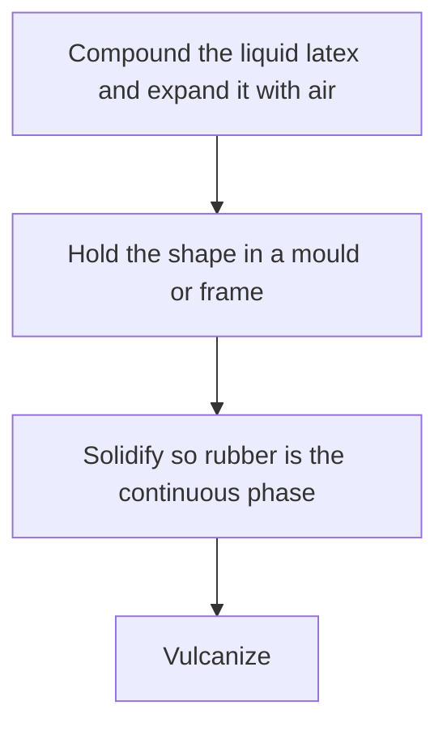
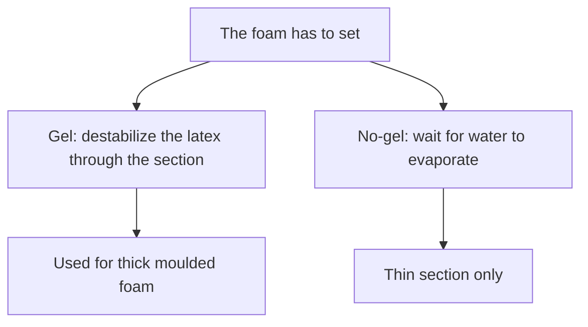

# Latex Foam for Costume Volume

> **Process hazard.** Foam manufacture uses gelling agents, heat, and fine powders at industrial shop scale. Collapse, shrinkage, and a missed gel time are documented risks when process controls are missing.

## Executive summary

Costume volume made from liquid latex is foam rubber. You expand the liquid latex with air, hold its shape in a mould or frame, solidify the rubber into a continuous structure, and vulcanize. The rubber network must lock into place before the air bubbles collapse.

Use this when planning padded costume elements and selecting the appropriate setting method.

## Questions this article answers

- [What is latex volume padding?](#volume)
- [When does the foam need a gel?](#gel)
- [What changes how the pad feels?](#feel)

## What is latex volume padding? {#volume}

### How

Build the foam structure in four sequential stages:

Whipping air into liquid latex is only the starting point. Pour or spread the wet foam into a mould or frame to maintain the finished dimensions. Solidify the compound so the rubber particles merge into a continuous network around the bubbles, then vulcanize the pad to set the polymer.

### Why

Foamed latex consists of rubber particles and air bubbles suspended in water. Two distinct surfaces determine whether the foam survives: rubber against water, and air against water. The rubber particles must coalesce into a continuous skeleton while the gas bubbles remain intact. If the air-water boundary fails first, the bubbles pop and the foam collapses back into liquid.

Detail: What gel means in foam

In this context, a gel means the latex is deliberately destabilized so the rubber particles coalesce while the bubbles are still present.

Polymer Latices Vol 3 outlines three distinct interfacial timings:
1. If the air–water surface energy rises first, the foam collapses before the rubber sets.
2. If the rubber–water interface destabilizes first, the foam sets, showing only limited collapse and a coarser cell structure.
3. An air surface that never destabilizes while the latex still gels is described as difficult or impossible in industrial practice.

Detail: Air cells in the foam

The diagram below illustrates foamed latex morphology: open air cells enclosed by the continuous rubber network.

## When does the foam need a gel? {#gel}

### How

For thick pads, formulate a chemical gel that destabilizes the compound throughout its entire depth. Use a delayed gelling agent paired with zinc oxide, following the Dunlop process. Test the gelling dosage on a small sample of the active compound batch before casting full sections.

For thin coatings or skins, drying without a chemical gelling agent is sufficient. Keep ungelled foam and heat-sensitive foam restricted to thin cross sections.

### Why

A chemical gel locks the rubber structure through the entire thickness before the liquid drains out of the bubble walls. Plain drying depends entirely on moisture evaporating through the exterior surface. Thick foam loses internal water too slowly, causing the fluid core to collapse under its own weight.

Heat-sensitive foam warms from the outside inward. Because heat penetrates slowly, a thick moulding gels in concentric layers. This internal stratification lowers load-bearing strength compared to delayed-action chemical gels of identical density, limiting heat-sensitive compounds to thin spreads and dips.

Detail: Dunlop doses and example cards

Polymer Latices Vol 3 gives typical natural-rubber Dunlop additions as 1.5 phr sodium silicofluoride and 3–5 phr zinc oxide. The sodium salt is the standard gellant for natural rubber. Compounds consisting entirely of styrene–butadiene latex require roughly 3 phr silicofluoride because synthetic latices contain higher concentrations of soap and alkali. Latex blends require intermediate doses proportional to the styrene–butadiene ratio. These published figures serve as baseline estimates; determine the precise loading using small bench tests for every formula and batch.

Ammonia-preserved natural-rubber formulation cards (Table 18.4) range from unfilled high-density stocks to lower-density compounds filled with kaolinite clay, ground whiting, or whiting combined with wet-ground mica. Thin sections of these four compounds gel and cure within 30 minutes at 100°C under industrial mattress and cushion schedules.

The unit phr denotes parts per hundred rubber by dry weight, sometimes designated as pphr.

Detail: One published gel pH

In an experimental trial documented in Polymer Latices Vol 3, pH drops while viscosity climbs following the addition of sodium silicofluoride. The descending curve represents pH (curve A), while the ascending curve tracks viscosity (curve B). In this specific system, the gel point occurs near pH 8.6 at slightly under 10 minutes. This value represents an empirical measurement for that compound rather than a universal operational target.

Detail: Why heat-sensitive foam stays thin

Heat applied to the exterior of a mould transfers inward via conduction. Consequently, gelation develops in concentric planes parallel to the mould boundaries. As trapped air expands with rising temperature, internal pressure can rupture the cell walls before the core rubber sets. Under dynamic flexing, the vulcanized pad tends to shear along these boundary planes, exhibiting lower tensile resistance perpendicular to the mould wall than parallel to it. Gelation and vulcanization remain separate chemical mechanisms even when managed within a single thermal cycle.

For solid-film heat gelation methods, refer to [Liquid heat-sensitized gelation](/literature-reviews/liquid-heat-sensitized-gelation).

Detail: Flame-retardant cushioning foam

The Vanderbilt Latex Handbook specifies polychloroprene foam for flame-retardant cushioning applications, including naval vessel mattresses, mass transit and theater seating, institutional bedding, and carpet backing. The process requires high-solids latex with medium to high polymer gel content, particularly when compounding heavy loadings of hydrated mineral fillers such as aluminum trihydrate.

## What changes how the pad feels? {#feel}

### How

If adding mineral oil to help rubber particles coalesce during gelling, restrict the dose to 5 phr or less. Avoid pairing heavy oil additions with high filler loadings unless you can accept a weaker, less resilient pad.

Adjust softness by controlling how much air you whip into the liquid compound. A pad expanded to a lower density feels softer and compresses under lower loads than a dense pad poured from the identical latex compound.

### Why

A small addition of mineral oil facilitates particle coalescence during the gelling phase. Higher oil additions allow manufacturers to incorporate higher volumes of mineral fillers to reduce cost, but this practice degrades tensile strength and tear resistance.

For highly expanded foam, mechanical stiffness depends on the modulus of the base rubber and the volume fraction occupied by the polymer network. Incorporating more air thins the cell walls, allowing the open structure to buckle under less applied force.

Detail: Gent–Thomas scaling

Polymer Latices Vol 3 details the Gent–Thomas open-cell deformation model. For highly expanded foams where node mass is small relative to connecting struts, Young’s modulus scales according to:

$$E \approx \frac{E_0}{6} \times \frac{\rho}{\rho_0}$$

In this relationship, $E_0$ and $\rho_0$ represent the tensile modulus and density of the solid rubber phase, while $\rho$ is the bulk density of the expanded foam. 

The model predicts a theoretical Poisson’s ratio of 0.25 under small extensions. Experimental measurements compiled in the text average 0.33, with an observed range between 0.28 and 0.43. While physical latices deviate from the ideal Poisson prediction, the equation provides an accurate scaling framework for density adjustments.

Detail: Compression behavior across foam densities

The experimental curves below display latex foam rubber under compressive load. Curve A represents the highest density ($0.31\text{ Mg m}^{-3}$) and Curve E represents the lowest ($0.10\text{ Mg m}^{-3}$), with intermediate densities at 0.21, 0.18, and $0.14\text{ Mg m}^{-3}$. 

Lower-density foams collapse at markedly lower compressive stresses. Because these stress-strain curves are non-linear, Polymer Latices Vol 3 cautions against using a single compressive modulus value when comparing pad firmness.

## Sources

- Blackley, D. C. *Polymer Latices: Science and Technology — Volume 3: Applications of Latices*. 2nd ed. Chapman & Hall / Springer, 1997. [Google Books](https://books.google.com/books?id=Y2VPGj7YbykC)
- Mausser, Robert Francis, ed. *The Vanderbilt Latex Handbook*. 3rd ed. Norwalk, CT: R.T. Vanderbilt Company, 1987. [Library of Congress](https://lccn.loc.gov/92117844)