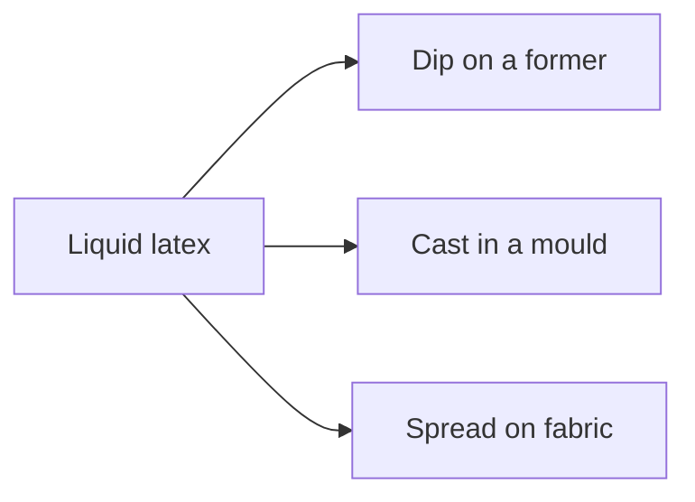
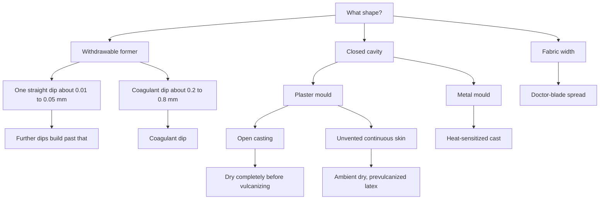

# Former Dip, Mould Cast, and Flat Spread

> **Safety.** Ammonia fumes from natural-rubber latex are a health hazard if you breathe them for a long time. Ventilate. Keep copper, brass, and galvanized iron off equipment that holds latex. The leach tank follows the same metals rule. Brass or copper fittings deteriorate the rubber in the latex. Galvanized fittings form coagulum. Coagulant salts and heat sensitizers are plant chemicals. See [Allergy and Skin Contact](/literature-reviews/allergy-and-skin-contact).

## Executive summary

Liquid latex becomes a film in one of three places. Dip builds it on a former you pull out of a tank. Cast gels it on the inside of a mould. Spread lays it on fabric with a doctor blade on a proofing line.

A straight dip is thin on each pass. A coagulant dip builds a thicker wall in one pass, and it builds faster. Heat-sensitized dipping is for a thick single dip, such as a teat. Pick the branch from the shape and the thickness you want. Read this after [Forming film from liquid latex](/literature-reviews/liquid-film-pathway).

## Questions this article answers

- [Which shape uses which process?](#which-shape)
- [How do you dip a former?](#dip)
- [How do you cast in a mould?](#cast)
- [How do you spread on fabric?](#spread)
- [How do you pick a branch?](#pick)
- [Which rule stays with its machine?](#rules)

## Which shape uses which process? {#which-shape}

Match the hardware to the shape. A glove form or a plug you can withdraw is a former: dip it. A hollow article with an inside surface is a mould: cast it. A continuous width of fabric is a spreading line.

### Why

Dipping leaves rubber on the outside of the shape you immersed. Casting copies the cavity wall, so the detail sits on the inside of the film. Spreading wets a moving textile. Water-based latex dries more slowly than a solvent rubber dough, so the fabric runs more slowly. Letter Circular LC 321 (1932) already treats spreading and dipping as separate routes, and it describes fabric impregnation as its own bath step.

### Detail: What the words mean

A former is the positive you dip. A mould is the cavity you cast in. Spread, in this article, means a wet latex film on fabric, the industrial proofing operation in *Polymer Latices* Volume 3.

## How do you dip a former? {#dip}

For a thin film, dip and withdraw, then dip again. Each straight pass is about 0.01–0.05 mm of dry rubber, so thickness comes from repeats.

For a thicker film, coat the former with a coagulant first. A coagulant is a salt bath, often a calcium salt. Leave the former in the tank for a set dwell so a gel layer can form. At withdrawal the film is usually only partly gelled. More salt on the former gives a thicker deposit for the same dwell. One coagulant dip is typically 0.2–0.8 mm dry. Handbook practice uses coagulant once the dry film is thicker than about 0.2 mm (8 mil), because the wall builds faster. Then leach in warm water and vulcanize in staged warm air.

Porcelain formers stand up to coagulant and latex. Mount them so they do not trap air as they go in. Rotate them after the dip so the wet film does not run into drips.

Heat-sensitized dipping is still a former in a tank. One dip can leave up to about 4 mm of dry rubber, which is how teats and soothers are made. The thickness-versus-time curve is different from a coagulant dip. Keep that cycle separate from a closed-mould cast. Further coagulant practice: [Coagulant dipping for wearable thickness](/literature-reviews/liquid-coagulant-dipping-wearable-thickness).

### Why

A straight dip has no coagulant. The wet film is only what clings and then dries, so one pass stays thin. Later dips also cover pinholes that do not line up from layer to layer (*Polymer Latices* Volume 3).

A coagulant destabilizes a gel layer during the dwell. The outer layer is often still fluid when the former comes out (*Polymer Latices* Volume 3). Warm leach pulls soluble salt out of the wet film. Gloves made from prevulcanized latex may only need warm-air drying (Vanderbilt Latex Handbook).

Brass or copper in contact with the latex deteriorates the rubber. Galvanized fittings form coagulum (Vanderbilt Latex Handbook).

### Detail: Viscosity and one straight dip

When water dilution changes total solids and viscosity together, dried thickness from one dip tracks the logarithm of viscosity. The handbook plot shows the same points on a linear viscosity scale and again on a log scale (*Polymer Latices* Volume 3).

### Detail: Calcium salt on the former

After a fixed dwell, deposit thickness rises as the amount of calcium salt on the former rises. The handbook series changed that load by changing the concentration of the coagulant solution. On the plot, circles are 0.5 minute, triangles 2 minutes, squares 5 minutes, and inverted triangles 10 minutes.

The usual order is coagulant, then latex. A first latex layer can instead act as a tie coat for the coagulant and for the gel that forms next. That helps on smooth glass or glazed porcelain. In wet-coagulant dipping, the coagulant’s slip makes the gel more liable to slide off the former. A last dip in coagulant, after the last latex dip, is optional. It is recommended for polychloroprene.

### Detail: Heat-sensitized dipping

Dry thickness versus dwell is plotted separately for heat-sensitized dips and for a conventional coagulant dip. Curve A is polyvinyl methyl ether, curve B is a polypropylene glycol, and curve C is the coagulant dip. The heat-sensitized formers in that plot were at 60 °C. The bath has to stay cool. A production note for baby-feeding teats holds bath temperature within ±1 °C. That limit is the hard part of heat-sensitized dipping compared with coagulant dipping.

## How do you cast in a mould? {#cast}

Plaster. Pour the plaster slurry down onto the master so bubbles move off the face that will be the cavity. Fill the mould with latex, wait, and pour out the excess if you are slush casting. Dry the casting enough in the mould that it keeps its shape when you take it out. Dry it completely before you vulcanize it, or it blisters.

A closed skin with no vent is a different dry step. Dry that skin at room temperature. Heat can burst it while the deposit is still fragile. The handbook preference for that closed skin is a prevulcanized latex. Room-temperature drying of a sealed skin does not replace “dry completely before vulcanizing” on an open plaster casting.

Metal, heat-sensitized. Use a closed mould. Add the sensitizer just before you cast, and keep air out of the compound. Rotate on two axes while the mould heats, until the latex gels. Cool, leach, dry the casting on a support, then vulcanize in warm air.

Slush thickness follows how stable the compound is, and the shape of the cavity. Rotational thickness follows how much compound you metered against the cavity area, and the wall is more even. Rotation needs its own rig. Plaster moulds are seldom used for that rotation. They are heavy and they break. See [Heat-sensitized gelation](/literature-reviews/liquid-heat-sensitized-gelation).

### Why

Plaster is porous. Water soaks into the mould and calcium ions gel the latex from the cavity face inward. Sharp edges wear away, so the mould is cheap and short-lived (*Polymer Latices* Volume 3).

Vanderbilt’s “dry completely before vulcanizing” note is about blistering if you vulcanize a wet casting. *Polymer Latices* Volume 3 tells you to dry an unvented continuous skin at room temperature, because heat can burst it. One failure is a blister. The other is a burst skin.

A heat-sensitized metal mould gels because the compound and the hot wall meet inside a closed cavity. That closed-mould cycle is the Kaysam class. The heat-sensitized former dip above stays in a tank.

### Detail: Kaysam timing example

One Vanderbilt natural-rubber example adds ammonium nitrate just before use. Biaxial rotation, about 4 minutes at 82 °C to gel. Cool 2–5 minutes at 15 °C. Leach in running water at 15–27 °C. Dry at 82 °C for at least 3 hours, supported. Vulcanize in warm air at 104 °C for 20–60 minutes, depending on wall thickness. That is a handbook example, not a shop recipe.

### Detail: Plaster deposit and stabilizer

For a fixed time in a plaster mould, a lower casein level gave a thicker deposit. Higher whiting also tracked thicker deposits, but total solids rose with the whiting, so the filler change is not separated from the solids change (*Polymer Latices* Volume 3).

## How do you spread on fabric? {#spread}

Use a proofing line: fabric under a doctor blade, with line speed matched to how fast water leaves the coat. A sharp blade at an acute angle lays a thin coat and keeps latex from striking through the cloth. A blunt blade set square to the cloth lays a thick coat and drives more latex into the fabric. If you need thickness without a soaked cloth, seal with the sharp blade first, then build with the blunt blade.

Layouts in the same chapter include a drying chest, a heated drum, a spreading roller, knife-over-roll, knife-over-blanket, and knife-over-diaphragm. The diaphragm layout is the one named for delicate fabric.

### Why

The coat is meant to stay flexible at room temperature, so the polymer is a rubber. Compared with solvent doughs, the latex line has no flammable solvent. The costs named in the handbook are fabric shrinkage or staining, and slower drying, which is why the cloth runs slower (*Polymer Latices* Volume 3).

## How do you pick a branch? {#pick}

Start with the shape. A withdrawable positive goes to dipping. A closed cavity goes to casting. A fabric width goes to spreading.

Then the thickness. One straight dip dries to about 0.01–0.05 mm. Further dips build past that. One coagulant dip is typically 0.2–0.8 mm dry. One heat-sensitized dip on a former can reach about 4 mm dry. A hollow thick wall inside a metal mould uses a heat-sensitized cast, slush or rotational.

Then the mould. An open plaster casting is an absorption gel: dry it enough in the mould to hold shape, and dry it completely before vulcanizing. An unvented continuous skin dries at room temperature, and a prevulcanized latex is the preference. Metal means the heat-sensitized cycle, leach, and a supported dry.

### Why

Each branch moves thickness with its own control. Straight dipping uses repeats and viscosity. Coagulant dipping uses dwell and how much salt is on the former. Casting uses residence time, compound stability, or the mass you metered into a rotating mould. Spreading uses blade angle and line speed. A dip dwell does not set a plaster wall. A blade angle does not set the film on a former.

## Which rule stays with its machine? {#rules}

Rotate a heat-sensitized compound inside a closed mould so the latex gels on a cavity wall.

Keep doctor-blade angles on the fabric line. A plaster slush mould gels by absorbing water, then has to dry before vulcanizing.

Treat pinholes from air in a dip tank as a dipping defect. A thick plaster casting fails a different way if you vulcanize it wet.

Multi-dip builds: [Liquid reinforcement and laminate zones](/literature-reviews/liquid-reinforcement-laminate-zones). Ammonia while you compound and dip: [Liquid ventilation and ammonia](/literature-reviews/liquid-ventilation-ammonia).

### Why

The gel happens in a different place on each branch. A former gels on its outside. A mould gels on its inside. A blade meters latex onto cloth. Using one branch’s timing card on another branch’s hardware misses the control that actually sets the wall.

## Sources

- *The Vanderbilt Latex Handbook*. 3rd ed. Edited by Robert Francis Mausser. Norwalk, CT: R.T. Vanderbilt Company, 1987. [Library of Congress](https://lccn.loc.gov/92117844)### Detail: Tank flow

A production dip tank uses an adjustable baffle, a screen, a circulator, and a false bottom. Surface flow is about 2–4 feet per minute. Circulation should pull compound under the false bottom so a loose fit does not suck in air. Air-tight covers limit skinning while the tank is idle. Air left in the compound shows up as pinholes.

- *Polymer Latices: Science and Technology — Volume 3: Applications of Latices*. 2nd ed. D. C. Blackley. Chapman & Hall / Springer, 1997. [Google Books](https://books.google.com/books?id=Y2VPGj7YbykC)
- *Letter Circular LC 321: Rubber Latex*. U.S. Department of Commerce, National Bureau of Standards, 25 February 1932. [NIST](https://nvlpubs.nist.gov/nistpubs/Legacy/LC/nbslettercircular321.pdf)
