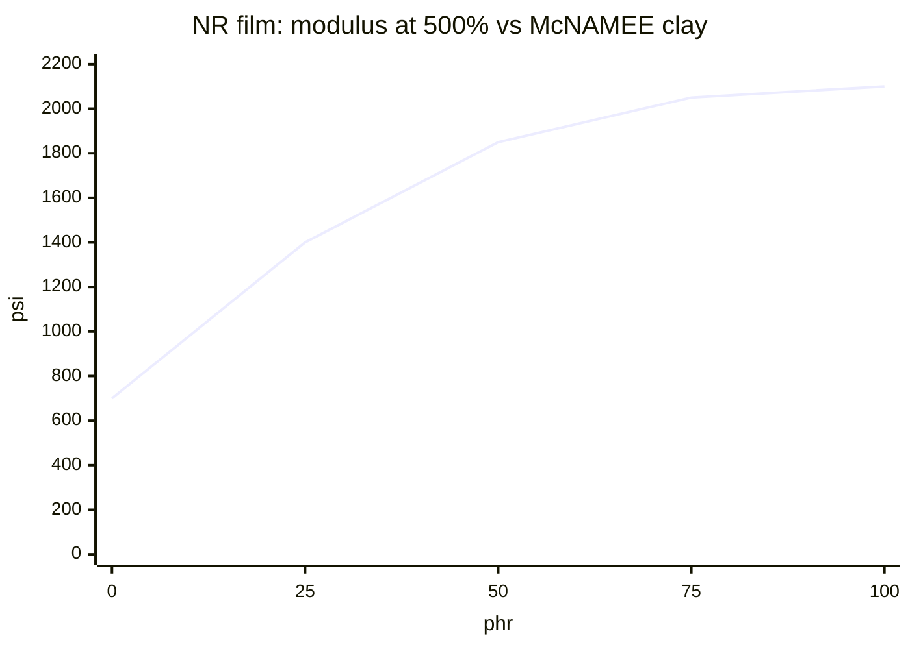
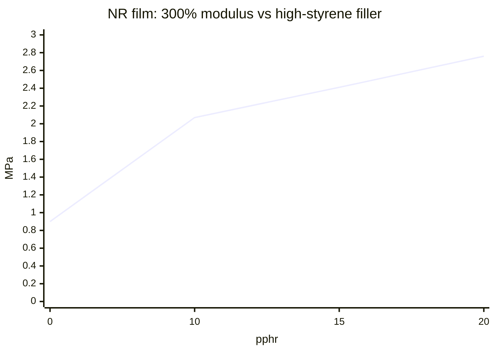
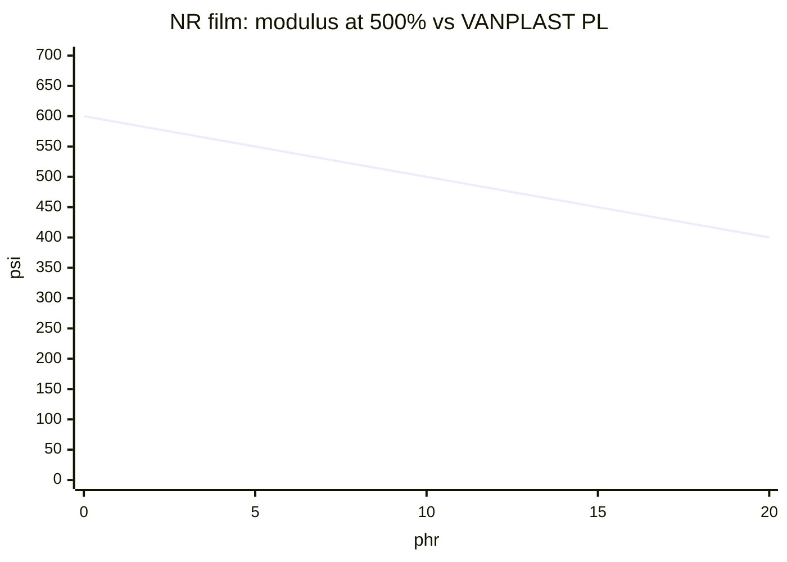
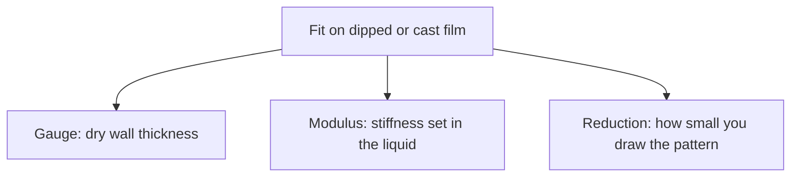

# Gauge, Modulus, and Reduction on Cast or Dipped Film

## Executive summary

When you work with liquid latex to dip, cast, or spread your own film, fit depends on three distinct controls. Gauge is dry wall thickness. Modulus is compound stiffness at a given stretch. Reduction is how much smaller you cut the pattern compared to body measurements. 

A thicker wall, a stiffer compound, and a smaller pattern produce very different mechanical results. Understanding these separate levers helps when a finished garment feels boardy, sags after wear, or relies on excessive thickness just to stay snug.

## Questions this article answers

- [How do you read gauge on film you formed?](#gauge)
- [How do you change modulus in the liquid?](#modulus)
- [What is reduction?](#reduction)
- [Which change actually changes the fit?](#which-change)

## How do you read gauge on film you formed? {#gauge}

### How

Measure the dry wall thickness in millimetres using a thickness gauge or micrometer. Adjust your dipping dwell time, withdrawal speed, cast volume, or spreader gap when the wall is too thick or too thin. Do not alter your compound or redraft your pattern pieces if the only problem is wall thickness.

For forming procedures, see [Home-cast latex film](/literature-reviews/liquid-home-cast-film) and [Coagulant dipping for wearable thickness](/literature-reviews/liquid-coagulant-dipping-wearable-thickness).

### Why

Gauge describes the physical thickness of the dry film. A thicker wall made from the same compound requires more overall force to stretch and bend over the body, but the compound itself has not changed. Its internal stiffness remains identical.

## How do you change modulus in the liquid? {#modulus}

### How

Modify your liquid latex compound before forming the film when the thickness measures correctly but the material feels wrong in the hand.

Add mineral clay dispersions to stiffen natural rubber film, keeping in mind that clay reduces tensile strength. High-styrene copolymer dispersions raise stiffness, increase tear resistance, and increase permanent set. Plasticizers soften the rubber, lowering modulus as the load increases. Graft copolymer latices offer an industrial route to stiffer film at thicknesses near half a millimetre when blended with standard natural rubber latex.

Treat published loading tables as comparative reference series. Any home compound still requires careful dispersion work. For compounding procedures, see [Pigment and filler compounding for liquid latex](/literature-reviews/liquid-pigment-filler-decks).

### Why

Modulus is tensile stress at a specific elongation, typically reported by handbooks at 300% or 500% stretch. A higher-modulus compound feels stiffer and less supple at the exact same physical gauge.

*The Vanderbilt Latex Handbook* notes that a vulcanized elastomeric film must stretch to at least twice its original length and return to approximately its initial dimensions. When sizing a piece, keep operating stretch well below this working limit.

Detail: What phr means

The term phr stands for parts per hundred rubber by dry weight. Some technical sources write pphr for the same ratio. Adding 20 phr of filler means mixing 20 dry parts of filler into 100 dry parts of rubber polymer.

Detail: McNAMEE clay in natural rubber

*The Vanderbilt Latex Handbook* reports a series for McNAMEE clay using air-dried spread films prepared from a natural rubber latex compound, vulcanized in warm air for 15 minutes at 93 °C.

| phr clay | Tensile (psi) | Modulus at 500% (psi) |
| --- | --- | --- |
| 0 | 5000 | 700 |
| 25 | 4600 | 1400 |
| 50 | 4000 | 1850 |
| 75 | 3200 | 2050 |
| 100 | 2100 | 2100 |

The data shows a clear trade-off: higher clay loading raises compound stiffness while progressively lowering tensile strength.

Detail: DIXIE clay in a chloroprene compound

From the same handbook, spread films made with CR 750 chloroprene latex and DIXIE clay, vulcanized in warm air for 60 minutes at 127 °C, show a matching trend:

| phr clay | Tensile (psi) | Stress at 500% (psi) |
| --- | --- | --- |
| 0 | 3100 | 500 |
| 25 | 1800 | 600 |
| 50 | 1500 | 1100 |

Mineral filler stiffens chloroprene film while reducing ultimate tensile strength, mirroring the behaviour seen in natural rubber.

Detail: High-styrene filler, tear, and permanent set

*Polymer Latices*, Volume 3, Table 16.12, documents sulfur-postvulcanized natural rubber latex films reinforced with a high-styrene styrene-butadiene copolymer filler, vulcanized for 15 minutes at 93 °C.

| pphr filler | Modulus at 300% (MPa) | Crescent tear (N/cm) | Permanent set (%) |
| --- | --- | --- | --- |
| 0 | 0.90 | 1156 | 6 |
| 10 | 2.07 | 1489 | 20 |
| 15 | 2.41 | 1664 | 22 |
| 20 | 2.76 | 1769 | 30 |

Permanent set represents unrecovered elongation after stretching and releasing. In this series, permanent set climbs rapidly alongside stiffness. For panels that must repeatedly snap back, 20 phr introduces significant recovery risk, though tear-critical zones may accept the compromise.

Detail: VANPLAST PL lowers modulus

*The Vanderbilt Latex Handbook* provides a plasticizer series using natural rubber latex and VANPLAST PL. The films were spread and vulcanized in warm air for 20 minutes at 93 °C.

| phr VANPLAST PL | Tensile (psi) | Modulus at 500% (psi) |
| --- | --- | --- |
| 0 | 4400 | 600 |
| 5 | 4200 | 550 |
| 10 | 3800 | 500 |
| 15 | 3300 | 450 |
| 20 | 2800 | 400 |

Plasticizers systematically decrease modulus, yielding a softer film at the cost of modest tensile loss.

Detail: MG graft latex

MG latex consists of natural rubber grafted with methyl methacrylate. *The Vanderbilt Latex Handbook* designates grades such as MG 30 and MG 49 based on the percentage of polymethyl methacrylate present.

At dry film thicknesses of 0.5 mm or higher, standard concentrated latex and conventional catalyst systems limit crack-free continuous film formation to roughly MG 15. Formulators blend high-MG concentrates with unmodified natural rubber latex to achieve target graft levels without film cracking.

Grafted films demonstrate substantially higher hardness and modulus alongside improved tear resistance, accompanied by lower tensile strength and higher tension set. Industrial operations use graft latices to stiffen dipped tubing and enhance puncture resistance in unsupported gloves.

## What is reduction? {#reduction}

### How

Cut pattern panels smaller than body circumference when the garment must stretch to fit. Increase or decrease the offset along pattern edges when you need more or less tension on the body. Do not adjust your rubber compound to fix a pattern that is simply drafted too large or too small.

### Why

Reduction is pure pattern geometry, often termed negative ease in pattern making. If an otherwise snug garment sags after brief wear, the fault is rarely the pattern outline. Slumping points instead to poor elastic recovery or high permanent set in the rubber compound itself.

## Which change actually changes the fit? {#which-change}

### How

Diagnose fit issues by isolating the specific problem:

1. Adjust your dipping or casting cycle when the dry wall thickness measures outside your target gauge.
2. Adjust compounding additives in the liquid when the gauge is correct but the rubber feels too limp or too rigid. Use clays or high-styrene latices to stiffen; use plasticizers to soften. Check permanent set if the article must snap back cleanly.
3. Adjust pattern reduction when the material hand and gauge are correct but the garment needs more or less physical tension across the body.

If an article bags out after repeated wearing, inspect the rubber for aging or excessive tension set rather than recutting the pattern. See [Liquid latex aging, storage, and care](/literature-reviews/liquid-aging-storage-and-care).

### Why

Each lever operates on a distinct physical property. Wall thickness, compound modulus, and pattern reduction are independent variables that cannot substitute for one another.

## Sources

- *The Vanderbilt Latex Handbook*. 3rd ed. Edited by Robert Francis Mausser. Norwalk, CT: R.T. Vanderbilt Company, 1987. https://lccn.loc.gov/92117844
- *Polymer Latices: Science and Technology — Volume 3: Applications of Latices*. 2nd ed. D. C. Blackley. London: Chapman & Hall, 1997. https://books.google.com/books?id=Y2VPGj7YbykC