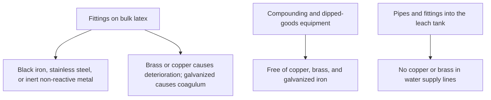
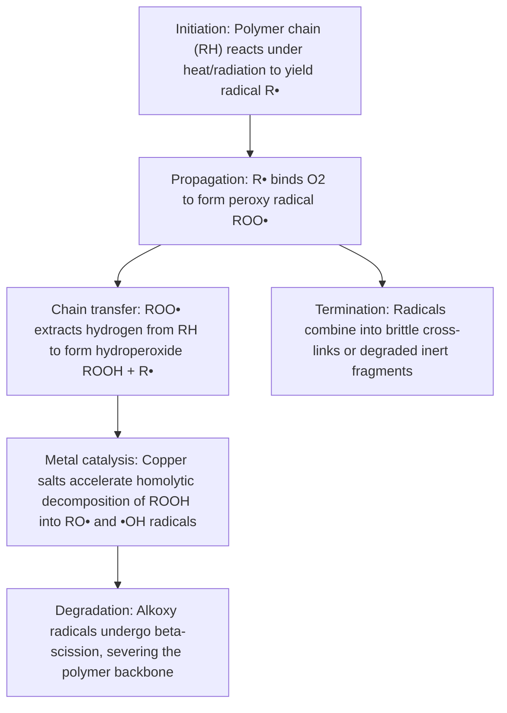

# Liquid Hardware & Metal Contact

## Executive summary

Wet liquid latex, leach bath water, and fresh dipped or cast film each follow strict metal contact rules. Brass and copper fittings degrade the rubber polymer while it remains in liquid suspension. Galvanized iron introduces zinc ions that destabilize the latex and generate coagulum. In compounded liquid latex containing dithiocarbamate accelerators, trace copper contact causes wet deposits to turn brown immediately. Even after a film dries, residual copper salts catalyze autocatalytic oxidation, leading to premature brittleness and failure.

For metal hardware rules on cured sheet goods, see [Sheet Hardware & Metal Contact](/literature-reviews/sheet-hardware-metal-contact). For a broader chemical contact summary, see the [Compatibility Matrix](/literature-reviews/compatibility-matrix-metals-oils-plastics).

## Questions this article answers

- [Which metals can touch wet latex and leach water?](#wet-contact)
- [Why does a fresh film turn brown from copper?](#copper-stain)
- [What does copper do after the film is dry?](#dry-film)

## Which metals can touch wet latex and leach water? {#wet-contact}

### How

Equip bulk liquid latex storage, compound mixing tanks, and dipped-goods equipment only with black iron, stainless steel, or compatible non-reactive plastics. Never install brass, copper, or galvanized iron fittings anywhere in the liquid pathway. 

For coagulant dipping systems, ensure the plumbing and supply lines feeding the warm-water leach tank are free of copper and brass fittings. Do not recirculate or reuse leach bath water unless dissolved and leached solids have been extracted.

### Why

Bulk liquid latex depends on electrostatic and steric stability to keep rubber particles suspended in water. Brass and copper actively deteriorate the rubber hydrocarbon chains while the latex is still liquid. Galvanized fittings expose the latex to reactive zinc coatings, which destabilize the suspension and clump the rubber into solid lumps known as coagulum.

Detail: Role of the leach in coagulant dipping

In coagulant dipping processes, a warm-water leach extracts water-soluble non-rubber constituents, residual serum substances, and surplus coagulant salts (such as calcium nitrate) from the gelled wet film before oven drying and vulcanization. If the supply plumbing contains copper or brass, cupric ions leach into the bath water. These ions are absorbed by the porous gelled film, initiating oxidative breakdown before the product even dries.

## Why does a fresh film turn brown from copper? {#copper-stain}

### How

Prevent all contact between copper alloys and fresh dipped or cast films, especially while the deposit remains wet. Workers should never handle wet deposits with bare hands after touching copper coins, brass tools, or bronze fittings. If finished goods must contact trace copper in service, omit dithiocarbamate accelerators from the compounding recipe entirely.

### Why

Compounds vulcanized or accelerated with dithiocarbamates react rapidly with minute traces of copper or copper salts. This reaction generates copper(II) dithiocarbamate, an intensely colored brown compound that discolors the surface of the film. Unvulcanized, wet gel deposits absorb ionic contaminants quickly, making them far more susceptible to contact staining than fully dried rubber.

Detail: Accelerator choices that reduce staining

D. C. Blackley notes in *Polymer Latices* (1997) that certain thiazole accelerators, specifically mercaptobenzothiazole disulfide (MBTS) and N-cyclohexyl-2-benzothiazylsulfenamide (CHBS) activated by thioureas, provide sufficient curing activity at 100°C. Vulcanizates cured with these systems resist copper staining far better than compounds accelerated with dithiocarbamates or thiuram sulfides.

Detail: Copper staining from tap water and textile dyes

In dipped latex thread manufacture, zinc dialkyldithiocarbamates serve dual roles as ultra-accelerators and vulcanizate antioxidants. However, residual dialkyldithiocarbamates in the rubber bond with trace copper(II) ions present in municipal tap water during washing or domestic laundering, forming dark copper(II) dialkyldithiocarbamates. 

Substituting a thiazole-thiophosphate accelerator combination yields acceptable tensile strength without discoloration. Furthermore, where products meet copper-containing dye complexes in adjacent textiles, copper extraction accelerates oxidative chain degradation. Formulations exposed to these environments require specialized heavy-metal-chelating antioxidants.

Detail: Literature consensus on dithiocarbamate remedies

Blackley's 1966 work *High Polymer Latices* noted that latex films discolor brown in the presence of trace copper from coin handling, correctly assigning the stain to brown copper dithiocarbamate complexes. While early technical literature proposed metal-deactivating additives, Blackley's 1997 revision concludes that the definitive production remedy is omitting dithiocarbamates entirely from compounding recipes where copper exposure is expected.

## What does copper do after the film is dry? {#dry-film}

### How

Isolate finished rubber films from brass fasteners, bronze grommets, and copper electrical leads. If a natural rubber or chloroprene liquid latex compound must be cast or dipped for an application where copper contact is inevitable, raise the total antioxidant content to 2.0 phr (parts per hundred rubber). Split this load evenly: 1.0 phr reserved for baseline environmental oxidation and 1.0 phr dedicated to neutralizing heavy-metal catalysis.

### Why

Oxidative breakdown of natural rubber is autocatalytic, meaning the degradation reaction generates free radicals that accelerate further decomposition. Fatty-acid salts of heavy metals, including copper, cobalt, manganese, and iron, act as powerful oxidation catalysts. These salts slash the activation energy required to break hydroperoxides into reactive free radicals, rapidly embrittling the rubber.

Detail: Formulating antioxidant reserves

In latex compounding, phr stands for parts per hundred rubber by dry weight.

Baseline natural rubber compounds typically carry 1.0 phr of phenolic or amine antioxidant to mitigate heat, light, and ambient oxygen degradation. Because metal-catalyzed oxidation rapidly exhausts protective scavengers, *The Vanderbilt Latex Handbook* specifies a 2.0 phr loading for copper-contact environments. At least 1.0 phr should consist of a metal-deactivating antioxidant, such as symmetrical dibeta-naphthyl-para-phenylenediamine (AGERITE WHITE) or 2,2'-methylene-bis(4-methyl-6-tertiary-butylphenol) (VANOX 2246).

Detail: Autocatalytic oxidation pathway

The metal-catalyzed degradation of dry polyisoprene proceeds along an established radical reaction sequence:

Trace copper ions ($Cu^{2+} / Cu^+$) participate in redox couples that catalyze the decomposition of rubber hydroperoxides into destructive chain-cleaving radicals, destroying elasticity and tensile strength.

Detail: Natural rubber concentrate copper limits

Duangthong et al. (*ScienceAsia*, 2017) review standard specifications for raw natural rubber latex concentrate. The international trade standard caps copper content at 8 mg/kg on total solids. Industrial experience confirms that even within this low threshold, copper present as copper oleate catalyzes localized polymer degradation, creating dark spots and weak points on dipped films such as protective gloves.

## Sources

- *High Polymer Latices: Their Science and Technology*. 2 vols. D. C. Blackley. London: Maclaren & Sons; New York: Palmerton Publishing, 1966. https://lccn.loc.gov/66077950
- *Polymer Latices: Science and Technology — Volume 3: Applications of Latices*. 2nd ed. D. C. Blackley. London: Chapman & Hall, 1997. https://books.google.com/books?id=Y2VPGj7YbykC
- *The Vanderbilt Latex Handbook*. 3rd ed. Edited by Robert Francis Mausser. Norwalk, CT: R.T. Vanderbilt Company, 1987. https://lccn.loc.gov/92117844
- Duangthong, Supunnee, Khwannapha Rattanadaecha, Wilairat Cheewasedtham, Puchong Wararattananurak, and Pipat Chooto. "Simple digestion and visible spectrophotometry for copper determination in natural rubber latex." *ScienceAsia* 43, no. 6 (2017): 369–376. https://doi.org/10.2306/scienceasia1513-1874.2017.43.369