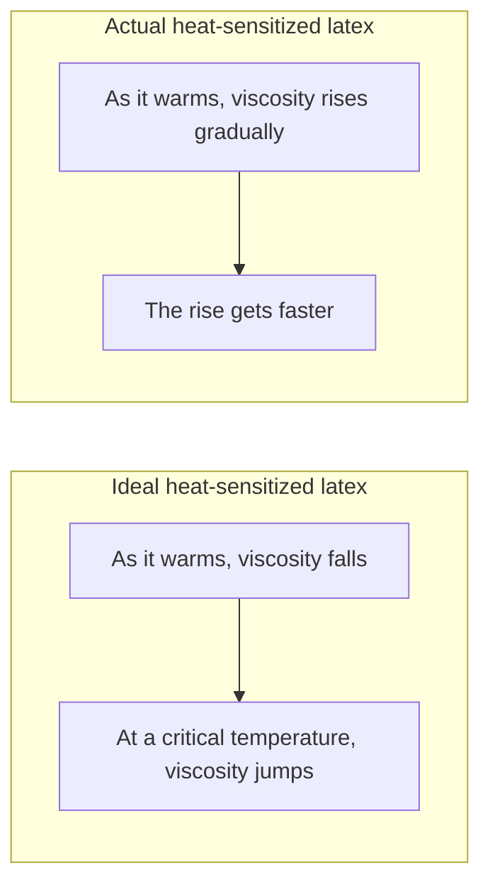
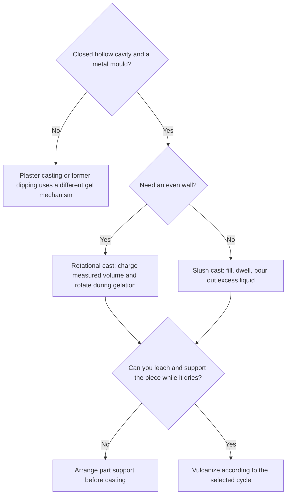

# Heat-Sensitized Gelation

> **Safety.** On the Vanderbilt Kaysam cycle, add the ammonium nitrate sensitizer just before you cast, and keep air out of the compound. Finish de-aeration before that salt solution goes in. A heated closed mould can burn.

## Executive summary

Heat-sensitized casting forms a hollow shell from liquid latex inside a closed metal mould. You pour the compound while it is fluid. Heat transferred from the mould causes the rubber particles to destabilize and gel.

Cast by filling the cavity and pouring out the excess fluid (slush casting), or charge a measured volume and rotate the mould on two axes during gelation (rotational casting). Once the gel forms, leach it in water, dry it until all moisture is gone, and vulcanize it. Support the wet gel during leaching, drying, and vulcanizing to prevent distortion. Published handbooks disagree on vulcanizing temperatures, so keep each temperature paired with its documented cycle. Plaster-mould castings blister if vulcanized wet, and Kaysam castings must dry completely before entering the vulcanizing oven.

Use this process on the liquid latex pathway when a closed metal mould is required. For dipping on a former, see [Coagulant dipping](/literature-reviews/liquid-coagulant-dipping-wearable-thickness). For broader tooling options, see [Former dip, mould cast, and flat spread](/literature-reviews/liquid-former-dip-vs-mould-cast-vs-flat-spread).

## Questions this article answers

- [When do you cast with a heat-sensitized compound?](#when)
- [How do you choose slush or rotational casting?](#choose)
- [How do you run a heated closed-mould cycle?](#cycle)
- [What do you do after the gel forms?](#after)

## When do you cast with a heat-sensitized compound? {#when}

### How

Select a heat-sensitized compound when you need a hollow rubber shell from a closed, non-porous metal mould. Introduce the sensitized compound into the preheated metal cavity while it remains fluid. The heated mould wall supplies the thermal energy needed to destabilize the compound and form a solid gel skin.

### Why

A cast article reproduces the inner surface of the mould cavity, creating crisp external detail. A dipped film on a former reproduces the tool on its interior surface, leaving its outer face softer and less defined unless turned inside out.

Porous plaster moulds extract water and release calcium ions to gel standard latex without heat. Non-porous metal moulds lack absorption, so wall build depends on mould temperature, thermal mass, and compound heat sensitivity. Light-alloy metal moulds cost more than plaster but withstand long production runs without surface degradation. Plaster moulds are cheaper for short runs, but their weight and fragility make them impractical for rotational equipment.

Detail: Sensitizer packages and gelation behavior

Industrial formulations use several distinct heat-sensitizing systems:

- **Zinc-ammine complexes:** An ammonium salt (chloride, nitrate, carbonate, or acetate) combined with an insoluble zinc compound (zinc oxide or zinc carbonate) and free fixed alkali. This forms the basis of the Kaysam patents. The Vanderbilt shop procedure adds a 20% ammonium nitrate solution immediately before casting.
- **Polyvinyl methyl ether:** A nonionic polymer that coagulates as temperature rises, used as an alternative slush-casting sensitizer.
- **Preformed zinc-ammine salts:** Commercial natural rubber latex preserved with ammonia and modified with preformed zinc-ammine complexes (International Latex). The uncompounded mix has a shelf life of approximately 7 days unless stabilized with an ethoxylated surfactant.
- **The Chassaing system:** Matured ammonia-preserved latex compounded with 2 to 4 parts of zinc oxide per hundred parts of dry rubber (phr). The compound gels near 85°C in heated metal moulds.

The diagram contrasts the theoretical step-change gel behavior with observed industrial viscosity curves. While ideal systems show sharp phase transitions, actual compounds show progressive thickening before setting into an irreversible gel.

## How do you choose slush or rotational casting? {#choose}

### How

Use slush casting when you have simple hollow cavities and can pour excess compound back out of the mould. Heat the mould to 90–100°C, fill it with compound, wait 2 to 5 minutes to build the desired wall gauge, and pour out the remaining liquid. Cool leftover drainings before returning them to the storage pot.

Use rotational casting when you require uniform wall thickness across complex geometry. Weigh or measure the exact liquid volume needed for the finished article, charge the hollow mould, seal it, and rotate it across two perpendicular axes in a heated enclosure until the entire charge sets.

### Why

Slush casting wall thickness depends on compound dwell time, local mould temperature, and fluid drainage dynamics. Deep pockets build thicker walls, and compound stability drifts downward each time warm, partially destabilized drainings re-enter the feed reservoir.

Rotational casting eliminates drainage variation and stability drift. Because the entire measured charge converts into the wall, thickness is governed by compound volume divided by cavity surface area. Industrial production lines use rotational casting for precision hollow parts, such as meteorological balloons produced in alkaline-resistant magnesium moulds.

Detail: Rotational casting machinery and tooling

Industrial rotational casting equipment uses biaxial gimbals enclosed in steam or hot-air chambers.

Hollow-article patent designs seal the heat-sensitized compound in non-porous metal shells rotated simultaneously about primary and secondary axes. In footwear casting patents, an unheated internal core is inserted into a heated outer cavity. The latex gels against the hot outer shell while remaining ungelled against the cool core, allowing the deposit to dry and vulcanize directly on the rigid core to preserve final fit.

## How do you run a heated closed-mould cycle? {#cycle}

### How

To execute the Vanderbilt Kaysam cycle for non-porous metal tooling:

1. De-aerate the base compound completely. Stir in the 20% ammonium nitrate solution immediately before casting, taking care not to whip air into the fluid.
2. Pour the measured charge into the mould and close the tool.
3. Rotate the mould biaxially in heat. Gelling typically completes within 4 minutes at 82°C.
4. Stop rotation and submerge the closed mould in cold water at 15°C for 2 to 5 minutes to firm the gel structure.
5. Open the mould, demould the wet gel carefully, and support the shell on a form or frame through washing, drying, and vulcanization.

Match your vulcanizing schedule to the specific cycle in use:

| Source report | Described process | Vulcanizing condition |
| --- | --- | --- |
| Vanderbilt Latex Handbook | Kaysam shop cycle after supported drying | 20–60 minutes at 104°C |
| Polymer Latices Vol 3 | 1933–34 Kaysam patents, after washing and drying | 70–80°C |
| Polymer Latices Vol 3, formulation table | Kaysam-process compound | 60 minutes at 85°C |
| Polymer Latices Vol 3, metal slush | Open mould after brief heat, dry at 40–50°C, cold wash | Appropriate duration at 100°C |

### Why

The documented vulcanizing conditions reflect differing process histories. The Vanderbilt reference defines a practical 1987 manufacturing schedule operating at 104°C. The Blackley account documents historical 1930s patent filings that cured at lower temperatures, alongside a distinct 85°C compound table. Never average these values. Follow the specific temperature matching your compound recipe.

Handling instructions also diverge based on the sensitizing system. Adding ammonium nitrate immediately before casting is mandatory in the Vanderbilt procedure because the salt actively destabilizes the latex. In contrast, pre-stabilized zinc-ammine concentrates containing protective nonionic surfactants retain processing stability for roughly a week at ambient temperatures.

Detail: Kaysam patent chemistry and destabilization kinetics

The 1933–1934 Kaysam patents specify a base of colloidally stable natural rubber latex containing at least 0.5% free fixed alkali (potassium hydroxide), an insoluble zinc salt (zinc oxide or basic zinc carbonate), and an ammonium salt. The ammonium salt reacts with the fixed alkali to release free ammonia:

$$\text{NH}_4^+ + \text{OH}^- \rightleftharpoons \text{NH}_3 + \text{H}_2\text{O}$$

Free ammonia coordinates with zinc ions to yield soluble zinc-ammine coordination cations, predominantly tetraamminezinc(II):

$$\text{Zn}^{2+} + 4\text{NH}_3 \rightleftharpoons [\text{Zn}(\text{NH}_3)_4]^{2+}$$

As temperature increases in the mould, ammonia volatilizes or dissociates, shifting the equilibrium toward uncomplexed divalent zinc ions ($\text{Zn}^{2+}$). These divalent cations interact with the carboxylate and proteinaceous stabilizing layers on the natural rubber particles, compressing the electrical double layer and inducing rapid, coherent gelation.

Excessive additions of ammonium nitrate depress colloidal stability to the point where the compound gels at room temperature within 10 minutes. This creates an unworkable premature gel rather than a controlled, thermally activated system.

## What do you do after the gel forms? {#after}

### How

1. Leach the wet gel in running water. In the Vanderbilt cycle, hold wash water between 15°C and 27°C. Extend leaching time for thicker cross-sections.
2. Dry the casting until all internal water has evaporated. Keep the wet gel fully supported on a drying form or tray to prevent sagging. Vanderbilt specifies drying at 82°C for three hours or longer. The alternative slush procedure dries at 40–50°C before cold washing.
3. Vulcanize only after the article is thoroughly dry, using the oven temperature specified for your compound.

### Why

Water-soluble salts retained in the polymer matrix accelerate thermal and oxidative aging. Ammonium nitrate residues degrade the vulcanized network if not extracted during leaching.

Trapped moisture causes blisters, steam pockets, and delamination when exposed to vulcanizing temperatures. Vanderbilt notes that cast parts cured while wet blister immediately. The Kaysam cycle requires complete dehydration before the rubber reaches cross-linking temperatures.

Wet latex gels undergo up to 25% linear shrinkage during drying, and uneven wall sections shrink at different rates. Without continuous mechanical support on a former, tray, or core, the drying shell will warp and collapse under its own weight. High filler loadings and reduced water content in the initial liquid compound reduce the total shrinkage volume.

Detail: Nonionic ethoxylate stabilization in slush systems

Nonionic ethoxylated surfactants stabilize zinc-ammine slush compounds at room temperature through steric hindrance. Polyoxyethylene chains form extended, hydrated coils in ambient water, preventing zinc-ammine complexes from bridging adjacent rubber particles.

As temperature rises in the mould, hydrogen bonding between water molecules and the ether oxygen atoms breaks down. The polyoxyethylene chains dehydrate, collapse, and lose their steric barrier properties, allowing the divalent zinc ions to coagulate the rubber. Adding ethoxylates also prevents premature coagulation when warm excess compound poured from a slush mould returns to the storage tank. Even with ethoxylate stabilization, warm drainings should be cooled before blending into the bulk reservoir.

## Sources

- *The Vanderbilt Latex Handbook*. 3rd ed. Edited by Robert Francis Mausser. Norwalk, CT: R.T. Vanderbilt Company, 1987. [Library of Congress](https://lccn.loc.gov/92117844)
- *Polymer Latices: Science and Technology — Volume 3: Applications of Latices*. 2nd ed. D. C. Blackley. Chapman & Hall / Springer, 1997. [Google Books](https://books.google.com/books?id=Y2VPGj7YbykC)
- *High Polymer Latices: Their Science and Technology*. 2 vols. D. C. Blackley. London: Maclaren; New York: Palmerton, 1966. [Library of Congress](https://lccn.loc.gov/66077950)