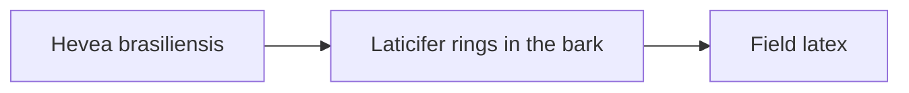
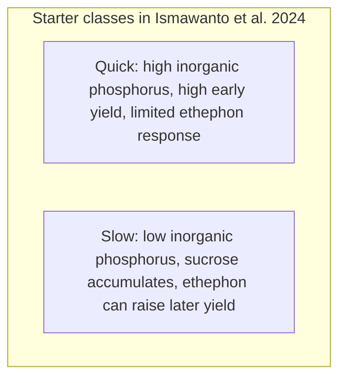
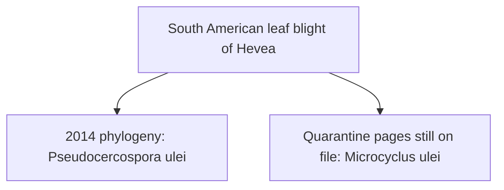

# The Hevea Rubber Tree

> **Safety.** Rubber seeds are poisonous until they are processed to remove cyanic poisons. This page is tree literacy for liquid latex. It is not a food guide, a planting manual, or medical advice.

## Executive summary

Natural-rubber liquid for liquid latex comes from the rubber tree, *Hevea brasiliensis*. Planted trees are almost always bud-grafted clones. South American leaf blight halted commercial plantations in tropical America, and Asia–Pacific quarantine regulations still classify that fungus as an exclusion pest.

## Questions this article answers

- [What tree produces natural-rubber latex?](#tree)
- [What does a clone name tell you?](#clone)
- [Which leaf disease sits on the planting map?](#disease)
- [How do you check a tree fact?](#check)

## What tree produces natural-rubber latex? {#tree}

### How

Check product documentation for natural rubber derived from *Hevea brasiliensis*. When working with liquid latex, you dip, cast, or spread an aqueous compound made from this raw material. The milky sap is collected from the inner bark of the tree as field latex, which processing facilities then concentrate for commercial manufacturing.

### Why

World Flora Online lists *Hevea brasiliensis* (Willd. ex A.Juss.) Müll.Arg. as an accepted species in the family Euphorbiaceae, based on World Checklist of Selected Plant Families records from June 2024. The species is classified as Least Concern on the IUCN Red List. Botanical records characterize it as a monoecious tree with milky sap and three leaflets, bearing separate male and female flowers on the same plant.

Growth habit varies across environments. The 2009 Agroforestree profile notes that plantation specimens rarely exceed 25 m, whereas wild specimens have reached over 40 m. Regional floras cited in World Flora Online record typical mature heights between 20 and 30 m.

Latex is produced within specialized tissue. Chao and colleagues (2023) show that the sap is the cytoplasm of laticifer cells, which form concentric rings from the vascular cambium. Tapping cuts open these rings. The laticifer fluid contains roughly 30 to 40 percent natural rubber. *Hevea brasiliensis* is indigenous to the Amazon basin and supplies over 98 percent of global natural rubber.

Geographic records show minor reporting differences. World Flora Online lists northern and western South America as the native range, including French Guiana. The Agroforestree profile lists Bolivia, Brazil, Colombia, Peru, and Venezuela, but omits French Guiana. Both authorities document broad cultivation across the humid tropics.

Detail: Flowers, fruit, and one conflicting word

Flora de Nicaragua and the Manual de Plantas de Costa Rica, as cited in World Flora Online, classify the plant as monoecious. The botanical summary in the Agroforestree profile calls the flowers dioecious, yet the biological description in that same profile states that male and female flowers appear on the same inflorescence in a 1:60 to 1:80 ratio. Pollination is carried out by insects, including honeybees and midges.

Capsules mature over 6 to 7 months and dehisce explosively. The Agroforestree profile notes that seeds can be thrown up to 33 m during dehiscence. Morphological entries from Brazilian Flora 2020 on World Flora Online confirm this explosive dehiscence. The floral descriptions and biology entries agree that individual trees carry both sexes, contradicting the solitary "dioecious" label in the profile overview.

Detail: Climate limits in the 2009 profile

The Agroforestree profile restricts optimal cultivation to humid lowland tropics between 15° N and 10° S. Planting above 400 to 500 m is discouraged, as trees at higher elevations show reduced stature, lower latex yields, and poorer timber production.

The biophysical specifications in that profile state:
- Elevation: 300 to 500 m
- Mean annual temperature: 23 to 35°C
- Mean annual rainfall: 1500 to 3000 mm (with 4000 mm noted as the absolute maximum)

The tree tolerates soil pH values between 4.0 and 8.0, though it thrives best in acidic soils and reacts poorly to lime. It can endure dry spells lasting 2 to 3 months. High winds can snap trunks, prompting the selection of wind-resistant clones in exposed zones.

Detail: Rubber in the bark, and other rubber plants

Chao and colleagues identify natural rubber chemically as cis-1,4-polyisoprene, comprising 30 to 40 percent of laticifer cell cytoplasm. The number of laticifer rings is a primary determinant of yield and correlates positively with sap production.

Roughly 2000 plant species synthesize polyisoprene. Alternative sources include guayule (*Parthenium argentatum*), Russian dandelion (*Taraxacum kok-saghyz*), and gutta-percha trees (*Eucommia ulmoides*).

Cultivar diversity remains close to wild baselines. Chao and colleagues found nucleotide diversity in cultivars (5.61 × 10⁻³) nearly matched wild germplasm (5.70 × 10⁻³ to 7.13 × 10⁻³). They attribute this narrow gap to widespread clonal propagation through bud grafting rather than repeated seed cycles. The CATAS8-79 clone reference genome is assembled at 1.58 Gb.

## What does a clone name tell you? {#clone}

### How

Read a clone name as an identification code for an individual bud-grafted genetic line. When evaluating source material, check both the clone identifier and its starter class. Clones are categorized as quick starters, medium starters, or slow starters, which defines their yield timing over years of tapping.

### Why

Clonal lines trace back to early collections. Chao and colleagues note that seeds gathered by Henry Wickham at Boim, Brazil, in 1876 founded the modern plantation stock via the Royal Botanic Gardens, Kew. Because a sexual breeding generation requires 20 to 25 years, growers maintain elite parent characteristics by grafting dormant buds onto seedling rootstocks.

Breeding dramatically raised output. Chao and colleagues record that selections yielded around 650 kg per hectare in the 1920s, while elite modern cultivars produced up to 2500 kg per hectare by the 1990s. This reflects historical breeding potential rather than a standard global average.

Ismawanto and colleagues (2024) group clones using latex diagnosis. Quick starters yield heavily during initial tapping seasons but display limited long-term gains. Slow starters produce modest initial volumes, retain more sucrose in their latex vessels, and sustain higher yields over decades when stimulated. In their trial, PB 260 represented the quick-starter line, while SP 217 served as a medium starter.

Detail: Clone families and breeding eras

Ismawanto and colleagues define quick-starter clones by distinct biochemical markers: high inorganic phosphorus, elevated metabolic activity, early output peaks, heavy sucrose consumption, lower lifetime yield ceilings, and poor responsiveness to ethephon stimulation. Conversely, slow starters show low inorganic phosphorus, slow initial output, high sucrose reserves, and significant yield jumps when treated with ethephon.

Cros and colleagues (2019), reported by CIRAD, assessed within-family genomic selection using a PB 260 × RRIM 600 cross in Côte d’Ivoire. Across-site prediction accuracy reached 0.53 using all available markers, rising to 0.56 when limited to the 125 to 200 markers with highest heterozygosity. A breeding simulation with 3000 progeny raised expected selection gains by 10.3 percent. Chao and colleagues observe that lengthy juvenile phases have allowed fewer than four cycles of controlled sexual recombination since Wickham's original collection.

## Which leaf disease sits on the planting map? {#disease}

### How

Monitor phytosanitary origin records for South American leaf blight under both *Pseudocercospora ulei* and *Microcyclus ulei*. When checking agricultural compliance or quarantine status, note that Southeast Asian growing regions maintain strict exclusion rules. Refer to local declarations for disease status; Singapore, for example, officially records the pathogen as absent.

### Why

Hora Júnior and colleagues (2014) report that South American leaf blight remains the main biological barrier to commercial cultivation in the Americas. This disease pressure pushed commercial latex production almost entirely into Southeast Asia. Their multi-gene phylogenetic analysis transferred the fungus from *Microcyclus ulei* to *Pseudocercospora ulei*.

Quarantine frameworks still use the older basionym. The Asia and Pacific Plant Protection Commission (APPPC) standard (RSPM No. 7 annex) lists *Microcyclus ulei* as an exceptionally damaging pathogen capable of devastating Asian rubber plantations. Appendix 2 of that document identifies 21 endemic countries across Central America, South America, and the Caribbean.

National phytosanitary databases reflect local surveillance. Singapore’s official International Plant Protection Convention (IPPC) filing (SGP-01/4, updated January 2021) retains *Microcyclus ulei*. Under ISPM 8 guidelines, it categorizes the blight as "Absent: pest not recorded" and confirms this with targeted surveys. This finding applies strictly within Singapore's borders.

Detail: South American leaf blight and geographic risk

Hora Júnior and colleagues studied fungal lesions across Brazilian plantations, matched spore stages phylogenetically, and placed the teleomorph in Mycosphaerellaceae. They determined that the pycnidial stage serves a spermatial function rather than spreading new infections. The collapse of the Fordlândia project in Brazil during the 1930s remains the classic historical example of plantation failure caused by this pathogen under monoculture conditions.

The APPPC annex establishes import controls, diagnostic steps, and inspection protocols for host plant materials. Its purpose is preventing fungal entry into disease-free territories rather than outlining field treatment programs.

Surveys in Singapore began in the 1990s. Between 2005 and 2010, laboratory screening of 1,208 leaf samples from remaining local stands detected zero instances of *Microcyclus ulei*, although common pathogens like *Colletotrichum gloeosporioides* appeared. From 2017 to 2020, inspection shifted to imported cargo and transit goods, yielding no positive detections. Direct leaf sampling of naturalized stands was discontinued because few mature trees remained.

## How do you check a tree fact? {#check}

### How

Consult World Flora Online under *Hevea brasiliensis* to confirm species names and family assignments. To check clone characteristics, review agronomic trials that report clone designations alongside measured output. When verifying fungal disease records, search under both *Pseudocercospora ulei* and *Microcyclus ulei*, retaining the terminology used in each specific document.

### Why

Botanical and agricultural records frequently contain minor discrepancies. Published sources report conflicting mature heights, alternate between monoecious and dioecious descriptions, and record slight differences in native ranges. Pathogen taxonomies also change over time; scientific journals use *Pseudocercospora ulei*, but trade and quarantine standards regulate under *Microcyclus ulei*. Citing exact names and values from specific sources preserves factual traceability without conflating conflicting standards.

## Sources

- World Flora Online. *Hevea brasiliensis* (Willd. ex A.Juss.) Müll.Arg. Taxon wfo-0000982080. Accepted name from WCSP data supplied 2024-06-04. https://www.worldfloraonline.org/taxon/wfo-0000982080 (accessed 2026-09-22).
- Orwa C, Mutua A, Kindt R, Jamnadass R, Anthony S. 2009. Agroforestree Database: a tree reference and selection guide, version 4.0. *Hevea brasiliensis*. World Agroforestry. https://apps.worldagroforestry.org/treedb/AFTPDFS/Hevea_brasiliensis.PDF
- Chao J, Wu S, Shi M, et al. 2023. Genomic insight into domestication of rubber tree. *Nature Communications*. https://doi.org/10.1038/s41467-023-40304-y
- Ismawanto S, Aji M, López D, et al. 2024. Genetic analysis of agronomic and physiological traits associated with latex yield revealed complex genetic bases in *Hevea brasiliensis*. *Heliyon*. https://doi.org/10.1016/j.heliyon.2024.e33421
- Cros D, Mbo-Nkoulou L, Bell JM, et al. 2019. Within-family genomic selection in rubber tree (*Hevea brasiliensis*) increases genetic gain for rubber production. *Industrial Crops and Products* 138. Claims here follow the CIRAD notice: https://publications.cirad.fr/une_notice.php?dk=592947 · https://doi.org/10.1016/j.indcrop.2019.111464
- Hora Júnior BT, de Macedo DM, Barreto RW, Evans HC, et al. 2014. Erasing the Past: A New Identity for the Damoclean Pathogen Causing South American Leaf Blight of Rubber. *PLOS ONE* 9(8): e104750. https://doi.org/10.1371/journal.pone.0104750
- International Plant Protection Convention. Pest Free Status — South American Leaf Blight in Singapore. Official pest report SGP-01/4. Publication 2 September 2012; last updated 5 January 2021. https://www.ippc.int/en/countries/singapore/pestreports/2012/09/south-american-leaf-blight-in-singapore/
- Asia and Pacific Plant Protection Commission. RSPM No. 7, Annex IV: Guidelines for protection against South American leaf blight of rubber. http://assets.apppc.fao.org.s3-eu-west-1.amazonaws.com/public/1258605952394_26th_APPPC___Annex_IV_RSPM_No7_0.pdf