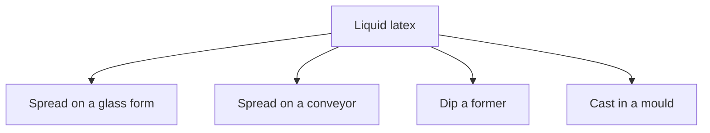

# Home-Cast Latex Film

> **Safety.** Liquid latex gives off ammonia vapor. Coagulant salts are chemical irritants. Keep copper, brass, and galvanized metals away from any equipment that holds liquid latex. Work in a well-ventilated space. See [Liquid ventilation and ammonia](/literature-reviews/liquid-ventilation-ammonia).

## Executive summary

Liquid latex can be converted into solid rubber film by spreading, dipping, or casting. You can spread it across a glass plate, run it on a moving conveyor belt, dip a former into a tank, or cast it inside a hollow mould. The chosen deposition method determines the finished thickness and surface finish.

Read this guide when producing raw film from liquid latex before cutting, gluing, or assembly. For introductory film formation principles, see [Forming film from liquid latex](/literature-reviews/liquid-film-pathway). For equipment geometry comparisons, see [Former dip, mould cast, and flat spread](/literature-reviews/liquid-former-dip-vs-mould-cast-vs-flat-spread).

## Questions this article answers

- [Which process makes the film?](#branch)
- [How does a glass-form spread work?](#glass)
- [How do Anode and Teague dips differ?](#anode)
- [How does a conveyor build sheet from latex?](#conveyor)
- [When does a dipped wall use coagulant?](#coagulant)
- [How does casting in a mould work?](#cast)

## Which process makes the film? {#branch}

### How

Select your tool and motion path before calculating target thickness:
- **Spread on a glass form:** Make a flat test film using a leveled glass plate and a clearance knife.
- **Spread on a conveyor:** Meter liquid onto a continuous moving belt for long yardage.
- **Dip a former:** Lower a three-dimensional tool into a tank and withdraw it vertically for seamless items.
- **Cast in a mould:** Fill a cavity to replicate detailed exterior contours on hollow shapes.

### Why

Every liquid latex process deposits a wet layer of rubber particles and evaporates the carrier water. The tool geometry determines which physical mechanism sets the film thickness. Spreading uses mechanical clearance, dipping balances bath dwell against chemical destabilization, and casting depends on mould porosity or heat transfer.

## How does a glass-form spread work? {#glass}

### How

Spread compounded liquid latex onto a clean glass plate to produce a flat test sample:
1. Wind a stainless-steel wire around both ends of a stainless-steel knife or drawbar to create a fixed clearance gap.
2. Pour a puddle of liquid latex at one edge of the glass bed.
3. Draw the knife across the plate in a single smooth stroke to meter the wet film.
4. Allow the film to dry thoroughly.
5. Dust the exposed dry rubber surface with pure talc, then gently peel the sheet from the glass.

### Why

The wound wire establishes the physical gap between the spreader blade and the glass base. A wire measuring 0.040 inches (about 1.0 mm) in diameter leaves a wet deposit that dries down to a gauge of 0.015 to 0.020 inches (0.4 to 0.5 mm) when working with compounds containing 40% to 60% total solids.

Detail: Laboratory drying schedules versus factory dipping

The Vanderbilt Latex Handbook specifies drying this glass-form comparison film for 16 to 25 hours at 23 ± 2 °C and 50 ± 5% relative humidity. Dipped-glove plants run at a similar but distinct target of 20 to 26 °C and 45% to 50% relative humidity. Maintaining 50% relative humidity keeps the surface skin from crusting over before water leaves the bulk film.

## How do Anode and Teague dips differ? {#anode}

### How

Mount a clean former made of glazed porcelain, glass, or aluminum. Select an immersion sequence based on your process setup:
- **Anode process:** Immerse the former in a coagulant salt bath, allow it to air briefly, then immerse it in the liquid latex tank.
- **Teague process:** Immerse the former directly into the liquid latex first, withdraw it, and then apply the coagulant bath.

Hold the former in the latex tank until the deposit reaches your target gauge. Repeat the cycle if you require extra wall thickness. If the compound formulation requires leaching prior to vulcanization, suspend the gelled part in an agitated water bath for 20 to 30 minutes at 40 to 50 °C.

### Why

The difference lies in the direction of chemical migration. In the Anode method, coagulant salts diffuse outward from the surface of the former, turning the liquid latex into a coherent gel layer from the inside out. In both methods, dwell time inside the liquid latex tank governs final film gauge. Leaching dissolves residual coagulant salts and water-soluble serum components before vulcanization, preventing surface bloom and maintaining film integrity.

Detail: Coagulant bath chemistry and diffusion mechanics

The Vanderbilt Latex Handbook provides a standard Anode coagulant formulation for natural rubber latex: a 20% by weight solution of calcium nitrate dissolved in industrial alcohol or methylated spirits. A tiny surfactant fraction cuts surface tension to ensure even coverage across the former. Divalent calcium ions ($Ca^{2+}$) neutralize the negative surface charges that keep natural rubber particles suspended, causing immediate gelation at the former surface. The growth rate follows diffusion kinetics, declining over time as the gelling wall thickens.

## How does a conveyor build sheet from latex? {#conveyor}

### How

To manufacture continuous sheet goods from liquid latex, meter the compounded liquid onto a continuous moving belt using a doctor blade or metering roller. Pass the wet layer through an in-line drying tunnel. For heavier gauges, apply repeated coats over the dried rubber on the same belt before peeling and rolling the finished sheet.

### Why

Industrial sheet lines spread multiple thin layers rather than one heavy wet coat. A thin wet layer dries rapidly without boiling or trapping steam bubbles. By drying each pass before depositing the next, surface defects and pinholes are confined to a single ply instead of creating a hole through the complete sheet.

Detail: Conveyor production patents

US Patent 2,415,028 (Firestone, 1947) details spreading prepared liquid latex onto an endless belt, followed by sequential gelling, vulcanization, and drying zones. Multiple spreader heads apply successive coats to build laminated multi-ply sheet. US Patent 2,129,607 (Mishawaka Rubber and Woolen, 1938) describes depositing multiple thin latex layers on a belt, drying each pass before adding the next. Staging the thermal profile dries the rubber evenly from the substrate outward, avoiding trapped bubbles.

## When does a dipped wall use coagulant? {#coagulant}

### How

Add a coagulant step whenever you need a dry film gauge exceeding 8 mils (about 0.2 mm).
- **Set the wet gauge** using three main parameters: compound total solids percentage, coagulant bath concentration, and former dwell time.
- **Prevent vertical running** by keeping compound viscosity and former withdrawal speed constant.
- **Eliminate pinholes** by keeping entrained air bubbles out of the latex bath. Avoid splashing or high-speed stirring.
- **Rinse residues** by leaching the gelled deposit in warm circulating water.

Keep your dipping room between 20 and 26 °C at 45% to 50% relative humidity. Keep copper, brass, and galvanized hardware off all processing gear.

### Why

Straight dipping without coagulant relies strictly on evaporation, which requires dozens of slow dips to build practical garment thickness. Coagulant dipping causes rapid chemical gelation, dramatically accelerating wall build. 

Entrained air pockets trapped in liquid latex become pinholes as the film sets, which causes immediate failure in dipped goods. Ambient humidity must remain balanced: excessive humidity prevents water from clearing the gel and delays vulcanization, whereas dry air causes premature surface skinning. A prematurely skinned surface resists bonding with subsequent dip coats. Copper and brass contact introduces metal ions that catalyze rapid oxidative degradation in natural rubber.

Detail: Wet gauge levers and glove room climate standards

The Vanderbilt Latex Handbook identifies total solids, coagulant concentration, and dwell time as the primary levers governing wet deposit mass. Viscosity and withdrawal rate act as stabilization controls: excessive withdrawal speed drags excess liquid upward, causing wedge-shaped gauge tapers. The specified environment (20 to 26 °C, 45% to 50% relative humidity) comes from industrial dipping standards for supported and unsupported natural rubber gloves. These environmental targets ensure that moisture leaves the gelled film at an even, controlled rate without surface case hardening.

## How does casting in a mould work? {#cast}

### How

Cast liquid latex when producing a hollow article whose outer surface must mirror the internal detail of a mould cavity:
1. Assemble the dry mould.
2. Fill the inner cavity completely with compounded liquid latex.
3. Allow the liquid to rest until a rubber wall of the required gauge gels against the mould surface.
4. Tip the mould and pour out the remaining ungelled latex. This fill-and-pour approach is slush moulding.
5. Dry and vulcanize the hollow casting inside the mould or after stripping it out.

Use porous plaster moulds for unheated coagulant casting. Use light-alloy metal moulds (aluminum or magnesium) when working with heat-sensitized compounds.

### Why

Casting forms hollow goods from the exterior surface inward. Liquid latex gels against the mould perimeter, creating a skin that grows thicker over time. Solid rubber castings are rarely made because thick masses trap internal moisture, requiring weeks to dry and often cracking from internal shrinkage.

Dry plaster moulds draw water out of the liquid latex by capillary action while releasing natural calcium ions into the compound. Both actions destabilize the latex particles and gel a deposit against the cavity face. Because plaster moulds abrade quickly at corners and parting lines, they are best suited for prototype work or small runs. Non-porous metal moulds do not wear out, but they require elevated temperatures to gel heat-sensitized latex compounds.

Detail: Slush moulding kinetics, rotational casting, and filler loading

Blackley (*Polymer Latices*, Volume 3) notes that slush moulding yields less uniform wall thickness than rotational casting. In rotational casting, a measured volume of latex is charged into a closed mould, which rotates biaxially within an oven so heat-sensitization gels an even shell over all surfaces.

For plaster mould casting, filler content directly alters the rate of deposition. Holding casein stabilizer at 0.5 phr (parts per hundred rubber), deposit thickness at a fixed dwell time increased from 1.05 mm without whiting filler up to 2.4 mm at 300 phr whiting. In compounds with lower casein at baseline, deposit thickness measured 1.3 mm without whiting and converged to 2.4 mm at 300 phr whiting. Adding whiting simultaneously raises compound total solids, accelerating mechanical drainage and ionic gel formation.

## Sources

- *The Vanderbilt Latex Handbook*. 3rd ed. Edited by Robert Francis Mausser. Norwalk, CT: R.T. Vanderbilt Company, 1987. https://lccn.loc.gov/92117844
- *Polymer Latices: Science and Technology — Volume 3: Applications of Latices*. 2nd ed. D. C. Blackley. London: Chapman & Hall, 1997. https://books.google.com/books?id=Y2VPGj7YbykC
- US Patent 2,415,028. Firestone Tire & Rubber Company. Method of making sheet material (1947). https://www.freepatentsonline.com/2415028.html
- US Patent 2,129,607. Mishawaka Rubber and Woolen Manufacturing Company. Method of making rubber articles (1938). https://www.freepatentsonline.com/2129607.html