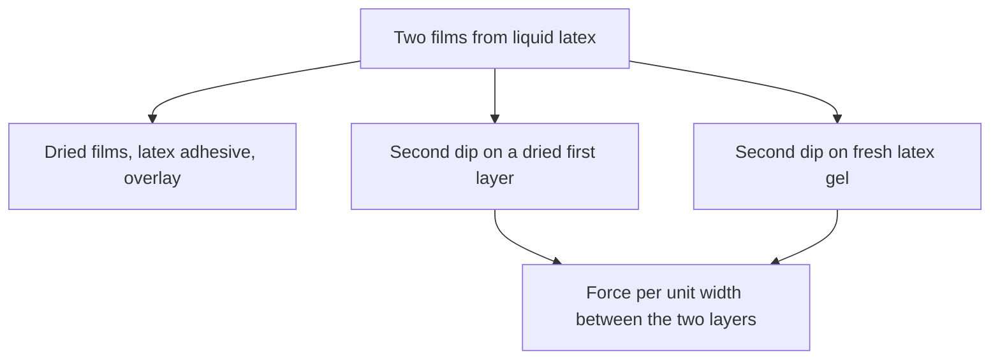

# Liquid Latex–Latex Adhesion Testing

> **Safety.** Ammonia-preserved natural rubber latex has a powerful odour. Read the product SDS. See [Liquid ventilation and ammonia](/literature-reviews/liquid-ventilation-ammonia).

## Executive summary

When you measure peel adhesion between two films made from liquid latex, record the coupon structure alongside the numerical result. A liquid latex coupon comes from a dip, a cast, or a spread film. In *Polymer Latices* Volume 3, the peel value reported for successive natural rubber dip layers represents the force per unit width required to pull the layers apart. Drying time, leaching history, soap content, and prevulcanization state determine that bond strength. Specimen dimensions, pulling speed, and peel angles appear in [Peel test methods](/literature-reviews/adhesion-peel-test-methods). Bonds made with solvent rubber cement on bought sheet are covered in [Sheet latex–latex adhesion testing](/literature-reviews/sheet-latex-latex-adhesion-testing).

## Questions this article answers

- [Which coupon am I peeling?](#coupon)
- [What has to travel with a multi-dip peel?](#conditions)
- [Which sentence owns this number?](#sentence)

## Which coupon am I peeling? {#coupon}

### How

Identify your coupon structure before citing or comparing peel test results. Liquid latex peel coupons fall into three categories:

1. Two dried films joined by applying a latex adhesive and pressing them together in an overlay.
2. A second dip applied over a first dip that has dried.
3. A second dip applied directly onto fresh, wet latex gel.

The peel data in the dipping chapter of *Polymer Latices* covers the second and third categories. Straight dips and coagulant dips were tested, using both unvulcanized latex and sulphur-prevulcanized latex. 

Mixing formulas for latex adhesives, such as shoe and foxing compounds, belong to the adhesive joint category. For guidance on selecting adhesive compounds, see [Liquid adhesives](/literature-reviews/liquid-adhesives-and-seam-integrity).

### Why

Each successive dip deposits an independent layer. The bond between layers weakens once the first layer dries, and leaching that dried layer reduces adhesion further. The risk of separation increases when two different latex compounds are paired, but delamination can still happen when both dips use the same compound. Fresh latex gel remains strongly hydrophilic, which promotes inter-particle fusion between the layers during dipping.

Detail: Force per unit width and layer mechanics

The delamination subsection in *Polymer Latices* assesses the bond between two layers by measuring the force per unit width needed to peel them apart. Test parameters such as angle, crosshead speed, and specimen width are detailed in [Peel test methods](/literature-reviews/adhesion-peel-test-methods).

Mud-cracking describes a single wet layer splitting during drying because its wet-gel strength is too low. In the formulation section, notes show that highly prevulcanized deposits show lower tensile strength, ultimate elongation, and tear strength. Those properties belong to deposit cohesion, not interface adhesion. The two-layer peel value belongs strictly to the interface.

Laboratory sulphur-prevulcanized latex produced lower peel strength than unvulcanized latex that was vulcanized after film formation. Industrially prepared sulphur-prevulcanized latices showed higher peel strength than laboratory prevulcanizates, but bond strength declined as the degree of liquid-state vulcanization increased.

A continuous film formed during the second dip does not prove that the initial layer was wetted. High compound viscosity can disguise poor surface wetting.

## What has to travel with a multi-dip peel? {#conditions}

### How

When testing or reporting peel values for a two-layer dip coupon, record four processing variables:

- Drying time of the first layer. Interfacial bond strength drops rapidly after even a brief drying interval.
- Leaching exposure. Water leaching of the dried deposit further degrades adhesion to the next dip.
- Soap content. Carboxylate soaps, including potassium caprylate, cause an immediate drop in bond strength.
- Vulcanization state. Note whether the latex was unvulcanized or sulphur-prevulcanized, and whether prevulcanization occurred at laboratory or industrial scale.

For dipped glove lines, maintain room conditions between 20°C and 26°C with 45% to 50% relative humidity. Dry air dries the surface of the first dip before the second compound is deposited, leading to poor lamination. Polychloroprene films require longer dwell times in ambient air than natural rubber films, making humidity control critical.

For adhesive joints, state whether the seam was formed by wet combine or dry combine. Dry combine means the applied latex adhesive dried to a tacky film on both faces before overlay. Wet combine means the coated faces were joined while the adhesive film was still wet.

### Why

Peel values are meaningful only when compared across samples with identical processing histories. Pausing to dry, water leaching, or adding stabilizing soaps changes the chemical boundary between deposits. The ambient temperature and humidity specifications for dipped gloves address surface drying on the initial layer, which answers a different manufacturing question than the mechanical force measurements recorded during testing.

Detail: Tackifiers and polymer structure in combining

Tackifying resins are more critical for dry combine joints than for wet combine joints. The 180° peel data printed alongside the combining discussion in *Polymer Latices* evaluates two layers of cotton duck bonded with polychloroprene latex adhesive. 

The formulas for wet combining and dry combining in *The Vanderbilt Latex Handbook* describe fabric-to-fabric lamination. Those formulations belong to [Liquid adhesives](/literature-reviews/liquid-adhesives-and-seam-integrity) and textile bonding applications.

In polychloroprene adhesive films, sol polymers generally deliver higher tear strength and higher peel resistance than gel polymers. The sol fraction undergoes greater elongation before tensile failure occurs at the bond line.

## Which sentence owns this number? {#sentence}

### How

Match your measured peel value directly to the corresponding source claim:

| If you measured | The governing claim is |
| --- | --- |
| Two natural rubber dip layers | *Polymer Latices* Volume 3: delamination of multi-dip products measured as force per unit width |
| Glove processing temperature and humidity | *The Vanderbilt Latex Handbook*: target of 20–26°C and 45–50% relative humidity to prevent surface drying and lamination failure |
| Wet combine or dry combine adhesive joins | *Polymer Latices* Volume 3: bond formation determined by film moisture when coated faces meet |

For mechanics of peeling, jaw speeds, and test geometries, consult [Peel test methods](/literature-reviews/adhesion-peel-test-methods).

For physical reinforcement, see [Liquid reinforcement](/literature-reviews/liquid-reinforcement-laminate-zones). To identify failure patterns in separated layers, see [Liquid delamination](/literature-reviews/liquid-delamination-seam-failure). For liquid latex bonded to fabric or rigid materials, see [Liquid latex–substrate adhesion testing](/literature-reviews/liquid-latex-substrate-adhesion-testing). For solvent-cemented joints on cured sheet, consult [Sheet latex–latex adhesion testing](/literature-reviews/sheet-latex-latex-adhesion-testing).

### Why

A peel measurement reflects the exact interface being tested. Data for rubber-to-fabric joints or tyre-cord adhesion cannot predict the behavior of dipped latex laminates. Keep multi-dip film data, adhesive combining data, and dipped glove plant specifications linked to their original test setups.

Detail: Historical discrepancies in textile-rubber peel data

The 1997 edition of *Polymer Latices*, in its discussion of high-tenacity rayon, describes mechanical abrasion followed by treatment with a latex-casein abrasive. The 1966 edition of *High Polymer Latices*, referencing the same experimental observation by Gardner, Herbert, and Wake, describes a latex-casein adhesive. Both citations refer to rubber-to-rayon cord adhesion rather than dip-film lamination.

The 1966 text also includes a single peel curve for duck-to-duck assemblies bonded with asphalt-modified polychloroprene. The 1997 edition presents a 180° peel test across two duck layers using three tackifier systems, generating three distinct curves. Values from 1966 belong to that historical asphalt system, while 1997 values belong to tackified polychloroprene formulations. Multi-dip natural rubber peel values remain restricted to the dipping process chapters.

## Sources

- Mausser, Robert Francis, ed. *The Vanderbilt Latex Handbook*. 3rd ed. Norwalk, CT: R.T. Vanderbilt Company, 1987. https://lccn.loc.gov/92117844
- Blackley, D. C. *Polymer Latices: Science and Technology — Volume 3: Applications of Latices*. 2nd ed. London: Chapman & Hall, 1997. https://books.google.com/books?id=Y2VPGj7YbykC
- Blackley, D. C. *High Polymer Latices: Their Science and Technology*. 2 vols. London: Maclaren; New York: Palmerton, 1966. https://lccn.loc.gov/66077950