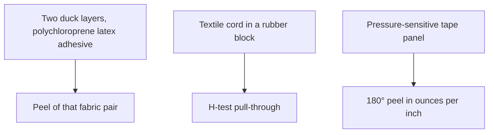
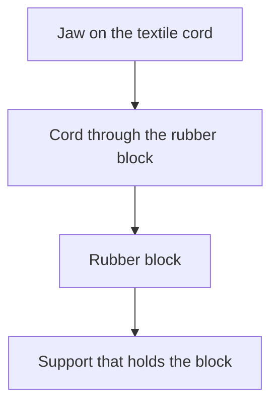
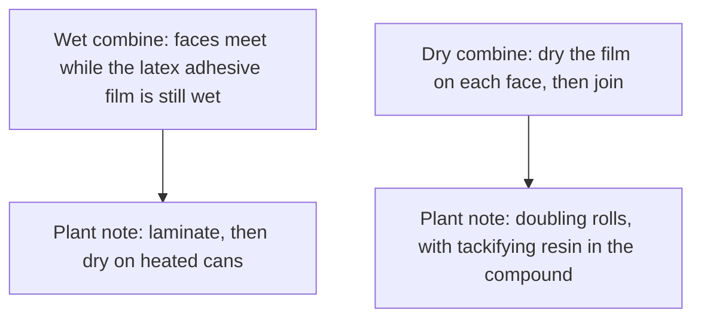

# Liquid Latex–Substrate Adhesion Testing

## Executive summary

For liquid latex, an adhesion number belongs to the liquid-latex film or latex adhesive and the specific substrate used in that test. Write both materials next to the recorded value. Copy the exact units from the original source.

Published cotton duck results in standard handbooks describe two layers of duck fabric bonded with a polychloroprene latex adhesive. One reference reports peel in newtons per centimetre. An older reference reports duck-to-duck peel in pounds per inch. Keep each value in its original unit.

A cord test result in these same handbooks measures the pull-through force needed to strip a cord out of a solid rubber block. A 180° peel value in the Vanderbilt adhesives chapter comes from a pressure-sensitive tape panel, measured in ounces per inch.

Use this guide when evaluating published adhesion numbers for textiles, leather, metals, cords, or paper coupons. Specimen geometry, pull speed, peel angles, and failure modes belong to the dedicated peel methods article.

## Questions this article answers

- [What is this number attached to?](#what-number)
- [Wet combine or dry combine?](#combine)
- [When is the number only a sort?](#sorting)
- [Which question belongs on another page?](#where-next)

## What is this number attached to? {#what-number}

### How

Name both substrates and the bonding material on your test record. Copy the unit printed in the original report. Never convert or transfer numbers between different test setups.

Record the test type alongside the number:
- For fabric-to-fabric tests, record the textile weave and the adhesive dry recipe.
- For cord pull tests, record the force as an H-test pull-through value.
- For tape tests, record the substrate panel and the unit, such as ounces per inch.

### Why

An adhesion value reflects the mechanical behavior of one complete test assembly, not an isolated property of the rubber. Duck tests measure two plies of heavy cotton fabric separated by a latex adhesive. Cord tests measure the force required to pull an embedded cord out of a solid rubber block. Tape tests measure a pressure-sensitive film pulled from a test face. 

Quoting a fabric peel value to predict how a dipped film sticks to leather or metal will give misleading results. Because test geometries and compounding recipes vary across reports, preserve each number in its original printed unit.

Detail: Two duck prints, two units

Both handbooks attribute their duck fabric adhesion data to Ward and Doherty (1954). *Polymer Latices* Volume 3 cites that report as *Neoprene Latex Adhesives*, Report No. 54-3. Even so, the two references publish different figures and units.

The 1997 Blackley caption specifies a 180° peel. The dry recipe listed in that caption contains:
- Polychloroprene: 100 parts by weight
- Zinc oxide: 5 parts
- Antioxidant: 2 parts
- Sodium alkyl sulphate: 1 part
- Tackifier: variable loading

Curve A uses asphalt. Curve B uses a rosin ester melting at 56°C. Curve C uses a rosin ester melting at 83°C. The table accompanying the figure lists an adhesion value of 31 N cm⁻¹ for each curve at zero tackifier. The axis is scaled in newtons per centimetre. The diagram also includes a T-peel inset.

The 1966 Blackley table evaluates asphalt alone. The axis is scaled in pounds per inch, and the zero-asphalt baseline is 16 lb in.⁻¹. The recipe lists 1 part stabiliser rather than naming sodium alkyl sulphate. The text refers to peeling of a duck-to-duck combination without specifying 180°.

Keep the 1997 values in newtons per centimetre and the 1966 values in pounds per inch. The relationship between the 180° caption and the T-peel diagram in the 1997 edition is addressed in the test methods review.

Detail: Cord pull-through

The H-test moulds textile cords through a solid rubber block to measure the force required to extract each cord. A tensile test machine grips the cord while a specialized jig restrains the rubber block.

Wood noted that comparisons between cords remain valid only within the same test block. Variation between separate blocks was significantly larger than scatter within a single block.

*High Polymer Latices* uses the H-test to measure static adhesion for resorcinol-formaldehyde latex (RFL) formulations. Static pull-through strength rises rapidly as resin increases from 0 to 15 parts per hundred dry rubber (phr). Additional resin beyond 15 phr yields little gain.

Detail: Tape panels, leather recipes, rigid faces

The Vanderbilt handbook reports 180° peel values as part of a four-property pressure-sensitive tape battery:
1. 90° quick stick
2. 180° peel
3. Polyken tack
4. 178° shear

These properties are evaluated together after applying rolling pressure to the tape backing. The handbook evaluates natural-rubber latex against solvent cements modified with Piccolyte tackifiers.

For leather goods, *Polymer Latices* Volume 3 provides formulation recipes for shoe fabrication. The dry combining process uses a natural-rubber latex compound, followed by oven heating at approximately 100°C for 30 minutes to develop ultimate bond strength.

The same chapter lists metals, glass, and rigid plastics among surfaces that can be joined with aqueous latex formulations, though it notes that commercial adoption remained limited.

## Wet combine or dry combine? {#combine}

### How

Mark your sample coupon as either wet combine or dry combine based on your assembly method.

Follow the sequence that matches your assembly:
- For wet combining, apply the latex adhesive and join the surfaces immediately while the film is wet. Dry the bonded assembly with heat or air.
- For dry combining, apply the latex adhesive to each surface. Let the water evaporate completely until the film is dry to the touch, then press the surfaces together.

### Why

Wet and dry combining create bonds through different physical mechanisms. In wet combining, liquid latex penetrates porous fabric before water evaporates. In dry combining, two dry polymer films fuse together under contact pressure through autohesion. 

Tackifying resins produce substantial improvements in dry-combined bonds by maintaining contact tack after the film dries. In wet combining, tackifiers have far less effect on early bond strength because the mechanical interlock forms while the compound is wet.

Detail: Shrink as a described outcome

Blackley lists fabric shrinkage and paper wrinkling as principal drawbacks of water-based latex adhesives relative to solvent rubber cement. 

In industrial fabric spread coating, uneven shrinkage during drying causes lengthwise ridges known as ribbing. Handbooks recommend drying the coated fabric under continuous mechanical tension around a steam-heated drum to prevent this defect. Specific shrinkage percentages for light apparel textiles are not documented in these references.

## When is the number only a sort? {#sorting}

### How

Check whether the reported value came from a static test or a dynamic fatigue test. If the test applied a single static pull to an unaged joint, treat that value as an initial screening result.

When recording test data, capture these essential parameters:
- Pull speed of the machine jaws.
- Specimen strip width.
- Failure mode, distinguishing between adhesive failure at the surface and cohesive failure inside the rubber layer.

### Why

Static tests measure the peak force needed to separate a fresh bond under a steady pull. Dynamic tests repeatedly flex or vibrate the bond to simulate real service. 

Static testing allows development laboratories to eliminate ineffective adhesive formulations early in the screening process. However, high static peel strength does not ensure that a bond will survive repeated stretching, washing, or flexing in a finished garment.

Detail: Static cord adhesion and a dynamic belt

Blackley describes several dynamic fatigue tests for rubber-textile composites:
- Dunlop belt test
- Goodyear hose test
- Goodrich disc test
- Avon test piece run in a Goodrich Flexometer

The Dunlop test cycles an endless rubber-textile belt across industrial pulleys. Adhesion loss is measured indirectly by calculating the drop in cord tensile strength after mechanical cycling.

On high-tenacity rayon cord, mechanical surface abrasion increases static bond strength. Dynamic durability, however, shows minimal gain unless the abraded cord receives a secondary dip. The 1997 edition identifies this dip as a latex-casein abrasive, whereas the 1966 text labels it a latex-casein adhesive. Both terms reflect the dual functional role of the surface dip.

## Which question belongs on another page? {#where-next}

### How

Select the appropriate reference guide for test methods, fabric interactions, or sheet latex construction:

| Topic | Reference guide |
| --- | --- |
| Test angles, pull rates, sample widths, and failure definitions | `adhesion-peel-test-methods` |
| Liquid-latex film bonded to another liquid-latex film | `liquid-latex-latex-adhesion-testing` |
| Sheet latex bonded to textiles, metals, or rigid plastics with solvent rubber cement | `sheet-latex-substrate-adhesion-testing` |
| Sheet latex bonded to sheet latex | `sheet-latex-latex-adhesion-testing` |
| Fiber penetration, wetting, and textile adhesion mechanics | [Liquid latex–textile bonding](/literature-reviews/liquid-latex-textile-bonding) |
| Formulating, applying, airing, and overlaying liquid latex adhesives | [Liquid adhesives and seam integrity](/literature-reviews/liquid-adhesives-and-seam-integrity) |
| Diagnosing bond separation and seam failures | [Liquid delamination and seam failure](/literature-reviews/liquid-delamination-seam-failure) |
| Chemical staining, swelling, and metal discoloration risks | [Compatibility matrix](/literature-reviews/compatibility-matrix-metals-oils-plastics) |

### Why

A reported adhesion figure is meaningful only when paired with its specific materials, chemical pathway, and test method. Testing liquid latex involves emulsion drying, porous fiber soaking, and water loss. Crafting with sheet latex relies on solvent evaporation, surface swelling, and contact pressure with solvent rubber cement. Keeping these material pathways separate prevents improper transfer of industrial liquid test data to handmade sheet garments.

## Sources

- Blackley, D. C. *High Polymer Latices: Their Science and Technology.* 2 vols. London: Maclaren; New York: Palmerton, 1966. <https://lccn.loc.gov/66077950>
- Blackley, D. C. *Polymer Latices: Science and Technology — Volume 3: Applications of Latices.* 2nd ed. London: Chapman & Hall / Springer, 1997. <https://books.google.com/books?id=Y2VPGj7YbykC>
- Mausser, Robert Francis, ed. *The Vanderbilt Latex Handbook.* 3rd ed. Norwalk, CT: R.T. Vanderbilt Company, 1987. <https://lccn.loc.gov/92117844>
- Ward, R. W., and F. W. Doherty. *Neoprene Latex Adhesives.* Report No. 54-3. Wilmington, DE: E. I. du Pont de Nemours & Co., 1954. Cited in *Polymer Latices*, Vol. 3.