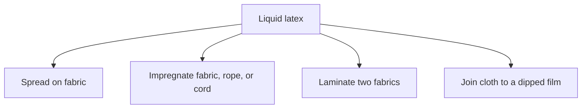
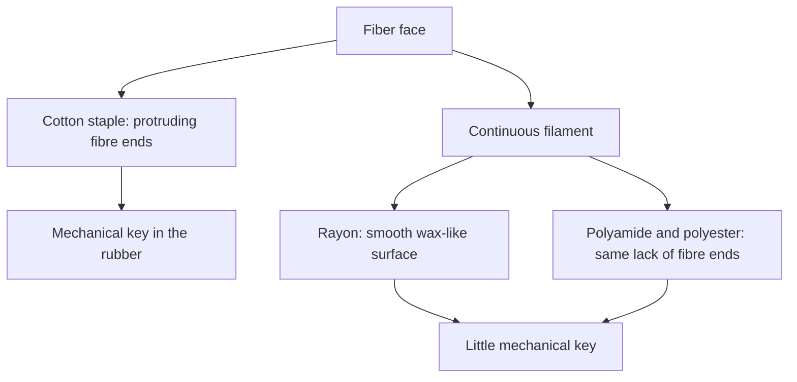
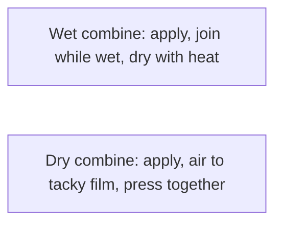
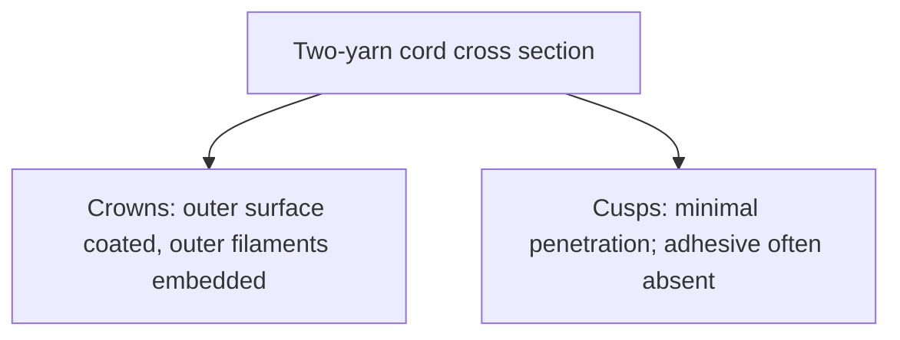

# Liquid Latex–Textile Bonding

> **Safety.** Water-based latex adhesives can freeze and shrink fabrics. OSHA lists exposure limits for ammonia as a chemical. Whether this bottle contains ammonia is on the product SDS. Solvent cements are a separate fire and fume class. See [Liquid adhesives](/literature-reviews/liquid-adhesives-and-seam-integrity) and [Liquid ventilation and ammonia](/literature-reviews/liquid-ventilation-ammonia). Skin chemistry: [Allergy and skin contact](/literature-reviews/allergy-and-skin-contact).

## Executive summary

Liquid latex can act as an adhesive, a coating, or an impregnant on cloth, or join a dipped rubber film directly to fabric. Bonding behavior depends on the textile structure. Cotton fibres provide protruding ends that create a strong mechanical grip. Smooth synthetic filaments like nylon and polyester offer almost no mechanical key and require matching chemical polarity or factory-applied chemical bridges.

Water-based latex adhesives also introduce process hazards: they shrink woven fabrics, freeze below 0°C, and dry more slowly than solvent cements. Industrial combining tables offer proven formulations, but factory dipping schedules cannot simply be duplicated on a craft bench without specialized heat equipment.

Use this review when a textile ply lifts from rubber, when cotton adheres but a synthetic fabric peels off clean, or before mixing a handbook combining recipe.

## Questions this article answers

- [What are you doing with the liquid?](#job)
- [Cotton or a smooth filament?](#fiber)
- [Wet combine or dry combine?](#combine)
- [How do you read a lift?](#peel)
- [What is the factory pretreat?](#pretreat)

## What are you doing with the liquid? {#job}

### How

Name your specific operation before selecting an adhesive or compound. Liquid latex performs four distinct textile operations: spreading a surface coating, impregnating yarns or cord, laminating two fabric plies together, or bonding fabric to a dipped film.

Next, evaluate the substrate. Check whether the face is cotton staple or a smooth synthetic filament, whether the weave is porous or dense, and whether the finished join must stretch during wear. Finally, select either wet combining or dry combining based on the heat tolerance of your fabric.

### Why

The Vanderbilt Latex Handbook (1987) outlines compounded latex formulations designed for wet and dry combining of fabric plies. *Practical Guide to Latex Technology* (2013) highlights the primary benefits of latex adhesives over solvent solutions: low cost, the absence of toxic or flammable solvent vapors, and spontaneous wetting on porous surfaces.

The same literature details the physical limitations of water systems. Aqueous latices tend to shrink natural fabrics and wrinkle paper. They coagulate irreversibly if frozen, and their dried films offer lower water resistance than vulcanized solvent cements.

The distinction between surface coating and structural impregnation dates to early industrial practice. Letter Circular LC 321 (1932) separated spreading latex on fabrics from deep impregnation of cords and ropes. It noted that vulcanized latex compounds are especially useful for textile composites where high curing temperatures or sulfur compounds would scorch the fabric or alter dye colors.

Detail: Already-wet surfaces

*High Polymer Latices* (1966) and *Polymer Latices* (1997) point out a unique processing advantage limited to porous, water-tolerant substrates such as paper and leather: aqueous latex adhesives can wet and bond adherends that are already damp. In contrast, solvent rubber cements require completely dry surfaces to prevent bond failure. The 1966 text also groups industrial rubber-to-textile bonding into two principal aqueous systems: latex-casein dispersions, and latex blended with resorcinol-formaldehyde resin condensates.

## Cotton or a smooth filament? {#fiber}

### How

Inspect the fibre structure of your fabric before applying liquid latex. If you are working with cotton, expect the protruding staple fibre ends to embed directly into the drying latex. Keep in mind that water in the compound will cause woven cotton to shrink.

If the fabric is rayon, nylon (polyamide), or polyester, expect a smooth continuous filament with little to no mechanical key. On these slick synthetics, you must match the chemical polarity of the latex compound to the textile surface, or select a factory-treated fabric. Natural rubber has low polarity and will not adhere firmly to untreated synthetic cloth.

Stop if the fabric contains an unidentified finish, water repellent, or synthetic blend. Test a scrap assembly before coating garment sections.

| Cue | Cotton | Nylon / polyamide |
| --- | --- | --- |
| Face | Staple fibre with protruding ends | Smooth continuous filament |
| Bond idea | Mechanical embed of fibre ends | Weak mechanical key; requires polarity match or chemical bridge |
| Latex adhesive | Enters open pores; risk of shrinkage | Enters weave voids; slick filaments resist mechanical lock |

### Why

*Polymer Latices*, volume 3 (1997), explains that cotton yarns feature thousands of individual staple fibre ends that project outward from the fabric face. When liquid rubber penetrates the yarn and vulcanizes, these embedded ends create a strong mechanical bond. Rayon, by comparison, is extruded as a continuous filament with a smooth, wax-like exterior. It lacks loose ends, offering almost no opportunity for mechanical grip. Blackley confirms that this lack of mechanical interlocking applies equally to synthetic polyamide and polyester yarns.

*High Polymer Latices* (1966) describes this exact failure mechanism. It identifies polyamide as nylon, and polyester under trade names such as Terylene and Dacron, noting that their smooth surfaces cannot establish physical bonds with standard rubber films. Both publications reach identical physical conclusions despite slight differences in fiber naming conventions.

When a substrate is highly porous, *Practical Guide to Latex Technology* indicates that polymer compatibility matters less because adhesion is dominated by mechanical entanglement. On non-porous or continuous synthetic surfaces, the polymer in the adhesive must match the polarity of the textile. In the Vanderbilt classification tables, natural rubber sits in the low-polarity tier, which prevents it from wetting and adhering to polar or slick synthetic filaments without chemical pretreatments.

Detail: Abrasion on high-tenacity rayon

Mechanical buffing or abrasion improves the static peel strength of vulcanized rubber to high-tenacity rayon cord. However, dynamic fatigue resistance remains poor unless the abraded cord is subsequently dipped in an adhesive bath. A sequence of mechanical abrasion followed by a latex-casein adhesive dip yields significantly higher peel strength than either method applied alone.

*High Polymer Latices* (1966) specifies an adhesive dip for this process. The 1997 reprint prints "abrasive" in that clause, which is a typographical error; this text follows the original 1966 wording. This technique was developed specifically for tire-cord manufacturing.

Detail: Charge, filler, and dipped glove linings

The Vanderbilt handbook notes two rheological rules for textile bonding: the latex compound must possess sufficiently low viscosity to penetrate fabric pores, and the colloidal charge of the latex particles must complement the substrate. If the substrate carries an identical electrical charge, colloidal particles are repelled, reducing contact. Adding inert mineral fillers raises compound viscosity, which chokes capillary flow into porous fabrics.

The Vanderbilt polarity scale categorizes common elastomers:
- High polarity: NBR, XNBR, XSBR, and PSBR.
- Medium polarity: CR.
- Low polarity: NR, SBR, BR, and IIR.

Fabric-lined gloves documented in Vanderbilt do not duplicate the elasticity of unsupported dipped latex. Their structural role is preventing tear propagation across the thin film. This represents supported dipping technology, not a design model for elastic garment seams.

Detail: Modulus bridging in cord bonding

Raumann (1968) demonstrated that a cured resorcinol-formaldehyde-latex (RFL) film functions as an intermediate modulus bridge positioned between a soft rubber coating and a stiff nylon filament core. The cured RFL film exhibits an ultimate tensile elongation of approximately 16%. This intermediate stiffness distributes shear stresses smoothly across the interface during cyclic strain, preventing catastrophic edge peeling.

## Wet combine or dry combine? {#combine}

### How

Select your combining procedure based on your workspace equipment and the heat sensitivity of your cloth.

For wet combining, apply a viscous liquid latex compound to one fabric face. Press the second fabric into the wet adhesive immediately using a weighted hand roller. Dry the combined laminate thoroughly under heat.

For dry combining, apply a latex compound containing tackifying resin to each fabric face. Allow both coatings to air until the water evaporates and the films turn tacky to the touch. Bring the coated faces together and press them firmly through doubling rolls or with a firm roller.

Industrial manufacturing lines adapt these fundamentals into several mechanized sequences:

### Why

The Vanderbilt Latex Handbook defines wet combining as applying a high-viscosity latex compound to one fabric substrate, joining the plies immediately through marriage rolls, and driving off water over heated drying cans. In dry combining, the compound is modified with emulsified tackifying resins. Each fabric ply is coated and dried separately to a non-blocking, pressure-sensitive state, then doubled together under high-pressure nip rolls without heat.

*High Polymer Latices* (1966) relies on this exact division: wet combining mates the substrates while the adhesive film is still liquid, whereas dry combining requires drying the film on each adherend prior to contact. *Polymer Latices* (1997) describes factory processing arrangements: knife-over-roll coating heads feeding heated marriage drums, dual spray nozzles misting both faces before calender consolidation, and staged passes where adhesive is dried onto a heat-resistant fabric before mating with a delicate face. Blackley notes that light spray deposition creates a waterproof laminate that remains permeable to water vapor.

Aqueous processing introduces real workshop difficulties: natural fabrics shrink, water evaporation is slow, unheated storage risks irreversible freezing, and dried latex films offer less water resistance than solvent cements. Industrial handbooks do not publish linear shrinkage percentages for consumer garment fabrics; test every yardage sample on a test coupon before cutting.

Detail: Handbook formulation cards

In rubber chemistry, **phr** denotes parts per hundred rubber by dry mass. These plant recipes illustrate the difference between vulcanizing wet-combining and resin-tackified combining compounds.

Vanderbilt wet-combining cement (SBR vulcanizing system):

| Ingredient | Dry (phr) | Wet (phr) |
| --- | --- | --- |
| SBR 2000 latex (40%) | 100 | 250 |
| Rosin acid soap (20%) | 2 | 10 |
| Zinc oxide dispersion (60%) | 5 | 8.33 |
| Sulfur dispersion (68%) | 2 | 2.94 |
| VANOX 102 antioxidant emulsion (65%) | 1.5 | 2.3 |
| SETSIT 51 dithiocarbamate accelerator | — | 2 |

Blackley, *Polymer Latices* (1997), Table 19.2 (textile combining compounds):

| Formulation | Base polymer | Additives | Solids and cure |
| --- | --- | --- | --- |
| A: NR wet-combining | NR latex (60%) | Sulfur, zinc oxide, lithopone filler | 54.7% total solids; vulcanize 15 min at 100°C |
| B: SBR combining / doubling | SBR latex (40%) | Kaolin clay, sodium polyacrylate thickener | 42% total solids; non-vulcanizing |
| C: CR wet combining | High-gel CR latex (50%) | Zinc oxide | 47.5% total solids |

*High Polymer Latices* (1966) cautions that volatile plasticizers and excessive inert mineral fillers degrade contact tack and reduce the peel resistance of dry-combined plies.

Detail: Tackifier loading and peel resistance

Blackley (1997) reviews 180° peel data from Ward and Doherty for two plies of heavy cotton duck laminated with polychloroprene latex adhesive. Peel strength plotted against tackifier concentration demonstrated sharp performance peaks that varied with resin chemistry (petroleum asphalt versus rosin ester derivatives). *High Polymer Latices* (1966) uses similar cotton duck peel tests to measure the effect of resin loading on dry-combining tack.

A Vanderbilt evaluation compared natural-rubber latex with solvent-milled natural rubber using Piccolyte A85 tackifier resin. Quick stick, 180° peel strength, and Polyken probe tack were nearly identical across a wide resin range. However, the latex compound showed vastly superior 178° shear adhesion. The handbook attributes this elevated shear holding power to the high-molecular-weight gel polymer preserved in un-milled latex particles. This test measures pressure-sensitive tape adhesives rather than fabric-to-rubber seams.

## How do you read a lift? {#peel}

### How

When a fabric seam or coated ply pulls apart, inspect both fracture faces before applying more adhesive. Identify where the adhesive layer remains.

| Visual appearance | Classification | Root cause |
| --- | --- | --- |
| Clean separation; adhesive sits on one side | Adhesive failure | Inadequate wetting, polarity mismatch, or smooth filament face |
| Adhesive layer tears in half; residue on both sides | Cohesive failure | Weak adhesive film, under-curing, or excess plasticizer |
| Yarns or loose fibres pull directly out of the weave | Fibre pull | Bond strength exceeds the structural integrity of the cloth |
| Rubber substrate tears while fabric bond holds | Rubber tear | Bond strength exceeds the tensile strength of the rubber |
| Border lifts away where the seam stretches | Edge lift | Peak peel stress at margins; adhesive film is too stiff |
| Successive dipped layers peel apart | Ply split | Incomplete fusion between dips (see [Liquid delamination](/literature-reviews/liquid-delamination-seam-failure)) |

Do not rely on a simple hand-pull test to confirm long-term durability. A static pull gives no indication of how an adhesive bond will survive repeated flexing in wear.

### Why

*Practical Guide to Latex Technology* defines a peel test as the measurement of fracture energy along a thin bonded interface or between a coating and a substrate. *High Polymer Latices* (1966) stresses that static laboratory peel tests measure adhesion without prior mechanical fatigue. These procedures serve only as preliminary sorting methods. A high static peel value does not prove that a rubber-to-fabric composite will survive dynamic flexing in a tire, shoe, or flexible garment.

To assess performance under repeated strain, rubber laboratories use dynamic tests such as the Dunlop belt test, which flexes bonded assemblies around cyclic pulleys. Blackley reports that dynamic belt testing correlates closely with actual tire service life. *Polymer Latices* (1997) reinforces this limitation, noting that a peel value has scientific validity only when the test standard, peel angle, and crosshead rate are documented.

Poh and Lamaming (2013) demonstrated that adhesive failure mode depends directly on testing speed. In an epoxidized natural rubber adhesive, low peel rates produced cohesive failure within the adhesive, while high peel rates caused a transition to clean adhesive failure at the interface.

Detail: Standard industrial test specifications

Industrial specifications govern laboratory adhesion and peel measurements:
- **ASTM D751:** Standard test methods for coated fabrics, covering coating adhesion and hydrostatic resistance.
- **ISO 2411:** Specifies coating adhesion procedures for rubber- or plastics-coated textiles.
- **ISO 36:** Measures separation force between vulcanized rubber and fabric plies laminated during manufacture; it explicitly excludes surface-coated fabrics.
- **ASTM D1876:** Standard T-peel test protocol for flexible adherends.
- **ASTM D903:** Standard 180° peel or stripping test for flexible-to-rigid assemblies.

These protocols supply comparative baselines for factory quality control. They do not define minimum pass or fail criteria for handmade latex garments.

## What is the factory pretreat? {#pretreat}

### How

Do not expect liquid latex to bond securely to untreated synthetic fabrics like polyester, nylon, or continuous-filament rayon. Industrial plants never bond raw latex compounds directly to untreated synthetic cords.

Factories treat synthetic textiles with specialized chemical dip baths before rubber vulcanization. The standard factory bath combines liquid latex with a partly condensed resorcinol-formaldehyde resin (RFL). For polyester, fabricators must add a high-temperature isocyanate or epoxy pre-dip.

If you are incorporating synthetic fabrics into sheet latex or liquid latex garments, purchase textiles that have been factory-rubberised or finished specifically for rubber adhesion.

### Why

*High Polymer Latices* (1966) identifies resorcinol-formaldehyde-latex (RFL) dips as the dominant industrial bonding method for rubber-to-textile assemblies. The condensed resorcinol-formaldehyde resin forms a polar, rigid network that cross-links with active groups on the textile, while the latex polymer co-vulcanizes into the adjacent rubber matrix. The text identifies two primary trade-offs: the resin condensate stiffens the textile, and the reaction imparts a distinct reddish-brown discoloration to the fibers.

*Polymer Latices* (1997) explains that a typical RFL dip applies approximately 5% dry resin pickup by mass to industrial tire cord. While standard RFL bonds securely to rayon and nylon, it does not bond to polyester because polyester lacks active hydrogen bonding sites. To overcome this, processors treat polyester with blocked polyisocyanates. Curing the cord in an industrial oven at approximately 220°C unblocks the isocyanate, freeing active groups to bond covalently with the polyester polymer chain.

Microscopic cross-sections of dipped cords by Ford, reproduced by Blackley, show that dip solutions coat only the exterior crowns of multi-filament yarns. The adhesive penetrates the outermost filament ring, but leaves the internal cusps where the yarns touch completely untouched.

Detail: Resin stoichiometry, pH, and surfactant effects

Blackley (1997) demonstrates that rubber-to-cord adhesion climbs rapidly as resin concentration rises from 0 to roughly 15 phr in the latex dip, leveling off beyond that threshold. Industrial dipping formulations target approximately 15 phr resin solids. The optimal formaldehyde-to-resorcinol molar ratio falls between 2:1 and 4:1. Nylon cord formulations require a slightly higher formaldehyde ratio than rayon. The dip must be maintained at pH 8 to 9 using sodium hydroxide or ammonium hydroxide.

Adding excessive surfactant or wetting agent to an RFL or latex-casein bath lowers surface tension but harms final bond strength. Excess surfactant creates a weak interfacial boundary layer that deteriorates rapidly under dynamic flexing fatigue.

Detail: Historical patents and chemical lineage

The development of chemical bonding dips followed several documented patent stages:
- **US Patent 2,128,635 (Charch and Maney, 1938):** DuPont patent establishing the original resorcinol-formaldehyde-latex dip process for synthetic tire cord.
- **US Patent 2,314,998 (B.F. Goodrich, 1943):** Applies aqueous polyhydric phenol-aldehyde-latex mixtures to treat cotton and synthetic cords.
- **Solomon (1985):** Historical review in *Rubber Chemistry and Technology* tracking the incorporation of vinylpyridine (VP) terpolymer latices into RFL formulations to boost bonding to polar synthetic polymers.
- **Lattimer, Weber, and Hardt:** Technical papers outlining two-stage dip sequences using water-borne epoxies or blocked isocyanates followed by standard RFL baths for polyester tire yarn.
- **Cray Valley technical documentation (Ricobond 7004):** Reports comparative T-peel adhesion values for treated polyester and nylon cords vulcanized against NR and SBR compounds.

## Sources

- *The Vanderbilt Latex Handbook*. 3rd ed. Edited by Robert Francis Mausser. Norwalk, CT: R.T. Vanderbilt Company, 1987. https://lccn.loc.gov/92117844
- *Polymer Latices: Science and Technology — Volume 3: Applications of Latices*. 2nd ed. D. C. Blackley. London: Chapman & Hall, 1997. https://books.google.com/books?id=Y2VPGj7YbykC
- *High Polymer Latices: Their Science and Technology*. 2 vols. D. C. Blackley. London: Maclaren & Sons; New York: Palmerton Publishing, 1966. https://lccn.loc.gov/66077950
- *Practical Guide to Latex Technology*. Rani Joseph. Shawbury: Smithers Rapra Technology, 2013. https://books.google.com/books/about/Practical_Guide_to_Latex_Technology.html?id=NB5AMwEACAAJ
- *Letter Circular LC 321: Rubber Latex*. U.S. Department of Commerce, National Bureau of Standards, 1932. https://nvlpubs.nist.gov/nistpubs/Legacy/LC/nbslettercircular321.pdf
- ASTM D751. Standard Test Methods for Coated Fabrics.
- ISO 2411. Rubber- or plastics-coated fabrics — Determination of coating adhesion.
- ISO 36. Rubber, vulcanized or thermoplastic — Determination of adhesion to textile fabrics.
- ASTM D1876. Standard Test Method for Peel Resistance of Adhesives (T-Peel Test).
- ASTM D903. Standard Test Method for Peel or Stripping Strength of Adhesive Bonds.
- OSHA. Ammonia, CAS 7664-41-7, occupational chemical exposure limits.
- Poh, B. T., and Lamaming, J. "Adhesion Properties of Epoxidized Natural Rubber (ENR)-Tackified Adhesive." *Journal of Coatings*, 2013. https://doi.org/10.1155/2013/519416
- Raumann, G. "The Adhesion of Nylon Tire Cord to Rubber." *Textile Research Journal* 38, no. 6 (1968): 647–652.
- Solomon, T. S. "Bonding of Rubber to Textiles." *Rubber Chemistry and Technology* 58, no. 3 (1985): 561–576.
- Charch, W. H., and Maney, D. B. "Artificial Silk and Method of Making Same." US Patent 2,128,635, issued August 30, 1938. https://patents.google.com/patent/US2128635A/en
- B.F. Goodrich Company. US Patent 2,314,998, issued March 30, 1943. https://patents.google.com/patent/US2314998A/en
- Cray Valley. *Ricobond 7004 for Textile Treatment*. Technical Update.
- Lattimer, M. B., Weber, C. D., and Hardt, Z. R. Reviews of RFL and two-step textile dips in *Rubber Chemistry and Technology*.
- Ward, A. G., and Doherty, E. E. Duck-fabric 180° peel measurements, as cited in Blackley, *Polymer Latices*, vol. 3 (1997).