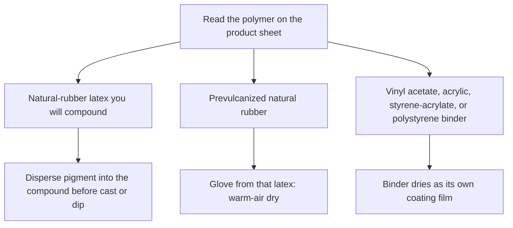

# Painting vs Compounding Pigment

> **Safety.** Read the TDS and SDS for ammonia, solvents, and pigments. A food-contact colorant list is not a wear clearance.

## Executive summary

With liquid latex, pigment can go into the natural-rubber latex before you cast or dip. A product the handbooks call latex paint is a different case: a synthetic binder blended with pigment, which dries as its own coating.

Use this when a bottle says paint, color, or liquid latex and you need the polymer line on the product sheet. Slurry practice is in [Pigment and Filler Compounding](/literature-reviews/liquid-pigment-filler-decks). Label fields are in [Decoding Consumer Latex Bottle Labels](/literature-reviews/liquid-decoding-bottle-labels).

## Questions this article answers

- [Which color method is this?](#which-method)
- [How do you tint the liquid before the film forms?](#compound-tint)
- [What does latex paint mean in the handbooks?](#latex-paint)

## Which color method is this? {#which-method}

### How

Read the polymer line on the product sheet, then follow the matching action below.

| What the sheet says | What to do |
| --- | --- |
| Natural-rubber latex you will cast or dip, and you want the color in that film | Disperse the pigment into the compound before you form the film |
| Prevulcanized natural rubber | The liquid was already crosslinked. A glove dipped from that latex needs only warm-air drying. See [Prevulcanized Consumer Latex](/literature-reviews/liquid-prevulcanized-consumer-latex) |
| Vinyl acetate, acrylic, styrene-acrylate, or polystyrene as a paint binder | Treat it as a coating. That binder dries as its own film |

### Why

Film from raw latex is not suited to usable or saleable articles until the latex is compounded. The Vanderbilt use table marks dyes and pigments optional for natural rubber. Color in that package is optional.

A latex paint, in Polymer Latices Vol 3, is a plasticized polymer dispersion blended with a pigment dispersion. On drying, that polymer binds the pigment into a coating film of its own.

A vulcanized film from an elastomeric latex must stretch to at least twice its length and return to about its original length. That rule applies to the vulcanized film.

Detail: Where dyes sit in the compounding table

Vanderbilt section 3 is elastomer phase modifiers. The Class 3 roster on that page is sulfur, zinc oxide, organic accelerators, antidegradants, clays, other loading materials, softeners, and reodorants. Dyes and pigments are not a row in that roster. The use table under the same section marks dyes and pigments optional for natural rubber.

## How do you tint the liquid before the film forms? {#compound-tint}

### How

Disperse water-insoluble pigment in water before adding it to the latex. Remix the dispersion before you weigh it.

Emulsify water-immiscible oils and low-melting solids before they meet the latex. Then compound the prepared additions into the latex you will cast or dip.

Bucket layouts are in [Pigment and Filler Compounding](/literature-reviews/liquid-pigment-filler-decks#identity-buckets).

### Why

A poor emulsion added to the compound can leave oil spots on the film. The emulsion examples in the handbook are an antioxidant, a tackifying resin, or a wax.

Shaking a dry craft pigment into the bottle skips the dispersion step.

Detail: Dispersion fineness and particle size limits

For most latex applications, the Vanderbilt limit for dispersed solids is a particle size below 5 microns. Check a fresh dispersion on a Hegman gauge before compounding, and remix it before weighing.

Detail: Emulsion checks and temperature limits

The Vanderbilt emulsion chapter uses a drop-on-water test. Casein for the caseinate solution is swollen in warm water, 54–71°C, for at least ten minutes, with stirring. Water above 74°C can damage the protein. Homogenize at or below 38°C. The aim of homogenizing is a smaller particle size and a longer shelf life.

## What does latex paint mean in the handbooks? {#latex-paint}

### How

If the product sheet names vinyl acetate, an acrylic, a styrene-acrylate, or polystyrene as the binder, or calls the product an emulsion paint, keep that liquid out of the natural-rubber compound. Use it as the coating it is.

### Why

Polymer Latices Vol 3 says latex-based surface coatings have been almost entirely based on synthetic latices. In the United Kingdom those paints are called emulsion paints because they replaced oil-bound washable distempers that were true oil-in-water emulsions. Elsewhere the same products have been called dispersion paints. The name records that history. The binder is still the polymer on the sheet.

Detail: Four binders and coating film formation

The same chapter compares four synthetic binder types: vinyl acetate polymers and copolymers; styrene-butadiene copolymers; acrylate ester polymers and copolymers, including styrene-acrylate copolymers; and polystyrene. Styrene-butadiene and polystyrene are no longer of significant industrial interest in that application.

A latex surface-coating composition is a dispersion of an internally or externally plasticized polymer blended with a pigment dispersion. On drying, the plasticized polymer binds the pigment particles into a coherent film. Film formation is loss of water, then integration of the polymer particles. The worked example is vinyl acetate. The chapter says the same broad principles apply to the other latex types.

Detail: Prevulcanized latex processing

Prevulcanized natural rubber is latex vulcanized while it is still liquid: sulfur or SULFADS, zinc oxide, an accelerator, and heat, with moisture loss prevented. Overcure makes the deposit short and weak. In the glove chapter, gloves made from prevulcanized latex need only warm-air drying. That is a dipped glove from that liquid, finished by drying.

## Sources

- *The Vanderbilt Latex Handbook*. 3rd ed. Edited by Robert Francis Mausser. Norwalk, CT: R.T. Vanderbilt Company, 1987. [Library of Congress](https://lccn.loc.gov/92117844)
- *Polymer Latices: Science and Technology — Volume 3: Applications of Latices*. 2nd ed. D. C. Blackley. Chapman & Hall / Springer, 1997. [Google Books](https://books.google.com/books?id=Y2VPGj7YbykC)