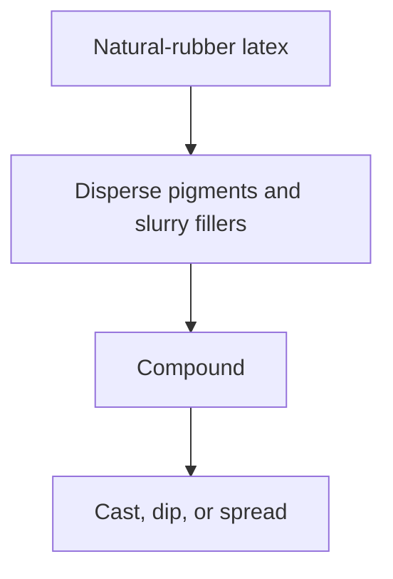
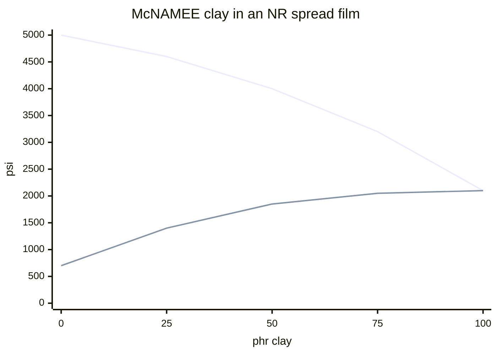

# Pigment and Filler Compounding for Liquid Latex

> **Safety.** Copper and manganese shorten service life. Food-contact colorant lists cover food-contact rubber. Skin wear sits outside that list. Read this as compounding literacy. Factory mixing cards stay in the plant.

## Executive summary

Color and opacity in a film you cast, dip, or spread start in the liquid, before the film forms. Insoluble powders and oils must be dispersed or emulsified first, or they shock the latex. Fillers raise the force needed to stretch the film. In some low-hydrocarbon latexes, a modest clay load is what lets a continuous film form. Heavier loads still stiffen it. Copper and manganese shorten service life when they are present in the raw rubber, in fabric dyes, or as trace impurities in mineral fillers.

Use this when you tint a batch, chase opacity, or need to know why dry craft pigment cannot be stirred directly into the bottle. Brush-on color is a different job: [Painting vs Compounding Pigment](/literature-reviews/liquid-painting-vs-compounding-pigment). Stiffness as a fit lever sits in [Gauge, Modulus, and Reduction](/literature-reviews/liquid-gauge-modulus-reduction).

## Questions this article answers

- [How do you color the film before it forms?](#compound-before-film)
- [How do you prepare pigments and fillers?](#identity-buckets)
- [What does filler load do to the film?](#loading)
- [Why do copper and manganese shorten film life?](#metal-impurities)

## How do you color the film before it forms? {#compound-before-film}

### How

In liquid latex, compound the liquid first, then cast, dip, or spread the film. Add color alongside the vulcanizing ingredients while the rubber is still liquid.

For water-insoluble pigments, use an aqueous dispersion: pigment already ground in water. Shake the container, weigh the required amount, and stir it in after the vulcanizing package is already stable in the latex.

### Why

The Vanderbilt Latex Handbook groups dyes and pigments with sulfur, zinc oxide, accelerators, clays, and antidegradants as modifiers of the rubber phase. Liquid latex straight from the tree or centrifuge cannot form a durable, vulcanized film on its own. It requires these additions. Water-insoluble pigments must enter as liquid dispersions so they mix evenly throughout the water phase before the film dries.

Detail: What is compounding?

Compounding is the process of mixing liquid latex with vulcanizing agents, accelerators, fillers, colorants, and protective chemicals before film formation. The colorant particles disperse throughout the liquid and become trapped inside the rubber matrix as water evaporates and the particles coalesce into a solid film.

Detail: Food-contact colorant lists

The United States Food and Drug Administration regulation 21 CFR 178.3297 lists colorants permitted for use in polymers. Entries that mention rubber refer back to 21 CFR 177.2600, which governs rubber articles intended for repeated food contact. This inventory confirms chemical extraction limits for food contact. It does not evaluate a garment film for skin contact or allergy potential.

## How do you prepare pigments and fillers? {#identity-buckets}

### How

Match the preparation method to the raw material form before introducing it to the latex.

| Bucket | What it is | Prep before the latex | What goes wrong |
| --- | --- | --- | --- |
| Aqueous pigment dispersion | Pigment already ground in water | Add when the compound is stable | A settled container alters the tint |
| Dry pigment powder | Water-insoluble powder | Grind a [dispersion](#what-dispersion) under 5 µm | Undispersed powder shocks the latex and leaves weak spots |
| Oil-phase colorant | Oil or low-melt solid | Make an [oil-in-water emulsion](#what-emulsion) first | A poor emulsion leaves oil spots on the film |
| Mineral filler (clay, whiting, talc) | Opacity, stiffness, cost | Slurry in water plus a dispersant | Film modulus rises |
| Polymeric filler (high-styrene SBR latex) | Separate polymer particles in latex | Add directly as a latex | Tear strength often rises; modulus and set also rise |

Practical steps:

- Aqueous dispersion: shake thoroughly, weigh, and stir into the stable compound.
- Dry iron oxide: grind into water with an anionic or nonionic dispersant until a Hegman gauge confirms particles are fine enough.
- Oil-soluble colorant: emulsify into water with a surfactant, perform a water drop test, then stir into the latex.
- Kaolin clay or whiting: create a smooth slurry in water using a dispersant before addition.
- High-styrene SBR: stir the emulsion directly into the latex compound.

Oil spots on the film, grit, or a compound that thickens abruptly indicate colloidal instability. Discard and remake the preparation.

### Why

Liquid latex is an aqueous colloidal suspension of rubber particles protected by electrical charges. Insoluble solids and immiscible liquids upset this balance if added dry or raw. Stirring dry powder directly into latex pulls water away from the rubber particles, causing local coagulation and grit. 

A dispersion keeps solid particles separated in water using wetting agents. An oil-in-water emulsion breaks liquid oils into microscopic droplets coated with surfactants so they stay suspended in water. The Vanderbilt Latex Handbook notes that an unstable emulsion separates during drying, leaving visible oil spots across the finished film.

Detail: Particle size and dispersion preparation

A dispersion consists of solid powder ground into water with a wetting agent. The target particle size in The Vanderbilt Latex Handbook is under 5 µm. Many commercial dispersions achieve 90% of particles at or below 2 µm. 

Fineness is verified using a Hegman grind gauge drawn down at approximately 30% total solids. Dispersions must be remixed before every weigh-up because dense pigments settle over time. Overgrinding must be avoided, as excessive mechanical action can cause fine particles to agglomerate.

Detail: Oil-in-water emulsion preparation

An oil-in-water emulsion breaks water-immiscible oils or low-melting solids into fine droplets surrounded by a surfactant barrier. A sound emulsion disperses completely when dropped into a beaker of clean water. An unstable emulsion breaks and leaves an oily sheen on the water surface. 

Mechanical homogenization should occur at or below 38°C. Formulations stabilized with casein require a temperature window of 54°C to 71°C to allow proper protein hydration and swelling.

Detail: Parts per hundred rubber (phr)

The unit phr stands for parts per hundred rubber by dry weight. Formula tables occasionally write this as pphr. Adhesive literature often uses pphp, meaning parts per hundred polymer. In all variations, the dry weight of the base polymer is fixed at 100, and all additives are scaled relative to that base value.

Detail: Industrial mill and emulsion practice

Dispersions described in The Vanderbilt Latex Handbook rely on anionic or nonionic wetting agents, such as the DARVAN product series. Pebble and ball mills typically operate with grinding media occupying about 50% of the total cylinder volume.

Emulsions use fatty acid soaps formed directly in the batch or synthetic surfactants like sodium alkyl sulfates. Adding 2% to 10% excess oil to the internal phase often improves droplet stability. A 65% active antioxidant emulsion is prepared by phase inversion, homogenized at or below 38°C, and checked with a water dilution test before compounding.

## What does filler load do to the film? {#loading}

### How

Always slurry mineral fillers in water with a dispersant before adding them to liquid latex.

For low-hydrocarbon latexes with very small particle sizes, The Vanderbilt Latex Handbook recommends 10 to 25 phr clay to enable a continuous film to form. The handbook specifies McNAMEE and DIXIE clays for these natural-rubber and synthetic compounds.

Above this level, fillers make the film noticeably stiffer. Keep mineral filler levels low if the garment film must remain supple and elastic.

High-styrene styrene-butadiene rubber (SBR) latex can be added to improve tear resistance. However, at 20 phr, permanent set reaches 30%. On a garment panel that must stretch and snap back cleanly, treat that level as an upper limit to avoid bagging.

### Why

Mineral particles do not stretch. When latex dries, rubber chains must deform around these rigid inclusions. This raises the force required to stretch the film (modulus) and lowers ultimate tensile strength.

In natural-rubber spread films evaluated in The Vanderbilt Latex Handbook, McNAMEE clay increases 500% modulus while reducing tensile strength across all loading levels. At 100 phr, tensile strength drops to equal the 500% modulus at 2100 psi.

Polymer Latices Volume 3 reports similar trends: whiting and zinc oxide steadily reduce tensile strength as loading increases. High-styrene SBR copolymer latex behaves differently. Because it is a compatible polymer particle rather than a mineral grain, it increases crescent tear strength, modulus, and hardness, while tensile strength remains stable up to 15 phr before dropping.

In latex adhesive films, Polymer Latices Volume 3 notes that mineral fillers reduce extensibility and increase bond stiffness. When added beyond small quantities (typically 0 to 30 pphp, up to a maximum of 100 pphp), mineral fillers reduce tack and ultimate bond strength.

Detail: Modulus and permanent set

Modulus is the tensile stress required to stretch a rubber specimen to a given elongation, such as 300% or 500%. A higher modulus indicates a stiffer film at identical gauge. 

Permanent set is the residual deformation remaining after a stretched specimen is released and allowed to recover. High permanent set causes garments to sag, bag at the joints, and lose shape after wear.

Detail: McNAMEE clay in natural rubber

Data from The Vanderbilt Latex Handbook for air-dried spread films based on a natural-rubber compound (zinc oxide, sulfur, BUTYL ZIMATE, AGERITE WHITE), vulcanized in warm air for 15 minutes at 93°C:

| phr McNAMEE clay | Tensile strength (psi) | Modulus at 500% (psi) |
| --- | --- | --- |
| 0 | 5000 | 700 |
| 25 | 4600 | 1400 |
| 50 | 4000 | 1850 |
| 75 | 3200 | 2050 |
| 100 | 2100 | 2100 |

The 1987 source table contains no elongation column.

The same handbook reports a polychloroprene series (DIXIE clay, CR 750, vulcanized 60 minutes at 127°C) showing the same behavior: tensile strengths of 3100, 1800, and 1500 psi, with 500% modulus values of 500, 600, and 1100 psi at 0, 25, and 50 phr clay.

High Polymer Latices (1966) reprints 1954 Vanderbilt curves for kaolinite clay in natural rubber. At 0 phr: elongation 1200%, tensile 6000 psi, 500% modulus 400 psi. At 20 phr: elongation 750%, tensile 3500 psi, 500% modulus 650 psi. The direction matches the 1987 data while documenting the elongation drop. The absolute numbers reflect different base recipes and laboratory vulcanization schedules.

Detail: Whiting, zinc oxide, and high-styrene copolymer comparison

From Polymer Latices Volume 3, showing tensile strength in MPa for postvulcanized natural-rubber films. Base compound: natural rubber 100, sulfur 2, zinc diethyldithiocarbamate 1, zinc oxide 3. Vulcanized 60 minutes at 100°C.

| Filler | 0 phr | 10 phr | 20 phr | 30 phr | 35 phr |
| --- | --- | --- | --- | --- | --- |
| Whiting | 33 | 28 | 26 | 24 | 23 |
| Zinc oxide | 33 | 30 | 28 | 26 | 24 |
| High-styrene copolymer (90/10) | 33 | 33 | 32 | 28 | 25 |
| Resorcinol-formaldehyde resin | 33 | 43 | 45 | 32 | 26 |

Detail: High-styrene SBR mechanical properties

Data from Polymer Latices Volume 3. Formulation: natural rubber 100 (as ammonia-preserved latex), potassium hydroxide 0.5, sulfur 1, activated dithiocarbamate 3, zinc oxide 5, octylated diphenylamines 1, with high-styrene styrene-butadiene copolymer latex added as indicated. Vulcanized 15 minutes at 93°C.

| phr filler | Modulus 300% (MPa) | Tensile (MPa) | Extension (%) | Tear (N/cm) | Set (%) |
| --- | --- | --- | --- | --- | --- |
| 0 | 0.90 | 28.6 | 880 | 1156 | 6 |
| 10 | 2.07 | 30.0 | 800 | 1489 | 20 |
| 15 | 2.41 | 30.7 | 760 | 1664 | 22 |
| 20 | 2.76 | 26.9 | 730 | 1769 | 30 |

Extension at break falls from 880% to 730% at 20 phr. The accompanying text notes that extension is relatively unaffected compared to mineral-filled systems, though the drop is measurable.

High Polymer Latices (1966) reprints 1954 data for high-styrene resin in natural rubber. Moving from 0 to 30 parts resin, tensile strength shifts from 4200 to 3200 psi (peaking at 4400 psi at 10 phr), elongation drops from 950% to 700%, 500% modulus rises from 800 to 1800 psi, and Shore hardness increases from 35 to 80. The 1997 metrics provide the primary reference values.

## Why do copper and manganese shorten film life? {#metal-impurities}

### How

When casting or dipping films that might encounter copper or manganese, include 2 phr total antioxidant in the compound.

Always agitate antioxidant and pigment dispersions before measuring. Settled dispersions cause uneven chemical distribution, leaving unprotected zones in the finished film.

For complete care and compounding strategies, see [Antidegradants in DIY Compounds](/literature-reviews/liquid-antidegradants-diy-compounds) and [Aging, Storage, and Care](/literature-reviews/liquid-aging-storage-and-care).

### Why

Copper and manganese are active oxidation catalysts for natural rubber. They break down hydroperoxides into free radicals, dramatically accelerating polymer chain scission and embrittlement. 

The Vanderbilt Latex Handbook specifies 2 phr total antioxidant when copper risk exists: 1 phr to manage ambient atmospheric oxidation and 1 phr specifically to deactivate metal catalysis. Specialized secondary amine antioxidants, such as AGERITE WHITE, chelate these transition metals and inhibit their catalytic activity. 

These metals may be present as trace soil contaminants in raw field latex, in textile dyes used on laminated fabrics, or as impurities in low-grade mineral fillers.

Detail: Concentration limits and regulatory thresholds

ISO 2004:2017 Table 1 sets strict limits on metal impurities for commercial centrifuged and creamed natural-rubber latex concentrates. Copper and manganese are each restricted to a maximum of 8 mg/kg of total solids. 

Without adequate metal-deactivating antioxidants, even trace amounts within these standard limits can degrade thin films rapidly if exposed to heat, UV radiation, or mechanical strain during use.

## Sources

- *The Vanderbilt Latex Handbook*. 3rd ed. Edited by Robert Francis Mausser. Norwalk, CT: R.T. Vanderbilt Company, 1987. [Library of Congress](https://lccn.loc.gov/92117844)
- *Polymer Latices: Science and Technology — Volume 3: Applications of Latices*. 2nd ed. D. C. Blackley. Chapman & Hall / Springer, 1997. [Google Books](https://books.google.com/books?id=Y2VPGj7YbykC)
- *High Polymer Latices: Their Science and Technology*. 2 vols. D. C. Blackley. London: Maclaren; New York: Palmerton, 1966. [Library of Congress](https://lccn.loc.gov/66077950)
- ISO 2004:2017. *Natural rubber latex concentrate — Centrifuged or creamed, ammonia-preserved types — Specifications.* Sixth edition. [iTeh preview](https://cdn.standards.iteh.ai/samples/70281/23b5bedd95e1478c978169e9039b7eb2/ISO-2004-2017.pdf)
- 21 CFR 178.3297. Colorants for polymers. [Cornell LII](https://www.law.cornell.edu/cfr/text/21/178.3297)
- 21 CFR 177.2600. Rubber articles intended for repeated use. [Cornell LII](https://www.law.cornell.edu/cfr/text/21/177.2600)