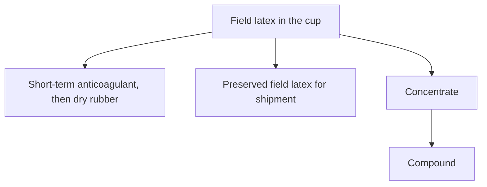
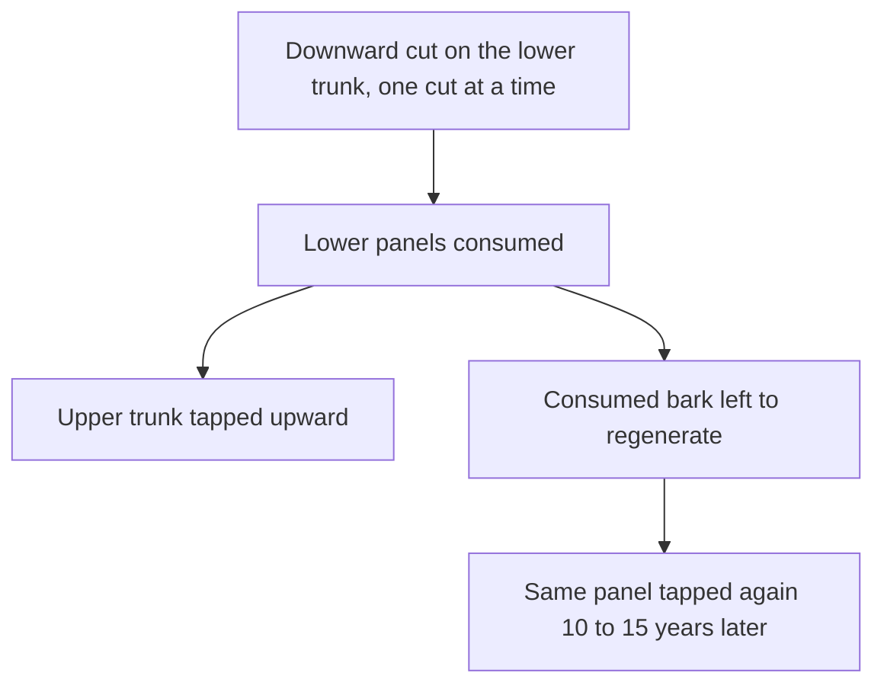
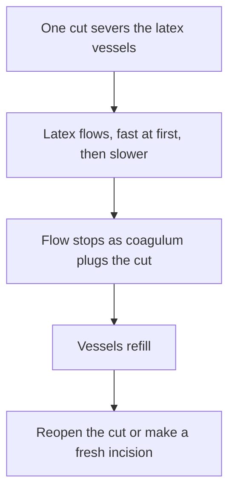

# Plantation Tapping and Field Latex

Fresh **field latex** and ethephon on the bark are plantation materials. This guide explains the tapping codes, bark consumption, and the liquid collected in the cup. Ammonia storage for bottled latex is covered in [Liquid Latex Aging, Storage and Care](/literature-reviews/liquid-aging-storage-and-care).

## Executive summary

**Field latex** is the liquid running from a tapped *Hevea* tree into a cup. For liquid latex work, it is the raw feedstock that a factory later preserves, concentrates, or formulates into compound.

How often the tree is cut, the length of the incision, and the use of ethephon stimulant determine the yield per tap and the rate of bark consumption. A 2019 Thailand trial and a 2012 Cameroon field study describe modern tapping systems. An older 1966 handbook outlines the biological flow-and-plug cycle of an incision and lists earlier chemical stimulants that preceded ethephon.

## Questions this article answers

- [What is field latex?](#field-latex)
- [How do you read a tapping code?](#tapping-code)
- [What does frequent tapping do to yield and bark?](#frequency)
- [What happens in the cup before the factory?](#cup)
- [Which pages take the next step?](#next)

## What is field latex? {#field-latex}

### How

Distinguish the raw plantation fluid from processed materials before dipping or casting. Field latex is the unrefined cup liquid. Concentrate is commercial latex with elevated dry rubber content. Compound is concentrated latex mixed with vulcanizing agents and stabilizers. 

Garment makers handle **concentrate** or compounded liquid latex, not raw field latex.

### Why

Fresh *Hevea* latex consists of roughly 60% water, 35% cis-1,4-polyisoprene rubber hydrocarbon, and 5% non-rubber components such as proteins, lipids, carbohydrates, and minerals. These non-rubber components are distributed among rubber particles, lutoids, and cytoplasmic serum. The rubber fraction forms the largest volume, followed by the serum and the lutoid particles.

Field latex typically contains 30% to 40% dry rubber (averaging around 33%). Shipping raw field latex is inefficient because of the high water content. Processing plants concentrate the fluid to approximately 60% dry rubber content. Centrifugation and creaming also remove a portion of the non-rubber fraction, producing a cleaner and more consistent raw material than raw field latex.

Detail: Four reports, four measurements

Published reports measure different fractions and parameters across different clones:

- Bottier (2020) summarizes fresh latex as approximately 60% water, 35% cis-1,4-polyisoprene, and 5% non-isoprene components.
- Liengprayoon et al. (2017) report non-isoprenes at about 10% of latex dry matter, or roughly 5% of raw dry natural rubber. Centrifugation yielded cream fractions of 35.9% (RRIM600) and 49.5% (PB235), and skim fractions of 8.8% (RRIM600) and 11.8% (PB235) by fresh weight. On a dry basis, skim had twice the concentration of lipids and proteins compared to cream. Lutoids contained the highest levels of lipids, proteins, and minerals (primarily potassium and magnesium). Serum contained proteins and minerals with minimal lipids. Because cream represents the bulk of the latex, it still holds the largest total mass of lipids.
- Rukkhun et al. (2020) observed hillside RRIM 600 under a 1/3S 3d/4 tapping system. In 2009, fresh yield was 0.12 to 0.14 kg per tree per tap, while dry yield reached 0.035 to 0.044 kg, corresponding to a water content of 67% to 71%.
- Lacote et al. (2019) monitored RRIM600 trees at Thepa station over three years. Total solids content remained stable at 52.7% to 55.2% across five distinct tapping regimes.

Blackley (1966) reported a dry rubber range of 30% to 40% as a historical processing baseline. These studies represent distinct clones, locations, and measurement methods.

## How do you read a tapping code? {#tapping-code}

### How

Interpret standard tapping notations to identify the cut fraction, direction, tapping frequency, and stimulant application:

- **S/2 d2**: Half-spiral downward cut, tapped on alternate days.
- **S/3 d1 2d/3**: One-third spiral downward cut, tapped two days in succession followed by one rest day.
- **S/2 d3 with ET 2.5% Pa1(1) 8/y**: Half-spiral downward cut, tapped every third day, with ethephon stimulant applied at 2.5% active ingredient, 1 gram per 1 cm band on the panel, eight times per year.
- **Panel notations**: BO-1 and BO-2 indicate the first and second virgin downward panels. B1-1 denotes renewed bark. HO-1 indicates an upward virgin panel.
- **Cut direction**: Downward cuts are standard; a "U" indicates an upward cut (such as S/2U or S/4U).

Follow the sequence established in field management. Tap downward on lower virgin panels, working one cut at a time. After consuming the lower bark, tap upward on the upper trunk while allowing the lower panels 10 to 15 years to regenerate.

### Why

Bark is a finite resource. Each tapping pass shaves away a thin layer of virgin tissue. In a study of 25 smallholder rubber plots in Cameroon, shaving thickness and tapping frequency each accounted for roughly 28% and 27% of the variation in bark consumption. The number of simultaneous cuts accounted for an additional 20%. Together, these three operational choices explained 75.6% of the variation in bark loss.

Opening multiple cuts at once without reducing frequency rapidly depletes the bark and triggers tapping panel dryness. The standard single-cut discipline protects the long-term biological productivity of the tree.

Detail: Tapping-system families

Lacote et al. (2019) define S/2 d4 as a half-spiral downward cut tapped every fourth day, alongside upward regimes like S/2U and S/4U with assigned ethephon regimens. Tapping intensity values in their research follow international exploitation notation systems.

Rukkhun et al. (2020) describe their hillside regime as 1/3S 3d/4, representing three tapping days followed by one rest day. Their published text contains contradictory descriptive glosses ("third daily tapping" and "three half spiral cut tapped every four days"), but the numerical day grid confirms three days of tapping followed by one rest day.

Michels et al. (2012) measured bark usage from 0.15 m to 2.10 m above the ground across Cameroon smallholdings. Annual virgin bark consumption ranged from 3.9% to 7.6%. Low-frequency tapping extended virgin panel life by roughly five years compared to industrial baselines, whereas high-frequency harvesting shortened bark life by 4.5 years. The authors calculated that panel management diagnosis can extend remaining tapping lifespan by 33% to 355%.

The Malaysian Rubber Board (2009) categorizes harvesting technology into exploitation symbols, ethephon stimulants (such as MORTEX, REACTORRIM, and RRIMFLOW), controlled upward tapping, and panel management systems.

## What does frequent tapping do to yield and bark? {#frequency}

### How

Select a tapping schedule by balancing labor against virgin bark preservation. Reducing tapping frequency while applying a matched ethephon schedule increases the yield per tap. 

When managing half-spiral cuts, lower frequencies with stimulant maintain cumulative annual yield close to high-frequency systems. Do not attempt to offset short cut lengths and low frequencies by adding excessive stimulant applications, as cumulative yield will drop.

### Why

Tapping consumes bark and removes rubber hydrocarbons that the tree must regenerate through metabolic synthesis. High-frequency tapping without rest depletes metabolic reserves and accelerates bark consumption.

In the Thailand trials by Lacote et al. (2019), reducing harvest frequency and adding a controlled ethephon schedule increased grams per tap. On half-spiral cuts, total annual output matched the busier schedules while consuming substantially less bark. Short cuts tapped infrequently failed to match cumulative yield even with increased stimulant applications. Rainfall also disrupts schedules, keeping real annual tap counts below theoretical calendar targets.

Detail: When the panel changes, and what the latex values did

At the Thepa trial station (RRIM600, three-year average), Lacote et al. (2019) documented the following performance:

| System | Grams per tree per tap | Kg per tree per year | Taps per year |
| --- | --- | --- | --- |
| S/3 d1 2d/3 | 46.57 | 7.2 | 155 |
| S/2 d2 | 62.88 | 7.1 | 113 |
| S/2 d3, ethephon 2.5%, 8/year | 78.32 | 7.1 | 91 |
| S/3 d2, ethephon 2.5%, 4/year | 61.22 | 6.9 | 113 |
| S/3 d3, ethephon 2.5%, 12/year | 71.31 | 6.5 | 91 |

The stimulated S/2 d3 system produced 168% of the grams per tap seen in the high-frequency S/3 d1 2d/3 regime, matching annual output (7.1 kg versus 7.2 kg). The intensive S/3 d1 2d/3 system consumed the most bark over three years (42.0 cm). The short-cut S/3 d3 system with 12 annual stimulations produced only 90.5% of the control yield (6.5 kg).

Over a 10-year commercial trial of RRIM600, shifting from alternate-day tapping (d2) to every third day (d3) with ethephon reduced cumulative downward virgin yield by 3% while increasing grams per tap by 30%. Over 11 years, fourth-day tapping (d4) yielded 10% less total rubber than d2, but grams per tap rose by 37% (d3) and 69% (d4). Virgin bark produced higher yields than renewed bark. In year 12, upward tapping on panel HO-1 sustained annual yield at low frequencies, with grams per tap 49% to 72% higher than the d2 baseline.

On clone RRIT 251, eight-year cumulative yields for d3 and d4 were 108% and 91% of d2 yields, with grams per tap increasing by 38% and 48%.

Rukkhun et al. (2020) confirmed a correlation between tapping frequency and yield (R² > 0.75) under high-frequency regimes, with bark consumption ranging from 1.8 cm to 3.0 cm per year across sites. While tapping panel dryness rates did not differ significantly across locations, the authors noted that high-frequency systems accelerated bark depletion and produced stressed physiological diagnostic values.

Lacote et al. (2004) evaluated four panel management strategies across clones PB 260, GT 1, PB 217, and AF 261 in Côte d'Ivoire over nine years. Clonal metabolic class dictated the response. Annual yield varied significantly by strategy, but nine-year cumulative yield did not differ for PB 260, GT 1, and PB 217. Girth growth remained unaffected except in GT 1, where fixed panels favored trunk expansion over yield.

Biochemical analysis at Thepa showed that sucrose levels were highest in the uninhibited S/3 d1 2d/3 system (10.9 mM) and lowest in the stimulated half-spiral system (7.7 mM). Inorganic phosphorus peaked in the stimulated system (20.9 mM), while reduced thiols dropped to their lowest levels (0.17 mM). This profile reflects accelerated sucrose utilization and elevated metabolic activity when individual taps yield higher latex volumes.

Rukkhun et al. (2020) recorded similar baseline physiological values for hillside RRIM 600: sucrose between 6.43 and 13.06 mM, inorganic phosphorus between 7.76 and 18.99 mM, and thiols between 0.23 and 0.56 mM.

Michels et al. (2012) note an immature non-productive period of roughly seven years before tapping begins, followed by an operational productive lifespan of 15 to 30 years or more.

## What happens in the cup before the factory? {#cup}

### How

Stabilize fresh latex quickly after collection. Natural rubber latex starts to coagulate within hours of leaving the tree. 

Use short-term anticoagulants (such as sodium sulfite or dilute ammonia) in the collection cup if the raw latex must remain fluid for transport to a processing plant. For sheet rubber production on plantations, latex is allowed to gel or is coagulated deliberately with acid. Liquid latex intended for garment work undergoes industrial preservation and centrifugation instead.

### Why

Latex resides under hydrostatic pressure within the laticifer vessels of the bark. Making an incision causes a rapid initial discharge. As pressure drops, flow slows, and rubber particles aggregate to form a **coagulum** plug that seals the cut vessels. 

Without added preservatives, bacteria and naturally occurring enzymes destabilize the suspended rubber particles. The latex separates into solid clots and clear serum before decaying. Ethephon prolongs flow by delaying this biological plug formation and stimulating cellular metabolism, allowing longer rest periods between tapping events.

Detail: 1966 coagulation notes beside ethephon

Blackley (1966) contrasts two historical theories of spontaneous latex coagulation. One proposal attributes coagulation to microbial acid formation from non-rubber substrates. The alternative mechanism focuses on fatty-acid anions displacing adsorbed proteins, reacting with divalent calcium and magnesium ions in the serum to destabilize the particles. 

During natural coagulation, latex pH remains between 6.0 and 6.3, whereas acid-induced coagulation requires a pH below 5.0. Maintaining a neutral pH of 7.0 using dilute alkali fails to prevent spontaneous gelation. Small concentrations of fatty-acid soaps accelerate clotting, while higher concentrations act as stabilizers. When calcium and magnesium ions are removed, raw latex can remain fluid for several days until putrefaction occurs. 

Ethephon functions differently. As documented by Lacote et al. (2019), ethephon decomposes into ethylene within plant tissue, promoting water influx into the latex vessels, stabilizing lutoids against premature burst, and activating metabolic turnover in laticiferous cells.

Blackley also notes earlier yield stimulants. Copper sulfate trunk injections raised yields temporarily before dropping after six months; these were abandoned due to copper contamination, which degrades vulcanized rubber. Synthetic plant hormones like 2,4-D and 2,4,5-T were applied in oil carriers above the cut to lengthen flow time, with effectiveness varying by clone. Ethephon replaced these early chemical treatments.

## Which pages take the next step? {#next}

### How

Use this page to understand raw field latex harvesting and the exploitation cycles that produce it. Consult neighboring guides for subsequent processing and compounding stages:

- Botany, clones, and disease: [The Hevea Rubber Tree](/literature-reviews/liquid-hevea-rubber-tree).
- Primary processing: [From the Rubber Tree to Liquid Latex](/literature-reviews/liquid-tree-to-liquid-latex).
- Preservation systems and storage: [Liquid Latex Aging, Storage and Care](/literature-reviews/liquid-aging-storage-and-care).
- Industrial concentration: `liquid-field-latex-to-concentrate`.

### Why

Field latex is an unstable agricultural fluid, not a finished manufacturing medium. Mixing plantation harvesting parameters with workshop procedures obscures the chemical transformations that make liquid latex usable for dipping and casting. Concentrating the latex raises its dry rubber content, and compounding introduces the sulfur and accelerators required to vulcanize dipped films.

## Sources

- Bottier C. “Biochemical composition of *Hevea brasiliensis* latex: A focus on the protein, lipid, carbohydrate and mineral contents.” In *Latex, laticifers and their molecular components: From functions to possible applications*, edited by Robert Nawrot, 201–237. Advances in Botanical Research 93. London: Academic Press, 2020. https://publications.cirad.fr/une_notice.php?dk=594602 · https://doi.org/10.1016/bs.abr.2019.11.003
- Blackley DC. *High Polymer Latices: Their Science and Technology*. 2 vols. London: Maclaren; New York: Palmerton, 1966. https://lccn.loc.gov/66077950
- Lacote R, Obouayeba S, Clément-Demange A, Dian K, Gnagne M.Y., Gohet E. “Panel management in rubber (*Hevea brasiliensis*) tapping and impact on yield, growth, and latex diagnosis.” *Journal of Rubber Research* 7, no. 3 (2004): 199–217. https://publications.cirad.fr/une_notice.php?dk=525247
- Lacote R, Sainoi T, Sdoodee S, Rawiwan C, Rongthong P, Kasemsap P, Chehsoh J, Chantuma P, Gohet E. “Performance of Different Latex Harvesting Systems to Increase the Labor Productivity of Rubber Plantations in Thailand.” IRRDB International Rubber Conference 2019, Nay Pyi Taw. https://agritrop.cirad.fr/593888/1/Lacote%20et%20al.%202019.pdf
- Liengprayoon S, Vaysse L, Jantarasunthorn S, Wadeesirisak K, Chaiyut J, Srisomboon S, Musigamart N, Roytrakul S, Bonfils F, Char C, Bottier C. “Fractionation of *Hevea brasiliensis* latex by centrifugation: (i) A comprehensive description of the biochemical composition of the 4 centrifugation fractions.” IRRDB 2017. https://agritrop.cirad.fr/586132/1/full%20paper%20IRRDB2017_Liengprayoon%20%28i%29.pdf
- Malaysian Rubber Board. “Latex Harvesting Technology & Physiology.” https://www.lgm.gov.my/webv2/coreActivities/latexHarvesting/(physiology:functions)
- Malaysian Rubber Board. *Rubber Plantation and Processing Technologies*. 1st ed. Kuala Lumpur: Malaysian Rubber Board, 2009. ISBN 978-983-2088-31-8. https://vitaldoc2.lgm.gov.my/vital/access/services/Download/vital1:78304/ATTACHMENT01
- Michels T, Eschbach J-M, Lacote R, Benneveau A, Papy F. “Tapping panel diagnosis, an innovative on-farm decision support system for rubber tree tapping.” *Agronomy for Sustainable Development* 32 (2012): 791–801. https://doi.org/10.1007/s13593-011-0069-2 · https://hal.science/hal-00930546v1/document
- Rukkhun R, Iamsaard K, Sdoodee S, Mawan N, Khongdee N. “Effect of high-frequency tapping system on latex yield, tapping panel dryness, and biochemistry of young hillside tapping rubber.” *Notulae Botanicae Horti Agrobotanici Cluj-Napoca* 48, no. 4 (2020): 2359–2367. https://doi.org/10.15835/48412045 · https://notulaebotanicae.ro/index.php/nbha/article/view/12045