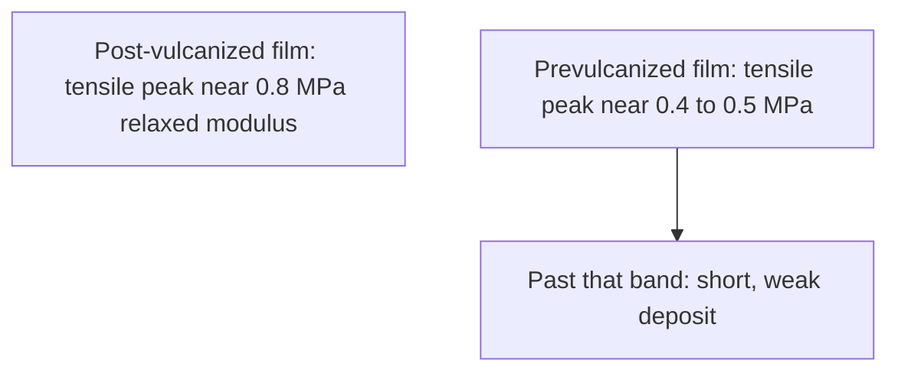
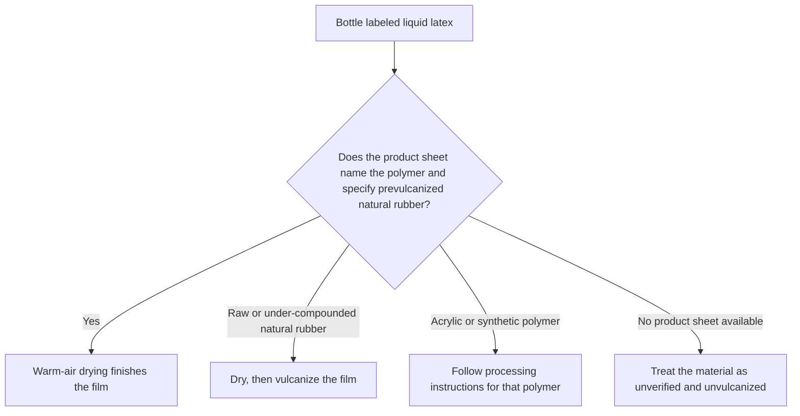

# Prevulcanized Consumer Latex

> **Safety.** Prevulcanization is an industrial process. Curatives react inside the liquid. Ammonia and accelerators remain in the bottle after warm-air drying. Leave the chloroform test to production facilities due to solvent exposure risks. For guidance on skin and allergy classes, see [Allergy and Skin Contact](/literature-reviews/allergy-and-skin-contact).

## Executive summary

Prevulcanized latex is natural-rubber latex cross-linked while still in liquid form. When using liquid latex, a deposited film can be finished by drying alone, provided the factory vulcanization remained within a narrow chemical band.

Check the technical data sheet before selecting a finishing procedure. The label "liquid latex" is merely a retail name. The underlying polymer depends on the product specifications.

## Questions this article answers

- [When is drying enough?](#dry-enough)
- [What if the bottle is unclear?](#bottle)
- [How do plants check the liquid?](#check)
- [Why do the strength reports disagree?](#strength)
- [How do you slow further vulcanization in storage?](#storage)

## When is drying enough? {#dry-enough}

### How

Select your finishing method based on the documented chemistry of your liquid latex.

| Material specification | Film procedure |
| --- | --- |
| Technical data sheet specifies prevulcanized natural rubber held in band | Dry in warm air |
| Raw or under-compounded natural-rubber latex | Dry, then vulcanize the film |
| Technical data sheet is missing or omits the polymer type | Dry, and plan to vulcanize the film |

### Why

The cross-links exist inside the individual rubber particles while still dispersed in water. Drying removes water, forcing the particles to touch and coalesce into a continuous film. *The Vanderbilt Latex Handbook* notes that dipped goods made from prevulcanized latex require only warm-air drying. The same source states that liquid vulcanization must remain at a low level of combined sulfur. Beyond that threshold, the resulting deposit becomes brittle and weak.

Detail: Tank outline

The Vanderbilt formulation heats stabilized natural-rubber latex with sulfur or a sulfur donor, zinc oxide, and an accelerator dispersion. Using ultra-accelerators, approximately one hour at 79°C completes vulcanization in the liquid state at atmospheric pressure. The plant procedure warms the latex to 32–38°C, adds compounding dispersions, maintains 70–80°C under continuous agitation, cools to roughly 30°C, and clarifies via decanting or centrifuging after 24 hours.

Detail: Where the tensile peak sits

Post-vulcanized natural-rubber latex films in *Polymer Latices* (Vol. 3) reach peak tensile strength near a relaxed modulus of 0.8 MPa. This modulus corresponds to a chemical cross-link density of approximately 5 × 10⁻² mol per dm³ of rubber hydrocarbon. Sulfur-prevulcanized films peak at 0.4–0.5 MPa. Citing results from Wong and Loo, the maximum cross-link density for sulfur-prevulcanized latex sits at roughly 1–2 × 10⁻² mol per dm³. The sulfur-prevulcanized test films reach 30 MPa tensile strength. High-energy radiation prevulcanization yields 30–35 MPa via direct carbon-carbon cross-links, independent of the sulfur curve. The handbook attributes the post-peak strength loss to incomplete particle coalescence during drying, rather than the chain-mobility constraints seen in dry bulk rubber.

Detail: Oil, grease, and high prevulcanization levels

*Polymer Latices* (Vol. 3) states that films prepared from sulfur-prevulcanized natural rubber demonstrate lower resistance to hydrocarbon oils and greases than post-vulcanized films. Extensive prevulcanization in the liquid state reduces tensile strength, elongation at break, and tear resistance because cross-linked particles resist mutual interdiffusion upon drying. Completing a portion of vulcanization after film formation reduces this physical property gap. Thicker articles tolerate higher states of prevulcanization. Liquid vulcanization reduces processing costs, whereas drying followed by post-vulcanization yields superior film mechanics.

*High Polymer Latices* (1966) notes that prevulcanized films fail more rapidly when exposed to solvents under mechanical tension. Equilibrium swelling in benzene shows lower sensitivity to combined sulfur levels compared to post-vulcanized deposits.

## What if the bottle is unclear? {#bottle}

### How

Review the technical data sheet before attempting to process the liquid. Do not assume retail packaging contains prevulcanized natural rubber.

Consult [Decoding liquid latex bottle labels](/literature-reviews/liquid-decoding-bottle-labels) for label terminology. Film deposition methods appear in [Forming film from liquid latex](/literature-reviews/liquid-film-pathway).

### Why

Raw natural rubber does not produce a durable film without proper compounding and cross-linking. Water-based synthetic dispersions, such as styrene-acrylic compounds used in special effects, frequently use the general name liquid latex despite having completely different chemical properties.

## How do plants check the liquid? {#check}

### How

Rely on supplier product documentation for consumer supplies. Do not attempt industrial solvent tests at home.

### Why

Manufacturing facilities evaluate the degree of liquid vulcanization using chloroform coagulation tests or swollen-diameter measurements. Chloroform is a toxic solvent requiring industrial vapor controls. The test result relies on subjective tactile assessment of a coagulated rubber sample. Solvent-swell testing offers higher numerical precision, but requires extended testing times that production facilities often avoid during active runs.

Detail: Chloroform ratings

Equal volumes of compounded latex and chloroform are agitated together until phase separation and coagulation occur. After two to three minutes, the operator evaluates the resulting coagulum:

Stage No. 1 indicates an unvulcanized state. Stage No. 4 indicates an advanced stage of precure where particle fusion in the dried film is compromised.

## Why do the strength reports disagree? {#strength}

### How

Interpret published physical strength figures according to the specific manufacturing method used. If the product data sheet fails to confirm that the liquid is prevulcanized natural rubber, dry the film and proceed with vulcanization.

### Why

Technical literature reports differing tensile values based on test context, compounding ingredients, and processing history:

- *The Vanderbilt Latex Handbook* (1987) records that properly prevulcanized liquid yields films approaching conventional vulcanized tensile values of 4,000 to 5,000 psi (27.6 to 34.5 MPa). Exceeding the optimal combined-sulfur target produces brittle, weak films.
- *Polymer Latices* (1997, Vol. 3) demonstrates that sulfur-prevulcanized films reach their tensile peak at lower modulus values than post-vulcanized films. Extending liquid prevulcanization lowers tensile strength, ultimate elongation, tear resistance, and solvent resistance. Post-curing the dry film narrows this difference.
- *Practical Guide to Latex Technology* (2013) notes in its casting chapter that films made from prevulcanized compound exhibit low tensile strength. The author recommends prevulcanized liquid primarily for casting solid objects where omitting oven vulcanization saves production time.
- *High Polymer Latices* (1966) documents lower ultimate tensile strength and elongation for prevulcanized films compared to post-vulcanized equivalents, alongside a lower modulus profile when post-curing is omitted. Modern references (1987, 1997, 2013) supersede this earlier text on absolute performance targets.

Detail: Particle cohesion mechanisms

The 1997 edition of *Polymer Latices* attributes the loss of mechanical strength at higher cross-link densities to restricted polymer interdiffusion between particle boundaries during drying.

*The Vanderbilt Latex Handbook* reports an alternative hypothesis: unreacted curatives at the particle surface may continue to form cross-links across particle interfaces during final drying.

*High Polymer Latices* demonstrates that serum substances do not act as an adhesive binder between rubber particles. Creaming and alcohol extraction procedures did not degrade the mechanical strength of dried prevulcanized films, confirming that inter-particle cohesion derives from the rubber phase itself.

## How do you slow further vulcanization in storage? {#storage}

### How

Store liquid latex containers in a temperature-controlled environment away from heat sources and light exposure. In production, manufacturers clarify the liquid by centrifuging or settling curatives before packaging, followed by antioxidant addition.

### Why

Residual sulfur and zinc oxide remain active within the liquid concentrate. Elevated storage temperatures allow the cross-linking reaction to proceed inside the container. This uncontrolled maturation shifts the compound toward an over-vulcanized state, producing weak and brittle films upon drying.

## Sources

- *The Vanderbilt Latex Handbook*. 3rd ed. Edited by Robert Francis Mausser. Norwalk, CT: R.T. Vanderbilt Company, 1987. [Library of Congress](https://lccn.loc.gov/92117844)
- *Polymer Latices: Science and Technology — Volume 3: Applications of Latices*. 2nd ed. D. C. Blackley. London: Chapman & Hall, 1997. [Google Books](https://books.google.com/books?id=Y2VPGj7YbykC)
- *Practical Guide to Latex Technology*. Rani Joseph. Shawbury: Smithers Rapra Technology, 2013. [Google Books](https://books.google.com/books/about/Practical_Guide_to_Latex_Technology.html?id=NB5AMwEACAAJ)
- *High Polymer Latices: Their Science and Technology*. 2 vols. D. C. Blackley. London: Maclaren; New York: Palmerton, 1966. [Library of Congress](https://lccn.loc.gov/66077950)