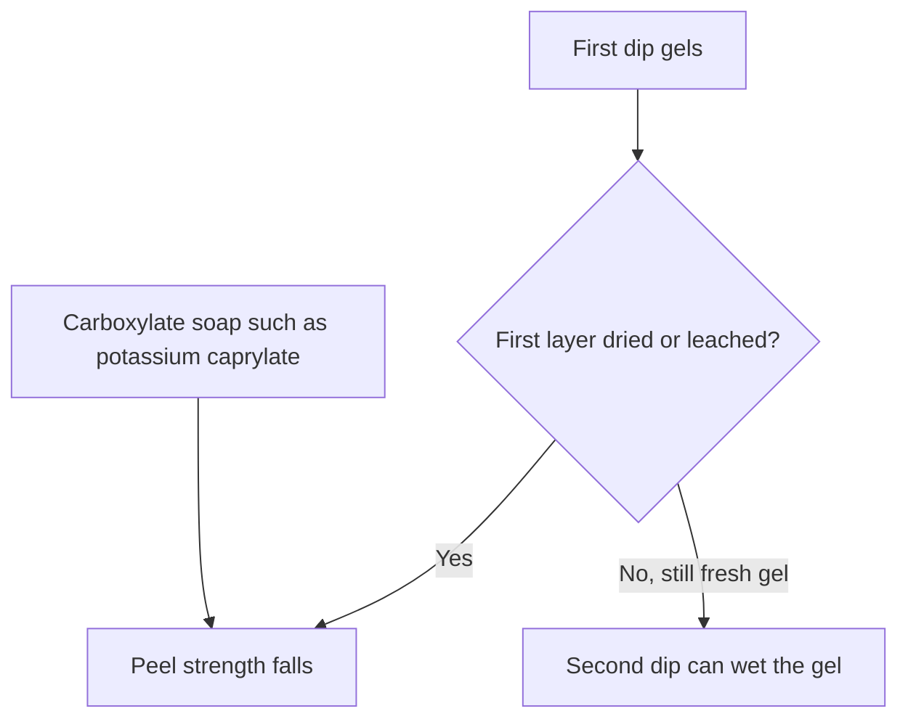
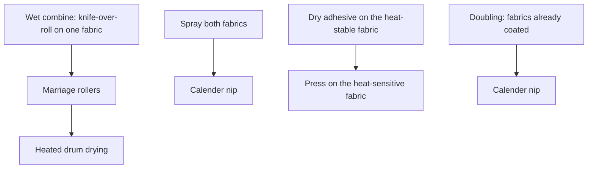
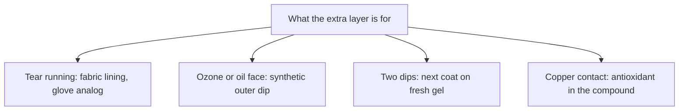

# Liquid Reinforcement and Laminate Zones

> **Safety note:** Solvent rubber cements require active, spark-free ventilation because their carrier solvents are flammable. Aqueous latex adhesives eliminate fire hazards, but they freeze easily in cold storage. Review each chemical safety data sheet (SDS) before compounding and maintain adequate airflow in your workspace. For bonding fundamentals, see [Liquid adhesives and seam integrity](/literature-reviews/liquid-adhesives-and-seam-integrity).

## Executive summary

When creating liquid latex films by dipping, casting, or spreading, you build structural strength directly into the wet deposit. You can add another coat of liquid latex, combine a natural rubber core with a synthetic outer face, or embed cloth into the stack. Adhesion between successive dipped layers depends strictly on timing: the next dip must go on while the previous layer is still a fresh, unwashed wet gel. If an underlying layer dries or passes through a leach bath too early, the plies split apart under tension. Use these guidelines when multi-layer dipped goods peel apart or when adapting commercial fabric-combining methods to studio scale.

## Questions this article answers

- [When do you add another coat or a cloth layer?](#another-coat)
- [Which extra layer matches the job?](#which-layer)
- [What does a split between coats usually mean?](#split)

## When do you add another coat or a cloth layer? {#another-coat}

### How

- Apply the next dip while the previous deposit is still a wet gel.
- Do not let the first layer dry completely or run it through a water leach tank before dipping the next coat.
- Build environmental resistance by dipping a natural rubber base first, followed by an outer synthetic coat. Use polychloroprene for ozone and oil resistance, or carboxylated nitrile for heavy grease and abrasion.
- Join textile reinforcements while the latex adhesive deposit is still wet. Keep in mind that water-based compounds cause untreated natural fabrics to shrink. For dedicated fabric operations, see [Liquid latex–textile bonding](/literature-reviews/liquid-latex-textile-bonding).

### Why

Peel strength between two natural rubber coats drops sharply once the first layer dries. Water leaching a dried layer lowers adhesion even further because it removes surface rubber and consolidates the boundary into a slick plane. A fresh, wet gel surface wets out readily, allowing polymer chains from the new dip to knit across the boundary.

A fabric backing or lining acts as a physical ripstop. When an unsupported rubber film sustains a puncture, tension causes that tear to run across the entire sheet. Backing the rubber with woven or knitted cloth restricts total elongation and arrests running tears.

Ambient humidity dictates surface stability. Extremely dry air causes the surface of a wet gel to skin over prematurely, preventing the next dipped compound from knitting into it.

Detail: Wet gel, soaps, and mud-cracking

Gazeley quantified the peel force per unit width across successive natural rubber dips. Adhesion dropped rapidly as the drying time of the initial layer increased, and an intermediate water leach reduced bond strength even further. Even brief air drying caused measurable adhesion loss.

Formulation chemistry plays a direct role. Adding a carboxylate soap such as potassium caprylate to the compound sharply reduced interlaminar bond strength by orienting at the interface and preventing chain interdiffusion.

Cure state also affects ply bonding. Laboratory sulfur-prevulcanized latices produced lower bond strengths than unvulcanized compounds that were vulcanized after film formation. In contrast, industrially prepared sulfur-prevulcanized latices exhibited higher initial bond strengths, though adhesion still dropped as the degree of prevulcanization increased. The practical rule across all trials is to exploit the wetting capacity of fresh, unconsolidated latex gel.

Mud-cracking represents a structural failure during drying rather than a boundary defect. When a wet gel lacks sufficient cohesive strength to oppose capillary drying forces, the deposit fissures into polygonal islands like dried mud. This defect appears frequently in blends containing highly sulfur-prevulcanized and unvulcanized natural rubber, or in natural rubber blended with styrene-butadiene (SBR) latex.

Detail: Natural-rubber inner, synthetic outer

Natural rubber provides high green strength and rapid film build on dipping formers, but it degrades when exposed to ozone, sunlight, and petroleum solvents. Synthetic latices resist these environments, but they often exhibit lower wet gel strength and lower unvulcanized tensile strength during manufacturing.

Producers solve this by dipping an inner natural rubber structural core, followed by a protective synthetic outer coat. Polychloroprene provides ozone protection and resists moderate hydrocarbon oils. Carboxylated acrylonitrile-butadiene (XNBR) offers superior performance over standard nitrile latices, providing higher wet gel strength, higher dry tensile properties, and excellent abrasion resistance against heavy oils and industrial greases. Because differing polymer chains resist mutual diffusion, successive dips of dissimilar latices demand exact wet-gel timing to prevent later delamination.

Detail: Plant combining layouts

Blackley categorizes industrial latex textile combining into four plant arrangements:

1. **Wet combine:** A knife-over-roll applicator applies a wet latex adhesive layer to the primary fabric. The secondary fabric meets it immediately at marriage rollers under low pressure, and the wet sandwich passes around a drying drum driven at web speed.
2. **Spray combine:** Atomizing nozzles apply adhesive onto both fabric faces. The webs unite at a calender nip. Controlled low-deposition spraying can yield a waterproof assembly that retains air permeability.
3. **Differential heat combine:** When bonding a heat-sensitive fabric to a stable fabric, the heat-stable substrate receives the adhesive coat and passes through a drying zone first. The heat-sensitive textile is pressed into the warm deposit, and the composite undergoes gentle final drying.
4. **Doubling:** Pre-coated and pre-dried fabric faces unite at a high-pressure calender nip. If the adhesive formulation uses a pressure-sensitive base, single-side coating may suffice; otherwise, both mating surfaces receive adhesive.

## Which extra layer matches the job? {#which-layer}

### How

Select your secondary layer based on the environmental exposure or mechanical load:

| Target performance | Construction choice |
| --- | --- |
| Stop running tears | Laminate a woven or knitted textile lining into the rubber wall. |
| Resist ozone, oils, and greases | Dip a natural rubber base for structure, then apply an outer dip of polychloroprene or carboxylated nitrile. |
| Prevent inter-coat peeling | Deposit the next coat over a fresh, unleached wet gel. |
| Prevent copper degradation | Add sacrificial antioxidant to the compounding recipe rather than adding extra rubber plies. |

For detailed contact tables, consult [Compatibility of metals, oils, and plastics](/literature-reviews/compatibility-matrix-metals-oils-plastics) and [Liquid aging, storage, and care](/literature-reviews/liquid-aging-storage-and-care).

### Why

Fabric reinforcement limits local elongation under strain. When an unsupported film is nicked, tension concentrates at the root of the cut and shears the rubber chains. A bonded fabric layer absorbs and distributes tensile forces across adjacent yarns, stopping the split.

Synthetic surface layers act as chemical shields. Polychloroprene resists ozone cracking caused by double-bond cleavage in natural rubber, while carboxylated nitrile prevents petroleum hydrocarbons from swelling the core.

Heavy metals like copper, cobalt, manganese, and iron degrade natural rubber and polychloroprene through catalytic oxidation. Soluble fatty acid salts of these metals accelerate oxidative breakdown throughout the bulk matrix. Adding extra coats will not prevent breakdown if copper contacts the part; the defense requires an adequate antioxidant reserve inside the compound itself.

## What does a split between coats usually mean? {#split}

### How

- Review the dwell time between dips. If the first coat dried or was leached before the second dip, the interface will peel under load.
- Measure shop humidity. If ambient air is dry, increase humidity or shorten the air dwell between dips to prevent surface skinning.
- Review your compound ingredients. Cut back on soluble carboxylate soaps, which migrate to the wet surface and act as release agents.
- For failures between rubber and fabric, see [Liquid latex–textile bonding](/literature-reviews/liquid-latex-textile-bonding) and review the failure categories in [Liquid delamination and seam failure](/literature-reviews/liquid-delamination-seam-failure).

### Why

Lamination between wet deposits requires polymer particles to interdiffuse across the boundary before drying locks them in place. If the first deposit dries completely, its rubber particles coalesce into a continuous film, eliminating the molecular mobility needed to absorb the next dip.

Leaching a fresh deposit washes away protective serum solids, but leaching a dried film sets the surface boundary permanently. If that dried, leached layer enters a second dip, the interface forms a mechanical joint rather than an integrated chemical matrix. Under peel stress, the boundary separates cleanly along the original dip line.

Detail: Humidity effects on cure and lamination

Ambient humidity affects film formation at both extremes:

- **Low relative humidity:** Accelerates surface evaporation from the wet gel deposit. The exposed face forms an unreactive skin before the bulk gel consolidates, leading to poor inter-ply lamination during subsequent dips.
- **High relative humidity:** Traps residual serum moisture inside the deposited wall. On thicker dipped goods, trapped water retards sulfur cross-linking during hot-air vulcanization, depressing modulus and ultimate tensile strength.

Chloroprene latex films are particularly sensitive to moisture retention and demand longer ambient drying cycles than natural rubber before entering vulcanization ovens.

## Sources

- *The Vanderbilt Latex Handbook*. 3rd ed. Edited by Robert Francis Mausser. Norwalk, CT: R.T. Vanderbilt Company, 1987. https://lccn.loc.gov/92117844
- *Polymer Latices: Science and Technology — Volume 3: Applications of Latices*. 2nd ed. D. C. Blackley. Chapman & Hall / Springer, 1997. https://books.google.com/books?id=Y2VPGj7YbykC
- *Practical Guide to Latex Technology*. Rani Joseph. Shawbury: Smithers Rapra Technology, 2013. https://books.google.com/books/about/Practical_Guide_to_Latex_Technology.html?id=NB5AMwEACAAJ