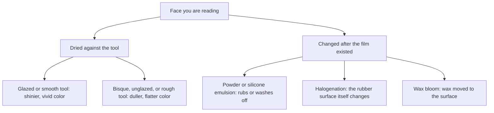
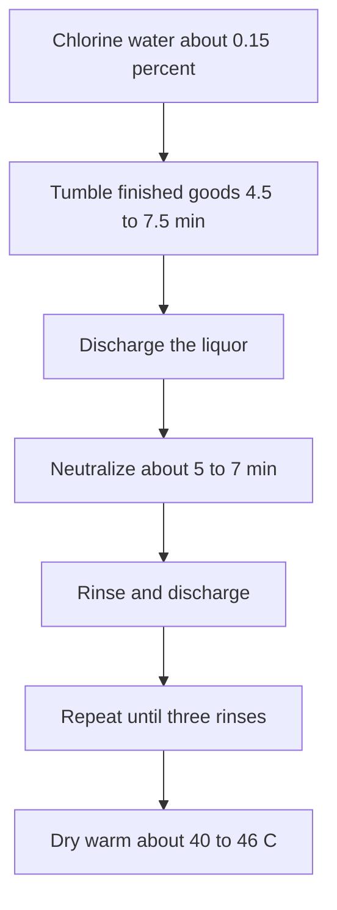

# Liquid Film Surface Finish

> **Safety.** Halogenation uses corrosive oxidizers. Read the numbers as factory vocabulary. The working method is in [Chlorination for Tack Control](/literature-reviews/liquid-chlorination-tack-control).

## Executive summary

On dipped or cast film, gloss and matte usually come from the surface the film dried against. A glazed former gives a shiny face and vivid color. A bisque or sandblasted former gives a dull, flat face. Tack can be dusted for a while, or changed permanently by halogenation. Powder that appears after storage is often wax that migrated to the surface to protect against ozone. Grasping a wet object and pulling a glove onto damp hands are two separate problems that require different surface treatments.

Use this when you are [forming film](/literature-reviews/liquid-former-dip-vs-mould-cast-vs-flat-spread) and evaluating the face you produced, or when stored film looks powdery. Garment storage sits in [Aging, Storage and Care](/literature-reviews/liquid-aging-storage-and-care).

## Questions this article answers

- [What makes the film glossy or dull?](#gloss)
- [What cuts tack, and what only lasts until you rub it?](#tack)
- [What is the powder after storage?](#bloom)

---

## What makes the film glossy or dull? {#gloss}

### How

Look at the face that dried against the tool. A glazed or polished former leaves a shinier film and more vivid color. A bisque, sandblasted, or rough former leaves a duller, flatter color. On a cast or spread sheet, use the same bench reading: a polished bed leaves a glossier contacting face than a rough bed. That reading is an analogy to dip formers, which are the tools described in the handbooks.

Tool selection sits in [Former Dip vs Mould Cast vs Flat Spread](/literature-reviews/liquid-former-dip-vs-mould-cast-vs-flat-spread). Color mixed into the compound is a separate choice, covered in [Pigment and Filler Decks](/literature-reviews/liquid-pigment-filler-decks).

### Why

The film copies the texture it dried against. A smooth glaze produces a specular surface that reflects light cleanly, making the film look shiny and the color look saturated. A rough surface produces microscopic irregularities that scatter light, making the film look dull and the color look flat.

Unglazed porcelain absorbs coagulant solution into its open pores. Dipping plants use that porosity when they need the former to carry extra coagulant into the latex tank, beyond the thin layer that clings by viscosity alone. A glazed former is the choice when the process requires a smoother deposit, an easier strip after drying and vulcanizing, and easier washing between cycles.

While the rubber remains on the tool, its outer surface is only a blurred copy of the former texture. A sharp embossed pattern shows up on the outside of a finished glove because the article is turned inside out during stripping. An embossed former is how factories produce a textured grip on a palm. The Vanderbilt handbook notes that designers must place the desired finish on whichever tool face produces the intended outward surface of the dipped article. Always check whether your stripping step inverts the film.

Detail: Glaze, unglazed porcelain, and grit

Blackley (*Polymer Latices*, Vol. 3) treats glaze both as a process variable and as a visual finish. Glazed porcelain gives a smoother deposit, releases the film more readily after drying and vulcanization, and cleans faster during cycling. Unglazed porcelain absorbs coagulant, so the process does not depend entirely on the small volume of solution retained by liquid viscosity. Coating a former with fine grit is an alternative method to increase coagulant and latex pickup on specific zones.

---

## What cuts tack, and what only lasts until you rub it? {#tack}

### How

Freshly vulcanized film is naturally tacky. Dusting with talc, starch, or applying a silicone emulsion creates a temporary slip layer. Mechanical rubbing and water washing strip this layer off.

For a permanent surface modification, halogenate the rubber. The finished film is treated in a halogen bath, neutralized, rinsed thoroughly, and dried warm. Working parameters are detailed in [Chlorination for Tack Control](/literature-reviews/liquid-chlorination-tack-control).

Distinguish between two different friction requirements:

- Grasping wet, slippery objects: An embossed grip pattern alone provides minimal traction on wet surfaces. Halogenation with chlorine or bromine water is the standard factory treatment to create wet grip.
- Donning onto damp skin: Chlorination provides adequate slip over dry skin. In factory testing, damp-hand lubricity remains poor without secondary hydrophilic coatings.

### Why

Topical slip agents include talc, mica, zinc stearate, and cornstarch. Silicone-oil emulsions work similarly. These materials sit loosely on the exterior of the film while the bulk rubber underneath remains unchanged. Factories traditionally dusted disposable items like medical examination gloves, while halogenating reusable goods like household gloves.

Chlorine water and bromine water reduce tack to comparable levels in Vanderbilt testing. Chlorine causes less discoloration. Sodium hypochlorite reduces tack less effectively than either elemental halogen water and causes discoloration comparable to bromine water.

Blackley summarizes friction data for glove films treated by different methods. In that study, iodination and bromination barely reduced dry friction against skin. Chlorination lowered dry friction significantly, and longer exposure lowered it further. A hydrophilic polymer coating produced the largest friction drop in the test series. Starch dusting performed about the same as a brief chlorination cycle. These tests evaluate dry kinetic friction, whereas Vanderbilt evaluations focus on surface tack.

Asrar and coauthors confirmed that chlorinated commercial gloves carry a chemically bonded chlorine layer that is detectable by laboratory spectroscopy.

Detail: One chlorine-water window

Saturated chlorine water contains 0.56% chlorine by weight. A standard processing bath dilutes this stock to roughly 0.15% available chlorine. A typical cycle tumbles the goods for 4.5 to 7.5 minutes at ambient temperature. High-sulfur compounds require shorter exposure times than low-sulfur compounds. After treatment, discharge the liquor, neutralize, rinse three times in fresh water, and dry at 40°C to 46°C. Keep all brass and copper equipment away from chlorine processing baths.

This sequence represents the standard Vanderbilt tumbler procedure.

Detail: Alternative chlorination chemistries

Blackley outlines three chemical routes for chlorinating dipped latex goods: aqueous chlorine gas, sodium hypochlorite acidified with hydrochloric acid, and organic chlorine donors. Sodium dichloroisocyanurate is the most common organic donor used on dipped products. A typical hypochlorite recipe combines 7.5% sodium hypochlorite by mass with 1% concentrated hydrochloric acid by mass. This mixture generates active chlorine species differently from a 0.15% elemental chlorine solution.

Neutralization baths typically use a 1% by mass solution of sodium thiosulfate or dilute ammonia.

Halogenation must remain confined to the immediate surface. Thin films or excessive exposure times cause bulk chlorination, leading to stiffening and discoloration. Heavy treatment also oxidizes and destroys dithiocarbamate and thiuram accelerator residues near the surface. Because these accelerators also act as secondary antioxidants, stripping them accelerates bulk oxidative aging. A properly chlorinated surface is harder than the underlying rubber and exhibits microtexturing under magnification, which lowers the coefficient of friction.

In Blackley's comparative friction data, concentrated sulfuric acid etching reduced dry friction more than bromination or iodination, but less than starch dusting. Hydrophilic polymer coatings produced lower dry friction values than any direct chemical treatment.

---

## What is the powder after storage? {#bloom}

### How

When stored film develops a whitish powder or haze, identify whether the substance is wax bloom. Paraffin or microcrystalline wax is deliberately compounded into liquid latex so it can migrate to the surface during storage. This layer creates a physical barrier against atmospheric ozone while the film is at rest. Flexing or stretching the film cracks this barrier. Wiping the powder away with a cloth removes the barrier and can restore surface tack.

Formulating rules are covered in [Antidegradants in DIY Compounds](/literature-reviews/liquid-antidegradants-diy-compounds).

### Why

Atmospheric ozone attacks unsaturated double bonds in the polyisoprene backbone, causing surface cracking under tension. An unbroken wax film blocks ozone from reaching the rubber while the garment sits undisturbed in storage. Film tested immediately after manufacture, before the wax has migrated, fails rapidly in ozone chambers. One standard protocol holds the vulcanized film for three weeks at 23°C and 50% relative humidity wrapped in kraft paper to allow a complete bloom layer to form.

A study in *Science Diliman* examining additive kinetics in natural rubber confirms that wax bloom consists of low-solubility hydrocarbon waxes migrating down a concentration gradient out of the bulk rubber.

Para-phenylenediamine (PPD) antiozonants use a chemical mechanism rather than a physical barrier. They protect rubber during dynamic flexing, but they cause severe contact staining and dark discoloration.

Detail: Wax loading and ozone chamber life

Typical compounding additions range from 0.5 to 1.0 phr of microcrystalline wax emulsion. The unit phr denotes parts per hundred rubber by dry weight; 1.0 phr equals one gram of dry wax per 100 grams of dry rubber hydrocarbon. The bloom layer must be continuous to protect the substrate. A single micro-crack caused by strain permits localized ozone attack, which is why wax systems are classified as static antiozonants.

A Vanderbilt laboratory comparison of proprietary microcrystalline waxes demonstrates the performance drop under mechanical strain:

| Wax additive in compound | Exposure hours to complete ozone failure |
| --- | --- |
| Control (no wax) | 16 |
| VANWAX H (static) | 76 |
| VANWAX H SPECIAL (static) | 98 |
| VANWAX H SPECIAL (flexed dynamically) | 26 |

These values reflect accelerated chamber testing at elevated ozone concentrations.

---

## Sources

- Mausser, Robert Francis, ed. *The Vanderbilt Latex Handbook*. 3rd ed. Norwalk, CT: R.T. Vanderbilt Company, 1987. <https://lccn.loc.gov/92117844>
- Blackley, D. C. *Polymer Latices: Science and Technology. Volume 3: Applications of Latices*. 2nd ed. London: Chapman & Hall, 1997. <https://books.google.com/books?id=Y2VPGj7YbykC>
- Asrar, J., et al. "Development of a methodology for characterizing commercial chlorinated latex gloves." *Journal of Applied Polymer Science* 82, no. 3 (2001): 672–682. <https://doi.org/10.1002/app.1895>
- "Effect of Ingredient Loading on Surface Migration Kinetics of Additives in Vulcanized Natural Rubber Compounds." *Science Diliman* 14, no. 2 (2002). <https://distantreader.org/stacks/journals/sciencediliman/sciencediliman-4442.pdf>