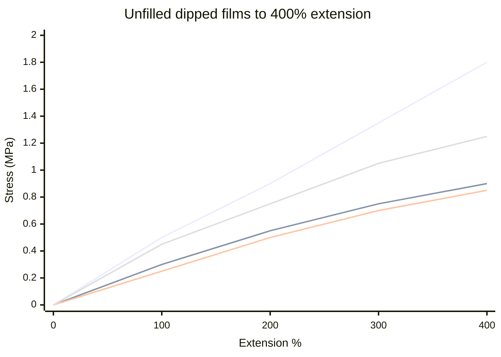
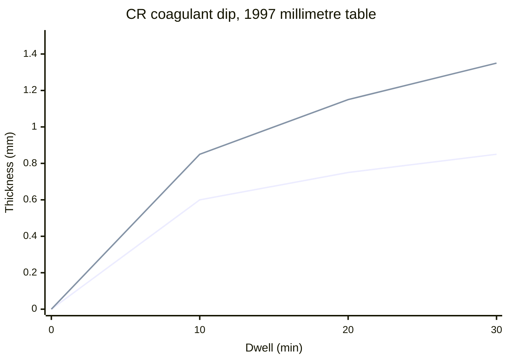

# Synthetic Lattices: CR, NBR, and SBR

> Skin and allergy questions are in [Allergy and Skin Contact](/literature-reviews/allergy-and-skin-contact). This page is about which liquid you dip.

## Executive summary

In liquid latex, you dip a former and withdraw a thin rubber film. Most dipping uses natural rubber latex. Polychloroprene provides sunlight, ozone, and solvent resistance, making it suitable for gloves exposed to hydrocarbon oils and greases. Carboxylated nitrile provides even higher resistance to oils and greases, along with a stronger wet deposit during dipping. However, carboxylated nitrile compounds spoil if left in the dipping tank too long. Polychloroprene compounds require zinc oxide and an antioxidant to prevent rapid degradation. Plain SBR latex lacks the properties needed for dipping and should not be used.

Use these rules when compounding a dipping bath. For chemical exposure on finished dry films, see the [Compatibility Matrix](/literature-reviews/compatibility-matrix-metals-oils-plastics). For seaming instructions, see [Adhesives and Seam Integrity](/literature-reviews/liquid-adhesives-and-seam-integrity).

## Questions this article answers

- [Which latex do you dip?](#which-latex)
- [What does polychloroprene need in the compound?](#cr-compound)
- [What happens if a nitrile dip sits?](#nbr-pot)
- [How do you match the adhesive?](#polarity)

## Which latex do you dip? {#which-latex}

### How

Dip natural rubber latex if you do not have a specific chemical or environmental resistance requirement.

Dip polychloroprene when the finished item must withstand petroleum oils, grease, ozone, or direct sunlight. You must add zinc oxide and an antioxidant to the compound before dipping.

Dip carboxylated nitrile when you require superior hydrocarbon-oil and grease resistance alongside high wet-film strength. Check the acrylonitrile content on the manufacturer's technical data sheet. A higher acrylonitrile ratio provides greater oil resistance.

Do not use plain SBR latex for dipped wearables.

For gloves that require specialized surface resistance, dip natural rubber first to form the inner lining, then apply the synthetic latex as an outer dip. If you place a carboxylated nitrile outer layer over a natural rubber lining, inspect the interface carefully because the layers can delaminate.

### Why

Natural rubber latex remains the default material for dipped goods because of its high elasticity, easy processing, and strong wet gel. Most synthetic latices form weaker wet deposits and lower-strength vulcanized films.

Polychloroprene latex resists sunlight, ozone, heat aging, chemical solvents, abrasion, and burning. It also resists gas and liquid permeation. Industrial dipping first adopted polychloroprene for chemical-resistant gloves where petroleum products destroyed natural rubber.

Styrene-butadiene rubber (SBR) latex provides no functional benefits for dipping. Industrial handbooks note that plain SBR is almost completely excluded from dipping operations. On polarity charts, plain SBR behaves like natural rubber, offering no added resistance.

Carboxylated nitrile outperforms regular nitrile in dipping because the acid groups improve wet-gel strength and produce a tougher, more abrasion-resistant dry film. However, synthetic coatings over natural rubber linings carry a known risk of delamination at the bond line.

Detail: Two polychloroprene grades, one chart

Polymer Latices Vol 3 prints stress–strain curves for unfilled vulcanized dipped films from two polychloroprene grades alongside a reference band for natural rubber films. The curves compare stress up to 400% extension rather than break points. Stress is reported in megapascals.

Review your raw material specification sheets. Different commercial polychloroprene grades vary widely in modulus across identical elongation levels.

## What does polychloroprene need in the compound? {#cr-compound}

### How

Add at least 5 parts of zinc oxide and 2 parts of an antioxidant per 100 parts of dry polychloroprene rubber. Disperse both powders thoroughly into water before adding them to the latex.

Increase zinc oxide up to 15 parts per hundred dry rubber if the film faces prolonged outdoor exposure, elevated heat, or contact with acid-sensitive substrates. Run sample tests before altering the standard 5-part recipe.

Select dark pigments, such as carbon black or iron oxide red, for outdoor articles. Polychloroprene degrades in direct sunlight when formulated in light colors.

If the compound is designed for post-dip curing, vulcanize the dried film using the prescribed heat cycle.

### Why

Zinc oxide and antioxidants give polychloroprene its characteristic stability. Unprotected chloroprene polymer chains degrade through two competing pathways during aging. Chain scission softens and weakens the polymer, while spontaneous crosslinking embrittles it into a rigid resin.

Zinc oxide accepts free acid and initiates crosslinking at allylic chlorine sites formed during polymerization. The antioxidant inhibits free-radical oxidation along the polymer backbone.

Industrial recipes omit zinc oxide only when dipping onto strongly alkaline or acid-neutralizing substrates, such as asbestos gaskets or hydraulic cement. Dipped garments always require the full zinc oxide load.

Detail: Neoprene 571 dipped-film example

The Vanderbilt Latex Handbook documents DuPont Neoprene Latex 571 dipping formulations using parts per hundred dry rubber (phr). Each variation includes DARVAN SMO (3 phr), DARVAN WAQ (1 phr), zinc oxide (5 phr), and an antioxidant (2 phr).

Specific columns introduce mineral and accelerator variations:
- Column B adds 10 phr McNAMEE kaolin clay.
- Column C retains 10 phr clay and adds 1 phr BUTYL NAMATE with 1 phr ETHYL TUADS.
- Column D retains 10 phr clay and adds 2 phr thiocarbanilide.

The coagulant-dipped test films were leached, dried for 16 hours at 24°C followed by 2 hours at 66°C, and then vulcanized. Uncured tensile strengths measure between 13.8 and 14.8 MPa across all four batches, with elongation at break ranging from 840% to 950%. After 60 minutes of vulcanization at 141°C, Column C reached a tensile strength of 25.0 MPa.

When submerged in ASTM Oil No. 3 for 22 hours at 100°C, the fully vulcanized Column C film still absorbed oil, swelling by approximately 120% volume. Polychloroprene protects against oils that dissolve natural rubber, but it remains susceptible to measurable swelling in aggressive hydrocarbons.

Detail: pH and coagulant-dip thickness

Polymer Latices Vol 3 demonstrates that deposit thickness during coagulant dipping depends directly on compound pH. The standard industrial operating window ranges from pH 10.3 to 10.9. This range balances bath stability against deposit thickness. Formulators add potassium hydroxide solution to raise pH and glycine solution to lower it.

Lowering compound pH from 12.1 down to 10.7 using 0.5 phr glycine increases the pickup thickness on the former:

Blackley's earlier work in *High Polymer Latices* (1966) records this same relationship with an operating window of pH 10.3 to 10.8. In the 1966 data, a 10-minute dwell yielded 0.035 inches with 0.5% glycine versus 0.020 inches without glycine.

The 1997 test formulation contains 100 parts dry polychloroprene, 5 parts zinc oxide, 10 parts kaolinite clay, and 2 parts phenyl-2-naphthylamine. The coagulant bath contains calcium chloride (1 part), calcium nitrate tetrahydrate (1 part), acetone (2 parts), and methanol (6 parts).

## What happens if a nitrile dip sits? {#nbr-pot}

### How

Compound carboxylated nitrile latex only when you are ready to dip.

Monitor dipping bath age closely. If a bath sits idle, wet-gel strength drops. If the dried film develops mud-cracking, blend fresh unaged compound into the bath. If severe mud-cracking persists, discard the bath.

Dry wet deposits under moderate temperatures. Do not force high heat early in drying.

To improve wet-film coalescence without degrading elasticity, add up to 2 parts of an ester plasticizer, such as di-n-butyl phthalate, per 100 parts of dry rubber.

### Why

Wet-gel strength measures how well the coagulated, water-swollen deposit holds together as the former leaves the bath. Coagulant dipping requires a cohesive wet skin that resists tears during withdrawal and washing. Carboxylated nitrile provides higher wet-gel strength and better dry abrasion resistance than regular nitrile.

As liquid carboxylated nitrile sits in a compounded state, it undergoes room-temperature prevulcanization. This crosslinking inside the wet droplets reduces particle cohesion. When the wet gel shrinks during water evaporation, the weak boundaries rupture, forming mud-cracks across the surface.

Nitrile polymers also exhibit low water-vapor permeability. If oven temperatures are raised too early, surface water evaporates while moisture remains trapped underneath, blistering or cracking the film.

Detail: Household glove compound example

Polymer Latices Vol 3 (Table 17.7) provides a commercial formulation for coagulant-dipped household gloves based on carboxylated acrylonitrile-butadiene latex.

Dry parts per 100 parts of rubber include:
- Ammonia: 0.5
- Maleic anhydride–styrene copolymer: 0.5
- Ammonium caseinate: 0.015
- Sulfur: 1.5
- Zinc diethyldithiocarbamate (ZDEC): 2.0
- Zinc oxide: 2.5
- Titanium dioxide: 2.0
- Color pigment: as needed

This formulation relies on ionic crosslinks formed between the zinc oxide and carboxylic acid groups alongside traditional sulfur vulcanization. An added antioxidant is omitted because nitrile polymers resist atmospheric oxidation far better than natural rubber or polychloroprene.

## How do you match the adhesive? {#polarity}

### How

When joining non-porous rubber faces, match the polarity of your adhesive to the polarity of the film.

Select high-polarity adhesives for nitrile rubber. Use medium-polarity adhesives for polychloroprene. Use low-polarity adhesives, such as natural rubber solvent cements, for natural rubber or plain SBR.

When bonding porous substrates like untreated fabric, ensure the liquid latex wets and enters the open pore structure. Verify that electrostatic charges on the latex particles and fabric fibers attract rather than repel.

For specific seam construction steps, consult [Adhesives and Seam Integrity](/literature-reviews/liquid-adhesives-and-seam-integrity).

### Why

Rubber contact bonding relies on thermodynamic compatibility between the dry polymer layers. High-polarity elastomers reject low-polarity adhesives, leading to poor wet-out and premature adhesive failure at the interface.

Nitrile sits at the high end of the polarity scale due to its nitrile (-CN) groups. Polychloroprene occupies a medium position due to its repeating chlorine atoms. Natural rubber and plain SBR contain non-polar hydrocarbon backbones and sit at the low end.

Porous substrates bond primarily through mechanical interlocking and capillary action. For porous materials, adhesive performance depends on surface wetting, physical penetration into voids, and complementary electrical charges rather than polarity matching.

Detail: Full polarity ranking

The Vanderbilt Latex Handbook categorizes commercial elastomer types by degree of polarity for non-porous bonding:

| High Polarity | Medium Polarity | Low Polarity |
| --- | --- | --- |
| NBR (Nitrile) | CR (Polychloroprene) | NR (Natural Rubber) |
| XNBR (Carboxylated Nitrile) | PVC (Polyvinyl Chloride) | SBR (Styrene-Butadiene) |
| XSBR (Carboxylated SBR) | | BR (Polybutadiene) |
| PSBR (Pyridine SBR) | | IIR (Butyl Rubber) |

Plain SBR belongs to the low-polarity group with natural rubber. Carboxylated SBR (XSBR) shifts into the high-polarity category alongside nitrile latices due to its ionic carboxylic groups. Match your solvent cement or latex adhesive to the exact elastomer chemistry of your dipped film.

## Sources

- *The Vanderbilt Latex Handbook*. 3rd ed. Edited by Robert Francis Mausser. Norwalk, CT: R.T. Vanderbilt Company, 1987. https://lccn.loc.gov/92117844
- *Polymer Latices: Science and Technology — Volume 3: Applications of Latices*. 2nd ed. D. C. Blackley. Chapman & Hall / Springer, 1997. https://books.google.com/books?id=Y2VPGj7YbykC
- *High Polymer Latices: Their Science and Technology*. 2 vols. D. C. Blackley. London: Maclaren; New York: Palmerton, 1966. https://lccn.loc.gov/66077950