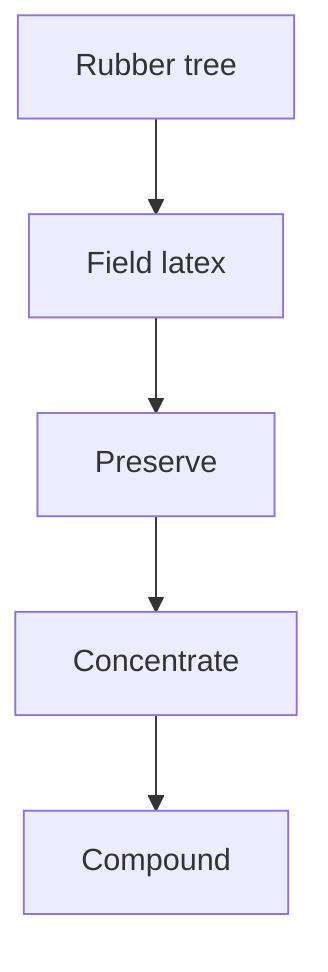

# From the Rubber Tree to Liquid Latex

> **Safety.** Ammonia fumes from natural rubber latex may be a health hazard if you breathe them for a long time. The Vanderbilt Latex Handbook recommends switching to a low-ammonia natural latex and ventilating the room. For shop air standards, see [Liquid Latex Ventilation and Ammonia](/literature-reviews/liquid-ventilation-ammonia). For skin contact safety, see [Allergy and Skin Contact](/literature-reviews/allergy-and-skin-contact).

## Executive summary

On the liquid latex pathway, natural rubber latex starts as field latex harvested from the rubber tree. Producers preserve the fresh liquid so it remains fluid, then concentrate it to remove excess water. Compounding occurs after concentration, preparing the liquid so you can dip, cast, or spread a film.

Use this review to trace the feedstock sequence from the plantation to the workbench before addressing storage, bottle labels, or film-forming operations.

## Questions this article answers

- [What is the chain from the tree to concentrate?](#chain)
- [Where do compound and film forming start?](#forming)
- [Where are storage and bottle labels?](#storage)

## What is the chain from the tree to concentrate? {#chain}

### How

Follow this production sequence when tracking liquid latex from its botanical source:

1. Harvest raw field latex from the tree by tapping.
2. Preserve the raw fluid immediately on the plantation to prevent coagulation and spoilage.
3. Concentrate the latex to raise the rubber proportion and remove excess serum.
4. Compound the concentrate with chemical additives before forming a film.

For related details on tree biology, see [Rubber Tree Biology](/literature-reviews/liquid-hevea-rubber-tree). For harvesting and field handling, see [Plantation Tapping and Field Latex](/literature-reviews/liquid-plantation-tapping-field-latex). For concentration plant processes, see [Field Latex to Concentrate](/literature-reviews/liquid-field-latex-to-concentrate).

### Why

Fresh field latex flows out when tapping cuts sever the latex vessels in the bark. Raw field latex contains roughly 30 to 40 percent dry rubber content, averaging about 33 percent. Without preservation, bacteria and plant enzymes cause the liquid to coagulate within a few hours of collection. Spontaneous coagulation separates the fluid into rubber clots and clear serum, followed quickly by putrefaction. Adding chemical preservatives arrests bacterial breakdown and keeps the rubber particles dispersed.

Shipping unconcentrated field latex across ocean routes is uneconomical because two-thirds of the cargo weight is water. Processing plants therefore concentrate the preserved field latex to roughly 60 percent dry rubber content. Concentration also removes a portion of the non-rubber serum components, yielding a more uniform raw material than variable field latex.

Preserved concentrates arrive with different chemical stabilizers. High-ammonia preserved natural latex can be compounded directly as received, or it can be aerated to lower the ammonia content. Low-ammonia natural rubber latex generally requires no ammonia reduction before compounding.

*The Vanderbilt Latex Handbook* (1987) notes that natural rubber latex occurs in the *Hevea brasiliensis* tree and the guayule plant. D. C. Blackley (1966) records that the commercial world supply of natural rubber latex was obtained almost exclusively from *Hevea brasiliensis*. Both statements remain accurate within their respective contexts of botanical occurrence and industrial market history.

Detail: Concentration methods in industrial latex production

Blackley (1966) identifies four primary methods historically used to concentrate natural rubber latex:

- **Centrifuging**: High-speed bowl separators divide preserved field latex into a rubber-rich concentrate and a rubber-poor skim fraction. Centrifuging removes non-rubber serum constituents and discards a fraction of the smallest rubber particles. The commercial market documented in 1966 strongly favored centrifuged latex, and modern liquid latex distribution relies primarily on this method.
- **Creaming**: Adding chemical creaming agents (such as sodium alginate or locust bean gum) causes rubber particles to cluster loosely and rise to the surface. Like centrifuging, creaming separates non-rubber substances into the serum layer and selectively shifts particle-size distribution.
- **Evaporation**: Heating the latex under vacuum drives off water without separating serum fractions. Evaporation preserves the original proportion of non-rubber solids relative to rubber hydrocarbon and retains the entire spectrum of particle sizes.
- **Electrodecantation**: An electrical field drives charged rubber particles toward semi-permeable membranes, concentrating the dispersion. This method removes soluble serum components alongside water.

Detail: Solids arithmetic and dry rubber content

Latex composition requires distinguishing between total solids content (TSC) and dry rubber content (DRC). 

Total solids represent the entire mass remaining after drying a sample to constant weight, including rubber hydrocarbon, proteins, resins, and inorganic salts. Dry rubber content measures only the coagulable hydrocarbon fraction.

In Blackley (1966), commercial concentrate standardizes at approximately 60 percent DRC. In the worked example from *The Vanderbilt Latex Handbook* (1987), a typical centrifuged natural latex is designated as 62 percent total solids, with rubber solids constituting 60 percent of total wet weight. Compounding formulations using this standard calculate 100 parts dry rubber per 167 parts wet latex by weight:

$$\text{Wet weight} = \frac{\text{Dry parts}}{\text{DRC}} = \frac{100}{0.60} \approx 166.7 \text{ parts wet}$$

The remaining 2 percent of total solids represents non-rubber constituents that stay suspended in the aqueous phase.

Detail: Botanical origin and commercial cultivation context

Blackley (1966) classifies *Hevea brasiliensis* within the family Euphorbiaceae. The latex resides in specialized laticiferous vessels situated within the inner bark, outside the cambium. Tapping cuts open these tubular vessels, allowing turgor pressure within the tree to expel the latex until natural coagulation seals the cut. 

Industrial cultivation, specific high-yielding clones, and regional disease factors are detailed in [Rubber Tree Biology](/literature-reviews/liquid-hevea-rubber-tree).

## Where do compound and film forming start? {#forming}

### How

Do not try to make finished rubber goods directly from raw, uncompounded concentrate:

1. Obtain preserved concentrated latex.
2. Compound the concentrate by blending required dispersions, such as sulfur, zinc oxide, accelerators, antioxidants, and color pigments.
3. Form the film by dipping a former, casting into a mould, or spreading onto a carrier substrate.

For film-forming procedures, see [Forming Film from Liquid Latex](/literature-reviews/liquid-film-pathway).

### Why

A dried deposit of raw latex does not make a functional garment. Film formed from uncompounded, unvulcanized latex remains soft, sticky, and susceptible to deformation under body heat. It swells excessively in solvents, dissolves in oils, and degrades quickly when exposed to oxygen and light.

Compounding introduces the chemical systems required for manufacturing. Adding stabilizers protects the colloidal suspension against premature coagulation during mechanical agitation. Adding vulcanizing agents and accelerators allows the polymer chains to cross-link into an elastic network during subsequent drying and heating cycles.

Detail: Colloidal dispersion definitions

*The Vanderbilt Latex Handbook* (1987) defines latex, whether natural or synthetic, as a colloidal dispersion of a polymeric material in an essentially aqueous medium. In natural rubber latex, individual cis-1,4-polyisoprene particles remain suspended in water because their protective outer layer carries a negative electrical charge. 

Compounding ingredients cannot be added as dry powders. Insoluble solids must first be ground into fine aqueous dispersions with compatible surfactants. Adding dry powders directly to latex destabilizes the protective electrical double layer, causing immediate, irreversible shock coagulation.

## Where are storage and bottle labels? {#storage}

### How

Manage stored liquid latex according to its chemical preservation requirements:

1. Store liquid latex containers tightly closed in temperature-controlled spaces, preventing exposure to frost or excessive heat.
2. Check container labels to verify whether the stock is high-ammonia or low-ammonia concentrate.
3. Ensure adequate room ventilation or local fume extraction whenever opening containers or compounding high-ammonia stock.
4. Consult specific companion reviews for operational parameters:
   - For container management, cream separation, and freeze protection, see [Liquid Latex Aging, Storage and Care](/literature-reviews/liquid-aging-storage-and-care).
   - For trade terms and bottle markings, see [Decoding Liquid Latex Bottle Labels](/literature-reviews/liquid-decoding-bottle-labels).
   - For health safeguards and room air management, see [Liquid Latex Ventilation and Ammonia](/literature-reviews/liquid-ventilation-ammonia).

### Why

Natural rubber latex requires continuous chemical preservation to remain stable during international transit and storage. Without preservatives, ambient bacteria metabolize the serum proteins, lowering the pH and neutralizing the particle charges until the latex curdles into a solid mass.

Ammonia serves as the primary industrial preservative by acting as both a bactericide and an alkaline stabilizer. Because ammonia continuously releases gas into container headspace, opening a storage drum or bottle exposes the user to sharp fumes. Sustained inhalation of concentrated ammonia fumes damages respiratory membranes, making active shop ventilation essential.

Detail: Short-term anticoagulants versus long-term preservation

Blackley (1966) separates the preservation of natural rubber latex into two distinct operational classes:

- **Short-term preservation (anticoagulants)**: Plantation workers add mild anticoagulants (such as sodium sulfite, formaldehyde, or dilute ammonia) directly to tapping cups or field collection buckets. These agents only need to keep field latex fluid for a few hours or days while it travels to a local processing factory for coagulating into dry rubber sheet or crepe.
- **Long-term preservation**: Liquid concentrates intended for shipment across global supply chains require robust, multi-month preservation. High-ammonia systems maintain an ammonia concentration of roughly 0.7 percent by weight in the liquid. Low-ammonia systems reduce ammonia to approximately 0.2 percent and add secondary preservatives, such as tetramethylthiuram disulfide (TMTD) paired with zinc oxide, or sodium pentachlorophenate. 

Any bottled concentrate purchased for liquid film fabrication belongs to the long-term preservation class.

## Sources

- *High Polymer Latices: Their Science and Technology*. 2 vols. D. C. Blackley. London: Maclaren; New York: Palmerton, 1966. <https://lccn.loc.gov/66077950>
- *The Vanderbilt Latex Handbook*. 3rd ed. Edited by Robert Francis Mausser. Norwalk, CT: R.T. Vanderbilt Company, 1987. <https://lccn.loc.gov/92117844>