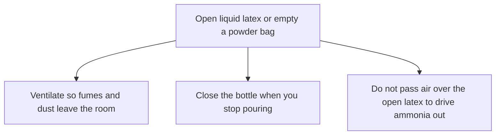

# Liquid Latex Ventilation and Ammonia

> **Safety.** Ammonia and rubber chemicals can irritate skin and lungs, and some rubber chemicals sensitize skin. If you feel dizzy, nauseated, or get a new rash or breathing trouble, stop and get fresh air. This page is shop hygiene. A clinician handles diagnosis. Your local authority handles the building.

## Executive summary

Liquid latex is water-based and usually preserved with ammonia. When compounding, you also handle dry powders. The shop hazards documented in latex handbooks are prolonged inhalation of ammonia fumes, airborne dust from compounding powders, and chemical burns from acids or alkalis.

Review these precautions before opening a container indoors, and before weighing zinc oxide, sulfur, or accelerators. For container labeling, see [Decoding consumer latex bottle labels](/literature-reviews/liquid-decoding-bottle-labels). For skin reaction categories, see [Allergy and Skin Contact](/literature-reviews/allergy-and-skin-contact). For storage shelf life, see [Liquid latex aging, storage and care](/literature-reviews/liquid-aging-storage-and-care).

## Questions this article answers

- [What do I do when the bottle is open?](#when-the-bottle-is-open)
- [Which metals stay off the liquid?](#metals)

## What do I do when the bottle is open? {#when-the-bottle-is-open}

### How

1. Read the safety data sheet for your liquid latex and for each compounding powder.
2. Open the container where moving air exhausts fumes directly out of the workspace. Close the cap as soon as you finish pouring.
3. Switch to low-ammonia latex if you work in the room for extended periods, and run continuous ventilation.
4. Wear a particulate respirator and protective clothing when weighing or transferring dry powders like zinc oxide, sulfur, antioxidants, or accelerators. Wash exposed skin after handling, and launder work clothing regularly.
5. Always pour acid or alkali slowly into water when diluting. Never mix strong acids directly with strong alkalis. Wear eye goggles, rubber gloves, and an apron.
6. Leave the preservative in the latex. Do not sweep air across the open surface of the liquid to strip the ammonia smell.

### Why

*The Vanderbilt Latex Handbook* (1987) notes that the workspace requires thorough ventilation. Ammonia gas escaping from natural rubber latex creates a health hazard when inhaled over prolonged periods. The handbook recommends switching to low-ammonia concentrate and ventilating the room whenever operations run for extended hours.

*Practical Guide to Latex Technology* (2013) identifies the sharp odor as the main drawback of ammonia preservation, particularly at levels above 0.3 percent. Concentrated latex releases ammonia vapor quickly into room air, causing respiratory discomfort and eye irritation. While the guide classifies ammonia as generally non-toxic at minor levels, moving air keeps exposure well below irritating thresholds.

Dry compounding chemicals bring physical and dermal hazards. Emptying powder bags into mixing vessels releases fine airborne particulates. Many rubber accelerators and antioxidants act as skin irritants and contact sensitizers. Corrosive liquids used for pH adjustment or coagulant baths present severe burn risks. Diluting by adding concentrated acid or alkali to water prevents violent boiling and spattering caused by heat of hydration.

Detail: Workplace ammonia limits

These occupational exposure limits apply to anhydrous ammonia gas (CAS 7664-41-7) in ambient air during industrial shifts.

OSHA enforces a Permissible Exposure Limit (PEL) of 50 ppm (35 mg/m³) measured as an 8-hour time-weighted average (TWA).

The National Institute for Occupational Safety and Health (NIOSH) recommends a Recommended Exposure Limit (REL) of 25 ppm (18 mg/m³) as a TWA up to a 10-hour shift, alongside a 15-minute Short-Term Exposure Limit (STEL) of 35 ppm (27 mg/m³). NIOSH marks 300 ppm as Immediately Dangerous to Life or Health (IDLH).

Detail: Plant equipment that strips ammonia from the latex

D. C. Blackley's *High Polymer Latices* (1966) outlines the industrial mechanics of partial deammoniation. Excess ammonia inhibits delayed-action gelation systems like sodium silicofluoride (SSF) during latex foam manufacturing.

Plants reduce ammonia concentrations by passing a low-velocity stream of warm air across the surface of a gently agitated bulk vessel. The gas in the headspace diffuses into the stream without air bubbling through the bulk, which would cause mechanical shear, surface skinning, and foam formation.

This plant equipment operates under precise mechanical control. For workshop production, handbooks specify using low-ammonia concentrate rather than trying to deammoniate open batches on site.

Detail: Lab compounding order

*The Vanderbilt Latex Handbook* outlines analytical quality tests for raw liquid latex: total solids content (ASTM D1076), dry rubber content, Brookfield viscosity, pH, mechanical stability time (MST), potassium hydroxide (KOH) number, volatile fatty acid (VFA) number, trace heavy metals (ASTM D1278), and boric acid or ammonia titration. Titration samples are stoppered immediately to prevent volatile ammonia loss before back-weighing.

During laboratory compound preparation, low-shear agitation avoids drawing a vortex that entrains air. Ingredients are incorporated in this specific sequence:

1. Colloidal stabilizers (surfactants, potassium hydroxide solutions)
2. Vulcanizing agents, activators, and accelerators (zinc oxide, sulfur, dithiocarbamates) as prepared aqueous dispersions
3. Antioxidant aqueous dispersions
4. Mineral fillers, color dispersions, and plasticizer emulsions
5. Water-soluble thickeners (polyacrylates, cellulose derivatives)

Dipping trial formers use polished aluminum, borosilicate glass, or glazed porcelain. Dipped deposits requiring serum extraction undergo leaching in running water baths at 40–50 °C for 20–30 minutes before final drying and oven vulcanization.

## Which metals stay off the liquid? {#metals}

### How

Keep copper, brass, bronze, and galvanized metals away from liquid latex. Never use containers, transfer valves, fittings, or stirring implements made from these metals. Use tools and vessels made from 304 or 316 stainless steel, ungalvanized black iron, high-density polyethylene, or borosilicate glass.

### Why

*The Vanderbilt Latex Handbook* notes that copper and copper alloys must never come into contact with natural rubber latex. Dissolved copper acts as an active oxidation catalyst, triggering rapid polymer chain scission that turns the rubber sticky, soft, and permanently degraded.

Galvanized equipment presents an immediate colloidal hazard. The zinc coating reacts with serum constituents and drops the colloidal stability of the latex, causing rapid local coagulation that plugs lines and ruins batches. Industrial piping relies on stainless steel, lined black iron, or glass coatings to keep metals completely isolated from the compound.

## Sources

- *The Vanderbilt Latex Handbook*. 3rd ed. Edited by Robert Francis Mausser. Norwalk, CT: R.T. Vanderbilt Company, 1987. <https://lccn.loc.gov/92117844>
- *Practical Guide to Latex Technology*. Rani Joseph. Shawbury: Smithers Rapra Technology, 2013. <https://books.google.com/books/about/Practical_Guide_to_Latex_Technology.html?id=NB5AMwEACAAJ>
- *High Polymer Latices: Their Science and Technology*. 2 vols. D. C. Blackley. London: Maclaren; New York: Palmerton, 1966. <https://lccn.loc.gov/66077950>
- OSHA. Chemical data: Ammonia (CAS 7664-41-7). <https://www.osha.gov/chemicaldata/623>
- NIOSH Pocket Guide to Chemical Hazards: Ammonia. Centers for Disease Control and Prevention. <https://www.cdc.gov/niosh/npg/npgd0028.html>