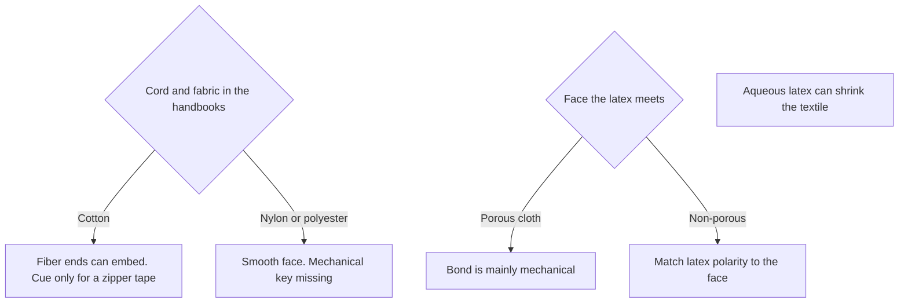

# Liquid Zipper Closure Compatibility

> **Safety.** A latex adhesive can freeze, and it can corrode some metals. Wet metal parts belong with [Liquid hardware](/literature-reviews/liquid-hardware-metal-contact) and the [compatibility matrix](/literature-reviews/compatibility-matrix-metals-oils-plastics).

## Executive summary

Liquid latex adhesives wet zipper tape directly. Because these adhesives are water-based, they can shrink woven textile tapes during application. When bonding to porous tape faces, adhesion relies on mechanical interlock. Cotton tape offers protruding fiber ends that embed into the rubber film, while smooth continuous-filament nylon and polyester tapes lack that mechanical key. On non-porous surfaces, latex polymer polarity must match the substrate face. Sheet latex and solvent rubber cement are covered in [Sheet zipper closure compatibility](/literature-reviews/sheet-zipper-closure-compatibility).

## Questions this article answers

- [Which zipper parts meet the liquid latex?](#which-parts)
- [What does a latex adhesive do to the tape?](#shrink)
- [Cotton tape, or a slick nylon or polyester tape?](#fiber)
- [What does ASTM D2054 test?](#d2054)

## Which zipper parts meet the liquid latex? {#which-parts}

### How

Identify which zipper components touch the wet compound before you apply adhesive.

| Part | What to check |
| --- | --- |
| Woven tape | Cotton, nylon, or polyester fiber content |
| Coil or teeth | Nylon coil, or metal exposed to wet latex |
| Stops and pull | Placement inside or outside the glue pathway |

For cloth faces in general, see [Liquid latex–textile bonding](/literature-reviews/liquid-latex-textile-bonding). For bonding systems, see [Liquid adhesives](/literature-reviews/liquid-adhesives-and-seam-integrity).

### Why

Liquid latex wets the woven tape directly. The coil or teeth form a separate mechanical element. If wet latex touches bare metal teeth, top stops, or bottom stops, water and compounding chemicals can corrode the metal before the film dries.

## What does a latex adhesive do to the tape? {#shrink}

### How

Account for fabric shrinkage before you attach the zipper tape, and protect liquid latex adhesives from freezing during storage and application.

### Why

Latex adhesives suspend rubber particles in water. When this water penetrates woven tape yarns, the fibers swell and shrink the fabric along its length. Industrial reference manuals explicitly identify textile shrinkage, freeze sensitivity, and metal corrosion as standard trade-offs when using water-based latex adhesives instead of solvent rubber cement.

Detail: Other latex adhesive trade-offs

The Vanderbilt Latex Handbook lists several secondary performance limits for water-based latex adhesives:
- Lower water resistance compared to vulcanized solvent films.
- Wrinkling or curling on paper and thin cellulosic textiles.
- Contamination risks from metal storage containers and application equipment.
- Slower drying rates due to the high latent heat of vaporization of water.
- Reduced electrical insulation properties in the dried film.

Solvent-based adhesives avoid fabric shrinkage and flash off quickly, but introduce flammability hazards and organic solvent vapors.

## Cotton tape, or a slick nylon or polyester tape? {#fiber}

### How

Check the fiber construction of the zipper tape before applying liquid latex:

- Select spun cotton tape when you need natural rubber latex to lock around exposed fiber ends.
- Expect poor adhesion with continuous-filament nylon or polyester tapes unless the textile has received a dedicated surface pretreat or dip.
- On non-porous surfaces, select an adhesive compound whose polymer polarity matches the substrate.

### Why

In *Polymer Latices*, D. C. Blackley explains that spun cotton yarns present many short fiber ends that project outward from the fabric surface. Liquid latex flows around these ends, locking them into the matrix as the film dries to form a mechanical key.

Continuous-filament synthetic yarns like nylon (polyamide) and polyester feature smooth, wax-like surfaces without protruding ends. Because the physical key is missing, natural rubber latex releases easily from untreated synthetic tapes under peel stress. 

As Rani Joseph notes in *Practical Guide to Latex Technology*, adhesion on porous substrates is predominantly mechanical, making polymer polarity less critical. On non-porous substrates where mechanical locking cannot occur, the chemical polarity of the latex must match the surface.

Detail: Abrasion and dip testing in Blackley

Both Blackley texts review tire-cord experiments evaluating adhesion on high-tenacity rayon and synthetic cords. Mechanical surface abrasion increases static bond strength to rubber. Under dynamic flexing, however, mechanical roughening alone does not prevent bond failure unless paired with an adhesive dip.

The 1966 edition describes this process as mechanical abrasion followed by a "latex–casein adhesive" dip. The 1997 edition refers to the dip stage as a "latex–casein abrasive," which appears to be an uncorrected typographical slip while describing the same cord-rubber test sequence.

Detail: Polarity matching on non-porous substrates

The Vanderbilt Latex Handbook classifies latex polymers into polarity groups for non-porous surfaces:
- High polarity: Nitrile (NBR), carboxylated nitrile (XNBR), carboxylated styrene-butadiene (XSBR), and pyridine-styrene-butadiene (PSBR).
- Medium polarity: Polychloroprene (CR) and polyvinyl chloride (PVC).
- Low polarity: Natural rubber (NR), styrene-butadiene (SBR), polybutadiene (BR), and butyl rubber (IIR).

On non-porous faces, low-polarity natural rubber adheres to non-polar surfaces but releases from high-polarity surfaces. For porous substrates, the handbook notes that the liquid must penetrate the pores, and the electrostatic charge of the latex particles must complement the substrate charge to avoid particle repulsion before film formation.

Joseph confirms these categories. Porous substrates rely on mechanical entrapment where polymer selection is flexible. Non-porous surfaces require matched polarity: polar lattices (carboxylated polymers, acrylics, NBR) on polar faces, and non-polar lattices (polyisoprene, SBR) on non-polar faces.

## What does ASTM D2054 test? {#d2054}

### How

Reference ASTM D2054 if you need to determine whether dye rubs off a zipper tape onto adjacent materials. Do not use it to measure seam strength or rubber adhesion.

### Why

ASTM D2054 evaluates colorfastness to crocking on zipper tapes. The standard test rubs dry and wet white test fabric against the tape under controlled pressure to measure dye transfer. It is strictly a textile dye test and does not report mechanical interlocking, wetting behavior, or adhesive peel resistance.

## Sources

- *The Vanderbilt Latex Handbook*. 3rd ed. Edited by Robert Francis Mausser. Norwalk, CT: R.T. Vanderbilt Company, 1987. https://lccn.loc.gov/92117844
- *Polymer Latices: Science and Technology — Volume 3: Applications of Latices*. 2nd ed. D. C. Blackley. London: Chapman & Hall / Springer, 1997. https://books.google.com/books?id=Y2VPGj7YbykC
- *High Polymer Latices: Their Science and Technology*. 2 vols. D. C. Blackley. London: Maclaren; New York: Palmerton, 1966. https://lccn.loc.gov/66077950
- *Practical Guide to Latex Technology*. Rani Joseph. Shawbury: Smithers Rapra Technology, 2013. https://books.google.com/books/about/Practical_Guide_to_Latex_Technology.html?id=NB5AMwEACAAJ
- ASTM D2054. Colorfastness of zipper tapes to crocking.