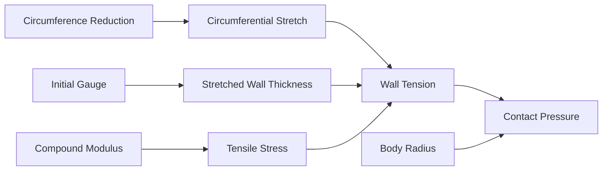

# Pattern reduction and body pressure targets

## Executive summary

Pattern reduction, sheet gauge, and local body radius determine how tightly a latex garment grips the body. Circumference reduction stretches the rubber around a limb or torso. Gauge provides the wall thickness under tension. Radius converts that wall tension into inwards contact pressure. 

For standard fashion sheet latex (0.33 to 0.45 mm gauge, averaging 0.39 mm) made from soft natural rubber, a 12 percent circumference reduction generates roughly 0.8 kilopascals of contact pressure on a mid-limb. That level corresponds to a secure, skintight grip rather than medical compression. Because pressure rises sharply over narrow body parts, the same percentage reduction feels far tighter on a wrist or ankle than on a waist. 

Use these targets when drafting patterns on paper or setting up digital garment simulations in Clo3D.

## Questions this article answers

- [What controls contact pressure on the body?](#what-controls-pressure)
- [How does pattern reduction change across gauge bands?](#reduction-by-gauge)
- [What contact pressures occur across different body radii?](#pressures-by-radius)
- [How do you plan pattern reduction in Clo3D?](#clo3d-workflow)

---

## What controls contact pressure on the body? {#what-controls-pressure}

### How

Adjust contact pressure by altering three independent pattern and material variables:

1. Reduce pattern circumference to set the circumferential stretch ratio.
2. Select sheet gauge to set the base wall thickness.
3. Check the local body radius where the rubber rests.

Keep vertical garment measurements unreduced when drafting skintight garments. Cut pattern circumferences narrower than body circumferences, but preserve vertical body lengths so the rubber does not ride up or drag vertically.

### Why

A garment panel cut smaller than the body must stretch to close. That stretch creates tension across the width of the panel. When curved around a limb or torso, that wall tension pushes inward against the skin.

Three factors govern this inward squeeze:

- Circumference reduction sets how far the polymer chains stretch horizontally.
- Gauge determines how much cross-sectional rubber resists that stretch.
- Body radius determines how focused that force becomes. A wide cylinder like a torso spreads the tension over a large curve, producing low inward pressure. A narrow cylinder like a wrist concentrates the same wall tension over a sharp bend, driving inward pressure up.

Because makers rarely reduce vertical body lengths, the material stretches almost entirely around the circumference while vertical stretch remains near neutral.

Detail: Laplace formulation for a thin stretched cylinder

Under the thin-wall assumption ($t \ll R$), contact pressure $P$ follows the classical Young-Laplace relation:

$$
P = \frac{\sigma_\theta\, t}{R}
$$

where $\sigma_\theta$ is circumferential Cauchy stress, $t$ is the current (stretched) wall thickness, and $R$ is the local body radius.

Assuming negligible longitudinal strain ($\lambda_z \approx 1$) and material incompressibility ($\lambda_\theta \lambda_z \lambda_r = 1$), the radial thinning ratio is:

$$
\lambda_r = \frac{1}{\lambda_\theta} = \frac{1}{\lambda}
$$

The deformed thickness becomes $t = t_0 / \lambda$, where $t_0$ is initial undeformed gauge.

For an incompressible Neo-Hookean solid with shear modulus $G$, the circumferential stress under pure circumferential stretch with fixed length is:

$$
\sigma_\theta = G\left(\lambda^2 - \lambda^{-2}\right)
$$

Substituting $\sigma_\theta$ and $t$ into the Laplace equation yields:

$$
P = \frac{G\left(\lambda^2 - \lambda^{-2}\right)\frac{t_0}{\lambda}}{R} = G\left(\lambda - \lambda^{-3}\right)\frac{t_0}{R}
$$

For a given pattern reduction percentage $r$, the stretch ratio is:

$$
\lambda = \frac{1}{1 - r}
$$

---

## How does pattern reduction change across gauge bands? {#reduction-by-gauge}

### How

Select circumferential reduction percentages according to the sheet gauge band:

| Gauge band (mm) | Midpoint gauge (mm) | Skintight reduction ($r$) | Circumferential stretch ($\lambda$) |
| --- | --- | --- | --- |
| 0.16–0.20 | 0.18 | 14% | 1.16 |
| 0.33–0.45 | 0.39 | 12% | 1.14 |
| 0.55–0.65 | 0.60 | 5% | 1.05 |
| 0.80–1.05 | 0.925 | 2% | 1.02 |

Within the primary fashion band (0.33 to 0.45 mm), scale reduction based on garment fit:

- **Body tailored:** 5% reduction.
- **Body hug:** 8.5% reduction.
- **Skintight:** 12% reduction.

### Why

Thicker sheet resists elongation far more aggressively than thin sheet. A 12 percent reduction on 0.90 mm rubber creates excessive tension that restricts movement and pinches joints. Conversely, a 2 percent reduction on 0.18 mm rubber fails to generate enough tension to keep the garment smooth against the skin.

Craft reduction tables compensate for gauge by dropping the reduction percentage as thickness rises. However, this adjustment does not keep contact pressure identical across all thicknesses. The combined product of reduction and gauge peaks in the 0.33 to 0.45 mm fashion band, giving standard fashion garments their characteristic snug grip.

Detail: Wall tension non-uniformity across gauges

Wall tension $T$ represents force per unit longitudinal length:

$$
T = \sigma_\theta\, t = G\left(\lambda - \lambda^{-3}\right) t_0
$$

Evaluating $T$ across the craft table's skintight definitions with soft natural rubber ($G \approx 0.457$ MPa):

- **0.18 mm band ($r = 0.14$, $\lambda = 1.163$):** $T \approx 0.457 \times (1.163 - 0.636) \times 0.18 \times 10^3 \approx 43.3\text{ N/m}$.
- **0.39 mm band ($r = 0.12$, $\lambda = 1.136$):** $T \approx 0.457 \times (1.136 - 0.682) \times 0.39 \times 10^3 \approx 80.9\text{ N/m}$.
- **0.60 mm band ($r = 0.05$, $\lambda = 1.053$):** $T \approx 0.457 \times (1.053 - 0.857) \times 0.60 \times 10^3 \approx 53.7\text{ N/m}$.
- **0.925 mm band ($r = 0.02$, $\lambda = 1.020$):** $T \approx 0.457 \times (1.020 - 0.942) \times 0.925 \times 10^3 \approx 33.0\text{ N/m}$.

Wall tension peaks in the 0.39 mm band. Heavy gauges (0.60 to 0.925 mm) use small reductions primarily to permit joint articulation, which reduces resting contact pressure relative to mid-weight fashion garments.

---

## What contact pressures occur across different body radii? {#pressures-by-radius}

### How

Anticipate higher contact pressures over narrow anatomical sites. When applying uniform reduction across a pattern piece, plan for the following pressures in the 0.33 to 0.45 mm fashion band:

| Fit level | Reduction ($r$) | Waist ($R = 12\text{ cm}$) | Arm ($R = 5\text{ cm}$) | Wrist ($R = 3\text{ cm}$) |
| --- | --- | --- | --- | --- |
| Body tailored | 5% | 0.29 kPa | 0.70 kPa | 1.16 kPa |
| Body hug | 8.5% | 0.49 kPa | 1.17 kPa | 1.94 kPa |
| Skintight | 12% | 0.68 kPa | 1.62 kPa | 2.70 kPa |

At a standard mid-limb radius ($R = 10$ cm), skintight fashion latex produces approximately 0.81 kPa (headline planning mark: 0.8 kPa).

### Why

Contact pressure is inversely proportional to body radius. If a sleeve uses a uniform 12 percent reduction from bicep to wrist, the contact pressure at the wrist is four times higher than at the waist, and more than double that of the upper arm.

Distal limbs naturally endure higher mechanical compression under simple geometric patterns. To prevent localized constriction at wrists, ankles, or the neck, reduce the reduction percentage slightly over sharp radii, or verify that the calculated pressure remains well below circulatory limits.

Detail: Modulus calibration and compound variations

The baseline shear modulus ($G \approx 0.457$ MPa) reflects postvulcanized high-ammonia sulphur natural rubber film with a relaxed tensile modulus at 100% elongation ($MR_{100}$) of approximately 0.8 MPa. Under the Neo-Hookean strain energy function:

$$
\sigma_{\text{eng}} = G\left(\lambda - \lambda^{-2}\right)
$$

At $\lambda = 2.0$ (100% elongation):

$$
0.8\text{ MPa} = G(2.0 - 0.25) = 1.75\, G \implies G \approx 0.457\text{ MPa}
$$

Commercial calendered sheet latex is dry-milled rubber rather than dipped liquid latex film. While dry-milled sheeting displays similar low-strain elasticity, specific compounds shift these values:

- **Prevulcanized latex:** Unfilled prevulcanized films exhibit lower cross-link densities with $MR_{100} \approx 0.4\text{ to }0.5$ MPa. Contact pressures scale down by roughly 0.55×.
- **Filled and high-styrene sheets:** Compounding with mineral fillers or resin reinforcers elevates the modulus ($M_{300}$ climbs steeply), raising contact pressures for an identical pattern reduction.

The 0.8 kPa planning mark represents an upper-soft reference for unpigmented or lightly loaded natural rubber sheeting.

---

## How do you plan pattern reduction in Clo3D? {#clo3d-workflow}

### How

1. Draft base pattern panels to the avatar's uncompressed body dimensions.
2. Apply 2D pattern reductions along horizontal circumference lines according to the gauge band. Leave vertical lines unreduced.
3. Assign physical fabric presets matching the sheet gauge and density.
4. Simulate fit in a neutral rest pose. Inspect surface contact to verify that resting pressure over mid-limb sections sits near 0.8 kPa.
5. Inspect high-curvature transitions (wrists, neck, ankles). If local pressure spikes, reduce the local reduction percentage.
6. Record the roll batch ID, sheet gauge, applied reduction percentages, and subjective wear feedback.

### Why

Digital simulation engines calculate contact force from mesh deformation. Applying pattern reduction directly to the 2D pattern geometry mirrors flat-pattern cutting in a physical workshop. 

Treating 0.8 kPa as an objective mid-limb planning mark provides a consistent reference across digital avatars of varying scale. Because human tactile perception varies by body site, identical physical pressure does not produce identical sensory pressure. Evaluating digital pressures against known anatomical zones prevents drafting garments that feel restrictive in wear.

Detail: Limitations of cylindrical planning models

The analytical model assumes ideal circular cross-sections and frictionless, unconstrained sliding. Real garment construction deviates in several ways:

1. **Non-circular cross-sections:** Bones and tendons (e.g., the ulna at the wrist, clavicles, shin) create local radii of curvature far smaller than the segment's average radius, generating localized pressure peaks.
2. **Seam bulk:** Overlaid seams add double thickness ($2\,t_0$), elevating local bending stiffness and seamline tension.
3. **Friction and mechanical lock:** High dry surface friction prevents rubber from sliding into uniform circumferential strain, trapping excess elongation near seams or joint folds.

Use the cylindrical Laplace calculation to set baseline pattern reductions, then verify physical fit across mobile joints.

---

## Sources

- Blackley, D. C. (1997). *Polymer Latices: Science and Technology* (2nd ed., Vols. 1–3). Chapman & Hall.