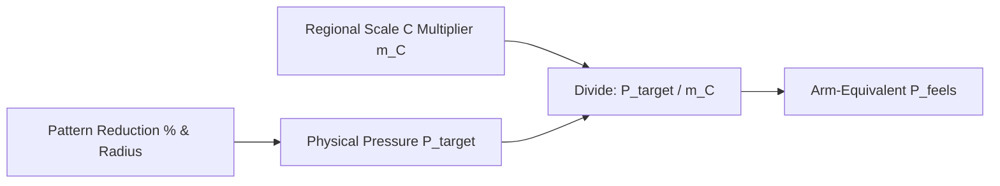
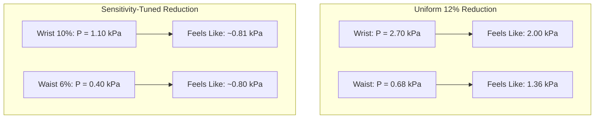

# Reduction and pressure sensitivity

> **Not medical advice.** Planning literacy only. This article does not provide medical diagnosis, prescription for medical compression, or certification for safe bodily constriction.

## Executive summary

Physical contact pressure from pattern reduction does not match how tight a garment feels to the wearer. Human pressure preference varies across the body. Wrists and calves tolerate and prefer higher hoop pressure, while the front of the waist and the neck tolerate far less. 

When you draft patterns using negative ease, calculating physical pressure alone gives a misleading picture of comfort. Dividing physical contact pressure by preferred-clothing-pressure multipliers converts raw kilopascals into an arm-equivalent intensity rating. This conversion shows whether a tight cuff or a snug waist will feel gentle, firm, or constricting before you cut sheet latex.

---

## Questions this article answers

- [How do you calculate arm-equivalent perceived pressure from pattern reduction?](#calculate-feels-like-pressure)
- [Does the Laplace radius effect cancel human pressure sensitivity differences?](#cancelation-effect)
- [How do you budget perceived pressure across extended body regions?](#extended-body-regions)
- [How do reduction levels interact with different body sites?](#fit-reduction-interactions)

---

## How do you calculate arm-equivalent perceived pressure from pattern reduction? {#calculate-feels-like-pressure}

### How

1. Calculate the raw physical contact pressure ($P_{\mathrm{target}}$) in kilopascals using the Laplace cylinder model based on your pattern reduction percentage, sheet latex gauge, and local limb radius.
2. Select the draft Scale C multiplier ($m_C$) for the target body region. Scale C sets the upper arm and forearm as the neutral baseline ($m_C = 1.0$). These bands are planning estimates, not latex-wear validated.
3. Divide raw physical pressure by the regional Scale C multiplier to obtain the arm-equivalent perceived pressure ($P_{\mathrm{feels}}$).
4. Evaluate the result against two standard sensory benchmarks:
   - **0.8 kPa**: light-grip intensity (comparable to a standard mid-limb fit at 12% reduction).
   - **1.6 kPa**: firm intensity (comparable to an upper arm fit at 12% reduction).

### Why

The central nervous system does not register pressure uniformly across every square centimeter of skin. Distal limbs, like the wrists and ankles, have lower subjective sensitivity to broad compression and accept higher mechanical pressure before reporting discomfort. The abdomen and the neck have thin muscular barriers over vital organs and sensitive vascular structures, causing the brain to perceive modest mechanical pressure as intrusive or uncomfortable.

Because the arm sits near the median for preferred pressure tolerance, treating arm pressure as 1.0 provides an intuitive yardstick. If a wrist band exerts 2.70 kPa but has a multiplier of 1.35, it registers subjectively as 2.00 kPa of arm squeeze. Conversely, if a ventral waist band exerts only 0.68 kPa but has a multiplier of 0.50, it registers subjectively as 1.36 kPa of arm squeeze.

Detail: Mathematical definition and scale distinctions

Perceived intensity relative to clothing preference is expressed as:

$$
P_{\mathrm{feels}} = \frac{P_{\mathrm{target}}}{m_C}
$$

Where:
- $P_{\mathrm{target}}$ is the contact pressure calculated via the law of Laplace ($P = T / R$, where $T$ is membrane hoop tension in N/m and $R$ is cylinder radius in meters).
- $m_C$ is the dimensionless regional preference multiplier from the draft Scale C synthesis (preferred clothing pressure), normalized to upper arm = 1.0 — not latex-wear validated.
- $P_{\mathrm{feels}}$ is the normalized perceived intensity expressed in arm-equivalent kilopascals.

Do not substitute tactile detection thresholds (Scale A) or pressure pain thresholds (Scale B) into this formula:
- **Scale A (Sensory Acuity):** Measures spatial two-point discrimination and light-touch detection thresholds (tested via von Frey filaments). It predicts how readily an individual detects subtle ridges, seam steps, or surface textures, not sustained hoop tension.
- **Scale B (Pressure Pain Threshold):** Measures the mechanical force per area required to transition from a sensation of pressure to a sensation of pain (typically tested using blunt algometry probes in units of $\mathrm{kg/cm^2}$ or kPa). Scale B represents a structural ceiling to prevent injury, especially over bony prominences or superficial nerves.
- **Scale C (Preferred Clothing Pressure):** Measures voluntary comfort acceptability under sustained encirclement. Dividing Laplace pressure by $m_C$ normalizes regional mechanical pressure against behavioral tolerance.

---

## Does the Laplace radius effect cancel human pressure sensitivity differences? {#cancelation-effect}

### How

Do not assume that smaller radii automatically balance out higher sensory tolerance. While physical pressure increases as radius shrinks, human sensory variation does not cancel this effect across every part of the body.

Apply these checks when planning panel reductions across different circumferences:
- For distal limbs (wrist, calf), expect partial cancelation: raw pressure is high, but higher tolerance softens the subjective impact.
- For ventral trunk (front of abdomen), expect compounding tightness: raw pressure is low due to large radius, but low tolerance makes it feel disproportionately tight.
- For the neck, treat the combination of small radius and low sensory tolerance as an acute constriction risk.

### Why

The law of Laplace states that wall tension creates higher inward pressure across a tight curve than across a broad curve ($P = T/R$). If you apply a uniform 12% pattern reduction across the entire body, sheet latex tension remains roughly constant, but contact pressure spikes dramatically on small cylinders like the wrist.

Fortunately, human preference runs in the same direction on the limbs: wrists tolerate higher pressure than arms. This creates partial cancelation. On the wrist, a fourfold increase in physical pressure over the waist feels only about 1.5 times tighter in perceived intensity. However, this cancelation breaks down on the neck and abdomen. On the ventral waist, a large radius drops physical pressure, but high biological sensitivity drives perceived tightness back up.

| Site | Radius ($R$) | Physical $P$ (12% reduction) | Scale C Multiplier ($m_C$) | Perceived $P_{\mathrm{feels}}$ | Sensory Reading |
| :--- | :--- | :--- | :--- | :--- | :--- |
| **Mid-limb** | 10 cm | 0.81 kPa | 1.00 | 0.81 kPa | Neutral light grip |
| **Arm** | 5 cm | 1.62 kPa | 1.00 | 1.62 kPa | Firm baseline |
| **Wrist** | 3 cm | 2.70 kPa | 1.35 | 2.00 kPa | Distal tolerance softens high raw pressure |
| **Ventral waist** | 12 cm | 0.68 kPa | 0.50 | 1.36 kPa | Low physical pressure feels firmer than mid-limb |

Detail: Quantitative analysis of the 12% fashion band

Assuming a reference skintight fashion band with initial thickness $t_0 = 0.39\text{ mm}$, engineering strain $r = 12\%$, and a standard soft natural rubber modulus, the circumferential membrane tension is approximately $T \approx 81\text{ N/m}$.

Applying $P = T / R$:
- At the wrist ($R = 0.03\text{ m}$), raw pressure is $P = 81 / 0.03 = 2700\text{ Pa} = 2.70\text{ kPa}$.
- At the ventral waist ($R = 0.12\text{ m}$), raw pressure is $P = 81 / 0.12 = 675\text{ Pa} = 0.68\text{ kPa}$.

The ratio of physical pressure between wrist and ventral waist is:

$$
\frac{P_{\mathrm{wrist}}}{P_{\mathrm{waist}}} = \frac{2.70}{0.68} \approx 3.97
$$

When corrected with Scale C preference multipliers ($m_{C,\mathrm{wrist}} = 1.35$; $m_{C,\mathrm{waist}} = 0.50$):

$$
P_{\mathrm{feels},\mathrm{wrist}} = \frac{2.70}{1.35} = 2.00\text{ kPa}
$$

$$
P_{\mathrm{feels},\mathrm{waist}} = \frac{0.68}{0.50} = 1.36\text{ kPa}
$$

The ratio of perceived intensity is:

$$
\frac{P_{\mathrm{feels},\mathrm{wrist}}}{P_{\mathrm{feels},\mathrm{waist}}} = \frac{2.00}{1.36} \approx 1.47
$$

The sensory ratio (1.47×) is markedly narrower than the physical ratio (3.97×). This confirms partial cancelation along the limb-to-trunk axis. However, full equalization does not occur. Across all body sites, physical pressure spans roughly a 4:1 ratio, while perceived pressure spans roughly a 2.6:1 ratio.

---

## How do you budget perceived pressure across extended body regions? {#extended-body-regions}

### How

When drafting areas beyond the limbs and waist, use anatomical proxy radii to estimate baseline pressure, then apply local Scale C ranges to budget comfort:

1. **Thigh and calf:** Treat the thigh using mid-limb baselines ($m_C \approx 1.00$). Use higher multipliers for the lower leg ($m_C \approx 1.25$), allowing modest reduction increases without discomfort.
2. **Lateral trunk:** Recognize that the sides of the waist tolerate higher pressure ($m_C \approx 0.80$) than the sensitive abdominal midline ($m_C \approx 0.50$). Place primary garment tension along lateral seams rather than across the front panel.
3. **Chest and underbust:** Restrict contact pressure at the chest band ($m_C \approx 0.65$). Check pressure-pain thresholds (Scale B) across the sternum, where bone and cartilage sit directly beneath the skin.
4. **Neck and collar:** Keep pattern reductions minimal. The neck pairs a tight radius with high biological sensitivity ($m_C \approx 0.55$). Small reductions generate substantial physical and perceived constriction.
5. **Face and forehead:** Do not use cylinder hoop-tension formulas. Facial fittings rely on three-dimensional surface mapping, airway clearance, and strict avoidance of Scale B pain limits.

| Extended Region | Proxy Physical $P$ (kPa) | Scale C Multiplier ($m_C$ band) | Perceived $P_{\mathrm{feels}}$ (kPa) | Construction Consideration |
| :--- | :--- | :--- | :--- | :--- |
| **Thigh** | 0.81 | 1.00 (0.90–1.10) | 0.81 | Matches neutral mid-limb light grip |
| **Lower leg / calf** | 1.62 | 1.25 (1.10–1.40) | 1.30 | Perceived intensity is milder than raw arm pressure |
| **Lateral trunk** | 0.68 | 0.80 (0.70–0.90) | 0.85 | Tolerates more tension than the ventral midline |
| **Chest / underbust** | 0.68 | 0.65 (0.55–0.75) | 1.05 | Keep near lower band; sternum has low pain threshold |
| **Neck** | 1.62* | 0.55 (0.50–0.70) | ~2.95* | High constriction risk; actual radius is often below 5 cm |
| **Face / forehead** | — | 0.50 (0.40–0.60) | — | Non-cylindrical; protect airway and avoid sensory fatigue |

*\*Neck values use arm pressure as a cautious proxy. True neck radii are frequently smaller, which elevates physical pressure even further.*

### Why

Garment simulation engines and basic pattern drafts frequently proxy non-cylindrical body regions using standardized cylinder radii. However, human tissues beneath those zones differ fundamentally in compliance and sensory innervation. 

Soft tissue over muscular zones (like the thighs or lateral torso) tolerates mechanical displacement easily. Thin tissue over bone (sternum) or over airway and major neck vessels is a lower-comfort, higher-caution zone. Regional multipliers help avoid treating a smooth, wrinkle-free draft as automatically safe for continuous wear.

Detail: Comfort preference is not physiological safety

Preferred clothing pressure (Scale C) is a subjective comfort construct. It does not certify physiological safety. Clothing-pressure reviews stress that pressure sensation can diverge from autonomic and respiratory responses: keep ventral waist/abdomen low (surface autonomic plexuses), avoid compressing respiratory muscle groups, and treat airway clearance on neck and face as a hard constraint separate from “feels fine.”

Planning checks (planning literacy only — not medical thresholds):
- **Neck / collar:** Small radius plus low Scale C tolerance; keep reductions minimal and do not treat \(m_C\) as permission for continuous constriction.
- **Underbust / thorax:** Prefer the lower end of the draft \(m_C\) band; cross-check Scale B over the sternum; prolonged torso encirclement can fatigue breathing even when short-term comfort ratings look acceptable.
- **Bony landmarks:** Evaluate Scale B (pain ceiling) alongside Scale C over sites such as the dorsal wrist or lateral knee, where numbness can appear without immediate muscle pain.

---

## How do reduction levels interact with different body sites? {#fit-reduction-interactions}

### How

Adjust pattern reductions according to regional sensitivity instead of using a single flat percentage across all pattern pieces.

To balance perceived pressure across an entire garment:
1. Identify your target fit category (for example: tailored, body-hug, or skintight).
2. Look up the resulting physical pressure for each body cylinder in your fit table.
3. Divide each value by the regional Scale C multiplier.
4. Adjust regional pattern dimensions until the resulting perceived pressures fall into your target comfort band.

For example, to maintain an even light-grip sensation across both trunk and limbs:
- Lower the reduction percentage on the ventral waist panel so raw physical pressure drops to ~0.40 kPa. With $m_C = 0.50$, this yields an arm-equivalent intensity of 0.80 kPa.
- Allow the reduction percentage at the wrist to remain higher, generating raw physical pressure of ~1.10 kPa. With $m_C = 1.35$, this yields an arm-equivalent intensity of ~0.81 kPa.

### Why

Applying a uniform pattern reduction across pieces with different circumferences creates uneven physical pressure. Compounding that effect with regional sensory preferences creates a garment that feels loose in some areas and uncomfortably tight in others.

Evaluating different reductions against their Scale C multipliers reveals how perceived pressure shifts between sites:

- **Body-hug waist (10% reduction):** Generates a modest physical pressure of 0.49 kPa. With an abdominal multiplier of 0.50, perceived pressure rises to 0.98 kPa. Even with a gentle fit label, the waist registers as a firm light grip.
- **Skintight wrist (12% reduction):** Generates a high physical pressure of 2.70 kPa. With a distal multiplier of 1.35, perceived pressure drops to 2.00 kPa. While the distal tolerance softens the sensation, raw mechanical pressure remains high enough to ensure the cuff feels securely clamped.
- **Body-tailored waist (6% reduction):** Generates a physical pressure of 0.29 kPa. With a multiplier of 0.50, perceived pressure is 0.58 kPa. This drops the subjective feel safely below the light-grip threshold, making it suitable for extended everyday wear.

Detail: Matrix calculations for regional pattern grading

Pattern grading software typically applies linear perimeter reductions. However, tension-radius relationships are non-linear. The matrix equation for local perceived pressure across any pattern node $i$ is:

$$
P_{\mathrm{feels},i} = \frac{E_{\mathrm{secant}}(\epsilon_i) \cdot t_0 \cdot \epsilon_i}{(1 + \epsilon_i) \cdot R_i \cdot m_{C,i}}
$$

Where:
- $\epsilon_i$ is local engineering strain determined by pattern reduction: $\epsilon_i = r_i / (1 - r_i)$, where $r_i$ is fractional pattern reduction.
- $E_{\mathrm{secant}}(\epsilon_i)$ is the secant tensile modulus of the vulcanized sheet latex at strain $\epsilon_i$.
- $t_0$ is unextended sheet gauge.
- $R_i$ is local deformed body cylinder radius.
- $m_{C,i}$ is the local Scale C preference multiplier.

Because $R_i$ and $m_{C,i}$ vary independently across anatomy, achieving uniform sensory pressure ($P_{\mathrm{feels},i} = \text{constant}$) requires solving for pattern reduction $r_i$ at each anatomical band:

$$
r_i = f\left(P_{\mathrm{feels}} \cdot m_{C,i} \cdot R_i\right)
$$

This explains why flat, proportional reductions across an entire body block invariably cause sensory hot spots at the neck, underbust, and anterior waist.

---

## Sources

- Mitsuno, T., & Kai, A. (2019). *Distribution of the preferred clothing pressure over the whole body*. Textile Research Journal. https://doi.org/10.1177/0040517518786272 (abstract/ordinal use only).
- Mitsuno, T. T. (2023). *Gradient of clothing pressure for comfortable support wear*. Journal of Textile Engineering & Fashion Technology, 9(4), 86–89. https://doi.org/10.15406/jteft.2023.09.00339
- Rolke, R., Baron, R., Maier, C., Tölle, T. R., Treede, D. R., Beyer, A., Binder, A., Birbaumer, N., Birklein, F., Bötefür, I. C., Braune, S., Flor, H., Huge, V., Magerl, W., May, C., Mundstyle, C., Rolko, C., Schattschneider, J., Sommer, C., & Radvilas, V. (2006). *Quantitative sensory testing in the German Research Network on Neuropathic Pain (DFNS): Standardized protocol and reference values*. Pain, 123(3), 231–243. https://doi.org/10.1016/j.pain.2006.01.041