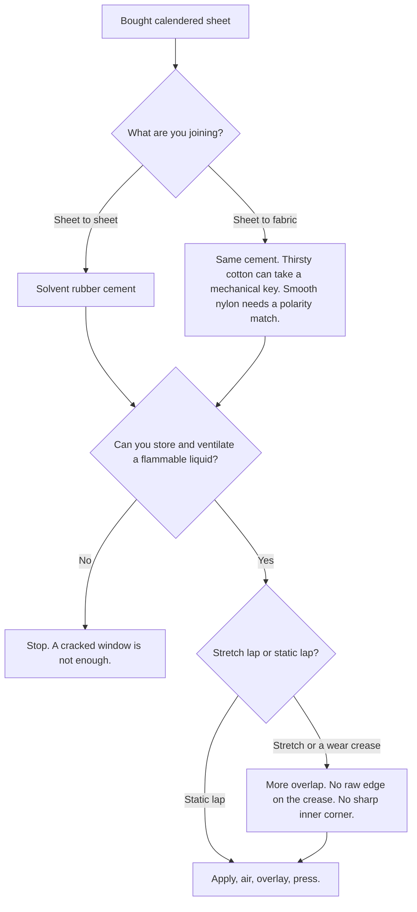
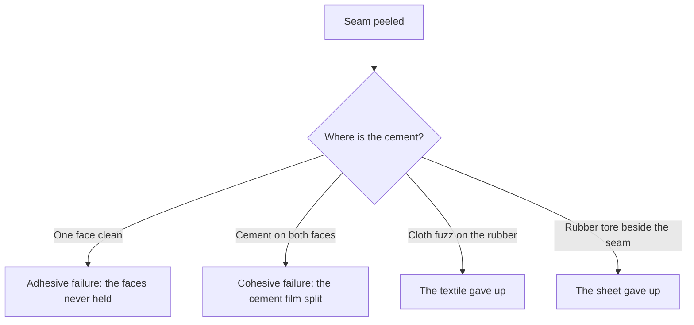

# Sheet Adhesives and Seam Integrity

> **Safety.** Solvent rubber cement is a flammable liquid. Fire, explosion, and toxic fumes are primary hazards. Read the product safety data sheet (SDS). Keep containers closed and away from heat, sparks, and flame. A cracked window is not enough ventilation. See [Sheet ventilation and solvent exposure](/literature-reviews/sheet-ventilation-solvent-exposure).

## Executive summary

Commercial sheet latex is calendered rubber sheet. The proper adhesive for this material is solvent rubber cement: unvulcanized rubber dissolved in a flammable organic solvent. You apply cement to both sides of the lap, air the film until it reaches a tacky state, overlay the edges, and press with a roller.

Select your glue family based on substrate chemistry, not brand marketing. Solvent rubber cement provides immediate tack and moisture resistance for sheet-to-sheet construction. Water-based latex adhesives suit textile manufacturing better than garment assembly.

## Questions this article answers

- [Which adhesive for bought sheet?](#which-adhesive)
- [How long do I wait after I apply it?](#air-the-coat)
- [Does the cement match the sheet?](#match-the-sheet)
- [What is a peeled seam telling me?](#peeled-seam)
- [What are the safety rules?](#safety)

## Which adhesive for bought sheet? {#which-adhesive}

### How

For commercial sheet latex, use solvent rubber cement. Apply an even layer to both faces along the marked glue pathway. Air the coat until the solvent flashes off. Overlay the parts without stretching the sheet. Press the seam flat with a roller.

A lap is an overlap join. One edge rests over the other across the seam allowance, and the adhesive bonds that contact strip. A static lap experiences minimal movement during wear, such as on a pocket, trim, or flat applique. A stretch lap sits across flex points like knees, elbows, crotches, or strap anchors.

For joining sheet latex to fabric, keep using solvent rubber cement. Porous cotton absorbs the liquid carrier and creates a mechanical lock around the fibers. Smooth synthetic textiles like nylon lack open pores and require matching chemical polarity.

### Why

*The Vanderbilt Latex Handbook* contrasts solvent adhesives directly against water-based latex adhesives. Solvent adhesives resist moisture, provide predictable drying rates, build immediate green tack, and wet smooth rubber surfaces easily. These qualities make solvent rubber cement the standard choice for sheet latex.

Water-based latex adhesives avoid flammable vapors and cost less. However, they dry slowly, freeze in storage, wrinkle porous fabrics, and offer poor water resistance.

Detail: Solvent versus latex adhesive systems

Vanderbilt notes key industrial drawbacks for solvent rubber cements: fire hazard, explosion risk, solvent vapor toxicity, and the requirement for explosion-proof ventilation equipment. In contrast, latex adhesives bring practical limitations: water evaporation takes longer, storage requires freeze protection, and residual surfactants lower electrical resistance and water resistance.

Joseph (2013) in *Practical Guide to Latex Technology* outlines the same divide. Solution adhesives wet non-porous surfaces rapidly and build immediate cohesive strength. Blackley (1997) in *Polymer Latices* shows that latex adhesives often form weaker films than solution cements because non-rubber serum components and surfactant shells obstruct interparticle coalescence during drying.

Detail: Calendered sheet manufacturing

Calendered sheet latex is manufactured by pressing compounded rubber stock between heavy, heated steel rollers to establish a uniform gauge. Suppliers sell this material as fully vulcanized roll goods. Because the rubber network is already cross-linked, makers assemble garments by surface bonding cut pieces rather than casting or dipping liquid compound.

## How long do I wait after I apply it? {#air-the-coat}

### How

After applying cement to both sides of the seam, air the coat. Wait for the solvent to evaporate until the adhesive film feels tacky to a light touch, not wet, and not completely dry.

Open time is the duration this tacky window remains usable. Thin coats, high room temperatures, and drafts shorten open time. Thick coats and cool workspace temperatures extend it.

Overlay the pieces while the adhesive film remains tacky. Press across the lap using a hard roller. Keep tension neutral while aligning edges. Once the two adhesive coats make contact, you cannot slide or reposition the seam.

### Why

Solvent rubber cement relies on contact bonding. As volatile solvent leaves the wet film, the concentration of rubber increases until a sticky, high-viscosity layer forms. When two tacky surfaces meet, rubber chains entangle across the interface to create an immediate bond.

If you overlay edges while the cement is still wet, trapped solvent cannot escape through impermeable rubber sheet. The seam stays soft, blisters, and slips under tension. If you wait past the open time, the adhesive film skins over or dries completely, losing the surface tack needed to bond.

Detail: Contact bonding mechanics and open time

Tack is the property that enables an adhesive to form an immediate bond under light contact pressure. Contact adhesives require application to both mating surfaces. Handbooks do not provide standardized minute schedules for fashion gauges (0.20 mm to 1.0 mm) because open time varies with ambient airflow, room temperature, relative humidity, solvent vapor pressure, and coating thickness.

Detail: Green strength during assembly

Green strength refers to the initial cohesive resistance of an adhesive film before full solvent release and chain equilibrium occur. While a seam holds its position immediately after pressing, residual solvent plasticizes the polymer network. Full bond strength requires several hours of resting before the seam can withstand heavy wear tension.

## Does the cement match the sheet? {#match-the-sheet}

### How

Match the polymer base of your adhesive to the rubber sheet. For natural rubber sheet latex, choose a solvent cement made with natural rubber (NR) or styrene-butadiene rubber (SBR). Do not use polar adhesives, such as nitrile rubber (NBR) cement, on natural rubber sheet.

When bonding sheet latex to porous fabric like untreated cotton, the adhesive physically penetrates the yarn structure to form a mechanical anchor. When bonding to smooth synthetic fabrics like nylon, chemical polarity matching determines seam survival.

### Why

On smooth, non-porous surfaces, bonding depends on chemical compatibility. Polymers with matching polarity wet each other and interdiffuse across the contact line. Natural rubber has low polarity. A low-polarity solvent cement dissolves into the surface layer of the sheet. High-polarity cements cannot wet low-polarity rubber and peel away cleanly under light load.

Porous textiles permit a mechanical key. The solvent carries dissolved rubber into the microscopic gaps between yarn fibers. Once the solvent flashes off, hardened rubber grips the fabric structure regardless of fiber polarity. Smooth synthetics offer no open weave, so adhesion depends entirely on surface energy and chemical affinity.

Detail: Polymer polarity ladder

| Polarity | Polymer types | Typical smooth substrate |
| :--- | :--- | :--- |
| High | NBR, XNBR, acrylic, polyurethane | Nitrile sheet, polar plastics |
| Medium | CR (polychloroprene), PVC | Neoprene, vinyl |
| Low | NR, SBR, BR, IIR | Natural rubber sheet latex, butyl |

Joseph (2013) notes that porous substrates rely primarily on mechanical anchoring, while non-porous surfaces require matched polymer polarity. Blackley (1997) describes industrial hybrid systems: pairing non-polar latices with polar resins (such as resorcinol-formaldehyde or casein) to bond low-polarity rubber to high-polarity synthetic cords like nylon and rayon.

## What is a peeled seam telling me? {#peeled-seam}

### How

Inspect the failed seam and note where the dried adhesive remains.

| Visual evidence | Root cause | Corrective action |
| :--- | :--- | :--- |
| One face is bare; cement clings to opposite face | Adhesive failure: surface was dirty, cold, or polarity mismatched | Clean sheet surface, air to correct tack, or verify cement matches sheet |
| Cement layer split in half; residue on both faces | Cohesive failure: adhesive film remained weak or degraded | Allow longer drying time, avoid humid workspaces, or replace old cement |
| Fabric fibers remain embedded in the adhesive | Substrate failure: fabric tore internally | Reinforce textile substrate or choose a denser weave |
| Sheet tore immediately adjacent to the seam edge | Stress concentration: sharp edge or localized stretching | Broaden seam overlap, ease pattern curves, or remove notches |
| Peel consistently initiates at the free outer edge | Edge lift: mechanical leverage along a flex line | Increase lap width; avoid locating raw seam edges on wear creases |
| Cement remains sticky days after assembly | Incomplete solvent release or oil contamination | Maintain adequate workspace temperature and keep skin oils off seams |

Never leave sharp internal corners or nicks when cutting pattern edges. Tear tests in laboratory settings use intentional notches because cuts concentrate stress. A seam ending in a sharp V acts as a built-in tear initiation point. Extra adhesive cannot compensate for poor pattern geometry.

### Why

Bond failures fall into two primary categories. **Adhesive failure** occurs at the boundary between the cement film and the rubber sheet, leaving one side bare. This indicates inadequate wetting, surface contamination, or mismatched chemical polarity. **Cohesive failure** occurs inside the adhesive layer itself, leaving torn rubber cement on both substrates. This points to incomplete solvent evaporation, contaminated solvent, or degraded polymer chains.

Peel rate influences how a seam separates. Poh and Chee (2013) showed that slow peel testing can produce cohesive failure through the adhesive bulk, whereas rapid peel testing shifts the break to interfacial adhesive failure within the same natural rubber system.

Edge peel happens because the exposed lip of a lap seam acts as a lever arm. When the garment stretches, stress focuses at that unbonded boundary.

Detail: Peel testing methods and fracture mechanics

ASTM D1876 covers the T-peel test for flexible bonded substrates. ASTM D903 measures peel or stripping strength on flexible and rigid materials. Both methods provide comparative laboratory metrics under controlled pull rates, not absolute garment design tolerances. ASTM D412 and ASTM D624 test tensile strength and tear resistance of vulcanized rubber using notched test pieces. Joseph (2013) highlights peel and shear testing as standard industrial procedures to quantify fracture energy across flexible adhesive joints.

## What are the safety rules? {#safety}

### How

Store solvent rubber cements and thinners in closed, clearly labeled metal containers away from heat, open flames, and electrical equipment. Never pour flammable solvents into unapproved plastic food containers. Use dedicated local mechanical exhaust ventilation that vents directly outdoors. Wear solvent-resistant gloves during prolonged application work.

Stop assembly immediately if you cannot control solvent vapors or ignition sources in your workspace.

### Why

Solvent rubber cements use volatile hydrocarbon carriers, frequently petroleum naphthas or n-heptane. These solvents release heavy vapors that sink toward the floor and collect in unventilated areas, creating serious flash fire and explosion hazards. Inhaling concentrated solvent fumes impairs coordination, causes headaches, and irritates the respiratory system.

Detail: Flammable solvent regulations and vapor properties

OSHA 29 CFR 1910.106 regulates workplace storage, piping, and handling of flammable liquids based on flash point and boiling point classifications. The NIOSH Pocket Guide for n-heptane identifies a lower explosive limit (LEL) of 1.05% and an upper explosive limit (UEL) of 6.7% by volume in air, with a flash point of -4 °C (25 °F). Because n-heptane vapor has a relative density of approximately 3.45 compared to air, it pools along worktables and floors rather than rising to open ceiling vents without mechanical air movement.

## Sources

- *The Vanderbilt Latex Handbook*. 3rd ed. Edited by Robert Francis Mausser. Norwalk, CT: R.T. Vanderbilt Company, 1987. https://lccn.loc.gov/92117844
- *Practical Guide to Latex Technology*. Rani Joseph. Shawbury: Smithers Rapra Technology, 2013. https://books.google.com/books/about/Practical_Guide_to_Latex_Technology.html?id=NB5AMwEACAAJ
- *Polymer Latices: Science and Technology — Volume 3: Applications of Latices*. 2nd ed. D. C. Blackley. Chapman & Hall / Springer, 1997. https://books.google.com/books?id=Y2VPGj7YbykC
- Poh, B. T., and C. L. Chee. "Peel Strength and Shear Strength of Pressure-Sensitive Adhesives Prepared from Epoxidized Natural Rubber and Kenaf Core Wood Flour." *International Journal of Polymer Science* 2013 (2013): 1–7.
- ASTM D1876. *Standard Test Method for Peel Resistance of Adhesives (T-Peel Test)*. ASTM International.
- ASTM D903. *Standard Test Method for Peel or Stripping Strength of Adhesive Bonds*. ASTM International.
- ASTM D412. *Standard Test Methods for Vulcanized Rubber and Thermoplastic Elastomers—Tension*. ASTM International.
- ASTM D624. *Standard Test Method for Tear Strength of Conventional Vulcanized Rubber and Thermoplastic Elastomers*. ASTM International.
- OSHA 29 CFR 1910.106. *Flammable Liquids*. Occupational Safety and Health Administration. https://www.osha.gov/laws-regs/regulations/standardnumber/1910/1910.106
- NIOSH Pocket Guide to Chemical Hazards: *n-Heptane*. National Institute for Occupational Safety and Health. https://www.cdc.gov/niosh/npg/npgd0312.html