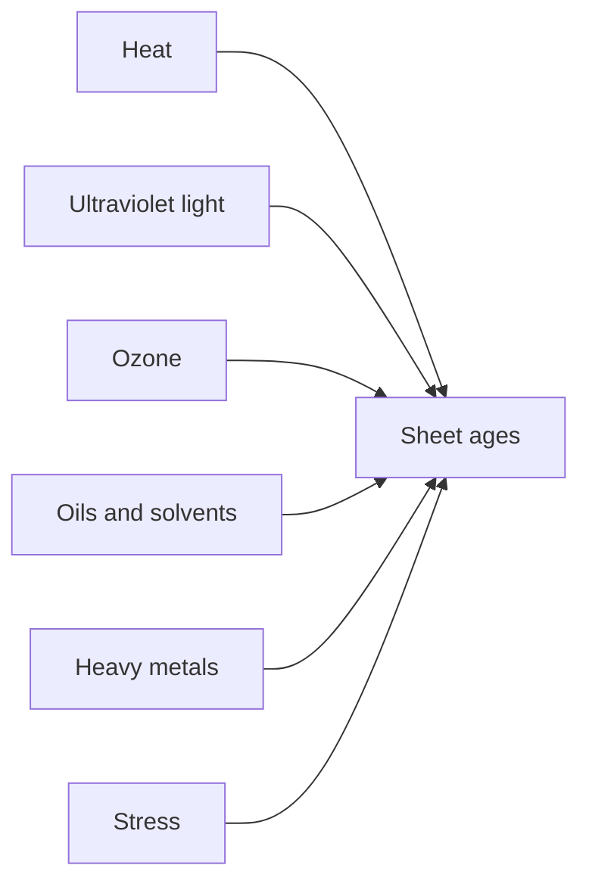
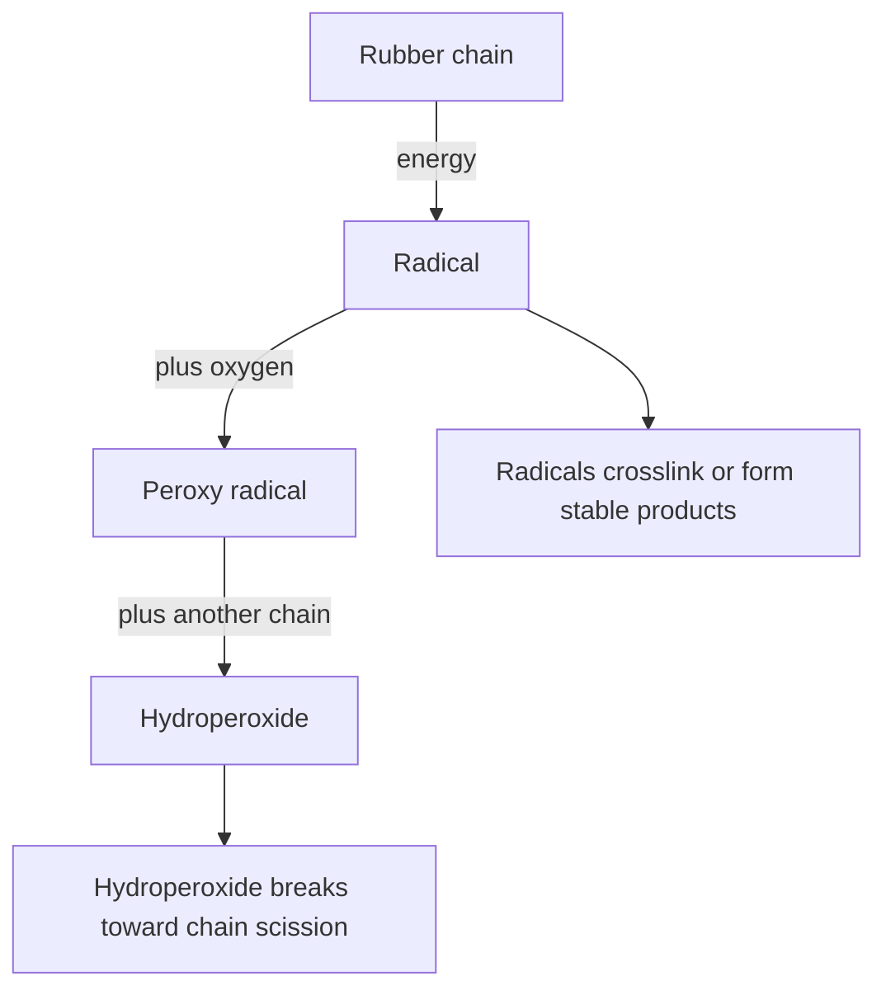
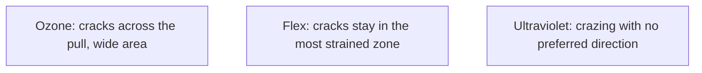
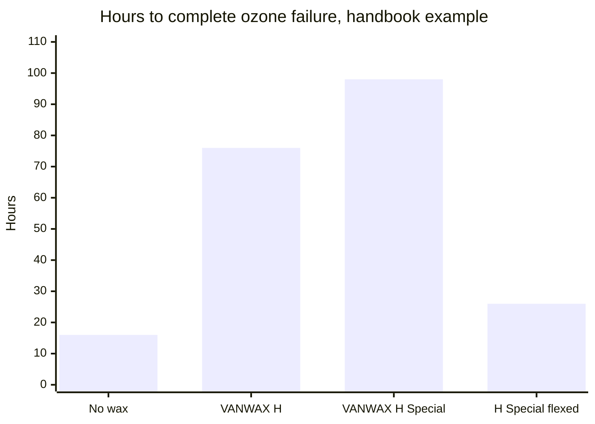

# Sheet Aging, Storage and Care

Petroleum products attack natural-rubber sheet. Solvent rubber cement used for a patch is flammable: keep the can closed, away from heat and sparks, and follow that product's safety data sheet. Skin reactions are covered in [Allergy and skin contact](/literature-reviews/allergy-and-skin-contact).

## Executive summary

Heat, light, ozone, oils, and continuous tension degrade vulcanized sheet latex. Storage controls retard that damage, but cannot prevent it entirely. Store sheet latex and garments cool, dark, and flat or rolled without sharp creases. Keep oils, greases, and heavy metals off the rubber. Apply these practices to unused roll stock and finished garments between wearings.

## Questions this article answers

- [Why does bought sheet age?](#why-does-bought-sheet-age)
- [How should I store sheet and garments?](#how-should-i-store-sheet-and-garments)
- [What do the marks mean?](#what-do-the-marks-mean)
- [What should stay off the sheet?](#what-should-stay-off-the-sheet)

## Why does bought sheet age? {#why-does-bought-sheet-age}

### How

Store rolls and garments in a cool, dark room isolated from ozone sources. Keep petroleum products, mineral oils, and oily lotions off the sheet latex. Never leave folds pressed under tension for extended periods.

| Driver | What you may notice | What to change |
| --- | --- | --- |
| Heat | Tackiness or premature hardening | Move to a cool room. Keep stock away from ceilings and radiators. |
| Ultraviolet light | Dull, discolored, or crazed surface | Move to light-tight storage. |
| Ozone | Fine cracks across a stretched zone | Remove electric motors, fluorescent tubes, and sparking gear from the room. |
| Oxygen | Gradual stiffening or softening in the dark | Slow it with lower temperatures. Oxidation proceeds continuously. |
| Oils and solvents | Swelling, softening, loss of tensile strength | Keep petroleum and mineral oils completely off the rubber. |
| Creases under stress | A crease line that splits into a crack | Roll the sheet or fold it loosely without weighted edges. |

### Why

*The Vanderbilt Latex Handbook* classifies the primary environmental hazards for natural rubber: heat, humidity, ultraviolet light, high-energy radiation, ozone, oxygen, active chemicals (acids, bases, oils, solvents, oxidizers, heavy metals), and mechanical stress.

Oxidation produces two competing structural changes in the polymer network. Chain scission breaks the polyisoprene backbone, which turns the rubber soft and tacky. Crosslinking creates secondary bonds between adjacent chains, which turns the sheet hard and brittle. Light accelerates this reaction, and the process is autocatalytic.

Ozone forms from electrical discharges in motors or lightning, and from photochemical smog in urban atmospheres. Ozone reacts directly with carbon-carbon double bonds in the rubber backbone. When the rubber is under tension, ozone cracks form perpendicular to the direction of stretch across the entire exposed surface. In contrast, mechanical flex cracks remain confined to the localized area of highest strain, while ultraviolet radiation crazes the surface in random directions.

Transition metal ions act as oxidation catalysts. Fatty-acid soaps containing copper, cobalt, manganese, or iron accelerate thermal degradation even in tiny amounts. Hydrocarbon oils, greases, and organic solvents swell the vulcanized matrix, lowering tear resistance and tensile strength as standardized in ASTM D471.

Detail: Chemical mechanism of oxidative attack

*The Vanderbilt Latex Handbook* illustrates autocatalytic oxidation in three discrete steps: initiation, propagation, and termination. Thermal or radiant energy cleaves a hydrogen atom from the polyisoprene backbone (RH), creating a free radical ($R^\bullet$). Atmospheric oxygen reacts rapidly with this site to yield a peroxy radical ($\text{ROO}^\bullet$), which abstracts a hydrogen atom from an adjacent chain to form a hydroperoxide ($\text{ROOH}$) and a new radical:

Hydroperoxides decompose into alkoxy ($\text{RO}^\bullet$) and hydroxyl ($\text{HO}^\bullet$) radicals, driving further chain scission. Alternatively, terminal radical combinations yield secondary crosslinks or inert degradation products. Compounded phenolic or amine antioxidants protect the rubber by donating hydrogen atoms to peroxy radicals, interrupting the propagation loop.

Natural rubber is an unsaturated diene elastomer. Ambient ozone concentrations typically range between 1 and 8 parts per hundred million (pphm). ASTM D1149 measures ozone cracking of vulcanized test specimens under static or dynamic surface strain in a dark, temperature-controlled chamber. Chamber test durations provide comparative screening between compound recipes rather than direct shelf-life predictions.

Detail: Crack direction and strain geometry

The visual pattern of surface cracking reflects the underlying degradation driver:

Ozone cracking requires tensile strain. The resulting fissures align perpendicular to the stress vector over the entire exposed field. Flex fatigue cracking occurs only where cycling strain exceeds the endurance limit of the rubber. Ultraviolet radiation penetrates only the immediate surface, producing multi-directional crazing independent of mechanical strain.

## How should I store sheet and garments? {#how-should-i-store-sheet-and-garments}

### How

Store sheet latex and finished garments in a climate-controlled room below 25 °C, shielded from all natural and artificial light. Isolate the storage space from equipment that generates ozone, including electric motors, high-voltage transformers, and fluorescent or mercury-vapor lighting.

Store items flat or loosely rolled. If garments must be placed in containers, roll them into wide cardboard tubes or wrap them without tight creases. Do not stack heavy objects on top of folded rubber.

### Why

ISO 2230 provides standard procedures for recording, packaging, and storing vulcanized rubber products. The standard focuses on vulcanized items and excludes raw uncured rubber and liquid latex.

Earlier editions of ISO 2230 emphasize minimizing air circulation around stored goods. Drafts continuously renew oxygen and atmospheric ozone at the rubber surface. Equipment with electric brushes, high-voltage fields, or ultraviolet discharge produces ozone locally. Organic vapors and combustion exhaust must also be excluded, as they form photochemical ozone when exposed to ambient light.

Latex goods stored inside transparent film packages discolor rapidly when exposed to ultraviolet light. Ordinary cardboard boxes (clay-board shipping cartons) do not form an airtight barrier. Mechanical deformation dramatically accelerates environmental attack: tension concentrates strain energy at the apex of a sharp fold. Rolling garments into tubes eliminates knife-edge creases and protects the rubber from accelerated ozone cracking.

Detail: Warehouse temperature gradients and the doubling rule

In unconditioned warehouse facilities, *The Vanderbilt Latex Handbook* notes vertical air temperature gradients from 35 °C at floor level to 60 °C near the roof deck. The oxidation rate of vulcanized natural rubber film roughly doubles for every 8.3 °C rise in ambient temperature. Goods stored on high shelving near a ceiling can oxidize eight times faster than identical stock stored near the floor.

Packaging film containing ultraviolet absorbers provides cost-effective surface protection compared to heavy antioxidant loading throughout the entire compound.

ISO 2230 outlines strict environmental controls covering temperature, humidity, light, ozone, and physical deformation. Vendor application guidelines, such as Freudenberg storage cards, recommend sealed polyethylene or aluminum-barrier packaging and an operating temperature threshold below 25 °C.

## What do the marks mean? {#what-do-the-marks-mean}

### How

Diagnose the physical cause of a defect before choosing a corrective step.

| Defect class | Visual appearance | Corrective action |
| --- | --- | --- |
| Bloom | White, hazy, or powdery film on the surface | Wipe gently with mild soap and water. Do not scrape with tools, which strips the protective surface layer. |
| Sticky tack | Soft, gummy, adhesive surface | Discard or retire the affected panel. Reduce room temperature and light; do not apply oils. |
| Ozone crack | Fine fissures perpendicular to the line of pull | Remove tensile strain immediately. Topical polishes cannot seal cracks. For structural repairs, see [Sheet adhesives and seam integrity](/literature-reviews/sheet-adhesives-and-seam-integrity). |
| Ultraviolet crazing | Random multi-directional crazing or yellowing | Relocate goods to dark storage. Surface crazing cannot be reversed. |

### Why

Wax bloom occurs when protective waxes dissolved in the compound migrate to the exterior. A study in *Science Diliman* notes that this bloom layer creates an inert physical shield that suppresses the migration of other compounding agents.

Sticky surface tack indicates severe oxidative chain scission, where polymer molecules break into low-molecular-weight fragments. Ozone cracking indicates localized chain cleavage at double bonds under mechanical stress. ASTM D925 provides test methods to isolate surface contact and migration staining from mechanical cracks, while ASTM D573 uses accelerated air-oven testing to evaluate heat aging.

Detail: Compounding protection with wax, antioxidants, and antiozonants

Formulations state ingredient amounts in parts per hundred rubber (phr), representing mass ratios relative to 100 parts of dry rubber base.

*The Vanderbilt Latex Handbook* specifies 1.0 to 2.0 phr total antioxidant for general-purpose latex goods. When compounding for copper or heavy metal exposure, the handbook recommends 2.0 phr total: 1.0 phr standard antioxidant combined with 1.0 phr copper inhibitor. In *Polymer Latices: Science and Technology — Volume 3*, Blackley specifies 0.5 to 2.0 phr antioxidant for high-quality, thin-walled dipped goods.

Microcrystalline or paraffin wax emulsions loaded at 0.5 to 1.0 phr migrate outward to form an impermeable static ozone barrier. However, mechanical strain or dynamic flexing ruptures this brittle crystalline barrier. Once fractured, the wax layer no longer protects the film. The Vanderbilt handbook documents this failure mode in laboratory aging trials:

| Formulation condition | Hours to ozone failure |
| --- | ---: |
| Unprotected control (no wax) | 16 |
| Static compound with VANWAX H | 76 |
| Static compound with VANWAX H Special | 98 |
| Compound with VANWAX H Special, subjected to flex strain | 26 |

Dynamic ozone protection relies on substituted *p*-phenylenediamine derivatives. These chemical antiozonants migrate continuously to react directly with atmospheric ozone, but they produce intense dark-red or brown staining that limits their use to black goods. Concentrations below 2.0 phr provide inadequate dynamic defense; 3.0 phr is standard for demanding environments.

Amine-based antioxidants provide strong protection against heat, oxygen, and metal-catalyzed oxidation, but they discolor when exposed to light. Hindered phenolic antioxidants offer weaker protection but avoid dark discoloration, making them the standard choice for translucent and light-colored sheet goods. Joseph's *Practical Guide to Latex Technology* and Blackley's *Polymer Latices* confirm this performance division.

Detail: Factory chlorination and surface tack

Asrar and coauthors demonstrate that aqueous chlorination modifies the immediate surface of natural rubber films. By converting sticky surface polyisoprene into a low-friction chlorinated layer, factory halogenation permanently eliminates surface tack without the need for dusting powders.

## What should stay off the sheet? {#what-should-stay-off-the-sheet}

### How

Keep petroleum jelly, mineral oil, motor fuels, cooking oils, and oil-based skin lotions entirely away from sheet latex. Use only water-based or pure silicone products for lubrication and polishing.

When patching a damaged garment, verify whether the repair is practical or if the item should be retired. See [Sheet adhesives and seam integrity](/literature-reviews/sheet-adhesives-and-seam-integrity). When using solvent rubber cement, work with active cross-ventilation away from open flames, store containers tightly closed, and consult the manufacturer safety data sheet. For workshop air management, see [Sheet ventilation and solvent exposure](/literature-reviews/sheet-ventilation-solvent-exposure).

### Why

Liquid hydrocarbons diffuse into the nonpolar polyisoprene matrix, dissolving intermolecular bonds. This solvent swelling expands the network, causing wrinkling, distortion, and rapid loss of tensile integrity.

NIOSH Publication 97-135 warns that oil-based moisturizers and skin creams compromise the barrier properties of natural rubber latex. An OSHA standard interpretation dated 24 August 1993 confirms that petroleum-based lubricants cause rapid physical deterioration in latex barrier films. Standardized immersion effects are quantified in ASTM D471.

Safety data sheets for solvent rubber cements specify handling standards for volatile carriers such as heptane or light aliphatic petroleum distillates. These solvents are classified as flammable liquids (GHS category H225) and produce vapors heavier than air that travel to ignition sources. Always store cans sealed in a cool location.

Detail: Industrial biocides and skin contact

Industrial antimicrobial agents and fungicides protect natural rubber compounds during processing and warm-air drying. However, residual biocides, sulfur donors, and dithiocarbamate accelerators can induce Type IV-like delayed contact dermatitis. Compounds formulated for apparel must use skin-safe ingredients. See [Allergy and skin contact](/literature-reviews/allergy-and-skin-contact).

## Sources

- *The Vanderbilt Latex Handbook*. 3rd ed. Edited by Robert Francis Mausser. Norwalk, CT: R.T. Vanderbilt Company, 1987. <https://lccn.loc.gov/92117844>
- *Polymer Latices: Science and Technology — Volume 3: Applications of Latices*. 2nd ed. D. C. Blackley. Chapman & Hall / Springer, 1997. <https://books.google.com/books?id=Y2VPGj7YbykC>
- *Practical Guide to Latex Technology*. Rani Joseph. Shawbury: Smithers Rapra Technology, 2013. <https://books.google.com/books/about/Practical_Guide_to_Latex_Technology.html?id=NB5AMwEACAAJ>
- ISO 2230:2026. *Rubber products — Guidelines for storage*. <https://www.iso.org/standard/89162.html>
- ISO 2230:2002 sample excerpts. <https://cdn.standards.iteh.ai/samples/35946/bd35e9ad8d6f4f9098921243d48e08c5/ISO-2230-2002.pdf>
- ISO 2230:1973 sample excerpts. <https://cdn.standards.iteh.ai/samples/7035/b223279cee704bb890cbb2ca55f594b7/ISO-2230-1973.pdf>
- ASTM D471-16a(2021). *Standard Test Method for Rubber Property—Effect of Liquids*. <https://store.astm.org/d0471-16ar21.html>
- ASTM D1149-18(2025). *Standard Test Methods for Rubber Deterioration—Cracking in an Ozone Controlled Environment*. <https://store.astm.org/d1149-18r25.html>
- ASTM D925-14(2025). *Standard Test Methods for Rubber Property—Staining of Surfaces (Contact, Migration, and Diffusion)*. <https://store.astm.org/d0925-14r25.html>
- ASTM D573. *Standard Test Method for Rubber—Deterioration in an Air Oven*. <https://store.astm.org/standards/d573>
- NIOSH. *Preventing Allergic Reactions to Natural Rubber Latex in the Workplace*. DHHS (NIOSH) Publication No. 97-135, 1997. <https://stacks.cdc.gov/view/cdc/21446>
- OSHA. Standard interpretation, mineral oil and petrolatum skin-care products and latex gloves, 24 August 1993. <https://www.osha.gov/laws-regs/standardinterpretations/1993-08-24>
- Asrar, J., et al. "Development of a methodology for characterizing commercial chlorinated latex gloves." *Journal of Applied Polymer Science* 82 (2001): 672–682. <https://doi.org/10.1002/app.1895>
- "Effect of Ingredient Loading on Surface Migration Kinetics of Additives in Vulcanized Natural Rubber Compounds." *Science Diliman*. <https://distantreader.org/stacks/journals/sciencediliman/sciencediliman-4442.pdf>
- Freudenberg Process Seals. *Elastomer Storage Guidelines*. <https://cdn2.hubspot.net/hubfs/6000523/FOGT_August2019%20Theme/Pdf/FOGT-Elastomer_Storage_Guidelines.pdf>
- Representative rubber-cement safety data sheet (heptane or light aliphatic solvent; GHS H225). Product safety documentation.