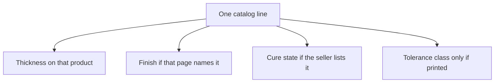

# Calendered Latex Sheet

## Executive summary

Calendered sheet latex is roll goods bought already formed and vulcanized. Mill rollers set the thickness and surface finish during production. Reading a product line requires matching the stated gauge, surface texture, and cure state to your garment design.

Consult this guide when reviewing supplier catalogs or choosing sheet latex gauges for garment construction. A broader overview of material selection is in [Buying Formed Latex Sheet](/literature-reviews/sheet-film-pathway).

## Questions this article answers

- [What does calendered mean on a product page?](#what)
- [How do you read one catalog line?](#catalog)
- [Why buy the mill's sheet?](#why-buy)

## What does calendered mean on a product page? {#what}

### How

Treat the roll as finished sheet latex. Mark your pattern pieces directly onto the material. Cut the sheet with a rotary cutter along the cut lines. Apply solvent rubber cement to the glue pathway on the bond faces, air until dry to the touch, and overlay the seams.

### Why

Calendered sheet latex arrives already formed and vulcanized. Heavy industrial rollers press uncured rubber into a flat, continuous sheet of uniform thickness before heating it. You do not need to dip or cast liquid latex to build your own gauge.

Standard dimensional tolerances for calendered solid rubber are established by ISO 3302-1:2014. Industrial suppliers, such as White Cross Rubber Products, classify their natural rubber sheeting under this manufacturing standard.

Detail: What the tolerance standard covers

ISO 3302-1:2014 is titled *Rubber — Tolerances for products — Part 1: Dimensional tolerances*. The document defines tolerance classes for solid rubber products formed by moulding, extrusion, or calendering. Rubber-coated textiles fall outside this standard. Calendered goods are evaluated against designated thickness classes, such as the ST tables summarized by manufacturers like EMI Seals.

## How do you read one catalog line? {#catalog}

### How

Check the nominal gauge printed for the specific product entry. Note whether the supplier lists distinct surfaces, such as a polishable face side and a textured underside. Confirm the cure state to verify the rubber is fully vulcanized. Treat any stated tolerance class as applying only to that specific thickness.

For pattern adjustments after selecting your thickness, see [Gauge, Modulus, and Reduction on Bought Sheet](/literature-reviews/sheet-gauge-modulus-reduction).

### Why

Latex sheet manufacturers publish independent specifications for their catalog lines. A single line item defines only that specific product, rather than setting a universal rule for every gauge on offer.

Detail: Three vendor specifications

White Cross Rubber Products offers calendered natural rubber sheeting starting at 300 µm (0.30 mm). Their catalog options include smooth or cloth finishes, alongside fully cured, semi-cured, or uncured formulations.

Elastomade Accessories lists latex sheeting ranging from roughly 0.25 mm to 1.05 mm. Their product chart specifies a polishable upper face paired with a roughened underside to aid handling and wear.

EMI Seals publishes *Manufacturing Tolerances* v3.0, mapping vendor dimensions to ISO 3302-1 classes. Under tolerance class ST1, rubber sheeting between 0 mm and 1 mm carries an allowable thickness variance of ±0.15 mm.

## Why buy the mill's sheet? {#why-buy}

### How

Order calendered sheet latex when your project requires a predictable thickness ready to cut immediately. Use solvent rubber cement to bond the seams. For joining techniques and adhesive handling, see [Sheet Adhesives and Seam Integrity](/literature-reviews/sheet-adhesives-and-seam-integrity). To verify gauge and surface quality upon arrival, consult [Sheet Garment Selection QA](/literature-reviews/sheet-garment-selection-qa).

### Why

Commercial sheet latex removes the variables of liquid latex processing. The manufacturing mill controls the compound, mechanical thickness, and vulcanization cycle under factory conditions. You receive stable roll goods with a consistent gauge across the entire yardage.

## Sources

- ISO 3302-1:2014. *Rubber — Tolerances for products — Part 1: Dimensional tolerances.* International Organization for Standardization, 2014. https://www.iso.org/standard/62492.html
- EMI Seals. *Manufacturing Tolerances* v3.0 (tables aligned to ISO 3302-1). Vendor table, including a 0–1 mm ST1 example of ±0.15 mm. https://emiseals.com/wp-content/uploads/2023/12/EMI-Manufacturing-Tolerances-v3.0.pdf
- White Cross Rubber Products. Natural rubber sheeting (calendered natural rubber, thickness, finish, and cure-state options). https://www.wcrp.uk.com/product/natural-rubber-sheet/
- Elastomade Accessories. Latex sheeting product chart (about 0.25–1.05 mm; polishable upper face and roughened underside). https://elastomade.com/latex-sheet/