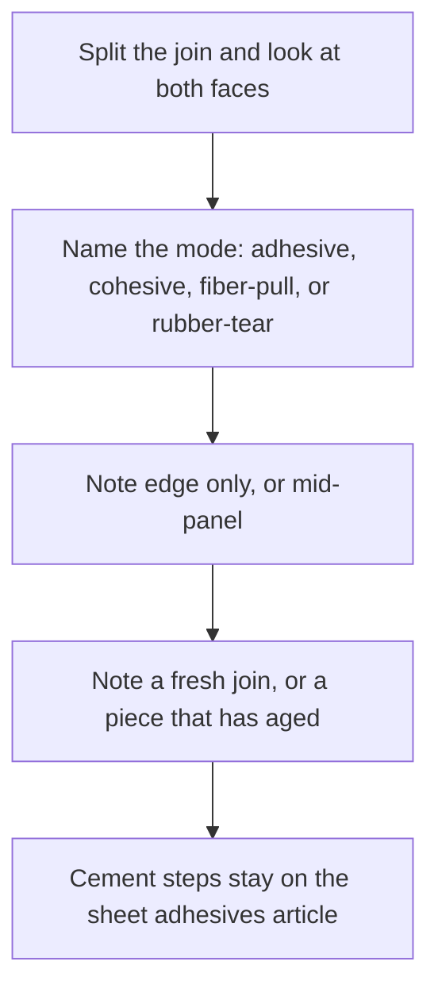
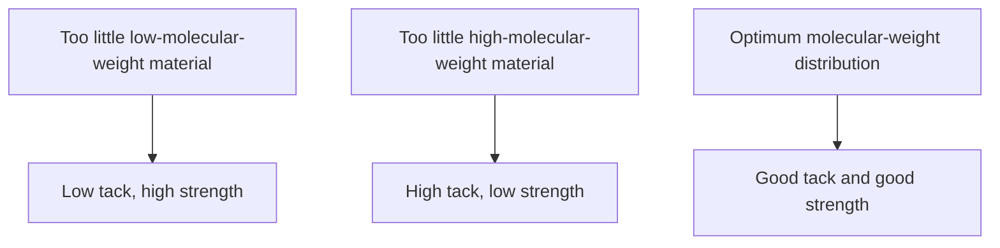
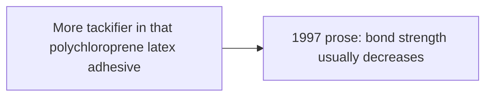

# Sheet Delamination and Seam Failure

> **Safety.** This page is for a seam that already let go on bought sheet. Solvent rubber cement sits in the solvent-adhesive column. The Vanderbilt Latex Handbook lists fire hazard, explosion hazard, and solvent fumes there. Storage and fumes: [Sheet ventilation and solvent exposure](/literature-reviews/sheet-ventilation-solvent-exposure).

## Executive summary

You bought sheet latex. A seam peeled, or an edge lifted. Read both split faces before you apply more adhesive (glue). Cement on one face only is adhesive failure. Cement torn through its thickness, visible on both faces, is cohesive failure. Fibers stuck in the cement mean the textile let go. Torn sheet means the rubber failed. A lab peel test is not a pass or fail grade for a finished garment.

Use this guide alongside [Sheet adhesives](/literature-reviews/sheet-adhesives-and-seam-integrity) and [Sheet latex–textile bonding](/literature-reviews/sheet-latex-textile-bonding).

## Questions this article answers

- [What do the two faces show?](#faces)
- [Why is smooth filament cloth a weaker mechanical lock?](#filament)
- [What do heat and age do to the film?](#age)
- [When is a hand peel different from a lab peel?](#lab-peel)

## What do the two faces show? {#faces}

### How

Separate the parted join and inspect both surfaces under clear light. Identify the failure mode using the reference table below. Note whether the lift started along an outer edge or inside the middle of a panel. Record whether the seam failed on a fresh assembly or on an aged piece.

| What you see | Mode |
| --- | --- |
| Cement on one piece only. The other face is clean rubber or clean cloth. | Adhesive failure |
| Cement split through the layer. Both faces show residue. | Cohesive failure |
| Textile fibers stuck in the cement | Fiber-pull |
| The sheet tore beside the join | Rubber-tear |

Seam overlap planning and cement handling stay on [Sheet adhesives](/literature-reviews/sheet-adhesives-and-seam-integrity). Sorting the failure mode tells you which layer gave way before you apply more adhesive.

### Why

Adhesive failure and cohesive failure occur in entirely different material planes. Adhesive failure means the dried film released its grip from the sheet or cloth surface. Cohesive failure means the cement split down its own middle while remaining bonded to both surfaces. If you treat every split seam as a simple shortage of adhesive, you miss whether the bond line released or the rubber compound broke apart internally.

The physical origin of the lift provides practical clues. Edge lifting usually points to handling shear, snagged borders, or uneven roller pressure during seam construction. Separation starting inside the middle of a panel points toward trapped solvent, surface contamination, or localized stress concentrations.

Detail: Molecular weight, tack, and strength

In one adhesive tape comparison, natural rubber latex adhesive retained a high-molecular-weight fraction that milled solvent rubber had lost through mechanical mastication. Across resin-to-rubber ratios of 30% to 60%, 90° quick stick, 180° peel, and Polyken tack tested essentially the same for both formulations. However, 178° shear adhesion ran higher for the latex adhesive (*The Vanderbilt Latex Handbook*, 1987, pp. 234–235). That trial evaluated pressure-sensitive tape, not a direct comparison between fashion sheet latex and solvent rubber cement.

Page 236 of the same handbook charts a carboxylated SBR pressure-sensitive adhesive. There, 180° peel versus tackifier resin percentage does not rise in a straight line; the printed peak occurs at 60% resin. A separate schematic on page 236 illustrates molecular weight effects: too little low-molecular-weight polymer yields low tack and high cohesive strength; too little high-molecular-weight polymer yields high tack and low cohesive strength; an optimum molecular-weight distribution delivers balanced tack and shear strength.

## Why is smooth filament cloth a weaker mechanical lock? {#filament}

### How

When bonding sheet latex to fabrics, identify whether the cloth is made of staple fibers or continuous synthetic filaments. Do not rely on mechanical interlocking if you are working with smooth synthetic textiles like polyamide (nylon) or polyester. For assembly guidelines between sheet latex and fabric substrates, review [Sheet latex–textile bonding](/literature-reviews/sheet-latex-textile-bonding).

### Why

Continuous filaments lack the protruding fiber ends that anchor rubber mechanically. *Polymer Latices* (Blackley, 1997) outlines this distinction for heavy-duty industrial textile bonding. Cotton is spun from short staple fibers. Tiny fiber ends stick out along the spun yarn, embedding directly into the adhesive or rubber layer to form a physical lock.

Polyamide, polyester, and rayon are manufactured as continuous filaments. Each strand is long and smooth, providing no exposed yarn ends for physical interlock. In continuous-filament bonds, seam integrity depends on interfacial adhesion rather than physical entrapment. The weakest link is typically the interface between the rubber and the adhesive film.

Detail: Abrasion of rayon cord

Blackley (1997) cites industrial tire-cord data where static adhesion of rubber to high-tenacity continuous-filament rayon improved after the cord surface was mechanically abraded. Dynamic adhesion under repeated flexing did not show comparable gains unless the cord was also treated with an aqueous resorcinol-formaldehyde latex dip. That method reflects heavy tire-cord processing rather than workshop garment construction.

## What do heat and age do to the film? {#age}

### How

Check the age and storage conditions of the item before diagnosing a split seam. If a garment lived in a warm wardrobe, car trunk, or sunlit space, treat thermal aging as a distinct failure cause rather than a flawed glue technique. Inspect the sheet latex for visible degradation: softening, gumminess, rigidity, or hairline cracks. Finished garment care is covered in [Sheet aging, storage, and care](/literature-reviews/sheet-aging-storage-and-care). Contact risks appear in the [Compatibility matrix](/literature-reviews/compatibility-matrix-metals-oils-plastics).

### Why

Heat accelerates oxidative breakdown in natural rubber. *The Vanderbilt Latex Handbook* (1987) notes that the oxidation rate of latex film roughly doubles for each 8.3°C increase in exposure temperature. Thermal oxidation produces two distinct physical outcomes depending on the underlying chemical degradation.

Chain scission breaks polymer backbones into shorter fragments, leaving the rubber soft and tacky. Uncontrolled crosslinking ties adjacent chains together, making the rubber brittle and hard. While a cured solvent rubber cement seam line differs chemically from raw latex film, both polymer networks degrade when stored in hot conditions.

Detail: Cure system and antioxidant in latex adhesives

Pressure-sensitive latex adhesives formulated with a sulfur-donor cure system age significantly better than adhesives vulcanized with colloidal free elemental sulfur (*The Vanderbilt Latex Handbook*, 1987). Crosslinking reduces inherent surface tack. Because of this trade-off, curing adhesives frequently require higher loadings of tackifying resin than non-curing grades.

The same handbook attributes embrittlement to progressive post-cure crosslinking, while surface tackiness and liquefaction stem from oxidative chain scission. Compounding guidelines in that text call for at least 1 part antioxidant per 100 parts dry rubber (phr) and 1 phr antioxidant per 100 parts tackifier resin. The resin and the rubber base often demand different antioxidant chemistries. Where natural rubber or polychloroprene films face copper or heavy-metal exposure, the handbook recommends a total of 2 phr antioxidant: 1 phr to inhibit standard atmospheric oxidation and 1 phr to sequester active metal ions.

## When is a hand peel different from a lab peel? {#lab-peel}

### How

When testing a repaired seam by hand, pull the joint slowly at the angle and rate the garment encounters during wear. Do not treat manual peel resistance as an exact match for automated lab peel data. If you record peel tests across multiple garments, document your pull speed, peel angle, and ambient room temperature.

### Why

Peel resistance changes as testing speed changes. In a study on an NBR/SMR L pressure-sensitive adhesive dissolved in toluene, Poh and Lamaming (2013) demonstrated that measured peel strength rose as testing speed increased. Slow peel rates produced cohesive failure within the adhesive mass, whereas fast peel rates shifted the failure mode into clean adhesive separation at the interface.

Standard testing methods such as ASTM D903 (peel or stripping strength of adhesive bonds) and ASTM D1876 (T-peel test for flexible substrates) establish controlled laboratory metrics. These standardized procedures yield reliable comparative data between adhesive recipes, but their numerical values do not serve as an operational pass or fail standard for handmade clothing seams.

Detail: Tackifier level and 180° peel

*Polymer Latices* (1997) cites peel tests using two layers of cotton duck fabric bonded with polychloroprene latex adhesive. The text notes that bond peel strength generally declines as tackifier concentration rises (tested with asphalt and two rosin ester resins). However, the printed data series is not strictly monotonic at the highest resin additions. Polymer-resin tack curves frequently peak between 60% and 70% resin concentration before falling off sharply.

*High Polymer Latices* (Blackley, 1966) reviews the same original study but reports a different set of numerical values for the asphalt peel series. The observed trend remains identical: higher resinous modifier content decreases peel resistance, but absolute values differ between editions. Neither dataset reflects direct values for solvent rubber cement on fashion sheet latex.

## Sources

- *The Vanderbilt Latex Handbook*. 3rd ed. Edited by Robert Francis Mausser. Norwalk, CT: R.T. Vanderbilt Company, 1987. https://lccn.loc.gov/92117844
- *Polymer Latices: Science and Technology — Volume 3: Applications of Latices*. 2nd ed. D. C. Blackley. London: Chapman & Hall, 1997. https://books.google.com/books?id=Y2VPGj7YbykC
- *High Polymer Latices: Their Science and Technology*. 2 vols. D. C. Blackley. London: Maclaren & Sons, 1966. https://lccn.loc.gov/66077950
- Poh, B. T., and Lamaming, J. “Effect of Testing Rate on Adhesion Properties of Acrylonitrile-Butadiene Rubber/Standard Malaysian Rubber Blend-Based Pressure-Sensitive Adhesive.” *Journal of Coatings* (2013). https://doi.org/10.1155/2013/519416
- ASTM D903. Standard Test Method for Peel or Stripping Strength of Adhesive Bonds. ASTM International.
- ASTM D1876. Standard Test Method for Peel Resistance of Adhesives (T-Peel Test). ASTM International.