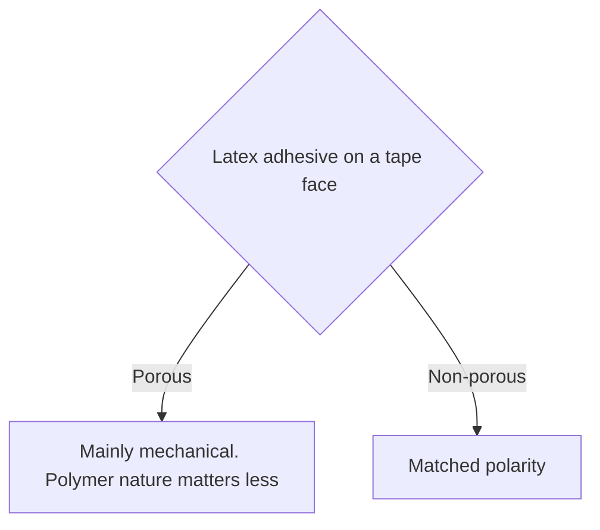

# Sheet Edge Finishing Materials

> **Safety.** Bonding a tube, strip, or tape to commercial sheet latex uses solvent rubber cement. That family presents distinct fire and vapor hazards. Read the product SDS. See [Sheet adhesives](/literature-reviews/sheet-adhesives-and-seam-integrity) and [Sheet ventilation](/literature-reviews/sheet-ventilation-solvent-exposure).

## Executive summary

A finished edge on sheet latex uses a natural-rubber tube, an elastomeric strip, or a textile tape. Sheet latex construction relies on solvent rubber cement rather than aqueous adhesives. Water-based latex adhesives risk shrinking woven textile tapes and drying unpredictably on non-porous faces. Match edge materials to your seam requirements and identify the surface type before you apply adhesive.

## Questions this article answers

- [Which piece finishes the edge?](#which-piece)
- [Cotton binding or a slick tape?](#cotton-or-slick)
- [What are the safety rules?](#safety)

## Which piece finishes the edge? {#which-piece}

### How

Select your edge finishing piece before preparing your bond surfaces. On sheet latex, use solvent rubber cement as the standard bonding agent. Mark the glue pathway, apply adhesive to both joining faces, and let the coats air until dry to the touch before you overlay the parts. Detailed application steps, including flash-off timing, are on [Sheet adhesives](/literature-reviews/sheet-adhesives-and-seam-integrity#air-the-coat).

| Family | What it is | Watch for |
| --- | --- | --- |
| Natural-rubber tube or strip | Smooth rubber rim piece | Solvent rubber cement bonding. Air the coat before overlay |
| Rubberised textile tape | Cloth that already has a vulcanized rubber face | Prepare the cloth on [Sheet latex–textile bonding](/literature-reviews/sheet-latex-textile-bonding#pretreat) |
| Woven cotton binding | Absorbent cloth tape | Aqueous latex adhesive can shrink this cloth |
| Smooth filament tape | Slick synthetic face, such as nylon | Polarity rules apply if using aqueous latex adhesives |

The rim lap forms where the edge reinforcement overlays the boundary of the main sheet.

### Why

*The Vanderbilt Latex Handbook* classifies solvent rubber cements as water-resistant formulations offering predictable drying rates and open times. Aqueous latex adhesives contain water that penetrates hydrophilic yarns, which can cause significant dimensional change or puckering along a garment edge.

Detail: Solvent adhesives and fabric shrinkage

*The Vanderbilt Latex Handbook* notes that aqueous latex adhesives present specific processing drawbacks, including sensitivity to freezing, slow drying rates, poorer water resistance, and a documented tendency to shrink fabrics.

Rani Joseph's *Practical Guide to Latex Technology* (2013) similarly highlights the tendency of aqueous lattices to shrink textiles and wrinkle paper substrates during wet lamination and edge application.

## Cotton binding or a slick tape? {#cotton-or-slick}

### How

Examine the surface structure of your tape before bonding it to sheet latex. Woven cotton is an open, porous face. Extruded or woven synthetic filaments, such as nylon ribbon, present a slick, non-porous face.

On sheet latex, continue using solvent rubber cement for both tape varieties. If an application calls for an aqueous latex adhesive instead, match the polymer polarity to smooth synthetic fibers, or rely on mechanical penetration for porous cotton. Surface preparation rules appear on [Sheet adhesives](/literature-reviews/sheet-adhesives-and-seam-integrity#match-the-sheet). Fiber differences are detailed on [Sheet latex–textile bonding](/literature-reviews/sheet-latex-textile-bonding#cotton-or-nylon).

### Why

Porous and slick surfaces bond through entirely different physical mechanisms when using aqueous latex adhesives. On porous substrates, bonding is primarily mechanical because the liquid rubber penetrates fiber interstices; the specific polymer type is less critical. On slick, non-porous substrates, mechanical interlock cannot form, so the adhesive polymer must chemically match the polarity of the substrate face.

Detail: Latex polarity, surface charge, and filler loading

*The Vanderbilt Latex Handbook* specifies polarity compatibility for non-porous substrates: the polarity of the latex must match the surface energy of the bonded faces.
- High polarity: NBR, XNBR, XSBR, PSBR.
- Medium polarity: CR and PVC.
- Low polarity: NR, SBR, BR, and IIR.

Natural rubber latex resides in the low-polarity group alongside synthetic polyisoprene and SBR.

For porous substrates, the handbook outlines separate physical criteria. The latex dispersion must wet and penetrate surface pores. The colloidal charge of the latex particles must be opposite to the surface charge of the substrate to prevent electrostatic repulsion. High filler loadings increase compound viscosity, which restricts capillary flow into textile pores.

Joseph in *Practical Guide to Latex Technology* confirms that porous bonding depends primarily on mechanical anchoring where polymer identity is secondary, whereas non-porous bonding requires matched polarities. Joseph identifies polyisoprene and SBR as non-polar matrices, contrasting them with polar options like acrylonitrile-butadiene, acrylics, styrene-vinylpyridine-butadiene, and carboxylated polymers.

## What are the safety rules? {#safety}

### How

Store solvent rubber cement in tightly sealed, clearly labeled containers away from heat sources, electrical equipment, and open flames. Work in an area equipped with dedicated vapor extraction. Consult the safety data sheet (SDS) supplied with your adhesive. If you cannot provide sufficient cross-ventilation or localized exhaust, postpone edge bonding until adequate ventilation is available. Workspace air requirements are detailed on [Sheet ventilation](/literature-reviews/sheet-ventilation-solvent-exposure).

### Why

Solvent rubber cement contains volatile organic solvents that evaporate rapidly during the airing phase. These vapors accumulate in low-lying pockets, creating health risks upon inhalation and forming flammable air-vapor mixtures. *The Vanderbilt Latex Handbook* identifies flammability, explosion hazards, and toxic fumes as the principal disadvantages of solvent-based adhesive systems.

## Sources

- *The Vanderbilt Latex Handbook*. 3rd ed. Edited by Robert Francis Mausser. Norwalk, CT: R.T. Vanderbilt Company, 1987. https://lccn.loc.gov/92117844
- *Practical Guide to Latex Technology*. Rani Joseph. Shawbury: Smithers Rapra Technology, 2013. https://books.google.com/books/about/Practical_Guide_to_Latex_Technology.html?id=NB5AMwEACAAJ