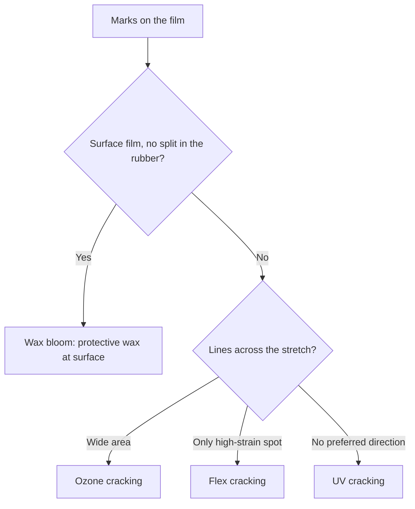

# Sheet Garment Selection QA

> **Not medical advice.** These checks are literacy. They are not an allergy test and not a device certificate.

## Executive summary

Before you wear or resell a bought garment made of sheet latex, medical standards like ASTM D3578 give you names for holes, powder, and protein on exam gloves. A fashion catsuit is not a medical glove. Scent and a surface wax film come from compounding practices described in rubber handbooks, not from glove specifications. Use this visual checklist when you buy secondhand sheet garments, inspect a custom commission, or decide go or no-go on first wear. Reaction classes are covered in [Allergy and Skin Contact](/literature-reviews/allergy-and-skin-contact). Do not treat this inspection as a skin patch test.

## Questions this article answers

- [What should I check before I wear bought sheet?](#pre-wear-checks)
- [How do I tell bloom from a crack?](#bloom-or-crack)

## What should I check before I wear bought sheet? {#pre-wear-checks}

### How

1. Light and stretch. Hold each panel up to a bright light or window. Gently stretch the rubber. A bright pinprick of light marks a through-hole. A thin patch may be a variation from dipping or casting. You are doing a visual survey, not a medical water-leak test.
2. Powder. If you find white powder or talc in high-friction zones like the crotch or underarm, treat it as surface soil. Wipe it off with a damp cloth or wash the garment. Do not treat powder residue as a measure of protein level.
3. Odor. A sharp chemical cure smell, a rotten odor, or a sour mildew scent means you should pause and inspect closer. Manufacturers sometimes add masking scents that hide these odors. A sniff test cannot identify the chemical or evaluate protein content.
4. Bloom or cracks. A cloudy wax film on the surface is harmless bloom, while a split in the rubber is structural damage. Use the guide below to tell them apart, and see [Sheet Aging, Storage and Care](/literature-reviews/sheet-aging-storage-and-care) for closet storage advice.
5. Stop wearing if your body reacts. If you develop a new rash, hives, itching, or shortness of breath, take the garment off immediately. Consult a physician and review [Allergy and Skin Contact](/literature-reviews/allergy-and-skin-contact).

For dark stains or stiffened areas around snaps, grommets, or zippers, refer to [Sheet Hardware and Metal Contact](/literature-reviews/sheet-hardware-metal-contact).

### Why

ASTM D3578 is the industrial specification for natural rubber examination gloves. It establishes limits for holes, surface powder, water-extractable protein, and physical tensile strength. ASTM D5151 defines a standard water-leak test for medical gloves, though the method does not specify the smallest hole size it detects. Holding sheet latex up to a light source adapts the concept of hole detection to the craft table, but it does not certify that a garment passes medical glove criteria.

A 1997 alert from the National Institute for Occupational Safety and Health (NIOSH) distinguishes three workplace reaction types to natural rubber: irritant contact dermatitis, delayed Type IV-like chemical hypersensitivity, and immediate Type I systemic protein allergy. In medical and industrial settings, dusting powder can absorb latex proteins and become airborne, carrying allergens onto skin and airways. The United States Food and Drug Administration (FDA) banned powdered surgeon and patient examination gloves, along with glove lubricating powders, because of these health risks. On fashion sheet latex, residual powder is unverified shop powder or talc. It should be treated as soil and washed away.

Federal labeling rules under 21 CFR 801.437 require explicit warning statements on medical devices containing natural rubber, while strictly prohibiting claims of "hypoallergenic." Commercial sheet garments sold for fashion or fetish wear are not medical devices and carry no standardized labeling. The absence of an allergy warning label does not mean the sheet is low in extractable protein.

Detail: Pinhole definitions and dipped film defects

In rubber glove manufacturing, air bubbles entrained in the latex compound form pinholes during dipping. A single pinhole causes a glove to fail quality control. In the coagulant dipping process, a chloroform number below 2 indicates insufficient precure, causing the wet gel to tear or blow out. Film webbing across adjacent formers leaves thin, weak zones along garment seams or edges. Incomplete leaching leaves residual coagulant salts such as calcium nitrate in the rubber matrix, accelerating discoloration when the film encounters heat, atmospheric fumes, or ultraviolet light.

These defect categories originate in high-volume liquid latex dipping plants. While useful as a vocabulary for inspecting sheet latex, they do not constitute formal pass or fail thresholds for craft garments.

Detail: Industrial odor masking compounds

*The Vanderbilt Latex Handbook* notes that rubber formulators use aromatic reodorants to mask objectionable odors caused by sulfur vulcanization accelerators, bacterial degradation in liquid latex, or the hydrolysis of residual monomers. Typical usage rates range from 0.25 to 0.50 phr (parts per hundred rubber), corresponding to 0.25 to 0.50 grams of masking agent per 100 grams of dry rubber polymer. The handbook acknowledges that reformulating a compound to eliminate base odor is not always practical. However, an aromatic additive merely masks volatile scents; it does not neutralize chemical residues, reduce protein content, or indicate biological cleanliness.

Detail: Laboratory protein assay standards

Evaluating extractable protein in natural rubber relies on three primary standardized assays:

- **ASTM D5712** determines total aqueous extractable protein using a modified Lowry assay, reporting values in micrograms of protein per gram of rubber or per square decimeter. It measures residual soluble proteins but does not diagnose clinical allergenicity.
- **ASTM D6499** measures antigenic latex proteins through an enzyme-linked immunosorbent assay (ELISA) using polyclonal antibodies. It quantifies specific antigens, though total antigenicity does not correlate perfectly with IgE-mediated allergic reactions.
- **ISO 12243** outlines the European and international assay for extractable proteins in medical gloves via the modified Lowry method.

Fashion sheet latex is rarely batch-tested against these standards. Holding a panel to a light bulb verifies physical continuity, but only laboratory solvent extraction can measure residual protein mass.

## How do I tell bloom from a crack? {#bloom-or-crack}

### How

Inspect any surface discoloration or texture change before assuming the sheet is ruined:

- A hazy, whitish wax film that wipes away or melts under gentle warm air, leaving solid rubber underneath, is bloom. Do not scrub it aggressively; review care recommendations first.
- Fine, parallel surface cracks running perpendicular to the direction of stretch across large areas indicate ozone cracking.
- Parallel cracks confined entirely to a folded edge or a sharp bend that was compressed in storage indicate flex cracking.
- Random, multidirectional crazing or alligator cracks on surfaces exposed to daylight indicate ultraviolet degradation.
- A surface that feels soft, gummy, and tacky, or one that feels brittle, stiff, and cardboard-like, has undergone advanced polymer breakdown.

For storage adjustments to stop active cracking, see [Sheet Aging, Storage and Care](/literature-reviews/sheet-aging-storage-and-care).

### Why

Over its service life, vulcanized natural rubber experiences two competing degradation pathways: polymer chain scission and oxidative crosslinking. In chain scission, backbone bonds in the polyisoprene molecule break, reducing molecular weight. The rubber turns soft, weak, and sticky. In excessive secondary crosslinking, oxygen and environmental oxidants create additional crosslinks between chains, turning the film rigid, brittle, and prone to shattering under strain.

Atmospheric ozone, present at background concentrations of 1 to 8 parts per hundred million, attacks double bonds in the rubber backbone under mechanical tension. Because ozone cracking requires tensile strain, cracks always orient perpendicular to the applied stress and distribute broadly across the strained surface. Flex cracking follows the same directional orientation but remains localized in zones of high cyclic strain or permanent creases. Ultraviolet radiation attacks unoriented polymer chains at the surface, creating random micro-cracking across exposed faces regardless of strain direction.

Wax bloom is a protective physical process, not polymer failure. Compounded antiozonant waxes migrate to the surface to form an inert barrier that shields the polyisoprene chains from ambient ozone while the garment sits in static storage. If the rubber is stretched, the brittle wax layer fissures and exposes the underlying rubber to ozone attack. Distinguishing between a protective surface wax layer and true micro-fissuring prevents unnecessary disposal of sound garments.

Detail: Coagulant salts and antiozonant wax migration

When dipped films undergo insufficient warm-water leaching during production, residual coagulant salts like calcium nitrate remain trapped in the rubber matrix. These hygroscopic salts draw moisture from the air and catalyze localized discoloration and polymer oxidation when exposed to heat, gas combustion fumes, or ultraviolet light.

Antiozonant protection in high-grade natural rubber compounds commonly relies on paraffin and microcrystalline wax blends added at 0.5 to 1.0 phr. Because these hydrocarbon waxes possess limited solubility in the polyisoprene matrix at ambient temperatures, they phase-separate and bloom to the surface. A continuous barrier film requires several days to establish after manufacturing. Static exposure tests show that a continuous wax barrier provides high protection against moderate ozone concentrations. However, because microcrystalline waxes lack elastic recovery, dynamic flexing fractures the film, requiring chemical antiozonants (such as paraphenylenediamines) for dynamic service. A laboratory table comparing hours to initial wax crack formation assesses formulation stability, not garment expiration dates.

## Sources

- ASTM D3578-19. Standard Specification for Rubber Examination Gloves. ASTM International, West Conshohocken, PA, 2019. [ASTM International](https://www.astm.org/d3578-19.html).
- ASTM D5151-19. Standard Test Method for Detection of Holes in Medical Gloves. ASTM International, West Conshohocken, PA, 2019. [ASTM International](https://www.astm.org/d5151-19.html).
- ASTM D5712-15(2020). Standard Test Method for Analysis of Aqueous Extractable Protein in Natural Rubber and Its Products Using the Modified Lowry Method. ASTM International, West Conshohocken, PA, 2020. [ASTM International](https://www.astm.org/d5712-15r20.html).
- ASTM D6499-24. Standard Test Method for Immunological Measurement of Antigenic Protein in Natural Rubber and its Products. ASTM International, West Conshohocken, PA, 2024. [ASTM International](https://www.astm.org/d6499-24.html).
- Food and Drug Administration. Banned Devices; Powdered Surgeon's Gloves, Powdered Patient Examination Gloves, and Absorbable Powder for Lubricating a Surgeon's Glove. Final rule. 81 FR 91722, 19 December 2016. [Federal Register](https://www.federalregister.gov/documents/2016/12/19/2016-30382/banned-devices-powdered-surgeons-gloves-powdered-patient-examination-gloves-and-absorbable-powder).
- ISO 12243:2003. Medical gloves made from natural rubber latex: Determination of water-extractable protein using the modified Lowry method. International Organization for Standardization, Geneva, Switzerland, 2003. [ISO](https://www.iso.org/standard/32959.html).
- Mausser, Robert Francis, ed. *The Vanderbilt Latex Handbook*. 3rd ed. Norwalk, CT: R.T. Vanderbilt Company, 1987. [Library of Congress](https://lccn.loc.gov/92117844).
- National Institute for Occupational Safety and Health. *Preventing Allergic Reactions to Natural Rubber Latex in the Workplace*. DHHS (NIOSH) Publication No. 97-135. Cincinnati, OH: NIOSH, 1997. [CDC Stacks](https://stacks.cdc.gov/view/cdc/21446).
- U.S. Food and Drug Administration. 21 CFR 801.437: User labeling for devices that contain natural rubber. Code of Federal Regulations, Title 21, Chapter I, Subchapter H, Part 801, Subpart H. [eCFR](https://www.ecfr.gov/current/title-21/chapter-I/subchapter-H/part-801/subpart-H/section-801.437).