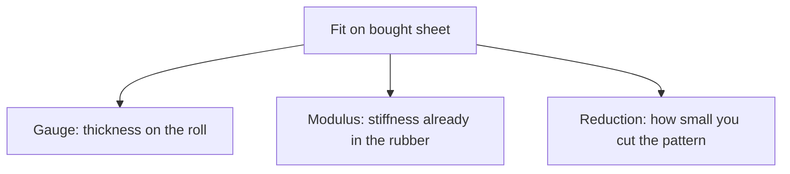

# Gauge, Modulus, and Reduction on Bought Sheet

## Executive summary

On bought calendered sheet latex, fit depends on three separate levers. Gauge is the thickness of the roll. Modulus is how stiff that rubber compound is at a given stretch. Reduction is how much smaller you cut the pattern than the body.

Thinner sheet, a softer compound, and a smaller pattern outline produce different results. Use these distinctions when you select a millimetre thickness from a catalog, or when two rolls with the identical printed thickness feel different in your hands.

## Questions this article answers

- [How do you read gauge on a roll?](#gauge)
- [What does modulus mean on sheet you bought?](#modulus)
- [What is reduction?](#reduction)
- [Which change actually changes the fit?](#which-change)

## How do you read gauge on a roll? {#gauge}

### How

Read the millimetre rating on that product line. Pick a different catalog thickness when you want a thicker or thinner wall. Check any tolerance class the seller prints next to that number.

For how suppliers present those options, see [Calendered latex sheet](/literature-reviews/sheet-calendered-sheet).

### Why

Gauge is thickness. With sheet latex, the processing mill already brought the rubber to that thickness between heavy rollers. You cut the sheet and apply adhesive.

ISO 3302-1:2014 is a dimensional tolerance standard for rubber products. Its scope includes calendered sheet. The standard defines how close a measured thickness must sit relative to the labeled thickness.

Detail: Catalog millimetres and tolerance classes

A thickness with no class named represents the nominal size on the product label.

The Elastomade latex sheeting chart runs from about 0.25 mm to 1.05 mm. That range describes that manufacturer's catalog offerings.

## What does modulus mean on sheet you bought? {#modulus}

### How

Leave the compound alone. You bought a finished roll. Stretch scraps side by side when two rolls share a printed gauge and one resists more. Treat them as different compounds.

Color and filler are already present in the roll. For those mechanisms, see [Colored sheet: pigment and filler effects](/literature-reviews/sheet-pigment-filler-decks).

### Why

Modulus is stiffness at a stated stretch. A higher modulus feels firmer at the same thickness.

Thickness also changes the pull. Modulus measures tensile stress, which is force spread across the cross-sectional area. A thicker piece of the same rubber requires more total force to bend and to reach the same stretch. The modulus of that compound remains the same. You changed the wall thickness, not that stress value.

Detail: Stress at a stated elongation

Standard rubber test data reports modulus as tensile stress at a fixed elongation, typically expressed in megapascals (MPa) or pounds per square inch (psi). Two thicknesses of one compound require different total pull force at the same elongation percentage while sharing an identical modulus.

On bought sheet latex, you inherit that stiffness. The mill already compounded and vulcanized the roll.

## What is reduction? {#reduction}

### How

Draw flat pattern pieces smaller than the body measurements when the finished garment must stretch to close. Adjust that outline when you want more or less stretch. Selecting a different catalog gauge changes only the wall thickness.

### Why

Reduction is pattern geometry. Pattern makers also call this negative ease. Gauge and modulus govern how firm that stretch feels against the body. They leave the pattern outline where you marked it.

## Which change actually changes the fit? {#which-change}

### How

Change the catalog thickness in millimetres when the wall thickness must change. Check the seller's published specifications for tolerances.

Treat same-gauge rolls as different compounds when they feel different in tension. If a garment bags out after wear, that loosening can stem from tension set in the mill compound, or from material aging. See [Sheet aging, storage, and care](/literature-reviews/sheet-aging-storage-and-care).

Change the pattern outline when you need more or less negative ease.

### Why

Each lever controls a distinct property. Thickness, inherited compound stiffness, and pattern reduction act independently on the finished fit.

## Sources

- ISO 3302-1:2014. *Rubber — Tolerances for products — Part 1: Dimensional tolerances.* International Organization for Standardization, 2014. https://www.iso.org/standard/62492.html
- Elastomade Accessories. Latex sheeting product chart (about 0.25–1.05 mm). https://elastomade.com/latex-sheet/