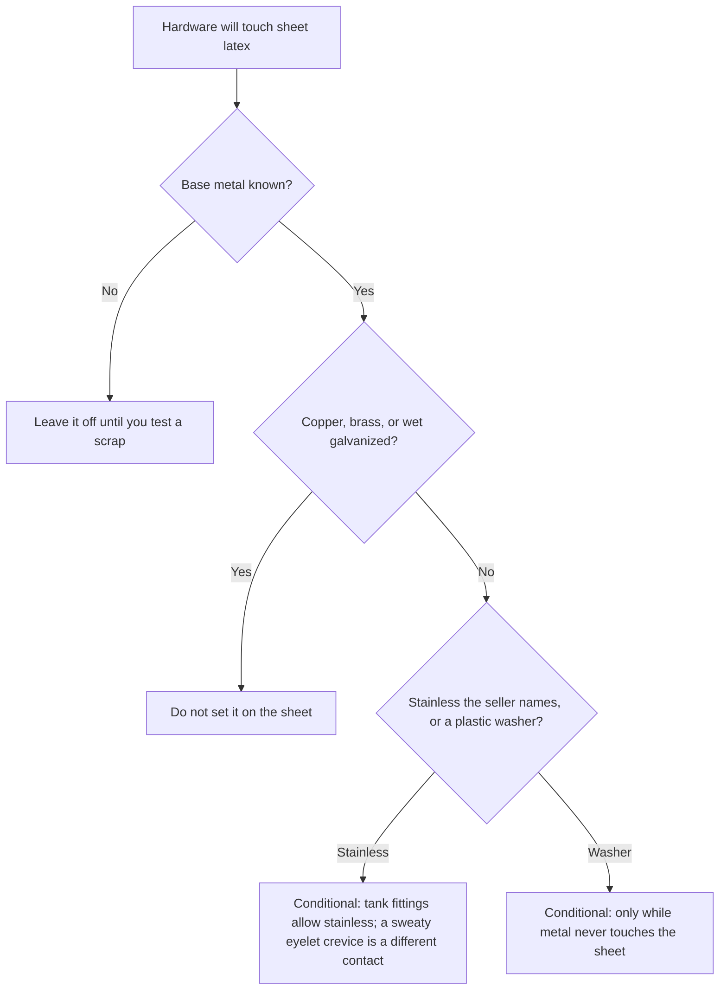

# Sheet Hardware & Metal Contact

## Executive summary

A snap, eyelet, or D-ring on sheet latex puts metal in direct contact with the rubber. Copper, brass, and wet galvanized steel are the primary metal classes that industry handbooks treat as harmful. Commercial finish names printed on retail packets describe surface coloring rather than the metal underneath. Inspect worn items for a brown ring or a stiff patch around each fastener, and replace the hardware if that damaged area expands.

Pair this review with the contact grid in the [Compatibility Matrix](/literature-reviews/compatibility-matrix-metals-oils-plastics) and the visual indicators in [Sheet Aging, Storage and Care](/literature-reviews/sheet-aging-storage-and-care).

## Questions this article answers

- [Why does the metal on a fastener matter?](#why-metal)
- [Which hardware should stay off the sheet?](#which-hardware)
- [What does a finish name tell you?](#finish-name)
- [What should you look for on a worn garment?](#inspect)

## Why does the metal on a fastener matter? {#why-metal}

### How

Keep copper and brass off sheet latex. If a snap is already attached and a brown ring begins to spread, remove the fastener and install one made from a non-reactive metal. A plastic washer helps only while it prevents the metal from touching the rubber.

### Why

Oxidative breakdown in rubber feeds on itself. *The Vanderbilt Latex Handbook* notes that fatty-acid salts of copper, cobalt, manganese, and iron accelerate this degradation reaction. Industrial compounding rules warn that brass and copper fittings cause severe deterioration of rubber in latex, while galvanized fittings generate coagulum. For sheet latex, these warnings identify the critical metals to refuse: copper, brass, and galvanized steel in wet conditions.

Duangthong and coauthors note that copper in natural rubber exists primarily as copper oxide and copper oleate, both of which accelerate oxidative breakdown. Their review confirms that localized dark spots on finished rubber goods can trace back directly to trace copper contamination during storage and processing.

Detail: Antioxidant level in a factory film

The abbreviation phr means parts per hundred rubber. *The Vanderbilt Latex Handbook* instructs compounders to use 2 phr total antioxidant to limit copper and metal-catalyzed degradation in natural rubber or chloroprene rubber film. One part protects against routine atmospheric oxidation. The second part defends against metal-catalyzed breakdown, as reactive transition metals rapidly consume protective additives. Commercial sheet latex does not receive post-cure chemical additives in a craft shop. Protecting the finished rubber depends entirely on fastener material selection.

Detail: Manganese and cobalt in mould metal

*Polymer Latices: Science and Technology — Volume 3* states that aluminium mould alloys for latex casting must remain free of trace copper, manganese, and cobalt. These metals discolor rubber products, and their salts accelerate oxidative breakdown across diene elastomers. This industrial rule for casting equipment confirms that the same transition metals attack vulcanized rubber films.

## Which hardware should stay off the sheet? {#which-hardware}

### How

Match the hardware item to its base metal before setting it into sheet latex.

| Hardware | How it sits | Metal to refuse |
| --- | --- | --- |
| Press snap | Disk stack through a punched hole | Plated brass when the core metal is unknown |
| Eyelet or grommet | Crimped barrel | Copper, brass, and any wet galvanized barrel |
| D-ring or buckle | Metal face under strap load | Galvanized steel |
| Corset busk | Broad steel against rubber | Iron salts that catalyze degradation in film |

### Why

The list of prohibited hardware metals reflects industrial processing guidelines. *The Vanderbilt Latex Handbook* specifies black iron, 300-series stainless steel, or inert nonmetallic materials for handling latex compounds. It explicitly prohibits brass, copper, and galvanized fittings. Retail packaging labeled generically as stainless does not specify the underlying alloy or ensure resistance to localized crevice corrosion from perspiration.

Detail: What verified means for metal alloys

Industrial specifications define specific stainless steel grades, such as 304 or 316, for storage vessels and leaching tanks. For garment construction, verified hardware means the supplier certifies the underlying alloy. Polished or chrome-plated coatings do not ensure an inert base metal.

## What does a finish name tell you? {#finish-name}

### How

Identify the core base metal before purchasing fasteners in bulk. Decorative labels like gunmetal, antique brass, and antique nickel describe surface colors, not base alloys. Before punching holes in pattern pieces, set a sample fastener into a scrap piece of sheet latex. Store the test scrap alongside an unfastened offcut to watch for discoloration over time.

### Why

Handbook warnings single out specific elements: copper, brass, manganese, cobalt, galvanized iron, and soluble iron salts. A decorative finish name provides no information about the core composition. Thin electroplated coatings can wear through quickly, exposing an underlying brass or zinc core directly to the rubber.

Detail: Brown staining from dithiocarbamate accelerators

*Polymer Latices: Science and Technology — Volume 3* documents a distinct staining mechanism: latex films compounded with dithiocarbamate accelerators turn brown when exposed to trace amounts of copper. Even handling pocket coins can deposit enough copper on fingertips to initiate staining. The reaction produces copper(II) dithiocarbamates, which form visible dark brown complexes. Freshly formed, undried deposits discolor most rapidly. The text notes that eliminating dithiocarbamate accelerators prevents this specific staining problem.

*The Vanderbilt Latex Handbook* gives an explicit compound recipe for copper-stain resistance: zinc propyl dithiocarbamate paired with zinc 2-mercaptobenzothiazole or 2-(4-morpholinothio)benzothiazole, omitting standard water-soluble dithiocarbamates.

In thread manufacturing, *Polymer Latices: Science and Technology — Volume 3* notes that small additions of dithiocarbamates remain necessary alongside thiazoles to maintain adequate vulcanization rates during production. Because commercial sheet latex rolls do not list specific accelerator systems, avoiding reactive metals remains the only reliable control.

## What should you look for on a worn garment? {#inspect}

### How

Inspect the sheet latex surrounding each fastener on existing garments:

- A brown or dark halo radiating outward from the metal contact point
- Local stiffening or hardening in the rubber beside an eyelet or snap
- Surface cracks initiating at the punched hole edge when the panel is stretched
- Uneven bending or loss of flexibility compared to adjacent rubber

Fastener holes introduce cut edges where mechanical tension and chemical exposure concentrate. If discoloration spreads or the rubber stiffens, remove and replace the hardware. For garment inspection procedures, consult [Sheet Garment Selection QA](/literature-reviews/sheet-garment-selection-qa). For metal slide closures, see [Sheet Zipper Closure Compatibility](/literature-reviews/sheet-zipper-closure-compatibility).

### Why

Rubber degrades through progressive auto-oxidation. *The Vanderbilt Latex Handbook* notes that degradation manifests as progressive crosslinking, which causes stiffening and embrittlement. The text also observes that articles with sharp angles or cut edges deteriorate more rapidly than rounded profiles. A punched hole in sheet latex presents an exposed cut edge that accelerates localized aging when paired with catalytic metals.

ASTM D925 defines standardized laboratory methods for evaluating contact staining, migration staining, and diffusion staining in rubber. The standard measures discoloration developed under elevated heat, mechanical pressure, or ultraviolet exposure. It establishes testing protocols for staining halos, though it does not establish specific pass or fail criteria for garment hardware.

Detail: ASTM D925 test classifications

ASTM D925 divides contact degradation into three distinct mechanisms: Method A evaluates direct contact staining between rubber and a contact surface; Method B evaluates migration staining, where chemical ingredients diffuse from rubber into an adjacent coating; and Method C evaluates diffusion staining through an applied finish under light exposure. These procedures standardize laboratory reporting of discoloration halos, but they do not define field wear limits for apparel hardware.

## Sources

- *The Vanderbilt Latex Handbook*. 3rd ed. Edited by Robert Francis Mausser. Norwalk, CT: R.T. Vanderbilt Company, 1987. <https://lccn.loc.gov/92117844>
- *Polymer Latices: Science and Technology — Volume 3: Applications of Latices*. 2nd ed. D. C. Blackley. Chapman & Hall / Springer, 1997. <https://books.google.com/books?id=Y2VPGj7YbykC>
- Duangthong, Supunnee, Khwannapha Rattanadaecha, Wilairat Cheewasedtham, Puchong Wararattananurak, and Pipat Chooto. “Simple digestion and visible spectrophotometry for copper determination in natural rubber latex.” *ScienceAsia* 43 (2017): 369–376. <https://doi.org/10.2306/scienceasia1513-1874.2017.43.369>
- ASTM D925. *Standard Test Methods for Rubber Property—Staining of Surfaces (Contact, Migration, and Diffusion)*. <https://store.astm.org/d0925-14r25.html>