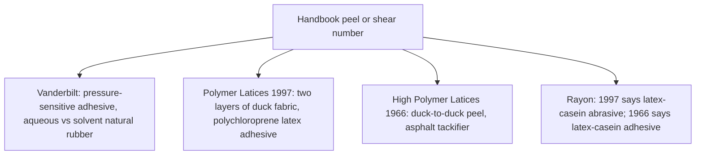

# Sheet Latex–Latex Adhesion Testing

> **Safety.** Solvent rubber cement consists of rubber dissolved in organic solvent. *Polymer Latices* lists flammable and toxic solvents among the primary hazards of polymer-solution adhesives. Provide dedicated ventilation and eliminate open flames or ignition sources when working with solvent rubber cement.

## Executive summary

Peel and shear values reported in rubber handbooks attach to specific laboratory test specimens such as duck fabric, pressure-sensitive tape, or rayon tire cord. They do not measure a craft seam made from two vulcanized sheets joined with solvent rubber cement. Use this guide when interpreting published adhesion numbers so you do not mistake textile or tape tests for garment seam specifications. For selecting adhesives, see [Sheet adhesives and seam integrity](/literature-reviews/sheet-adhesives-and-seam-integrity). For test geometries, peel angles, and crosshead speeds, see Adhesion peel test methods (`adhesion-peel-test-methods`).

## Questions this article answers

- [What is the peel number attached to?](#what-the-number-is)
- [Which sentences are a sheet-cement test?](#sheet-cement)
- [Where do the neighboring questions live?](#neighbors)

## What is the peel number attached to? {#what-the-number-is}

### How

Read the specimen description printed in the same sentence or table as the test number. Pair the number only with that exact material assembly. Do not transfer a peel or shear value to a sheet latex garment seam unless the test explicitly used vulcanized sheet latex with solvent rubber cement.

### Why

A mechanical test number measures the force required to separate the specific specimen prepared for that test. Rubber handbooks report adhesion values across distinct constructions. A pressure-sensitive tape formulation, a laminated cotton duck textile, and an impregnated rayon tire cord have different surface energies and stress distributions. Furthermore, historical handbooks sometimes describe the same chemical system with different terminology. *Polymer Latices* (1997) and *High Polymer Latices* (1966) use different terms for rayon cord dips, and both source wordings stand as published.

Detail: Pressure-sensitive comparison and duck fabric peel values

*The Vanderbilt Latex Handbook* section "Natural Rubber - Solution vs. Latex Adhesives" compares systems using Piccolyte A85 as the tackifying resin. Across resin concentrations from 30% to 60% based on dry rubber, quick stick, peel adhesion, and Polyken tack measure essentially the same for the aqueous latex system and the solvent solution system. In contrast, shear adhesion is significantly higher for the latex system. Natural rubber used for the solvent adhesive in that trial was milled to a Mooney viscosity of 75 or below to achieve complete solubility at 10% solids. The high molecular weight fraction of unmilled rubber is insoluble in common organic solvents.

The handbook tabulates these results under pressure-sensitive adhesive performance for Piccolyte A85 and natural rubber. The peel column is designated as 180° peel adhesion in ounces per inch of width. At 30%, 40%, 50%, and 60% resin concentration, every aqueous shear value exceeds 6000 minutes, while every solvent shear value falls below 500 minutes.

*Polymer Latices* (1997) reports that the tack of a polymer-resin blend typically rises to a sharp maximum near 60% to 70% resin by mass, and then drops. Adhesive bond strength generally declines as the resin-to-polymer ratio increases. Blackley illustrates this with the 180° peel strength of two layers of cotton duck fabric bonded with a polychloroprene latex adhesive. The dry formulation parts by mass are polychloroprene rubber 100, zinc oxide 5, antioxidant 2, sodium alkyl sulphate 1, and variable tackifier. The tackifier columns list asphalt, a rosin ester melting at 56°C, and a rosin ester melting at 83°C. The formulation with zero tackifier yields an uncaptioned value of 31 in a table lacking explicit cell units.

*High Polymer Latices* (1966) also locates the tack peak near 60% to 70% resin content. Its peel test evaluates a duck-to-duck textile lamination bonded with polychloroprene and asphalt tackifier. At zero parts asphalt, the peel strength is reported as 16 lb wgt per inch. That figure does not override the 1997 value of 31. Both citations document duck fabric laminated with an aqueous latex adhesive rather than sheet rubber bonded with solvent cement.

Detail: Casein wording on rayon cords

*Polymer Latices* (1997) notes that the static adhesion of rubber to high-tenacity rayon cord improves when the cord surface is mechanically abraded before bonding. Abrasion followed by treatment with a latex-casein abrasive yields higher adhesion than either step alone. However, *High Polymer Latices* (1966) describes that identical experimental setup as a latex-casein adhesive. Both phrases remain documented in the literature. A separate 1966 cord-dip formulation also uses the phrase latex-casein adhesive for treating rayon cord.

In the 1997 text, static and dynamic adhesion tests are distinguished by the rate of deformation applied during peel or pull-out. Static tests conducted without prior mechanical fatigue serve only as preliminary sorting trials for textile cord bonding.

## Which sentences are a sheet-cement test? {#sheet-cement}

### How

Check whether a cited handbook sentence explicitly specifies two plies of vulcanized sheet latex joined by solvent rubber cement. If the text describes fabric plies, dipped latex gel layers, or adhesive tapes, treat those figures as irrelevant to sheet latex garment seams.

### Why

A garment seam on sheet latex consists of two cured, solid rubber surfaces joined by applying solvent rubber cement, airing until tacky, and consolidating the overlay under pressure. Industrial handbook sentences evaluating peel strength routinely measure pressure-sensitive tapes, coated fabrics, or dipped cord. While handbooks discuss how solvent solutions wet hydrophobic surfaces more effectively than water-based latex adhesives, they do not publish standardized peel figures for solvent-welded sheet latex seams.

Detail: Wetting and cohesion of solvent versus latex adhesives

*Polymer Latices* identifies poor wetting on dry hydrophobic surfaces, particularly greasy substrates, as a primary disadvantage of water-borne latex adhesives relative to solvent solutions. Blackley also observes that the adhesive and cohesive strengths developed by dried latex films may be lower than those developed by solvent-deposited polymer films. This occurs because emulsified polymer particles coalesce less completely during drying, and residual surface-active agents remain trapped within the film matrix. 

The text balances this disadvantage by noting that solvent adhesives introduce severe flammability and vapor inhalation risks. However, industrial comparisons between solvent solutions and latex adhesives do not address fashion sheet preparation, such as cleaning surface blooming or removing silicone processing oils before applying adhesive.

## Where do the neighboring questions live? {#neighbors}

### How

Refer to the companion literature reviews for related testing standards, dipping methods, and substrate combinations:

- For peel angles, test crosshead speeds, specimen widths, and ASTM standard limitations, consult Adhesion peel test methods (`adhesion-peel-test-methods`).
- For bonding between successive dips in liquid latex, consult Liquid latex–latex adhesion testing (`liquid-latex-latex-adhesion-testing`).
- For bonding latex to non-rubber substrates, consult Sheet latex–substrate adhesion testing (`sheet-latex-substrate-adhesion-testing`) and Liquid latex–substrate adhesion testing (`liquid-latex-substrate-adhesion-testing`).
- For choosing between adhesive types for sheet construction, consult [Sheet adhesives and seam integrity](/literature-reviews/sheet-adhesives-and-seam-integrity).
- For analyzing seam failure modes, edge lift, and bond degradation, consult [Sheet delamination and seam failure](/literature-reviews/sheet-delamination-seam-failure).

### Why

Adhesion science divides sharply between wet dipping, dry sheet contact bonding, and textile combining. The coalescence of two wet latex layers on a dipping former follows colloidal film-formation rules. In contrast, bonding two cured sheets relies on solvent diffusion, polymer tack, and mechanical roll pressure. Separating test methods, dipping mechanics, and repair procedures into dedicated articles prevents misapplying industrial latex data to finished garment seams.

## Sources

- [*The Vanderbilt Latex Handbook*](https://lccn.loc.gov/92117844). 3rd ed. Edited by Robert Francis Mausser. Norwalk, CT: R.T. Vanderbilt Company, Inc., 1987.
- [*Polymer Latices: Science and Technology — Volume 3: Applications of Latices*](https://books.google.com/books?id=Y2VPGj7YbykC). 2nd ed. D. C. Blackley. Chapman & Hall / Springer, 1997.
- [*High Polymer Latices: Their Science and Technology*](https://lccn.loc.gov/66077950). 2 vols. D. C. Blackley. London: Maclaren; New York: Palmerton, 1966.