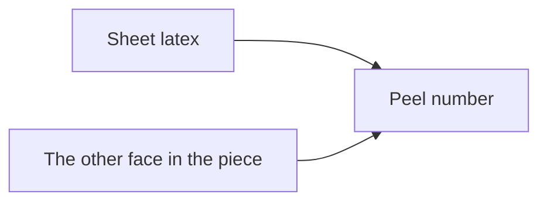
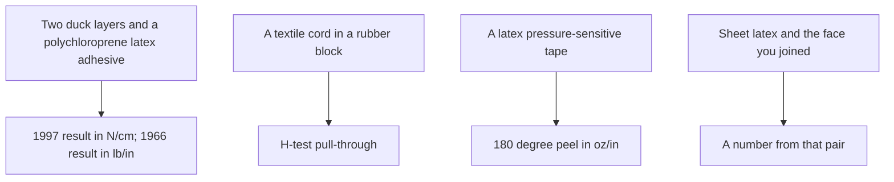

# Sheet Latex–Substrate Adhesion Testing

This page is not a skin test and it is not medical advice. Labeling for skin contact is in [Allergy and skin contact](/literature-reviews/allergy-and-skin-contact).

If the piece uses solvent rubber cement, keep the can closed and the room ventilated. See [Sheet ventilation](/literature-reviews/sheet-ventilation-solvent-exposure).

## Executive summary

A peel number for sheet latex against another material belongs strictly to those two tested faces. Whenever you record or cite a test value, write the exact sheet latex grade and the specific substrate face beside that number.

Handbook curves that report peel strength are tied directly to the materials described in their captions. A 1997 duck-fabric figure measures two layers of duck joined with a polychloroprene latex adhesive in newtons per centimetre. An older 1966 figure records duck-to-duck peel in pounds per inch. Cord pull tests measure the force required to pull an embedded cord from a solid block. Published values in ounces per inch from adhesive handbooks characterize pressure-sensitive tapes, not garment bonds.

Use this guide when evaluating sheet latex bonded to textiles, leather, metal, or plastic. Specific standard method titles are covered in [Adhesion and peel test methods](/literature-reviews/adhesion-peel-test-methods). Substrate mechanics for fibers appear in [Sheet latex–textile bonding](/literature-reviews/sheet-latex-textile-bonding). Testing films derived from liquid latex is detailed in `liquid-latex-substrate-adhesion-testing`.

## Questions this article answers

- [What faces does the number belong to?](#what-faces)
- [What do you write for sheet against a textile?](#sheet-textile)
- [What about leather, metal, plastic, and skin?](#other-faces)
- [Where does rubberise sit in the report?](#rubberise)
- [Where is the method name?](#where-next)

## What faces does the number belong to? {#what-faces}

### How

Name both faces explicitly. One face is your sheet latex. The other face is the exact textile, leather, metal, plastic, or structural backing used in the construction.

Keep published figures attached strictly to their original experimental conditions.

### Why

*Polymer Latices* Volume 3 establishes that an adhesion measurement has meaning only when the test method remains attached to the result. The duck curve in that volume measures two plies of duck fabric bonded with a polychloroprene latex adhesive. Its axis plots peel strength in newtons per centimetre.

*High Polymer Latices* (1966) documents the peeling of a duck-to-duck assembly bonded with polychloroprene and asphalt, plotting the axis in pounds per inch. Because testing protocols evolved between editions, leave each number in its original unit. The 1966 chart cannot stand as an equivalent substitute for the 1997 dataset.

The same 1997 source describes the H-test, which measures the force required to pull a textile cord out of a solid vulcanized block. Because the specimen geometry resembles the letter H, record that finding as a cord pull-through rather than a surface peel.

In *The Vanderbilt Latex Handbook*, 180° peel measures pressure-sensitive tape performance. The tackifier panel on page 236 records data in ounces per inch under defined roller application pressure. The companion table on page 235 benchmarks box-closing tape, permanent labels, and paper masking tape.

Detail: The two duck units, side by side

The 1997 Blackley caption specifies a 180° peel configuration. Its dry-basis compounding recipe lists polychloroprene at 100 phr, zinc oxide at 5 phr, antioxidant at 2 phr, sodium alkyl sulphate at 1 phr, and a variable tackifier resin. 

The 1966 figure labels the 1 phr component as an unspecified stabilizer. The 1997 edition identifies that 1 phr component as sodium alkyl sulphate. The 1966 text omits the 180° angle designation.

Neither handbook page references ASTM or ISO standards. Retain the published units without recalculation. A test coupon using sheet latex must document the rubber thickness, compound source, and matching substrate. 

Both historical duck diagrams illustrate a T-peel shape where the specimen tails pull apart in opposite directions. Reference [Adhesion and peel test methods](/literature-reviews/adhesion-peel-test-methods) for formal classification of T-peel protocols.

## What do you write for sheet against a textile? {#sheet-textile}

### How

Record four core parameters whenever reporting textile adhesion:

1. The test standard and edition, referenced via [Adhesion and peel test methods](/literature-reviews/adhesion-peel-test-methods).
2. The specimen geometry mandated by that edition.
3. The conditioning parameters, jaw separation rate, and environment.
4. The two contact faces: the sheet latex grade and the specific textile substrate.

If the assembly was joined using solvent rubber cement, document that glue family. The duck test figures in historical references represent a waterborne latex adhesive applied between woven cotton faces.

A static bench test completed immediately after fabrication functions only as a sorting check. Operational mechanics for tires, belts, or clothing subject to flex fatigue require separate dynamic testing. Substrate compatibility data for cotton and nylon is collected in [Sheet latex–textile bonding](/literature-reviews/sheet-latex-textile-bonding).

### Why

Static testing and dynamic testing isolate different physical responses based on the rate and repetition of deformation. A static peel test on an unaged seam checks baseline consolidation. It does not predict endurance under cyclic laundering or mechanical stretch. Data points drawn from duck plies or tire cords cannot be translated to sheet latex bonded to garment textiles.

Detail: ISO 36 and ISO 2411, as class names only

[Adhesion and peel test methods](/literature-reviews/adhesion-peel-test-methods) covers ISO 36 for assemblies consisting of a rubber layer bonded to a fabric ply. It directs coated fabrics to ISO 2411. ASTM D751 provides an alternate framework for coating adhesion on industrial fabrics.

When evaluating sheet latex bonded to a textile, identify which structural model the sample mirrors. Strip dimensions, crosshead speed, acceptance thresholds, and failure-mode designations (adhesive peel versus cohesive failure) must come directly from the active standard.

Detail: What a stretch-and-wash report has to name

A comprehensive post-wash report requires recording sheet latex thickness, textile weave, test method, pull rate, relaxation duration, and the laundering cycles applied. Handbook sorting tests cite tire carcass applications rather than laundered fashion fabrics. They offer no empirical numbers for washed elastomeric-textile joins.

## What about leather, metal, plastic, and skin? {#other-faces}

### How

Compounded latex formulations appear in industrial guides for combining fabrics, laminating foil, and mounting paper or leather goods. These application listings do not supply numeric peel strengths for sheet latex. When aqueous adhesives are applied to wet assemblies, refer to `liquid-latex-substrate-adhesion-testing`.

Do not borrow pressure-sensitive tape ratings when specifying rubber-to-metal or rubber-to-plastic joints. Handbook measurements given in ounces per inch evaluate light-tack films, not vulcanized structural assemblies.

For contact swelling, chemical degradation, or plasticizer staining without mechanical peel numbers, consult [Compatibility of metals, oils, and plastics](/literature-reviews/compatibility-matrix-metals-oils-plastics).

Skin contact involves biocompatibility and barrier exposure rather than mechanical bond resistance. Refer to [Allergy and skin contact](/literature-reviews/allergy-and-skin-contact).

### Why

Application lists outline industrial uses without validating seam capacity. In the *Vanderbilt* handbook, varying resin-to-rubber ratios from 30% to 60% with Piccolyte A85 yielded matching 180° peel numbers between natural rubber latex and solvent cement on tape backings, though the latex compound exhibited higher resistance in a 178° shear test. Those figures apply exclusively to tape films.

Chemical compatibility rules and mechanical adhesion tests measure separate physical phenomena. They belong in separate records.

Detail: What the combining paragraph actually lists

Wet combining describes spreading a high-viscosity latex adhesive onto one substrate, laminating the second ply immediately, and passing the combined web over steam-heated drums. Dry combining applies a tackified compound to both surfaces, evaporates the water phase, and bonds the tacky plies through pressure rollers.

These continuous lines manufacture coated industrial rolls. A manual coupon made from sheet latex must state the adhesive system, drying time, assembly pressure, and both bond surfaces.

## Where does rubberise sit in the report? {#rubberise}

### How

If you rubberise a textile or hardware element before assembling the seam, document that pretreatment alongside your peel value. Adhesion ratings belong strictly to the pretreated interface that took the load.

### Why

*Polymer Latices* Volume 3 reports that mechanical abrasion of high-tenacity rayon cord improved static adhesion. Combining surface abrasion with a latex-casein dip yielded higher pull strength than either treatment applied on its own. That finding concerns cord pretreatments in industrial dipping, not untreated fabrics.

Detail: Cord pretreat and shop rubberise

The rayon cord abrasion data isolates mechanical keying on continuous tire cords. Factory dip systems for rayon and synthetic polyamide are outlined in [Sheet latex–textile bonding](/literature-reviews/sheet-latex-textile-bonding), with aqueous processing chemistry detailed in [Liquid latex–textile bonding](/literature-reviews/liquid-latex-textile-bonding).

When you rubberise zipper tape or structural stays, maintain the designation rubberise. Record the exact dipping or priming technique used. The primary literature values evaluate industrial tire cord abrasion combined with latex-casein dips.

## Where is the method name? {#where-next}

### How

Match your testing question to its designated domain guide:

| Testing question | Reference source |
| --- | --- |
| Standard selection, crosshead speed, and specimen geometry | [Adhesion and peel test methods](/literature-reviews/adhesion-peel-test-methods) |
| Sheet latex joined to sheet latex | `sheet-latex-latex-adhesion-testing` |
| Film made from liquid latex joined to identical film | `liquid-latex-latex-adhesion-testing` |
| Film made from liquid latex joined to a non-latex substrate | `liquid-latex-substrate-adhesion-testing` |
| Adhesive families, drying times, and seam overlay rules | [Sheet adhesives and seam integrity](/literature-reviews/sheet-adhesives-and-seam-integrity) |
| Fiber dynamics and polarity differences in cotton and nylon | [Sheet latex–textile bonding](/literature-reviews/sheet-latex-textile-bonding) |
| Inspecting seam failure modes and peel patterns | [Sheet delamination and seam failure](/literature-reviews/sheet-delamination-seam-failure) |
| Staining, swell, or oil reactions without mechanical pull forces | [Compatibility matrix](/literature-reviews/compatibility-matrix-metals-oils-plastics) |

### Why

A standard method name fixes the geometry, crosshead rate, and calculation parameters. It does not transfer strength data across different material interfaces. The duck curves represent polychloroprene latex adhesive between textile plies. The ounce measurements evaluate pressure-sensitive tapes. A sheet latex assembly requires its own verified test coupon.

## Sources

- *Polymer Latices: Science and Technology — Volume 3: Applications of Latices.* 2nd ed. D. C. Blackley. Chapman & Hall / Springer, 1997. <https://books.google.com/books?id=Y2VPGj7YbykC>
- *High Polymer Latices: Their Science and Technology.* 2 vols. D. C. Blackley. London: Maclaren; New York: Palmerton, 1966. <https://lccn.loc.gov/66077950>
- *The Vanderbilt Latex Handbook.* 3rd ed. Edited by Robert Francis Mausser. Norwalk, CT: R.T. Vanderbilt Company, 1987. <https://lccn.loc.gov/92117844>
- ISO 36:2020. *Rubber, vulcanized or thermoplastic — Determination of adhesion to textile fabrics.* Edition 7. <https://www.iso.org/standard/74942.html>
- ISO 2411:2024. *Rubber- or plastics-coated fabrics — Determination of coating adhesion.* Fifth edition. <https://www.iso.org/standard/86334.html>
- ASTM D751-26. *Standard Test Methods for Coated Fabrics.* <https://store.astm.org/d0751-26.html>