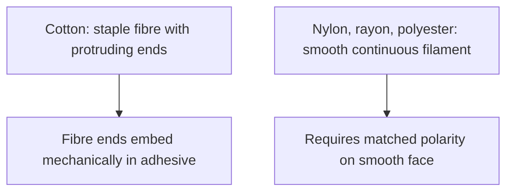
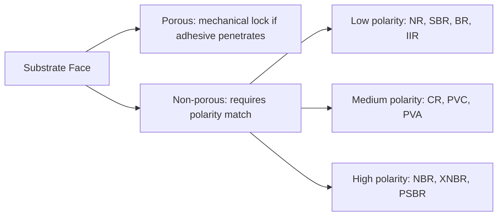
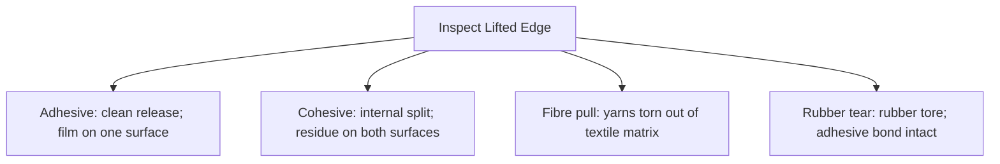

# Sheet Latex–Textile Bonding

> **Safety.** Solvent rubber cement presents fire, explosion, and vapor hazards. Review the product SDS. Ensure adequate ventilation. Keep containers closed and away from ignition sources. Refer to [Sheet adhesives](/literature-reviews/sheet-adhesives-and-seam-integrity) and [Sheet ventilation](/literature-reviews/sheet-ventilation-solvent-exposure). Natural rubber protein (Type I) and accelerator residues (Type IV-like) can cause allergic reactions upon contact with skin. This information is educational literacy, not medical advice. Refer to [Allergy and skin contact](/literature-reviews/allergy-and-skin-contact).

## Executive summary

When bonding textile trim, linings, or panels to commercial sheet latex, fibre structure dictates bond strength. Staple fibres like cotton possess protruding fibre ends that embed directly into the adhesive matrix, forming a durable mechanical lock. Synthetic filaments such as nylon, polyester, and rayon have smooth surfaces that lack these fibre ends. For smooth synthetic fibres, adhesion depends entirely on matching the chemical polarity between the adhesive polymer and the textile surface. Use this guide to diagnose seam lift, bond synthetic fabrics to low-polarity natural rubber, and minimize stress at flexing laps.

## Questions this article answers

- [How do cotton and nylon differ when bonding to sheet latex?](#cotton-or-nylon)
- [How does lap joint movement cause seam failure?](#stretch-lap)
- [How do you identify the cause of a lifted fabric edge?](#lifted-edge)
- [Should fabric be pretreated before applying adhesive?](#pretreat)
- [What safety rules apply to bonding adhesives?](#safety)

## How do cotton and nylon differ when bonding to sheet latex? {#cotton-or-nylon}

### How

Identify your textile fibre before bonding:

1. Inspect the cloth face. If the fabric is a blend, has a coated finish, or is an unknown weave, identify the fiber type first.
2. For cotton and other staple-fibre textiles, apply solvent rubber cement to both the fabric and the sheet latex glue pathway.
3. Air the adhesive until it flashes off to tack.
4. Overlay the two surfaces without stretching either substrate.
5. Press the lap firmly across the entire join with a roller.
6. For smooth synthetic fabrics like nylon, test a sample strip first. If bond strength is poor, do not force an unformulated low-polarity cement to hold a high-polarity smooth filament.

### Why

Cotton is composed of staple fibres. Short, individual fibres are twisted into yarns, leaving loose fibre ends protruding along the surface. When liquid adhesive is applied, it wets around these fibre ends. Once dried, the adhesive captures these ends, generating a mechanical interlock that holds even if the chemical affinity between the polymer and cellulose is low.

Continuous filament synthetics like nylon and polyester, as well as regenerated celluloses like rayon, lack these protruding ends. Their smooth filaments offer no mechanical anchor. Bonding to a smooth surface requires chemical wetting and matched polarity. The adhesive polymer must share a similar surface energy with the textile substrate. Natural rubber (NR) and styrene-butadiene rubber (SBR) sit at the low-polarity end of the scale. Polyamide (nylon) is substantially more polar. Because standard natural-rubber solvent cement cannot readily wet or match the polarity of nylon filaments, the bond relies on weak dispersion forces and peels easily under tension.

Latex adhesive systems introduce additional physical considerations. Water in aqueous adhesives swells natural fibers, causing fabrics to shrink as they dry. High filler loadings in latex adhesives increase formulation viscosity, preventing the liquid from penetrating porous yarn bundles before it coalesces.

Detail: Polarity matching and latex compounding

Industrial formulations rank elastomer polarity to predict adhesion onto non-porous and smooth surfaces. *The Vanderbilt Latex Handbook* organizes polymer emulsions by polarity:

- **High polarity:** Nitrile butadiene rubber (NBR), carboxylated nitrile (XNBR), carboxylated styrene-butadiene (XSBR), and pyridine-styrene-butadiene (PSBR).
- **Medium polarity:** Polychloroprene (CR) and polyvinyl chloride (PVC).
- **Low polarity:** Natural rubber (NR), styrene-butadiene (SBR), polybutadiene (BR), and butyl rubber (IIR).

D. C. Blackley's *Polymer Latices* aligns with this classification. Polyisoprene and non-functionalized SBR represent low-energy, non-polar polymers. Polyacrylics, NBR, and vinylpyridine-functionalized terpolymers sit at the high-polarity end, while CR and polyvinyl acetate (PVA) occupy intermediate roles.

When bonding substrates with conflicting polarities—such as joining an NR film to a nylon fabric—industrial manufacturers do not rely on standard single-polymer cements. Instead, they compound polymer blends (such as NR/XNBR blends) or combine an elastomer latex with tackifying resins that contain polar functional groups. These tailored multi-polymer systems are factory formulations; typical commercial solvent rubber cements available in craft shops lack these polarity-bridging modifications.

## How does lap joint movement cause seam failure? {#stretch-lap}

### How

Differentiate between static and dynamic joints when planning fabric placement:

- **Static laps:** Keep textile overlays on low-movement zones (such as torso panels or decorative chest trims) where the sheet latex does not stretch significantly during wear.
- **Dynamic laps:** Avoid placing fabric lap edges over active articulation points, including knees, elbows, openings, and strap anchors.
- Inspect seams after active use. Check the free edge of the fabric lap first; peel always initiates at this boundary.

### Why

A lap joint consists of an overlap where one substrate is bonded over another. When a garment is worn, the rubber and the textile behave according to radically different physical properties. Rubber is a highly deformable elastomer capable of hundreds of percent elongation at low stress. Woven and knit textiles are comparatively rigid, exhibiting high initial modulus with minimal mechanical stretch.

When a bonded lap is stretched, the rubber substrate elongates readily, but the textile resists extension. This mismatch generates severe shear and peel stresses concentrated directly at the terminal edge of the lap joint. Once the adhesive bond breaks at this boundary, the failure propagates along the joint as peeling continues.

In reinforced industrial goods, such as fabric-lined protective gloves, stiff textile backings are intentionally used to restrict elongation and prevent puncture propagation. In latex fashion garments, however, this stiffening action stops the natural drape of the sheet and concentrates mechanical strain at the seam line.

Detail: Modulus mismatch and interfacial strain

Industrial dynamic testing demonstrates that static pull values do not predict joint survival under cyclic deformation. When two bonded materials possess vastly disparate Young's moduli ($E$), mechanical shear stress ($\tau$) concentrates at the joint discontinuity according to classical lap shear mechanics:

$$\tau_{\text{edge}} \propto \frac{\Delta \epsilon \cdot G_a}{t_a}$$

where $\Delta \epsilon$ represents the strain differential between the elastomer and the textile, $G_a$ is the shear modulus of the adhesive layer, and $t_a$ is adhesive layer thickness. 

Raumann (1968) evaluated stress transfer across resorcinol-formaldehyde-latex (RFL) adhesive interlayers between rubber skim stocks and high-modulus nylon tire cords. The study demonstrated that the adhesive interlayer acts as a modulus gradient transition zone. The cured RFL film exhibits an intermediate modulus that bridges the soft elastomer matrix and the rigid nylon filament, dissipating edge stress across a broader interfacial volume. A standard solvent rubber cement deposit lacks this engineered modulus gradient, resulting in unbuffered stress transfer that prompts adhesive release under cyclic wear.

## How do you identify the cause of a lifted fabric edge? {#lifted-edge}

### How

Examine the separated faces under good lighting to classify the failure mode:

1. Inspect both surfaces of the open join.
2. Check for adhesive residue:
   - If adhesive remains on only one substrate while the opposing surface is bare, record **adhesive failure**.
   - If a layer of adhesive remains on both surfaces, split down the middle, record **cohesive failure**.
   - If individual threads or yarn fragments have torn out of the textile and remain stuck to the rubber, record **fibre pull**.
   - If the rubber itself has ruptured while the adhesive and cloth remain intact, record **rubber tear**.
3. If lift occurs strictly along dynamic zones subject to body flexing, attribute the issue to mechanical strain concentration rather than chemical failure.

| Visual Appearance | Failure Mode | Root Cause |
| :--- | :--- | :--- |
| Clean substrate surface; adhesive on opposite face | Adhesive failure | Poor chemical wetting, polarity mismatch, or contamination |
| Adhesive film split evenly across both faces | Cohesive failure | Weak adhesive matrix, under-aired join, or plasticizer migration |
| Yarns and fibres pulled directly out of the weave | Fibre pull | High bond strength exceeding structural yarn cohesion |
| Sheet latex tears adjacent to the bond line | Rubber tear | Bond strength exceeds the tensile strength of the elastomer |
| Lift isolated to moving joints or flex zones | Lap shear failure | Modulus mismatch and localized strain concentration |

### Why

Standardized peel tests evaluate the mechanical force needed to separate a thin flexible ply from a substrate. These test procedures reveal that interfacial bond durability depends on pulling rate, temperature, and joint geometry.

Adhesive failure signifies that the intermolecular attraction between the cement and the substrate was lower than the internal tensile strength of the adhesive. Cohesive failure indicates that the adhesive bonded securely to both surfaces, but lacked the internal strength to resist tensile or shear forces. Fibre pull and rubber tear indicate that the adhesive interface is stronger than the underlying substrate materials. 

Poh and Lamaming (2013) demonstrated that peel separation modes can invert based entirely on rate of deformation. A slow peeling force can cause an adhesive to deform viscously and split cohesively, whereas a rapid shock load applied to the same formulation causes an abrupt, clean adhesive release at the interface.

Detail: Standardized test methodologies

Selecting an appropriate laboratory peel test depends directly on substrate geometry and thickness:

- **ASTM D751:** Standard Test Methods for Coated Fabrics. Evaluates the adhesion of a continuous polymeric coating spread onto a fabric substrate.
- **ISO 2411:** Rubber- or plastics-coated fabrics — Determination of coating adhesion. Specifically dedicated to coated materials.
- **ISO 36:** Rubber, vulcanized or thermoplastic — Determination of adhesion to textile fabrics. Applies specifically to rubber plies bonded to fabric cords or layers; its official scope explicitly excludes coated fabrics, redirecting those products to ISO 2411.
- **ASTM D1876:** Standard Test Method for Peel Resistance of Adhesives (T-Peel Test). Evaluates two flexible adherends joined face-to-face and peeled apart in a "T" geometry at $180^\circ$.
- **ASTM D903:** Standard Test Method for Peel or Stripping Strength of Adhesive Bonds. Evaluates the stripping strength of a flexible adherend pulled at $180^\circ$ from a rigid backing.

None of these industrial methods specify a pass/fail threshold for fashion garments. Their values serve to establish process consistency and track the transition between adhesive and cohesive failure modes.

## Should fabric be pretreated before applying adhesive? {#pretreat}

### How

For garments constructed from commercial sheet latex:

1. Do not attempt industrial chemical dip pretreatments on garment fabrics.
2. Clean the bonding area of the sheet latex using an appropriate solvent wipe to strip surface oils, waxes, and processing aids.
3. For synthetic fabrics that will not bond with solvent rubber cement, substitute mechanical fasteners, stitched anchor points reinforced with rubber backings, or switch to a compatible natural fibre like cotton.
4. If working with liquid latex systems, refer to the dedicated industrial methods outlined in [Liquid latex–textile bonding](/literature-reviews/liquid-latex-textile-bonding).

### Why

Commercial fabric-to-rubber manufacturing relies on complex liquid dip systems that cannot be duplicated safely or effectively on a garment assembly table. Industrial tire cords and heavy-duty conveyor belts are pretreated in large automated lines using aqueous latex-casein dispersions or resorcinol-formaldehyde-latex (RFL) masterbatches. These industrial chemistry packages require thermal curing ovens operating at temperatures well above the degradation limits of unvulcanized or thin fashion rubber.

Solvent rubber cement functions strictly as a contact adhesive. It relies on room-temperature solvent evaporation, surface wetting, and immediate mechanical consolidation under roller pressure. Attempting to apply complex chemical dip formulations to finished fashion textiles without industrial metering and curing ovens will ruin the fabric hand without improving bond integrity.

Detail: RFL chemistry and textile stiffening

Industrial RFL formulations rely on an in-situ condensation reaction between resorcinol and formaldehyde, which is then blended into a high-vinylpyridine or SBR/NR latex dispersion. When synthetic yarns pass through an RFL bath and enter an industrial drying tower at $200^\circ\text{C}$ to $230^\circ\text{C}$, the phenolic resin polymerizes into a rigid, cross-linked thermoset network. This polymer network chemically bonds to both the functional groups of the synthetic yarn (via hydrogen bonding or covalent condensation with polyamide end-groups) and vulcanizes into the adjacent elastomer matrix during post-cure pressing.

This treatment causes distinct changes to the textile:
- **Discoloration:** Resorcinol-formaldehyde resins cure into dark reddish-brown compounds, permanently staining the treated textile.
- **Drape loss:** The resin penetrates yarn bundles and cures into a rigid structural matrix, eliminating fabric flexibility and producing a board-like feel.
- **Polyester limitations:** Standard RFL dips bond poorly to untreated polyester; industrial processing requires adding masked polyisocyanates that unblock only under extreme heat.
- **Wetting agent trade-offs:** Surfactants added to stabilize latex-casein or RFL dips can lower dynamic cord adhesion over time, reducing bond fatigue life.

Because of this intense discoloration, stiffness, and heat requirement, industrial dip technology cannot be transferred to the assembly of fashion latex garments.

## What safety rules apply to bonding adhesives? {#safety}

### How

Protect your workspace when handling bonding compounds:

1. Store solvent cements and thinners in designated flammables storage containers. Keep all cans tightly capped when not actively dispensing.
2. Work only in areas equipped with continuous mechanical cross-ventilation or active chemical vapor extraction. Refer to [Sheet ventilation](/literature-reviews/sheet-ventilation-solvent-exposure).
3. Keep all open adhesive containers isolated from static sources, open flames, electrical heaters, and sparking workshop equipment.
4. Wear chemical-resistant nitrile gloves during adhesive application to prevent transdermal solvent absorption.
5. Review the specific Safety Data Sheet (SDS) for your exact adhesive SKU. Do not rely on generic brand assumptions.
6. Verify that clients and wearers are aware that natural rubber goods and latex-based adhesives carry allergen risks.

### Why

Solvent rubber cements consist of natural or synthetic elastomers dissolved in volatile hydrocarbon solvents, typically light aliphatic naphthas, heptane, or toluene. These solvents possess low flash points and high vapor densities. Solvent vapors sink toward the floor and travel across table surfaces toward distant pilot lights or motor brushes, generating immediate flash fire and vapor explosion risks.

Aqueous latex adhesives eliminate the flammable solvent hazard, but introduce other risks. Liquid latex compounds are commonly stabilized with volatile ammonia ($NH_3$), which off-gasses during drying and causes respiratory irritation and eye fatigue. Furthermore, waterborne adhesives dry slowly, cause water-induced textile shrinkage, and coagulate irreversibly if exposed to freezing temperatures.

Neither solvent-based nor aqueous adhesives eliminate biological allergy risks. Solvents do not denature the allergenic plant proteins responsible for Type I IgE-mediated latex allergy, nor do they eliminate vulcanization accelerators (such as dithiocarbamates, thiurams, or mercaptobenzothiazoles) linked to Type IV-like delayed contact dermatitis.

Detail: Exposure standards and solvent physical properties

Solvent cements formulated with technical-grade heptane exhibit flash points as low as $-4^\circ\text{C}$ ($25^\circ\text{F}$) with lower explosive limits (LEL) around 1.05% by volume in air. Vapor pressures exceeding $40\text{ mmHg}$ at room temperature ensure rapid solvent evaporation that can build flammable atmospheres quickly in enclosed craft spaces.

For aqueous latex adhesive variants preserved with ammonia, OSHA establishes regulatory airborne concentration limits:

- **Permissible Exposure Limit (PEL):** $50\text{ ppm}$ ($35\text{ mg/m}^3$) as an 8-hour time-weighted average (TWA).
- **NIOSH Recommended Exposure Limit (REL):** $25\text{ ppm}$ ($18\text{ mg/m}^3$) TWA, with a Short-Term Exposure Limit (STEL) of $35\text{ ppm}$ ($27\text{ mg/m}^3$).

Operating within these thresholds requires active, dedicated local exhaust ventilation whenever handling solvent-based cements or open ammonia-preserved latex adhesives.

## Sources

- Mausser, Robert Francis, ed. *The Vanderbilt Latex Handbook*. 3rd ed. Norwalk, CT: R.T. Vanderbilt Company, 1987. https://lccn.loc.gov/92117844
- Joseph, Rani. *Practical Guide to Latex Technology*. Shawbury: Smithers Rapra Technology, 2013. https://books.google.com/books/about/Practical_Guide_to_Latex_Technology.html?id=NB5AMwEACAAJ
- Blackley, D. C. *Polymer Latices: Science and Technology — Volume 3: Applications of Latices*. 2nd ed. London: Chapman & Hall / Springer, 1997. https://books.google.com/books?id=Y2VPGj7YbykC
- Raumann, G. "The Mechanical Properties of Cord-to-Rubber Bonding Systems." *Textile Research Journal* 38, no. 6 (1968): 643–652.
- Poh, B. T., and J. Lamaming. "Adhesion Properties of Styrene-Isoprene-Styrene (SIS)/Standard Malaysian Rubber (SMR L) Blend Pressure-Sensitive Adhesives." *Journal of Coatings* (2013): 519416. https://doi.org/10.1155/2013/519416
- ASTM International. *ASTM D751: Standard Test Methods for Coated Fabrics*. West Conshohocken, PA: ASTM International.
- International Organization for Standardization. *ISO 2411: Rubber- or plastics-coated fabrics — Determination of coating adhesion*. Geneva: ISO.
- International Organization for Standardization. *ISO 36: Rubber, vulcanized or thermoplastic — Determination of adhesion to textile fabrics*. Geneva: ISO.
- ASTM International. *ASTM D1876: Standard Test Method for Peel Resistance of Adhesives (T-Peel Test)*. West Conshohocken, PA: ASTM International.
- ASTM International. *ASTM D903: Standard Test Method for Peel or Stripping Strength of Adhesive Bonds*. West Conshohocken, PA: ASTM International.
- Occupational Safety and Health Administration. *Chemical Data: Ammonia*. CAS 7664-41-7. Washington, DC: U.S. Department of Labor.