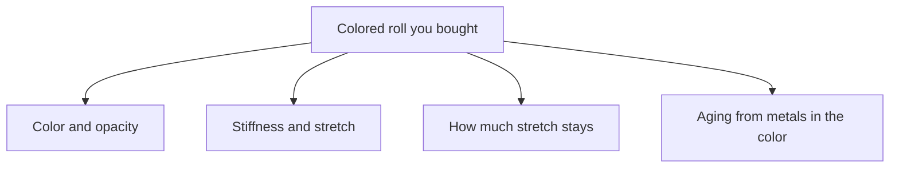

# Colored Sheet: Pigment and Filler Effects

> **Safety.** Colorants and fillers change what can extract at the skin and how the sheet ages. A food-contact colorant list is not a wear certificate. Copper and manganese in a pigment consume antioxidant. This page is about sheet you already bought.

## Executive summary

When you buy red, black, or opaque calendered sheet latex, the processing mill has already milled the color and mineral fillers into the rubber stock. You inherit opacity, mechanical stiffness, permanent set, and the protective antioxidant package selected at the plant. Adding mineral clay to natural rubber increases stiffness and lowers tensile strength. High-styrene copolymer fillers increase tear resistance, but they also raise permanent set. Some pigments introduce heavy metal impurities that accelerate aging.

Use this guide when selecting catalog colors, comparing translucent sheet to opaque stock, or diagnosing why rolls of identical gauge feel noticeably stiffer. Surface graphics applied to stock you already own are covered in [Printing and Surface Decoration](/literature-reviews/sheet-printing-surface-decoration). Modulus adjustments for garment patterning are addressed in [Gauge, Modulus, and Reduction](/literature-reviews/sheet-gauge-modulus-reduction).

## Questions this article answers

- [What is already in a colored roll?](#what-is-already-in-a-colored-roll)
- [Why does one opaque sheet feel stiffer?](#why-does-one-opaque-sheet-feel-stiffer)
- [Can the pigment age the sheet faster?](#can-the-pigment-age-the-sheet-faster)
- [How do I choose a colored roll?](#how-do-i-choose-a-colored-roll)

## What is already in a colored roll? {#what-is-already-in-a-colored-roll}

### How

Treat every catalog color as an independent rubber compound. A pigmented roll and a translucent roll from the same vendor are distinct materials, even when ordered at the same nominal thickness. Color swatches do not specify pigment chemistry or mineral loading. 

When constructing garments intended for long service life, request technical data sheets showing the base polymer and colorant composition. For critical color and modulus matching across multi-panel projects, buy all required yardage from a single production run.

### Why

*The Vanderbilt Latex Handbook* classifies colorants and dyes alongside reinforcing clays and bulk fillers as compound modifiers. These ingredients are incorporated into the raw elastomer prior to milling and calendering. 

You cannot extract or neutralize these additives after purchasing the sheet. Their physical and chemical properties remain locked into the vulcanized matrix.

Detail: Compound classification of colorants

Class 3 modifiers in the Vanderbilt system comprise clays, particulate fillers, processing softeners, and pigments. These components are optional across different elastomer formulations. 

Sheet latex delivered as colored roll goods has undergone that full compounding stage. Color is not a topical wash. It is an integral compound constituent that influences mechanical modulus and aging behavior alongside conventional inorganic fillers.

Detail: Parts per hundred rubber (phr)

Rubber compounding recipes express ingredient concentrations in parts per hundred rubber (phr). A loading of 10 phr clay indicates 10 parts by weight of dry filler per 100 parts by weight of dry base elastomer. 

Commercial sheet latex sold for garment assembly rarely discloses this proportion on product packaging.

## Why does one opaque sheet feel stiffer? {#why-does-one-opaque-sheet-feel-stiffer}

### How

Cut test strips from both the opaque sheet and a translucent reference roll at identical gauge. Stretch each strip to three or four times its resting length and release it. If the opaque sample resists extension more aggressively and fails to snap back fully to its starting dimension, particulate filler is the standard cause.

Never assume two rolls will drape or fit identically based on labeled gauge or shared shade names. Garment-grade sheet latex occupies the low-filler boundary of manufacturing practice, well below the 50 to 100 phr loadings common in heavy industrial rubber.

### Why

Particulate fillers interfere with the natural elastic network of natural rubber. In natural rubber films, McNAMEE clay increases modulus while reducing ultimate tensile strength as concentrations climb toward 100 phr. The material grows boardy and breaks under lower ultimate tension.

Data from *High Polymer Latices* demonstrates that kaolinite clay reduces elongation at break across that same loading range. Stress at 500% elongation increases only within the range where the rubber retains enough elasticity to stretch that far. Because baseline recipes and vulcanization cycles vary between handbook trials, separate published tables reflect distinct compound formulations.

Organic fillers alter properties along a different trajectory. Adding a high-styrene copolymer increases tear resistance, but it causes a steep rise in permanent set. In comparisons with inorganic whiting and zinc oxide, high-styrene additives maintain baseline tensile strength up to 20 phr before dropping, whereas mineral fillers cause an immediate, progressive decline in tensile strength.

Detail: Modulus and permanent set definitions

Tensile modulus represents the mechanical force needed to stretch rubber to a stated elongation, typically reported as stress at 300% or 500% strain. A higher modulus value indicates a stiffer sheet that requires greater force to deform. 

Permanent set measures the unrecovered strain remaining after stress is released. High permanent set causes garments to bag out at high-strain points such as knees and elbows.

Detail: McNAMEE clay in an NR film

Air-dried natural rubber spread films, warm-air vulcanized for 15 minutes at 93°C (*The Vanderbilt Latex Handbook*).

| phr McNAMEE clay | Tensile strength (psi) | Modulus at 500% (psi) |
| --- | --- | --- |
| 0 | 5000 | 700 |
| 25 | 4600 | 1400 |
| 50 | 4000 | 1850 |
| 75 | 3200 | 2050 |
| 100 | 2100 | 2100 |

A comparative chloroprene series (CR 750) compounded with DIXIE clay and vulcanized for 60 minutes at 127°C demonstrates the same directional trend: tensile strength drops from 3100 to 1800 to 1500 psi while stress at 500% climbs from 500 to 600 to 1100 psi across 0, 25, and 50 phr loadings.

Detail: Kaolinite elongation on NR deposits

Data from *High Polymer Latices* (1966) for natural rubber latex deposits, citing 1954 Vanderbilt research. Vulcanization: 60 minutes at 93°C. Empty cells reflect data omitted from the original published record.

| phr clay | Elongation at break (%) | Tensile strength (psi) | Modulus at 500% (psi) |
| --- | --- | --- | --- |
| 0 | 1200 | 6000 | 400 |
| 20 | 750 | 3500 | 650 |
| 40 | 600 | 2500 | 900 |
| 60 | 500 | 1900 | 1150 |
| 80 | 450 | 1600 | |
| 100 | 400 | 1400 | |

Do not average these values directly with 1987 McNAMEE tables due to differences in compounding recipes and vulcanization cycles.

Detail: High-styrene copolymer filler and inorganic whites

Natural rubber latex films modified with a high-styrene styrene-butadiene copolymer, vulcanized for 15 minutes at 93°C (*Polymer Latices*, Vol. 3).

| phr filler | Modulus 300% (MPa) | Modulus 500% (MPa) | Tensile strength (MPa) | Elongation at break (%) | Tear strength (N/cm) | Permanent set (%) |
| --- | --- | --- | --- | --- | --- | --- |
| 0 | 0.90 | 1.79 | 28.6 | 880 | 1156 | 6 |
| 10 | 2.07 | 5.58 | 30.0 | 800 | 1489 | 20 |
| 15 | 2.41 | 6.89 | 30.7 | 760 | 1664 | 22 |
| 20 | 2.76 | 8.62 | 26.9 | 730 | 1769 | 30 |

A 1966 chart of an equivalent high-styrene formulation shows an unfilled 500% modulus of 800 psi. The 1997 revision records 1.79 MPa (approximately 260 psi) for that point. Tensile strength and hardness values remain consistent between editions after unit conversion. The values above follow the 1997 publication.

The chart below shows tensile trends for a separate natural rubber vulcanizate cured for 60 minutes at 100°C. Calcium carbonate (whiting) and zinc oxide produce steady declines in tensile strength as loading increases. The high-styrene copolymer maintains unfilled tensile values up to roughly 20 phr before declining. Resorcinol-formaldehyde resin displays an initial peak before falling. A 1966 graph places that resin peak near 10 phr, whereas the 1997 version peaks closer to 20 phr. For commercial sheet latex selection, the stable baseline comparison is the inorganic pigments versus the high-styrene copolymer.

## Can the pigment age the sheet faster? {#can-the-pigment-age-the-sheet-faster}

### How

Store colored sheet latex under the same environmental controls used for natural gum sheet: keep it cool, dark, dry, and isolated from oils. 

When buying budget-tier vibrant colors for garments exposed to sunlight or sweat, confirm the antioxidant package with the manufacturer. A swatch confirms optical shade, not thermal or oxidative durability.

### Why

Color pigments and mineral fillers serve as an entry route for copper and manganese into natural rubber. These transition metals act as powerful pro-oxidants, accelerating chain scission. When formulations require specific protection against copper degradation, *The Vanderbilt Latex Handbook* specifies a baseline allowance of 2 phr total antioxidant.

If color dispersions were improperly milled or allowed to settle before sheet formation, antioxidant reserves deplete unevenly throughout the film. A localized shortage allows patches of the sheet to develop ozone cracking or surface crazing while neighboring zones remain flexible.

Detail: Antioxidant allowances for metal contamination

The 2 phr antioxidant loading recommended in *The Vanderbilt Latex Handbook* is an internal formulation requirement for rubber exposed to heavy metal contamination. 

This antioxidant is incorporated into the liquid compound prior to sheet manufacture. It cannot be applied topically to finished sheet latex as a surface wash, and a catalog color listing provides no guarantee that this protection exists.

## How do I choose a colored roll? {#how-do-i-choose-a-colored-roll}

### How

Purchase colored sheet latex when project requirements require a specific optical finish and you accept the mill-processed hand, recovery, and antioxidant limits of that run.

Before cutting into a new roll, perform a shop bench test. Stretch a small sample strip to 300% elongation, hold it briefly, release it, and evaluate both recovery speed and permanent stretch. Treat the same catalog color name sourced from different mills or purchased months apart as separate materials. When structural recovery and longevity are essential, request technical data sheets confirming polymer identity, pigment chemistry, and filler loading.

### Why

Nominal gauge and catalog color descriptions do not dictate modulus or permanent set. Industrial data demonstrates the mechanical shifts caused by compound additives, but published figures cannot substitute for testing an unverified commercial roll. 

A physical elongation test provides direct, immediate assessment of stiffness and elasticity without chemical analysis.

## Sources

- Blackley, D. C. *High Polymer Latices: Their Science and Technology*. 2 vols. London: Maclaren; New York: Palmerton, 1966. <https://lccn.loc.gov/66077950>
- Blackley, D. C. *Polymer Latices: Science and Technology — Volume 3: Applications of Latices*. 2nd ed. London: Chapman & Hall; New York: Springer, 1997. <https://books.google.com/books?id=Y2VPGj7YbykC>
- Mausser, Robert Francis, ed. *The Vanderbilt Latex Handbook*. 3rd ed. Norwalk, CT: R.T. Vanderbilt Company, 1987. <https://lccn.loc.gov/92117844>
- Winspear, George G., ed. *The Vanderbilt Latex Handbook*. New York: R. T. Vanderbilt Co., 1954. <https://lccn.loc.gov/54002697>