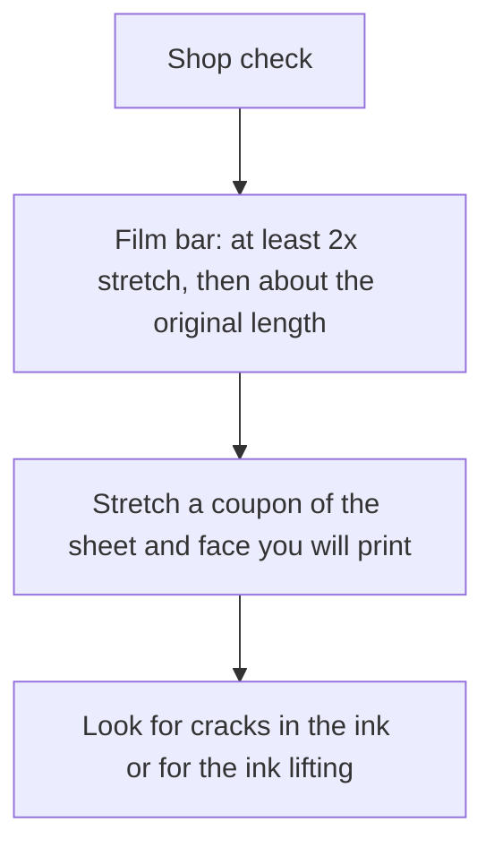
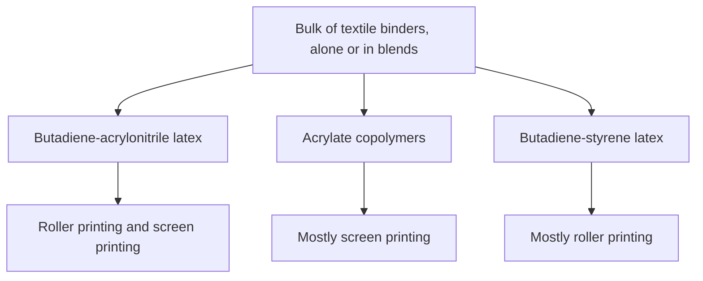

# Printing on Latex Sheet

> **Safety.** Solvent inks belong in a ventilated shop, with the personal protective equipment listed on the product safety data sheet. This page states the industrial bar a print has to survive.

## Executive summary

Bought sheet latex stretches like rubber. A graphic made for cotton still has to survive that stretch on the sheet you bought. Industrial stretch inks use a polyurethane and polyester elastomer vehicle, plus pigment, on latex rubber.

Use this when you choose an ink or a transfer for sheet you bought, or when a product photo stands in for a stretch number. The face you print is the mill face. Read it in [Sheet Surface Finish](/literature-reviews/sheet-surface-finish-literacy). If you prefer to color the rubber itself, see [Pigment and Filler Decks](/literature-reviews/sheet-pigment-filler-decks).

## Questions this article answers

- [What stretch does bought sheet have to survive?](#hard-substrate)
- [What ink is built for rubber that stretches?](#stretch-ink)
- [What do adhesion tests measure?](#qc-language)
- [Which face do you print?](#bought-face)

## What stretch does bought sheet have to survive? {#hard-substrate}

### How

Cut a coupon from the same sheet, and the same face, that you plan to print. Stretch it to at least twice its length. Look for cracks in the ink, and for the ink lifting off the rubber.

If the ink was made for cotton or for rigid plastisol, treat it as the wrong class until that coupon stays intact.

### Why

*The Vanderbilt Latex Handbook* defines a vulcanized elastomeric latex film as one that must stretch, under stress, to at least twice its original length, then return to approximately its original length. An ink sold for cotton or for rigid plastisol has not met that bar until your coupon says so.

## What ink is built for rubber that stretches? {#stretch-ink}

### How

Ask whether the ink vehicle is a polyurethane or polyester elastomer meant for latex rubber. If the seller will not state an elongation on a rubber-like substrate, you do not have a specification. The vehicle has to be an elastomer. Adding pigment to a craft acrylic leaves you with a craft acrylic.

### Why

Patent US10487228B2 describes an aqueous stretchable ink: polyester, a polyurethane elastomer, a pigment dispersion, and surfactants. The patent aims that ink at stretchable latex rubber. That is the industrial class for printing on latex rubber.

Detail: What the patent claims for elongation

The patent's examples describe images stretching to roughly 110–500% without visible cracks or delamination over many cycles. Treat that range as a patent embodiment. It is a claim in US10487228B2, and your coupon remains the practical check on the sheet you bought.

Detail: Textile printing binders

*The Vanderbilt Latex Handbook* states that the bulk of textile printing binders fall into three types, used alone or in blends. On sheet latex they provide a vocabulary for what a binder must survive.

Butadiene-acrylonitrile binders serve for both roller printing and screen printing. The handbook notes that they give better dry crock resistance than acrylate binders, and better cyclic aging and solvent resistance than styrene binders. Acrylate copolymers are used almost exclusively for screen printing, chosen for aging stability and runnability on the screen. Butadiene-styrene binders are used almost solely for roller printing. They cost less and resist dry crock better than acrylate binders, but they run poorly on screen printing equipment.

An ideal textile binder, according to that chapter, must resist dry crock, wet crock, washing, dry cleaning, light, cyclic aging, and scrubbing.

## What do adhesion tests measure? {#qc-language}

### How

If a seller cites a laboratory method, match the standard designation to the job using the reference table. Then run your coupon anyway. A shop check consists of that stretch coupon, plus a peel or a cross-cut on your own sheet. Peel modes for seams are covered in [Adhesives and Seam Integrity](/literature-reviews/sheet-adhesives-and-seam-integrity).

| Standard | What it measures |
| --- | --- |
| ASTM D751 | Coating-to-fabric adhesion |
| ASTM D3389 | Abrasion of a coated fabric, by mass loss or by cycles |
| ASTM D1876 | T-peel of a bond between flexible layers |

### Why

These ASTM methods describe coated fabrics and flexible bonds. A thin ink film can be evaluated as a coating only by analogy. A coated-fabric grade does not certify a fashion garment.

## Which face do you print? {#bought-face}

### How

Print the test on the face side or underside you intend to show. You bought that face from the mill. If you need an entirely different finish, you must laminate a new film.

### Why

Calendered sheet latex is pressed to an even gauge between heated rollers. Both faces are whatever that mill produced. Shine alone does not designate the print side. Review the vendor finish in [Sheet Surface Finish](/literature-reviews/sheet-surface-finish-literacy) before selecting a print surface based purely on gloss.

## Sources

- *The Vanderbilt Latex Handbook*. 3rd ed. Edited by Robert Francis Mausser. Norwalk, CT: R.T. Vanderbilt Company, Inc., 1987. [Library of Congress](https://lccn.loc.gov/92117844)
- Wu, Derry, and Zhou. US10487228B2, *Stretchable ink composition*, 2019. [Google Patents](https://patents.google.com/patent/US10487228B2/en)
- ASTM D751, *Standard Test Methods for Coated Fabrics*. [ASTM](https://store.astm.org/d0751-26.html)
- ASTM D3389, *Standard Test Method for Coated Fabrics Abrasion Resistance (Rotary Platform Abrader)*. [ASTM](https://store.astm.org/d3389-21.html)
- ASTM D1876, *Standard Test Method for Peel Resistance of Adhesives (T-Peel Test)*. [ASTM](https://store.astm.org/d1876-00.html)